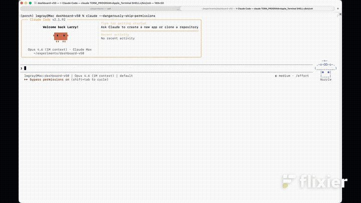

  <p align="center">
    
  </p>

  <h1 align="center">Marcus</h1>

  <p align="center">
    <strong>Agents coordinate through shared state, not conversation.</strong>
  </p>

  <p align="center">
    <a href="#get-started">Quickstart</a> •
    <a href="https://marcus-ai.dev">Docs</a> •
    <a href="https://discord.com/channels/1409498120739487859/1409498121456848907">Discord</a> •
    <a href="ROADMAP.md">Roadmap</a> •
    <a href="PROTOCOL.md">Protocol</a>
  </p>

  <p align="center">
    <a href="https://github.com/lwgray/marcus"></a>
    <a href="https://discord.com/channels/1409498120739487859/1409498121456848907"></a>
    
    <a href="https://opensource.org/licenses/MIT"></a>
    <a href="https://modelcontextprotocol.io/"></a>
  </p>

  <p align="center">
    
  </p>

  ---

  ## What is Marcus?

  Marcus is an open-source orchestration server for AI coding agents. You describe what
  to build. Marcus breaks the work into tasks on a shared kanban board. Multiple agents
  pull tasks independently, write the code, and coordinate through the board — never
  through chat. You walk away; you come back to working software.

  Any [MCP](https://modelcontextprotocol.io/)-compatible agent works: Claude Code,
  Codex, Gemini CLI, Kimi, AutoGen, LangGraph, or a custom runtime.

  ---

  ## Features

- 🗂 **Board-mediated coordination** — agents pull from a shared board. No group chats, no lost threads, no duplicate work.
  - 🎯 **Task-scoped context** — each task carries its own dependencies and artifacts from prior work.
  - ♻️ **Resilient by default** — agent fails? Task stays on the board, another picks it up. Recovery is built in.
  - 📈 **Scales with agents** — more agents = more throughput, not more chaos.
  - 🔍 **Full audit trail** — every decision and artifact recorded. Know what happened, who did it, and why.
  - 🔌 **Any MCP agent** — Claude Code, Codex, Gemini CLI, Kimi, AutoGen, or a custom runtime.

  ---

  <p align="center">
    
  </p>

  ---

  ## Get Started

  **Prerequisites:**
  - macOS or Linux (Windows users: install [WSL2](https://learn.microsoft.com/en-us/windows/wsl/install), then follow the Linux instructions)
  - Python 3.11+
  - `tmux` (`brew install tmux` on macOS, `sudo apt install tmux` on Ubuntu/Debian)
  - An LLM provider (Anthropic, OpenAI, or [Ollama](https://ollama.ai))
  - An MCP-compatible coding agent
    - **Runner mode** (one-command): [Claude Code](https://claude.ai/code) + `tmux`
    - **Attach mode** (any agent): Codex, Gemini CLI, Kimi, AutoGen, LangGraph, custom

  ### Step 1: Install

  ```bash
  git clone https://github.com/lwgray/marcus.git
  cd marcus
  pip install -e .
  cp -r skills/marcus ~/.claude/skills/marcus  # Claude Code + Runner mode only
  ```

  ### Step 2: Configure your LLM provider

  ```bash
  cp .env.example .env
  cp config_marcus.example.json config_marcus.json
  ```

  Edit `.env` for your API key:

  ```bash
  CLAUDE_API_KEY=sk-ant-api03-your-key-here
  ```

  > Marcus reads `CLAUDE_API_KEY` (not `ANTHROPIC_API_KEY`) so it doesn't
  > interfere with Claude Code's subscription auth.

  | Provider  | Cost | Setup |
  |-----------|------|-------|
  | Anthropic | Paid | Set `CLAUDE_API_KEY` in `.env` — works out of the box |
  | OpenAI    | Paid | Set `OPENAI_API_KEY` in `.env`, set `ai.provider` to `"openai"` in `config_marcus.json` |
  | Ollama    | Free | Install [Ollama](https://ollama.ai), pull a model, set `ai.provider` to `"local"` |

  > This is the LLM Marcus uses for task decomposition. Your coding agents use their own keys separately.

  ### Step 3: Start Marcus

  ```bash
  ./marcus start
  ```

  See the board in your terminal at any time:

  ```bash
  ./marcus board
  ```

  ### Step 4: Choose a visual dashboard (optional)

  **Cato** — real-time visualization with a built-in kanban board:

  ```bash
  # In a sibling directory
  git clone https://github.com/lwgray/cato.git
  cd cato && pip install -e . && ./cato start
  # Open http://localhost:5173
  ```

  **Planka** — drag-and-drop kanban UI (requires Docker):

  ```bash
  docker compose up -d
  # Edit config_marcus.json: set kanban.provider to "planka"
  ./marcus start
  # Open http://localhost:3333  (login: demo@demo.demo / demo)
  ```

  ### Step 5: Your first project — Runner mode

  ```bash
  mkdir ~/projects/my-todo-app
  cd ~/projects/my-todo-app
  claude --dangerously-skip-permissions
  ```

  Then inside Claude Code, prompt:

  ```
  /marcus Build a todo app with authentication using 3 agents
  ```

  The `/marcus` skill registers the MCP server, injects the agent prompt, decomposes
  the project, and spawns agents in tmux panes. You walk away, you come back to
  working software.

  <details>
  <summary><strong>Using a different agent? Use Attach mode — same board, same coordination, you wire the agents yourself.</strong></summary>

  Marcus is an MCP server at `http://localhost:4298/mcp`. Any agent that speaks MCP
  can participate. Runner mode automates the wiring below; Attach mode gives you
  manual control.

  ---

  **Step 1 — Connect your agent to Marcus**

  Point your agent's MCP configuration at the running Marcus server:

  ```
  http://localhost:4298/mcp   (HTTP transport)
  ```

  For Claude Code users without tmux, register from inside your project directory:

  ```bash
  cd ~/projects/my-todo-app
  claude mcp add --transport http marcus http://localhost:4298/mcp
  ```

  For other runtimes, consult your agent's MCP docs for how to register an HTTP MCP server.

  ---

  **Step 2 — Give your agent the system prompt**

  `prompts/Agent_prompt.md` is the complete behavioral spec for a Marcus worker. It
  tells your agent exactly how to call Marcus tools, manage the work loop, handle
  context and artifacts, report blockers, and when to exit. **Without it your agent
  won't know the protocol and will stall.**

  Copy it into every project directory an agent will run in:

  ```bash
  cp <marcus-dir>/prompts/Agent_prompt.md ~/projects/my-todo-app/CLAUDE.md
  ```

  For non-Claude runtimes, paste the contents into your agent's system prompt instead.

  ---

  **Step 3 — Bootstrap the board (one agent, once)**

  One agent must call `create_project` to decompose the work and populate the board.
  Do this before workers start:

  Ask your agent to call the `create_project` MCP tool:

  - `description` — what you want to build, in plain language
  - `project_name` — a name for the board

  Marcus returns a `project_id`, `recommended_agents` count, and the full task graph. When it returns, tasks are on the board and immediately available.

  That same agent can then join the work loop as a worker.

  ---

  **Step 4 — Start workers**

  Each worker calls `register_agent` once at startup (name, role, skills), then enters
  the work loop driven by `Agent_prompt.md`:

  1. Call `request_next_task` — Marcus returns a task or a retry signal
  2. If no task: wait `retry_after_seconds` and try again — **do not exit**; work may still arrive
  3. If task received: call `get_task_context` to fetch artifacts from dependency tasks
  4. Do the work
  5. Call `log_decision` for any significant architectural choice
  6. Call `log_artifact` for any file other agents will need (specs, schemas, design docs)
  7. Call `report_task_progress` at 25%, 50%, 75%, 100%
  8. Immediately call `request_next_task` again — do not wait

  Marcus handles dependency ordering, lease isolation, and artifact routing.

  > **Building a runner for another runtime (AutoGen, LangGraph, custom)?**
  > See [PROTOCOL.md](PROTOCOL.md) for the machine-readable agent protocol spec.

  </details>

  <details>
  <summary><strong>Running experiments at scale? Use Posidonius for multi-run management.</strong></summary>

  [Posidonius](https://github.com/lwgray/posidonius) is the experiment dashboard
  for launching and managing multi-agent runs across any CLI agent. It handles
  spawning, experiment tracking, and provides a web UI for monitoring.

  ```bash
  git clone https://github.com/lwgray/posidonius.git
  cd posidonius && pip install -e .
  ```

  See the [Posidonius README](https://github.com/lwgray/posidonius) for setup.
  By default Posidonius writes projects to `~/experiments/`.

  </details>

  ---

  ## How It Works

  Marcus uses a simple idea: **give agents a shared task board instead of making them
  talk to each other.** We call this **board-mediated coordination**  — a modern, agent-native take on the
  ▎ classical https://en.wikipedia.org/wiki/Blackboard_(design_pattern) (Hayes-Roth, 1985), applied to autonomous LLM agents coordinating over MCP.

  <p align="center">
    
  </p>

  Each task carries its own context — requirements, dependencies, artifacts from
  prior tasks. When an agent picks up a task, it gets exactly the context it needs.
  No chat history. No lost threads. No duplicate work.

  When an agent fails, the task stays on the board with its progress. Another agent
  picks it up and continues. **The board is the system of record.**

  ### Architecture

  <p align="center">
    
  </p>

  **Key design decisions:**

  - **Agents are stateless.** All state lives on the board.
  - **Tasks are the unit of coordination.** Each has context, dependencies, artifacts.
  - **MCP is the interface.** Any MCP-compatible agent works with Marcus.
  - **Observability is built in.** Every action is traceable through the board and Cato.

  See [Architecture Docs](https://marcus-ai.dev) for deep dives.

  ---

  ## Why Marcus

  Multi-agent AI is broken at scale. Every framework today coordinates agents through
  **conversation** — group chats, message passing, chain-of-thought relays. This works
  with 2–3 agents. At scale, it collapses:

  - **Context degrades.** Each agent gets a growing wall of chat history. Signal drowns in noise.
  - **Work duplicates.** Without shared state, agents don't know what others have done.
  - **Failures cascade.** One agent crashes and the conversation context is gone. No recovery.
  - **Adding agents adds chaos.** More agents = more messages = slower, less reliable coordination.

  The fundamental mistake: treating coordination as a conversation problem. It's a
  **state management** problem.

  |                        | Group Chat Coordination     | Board-Mediated Coordination   |
  |------------------------|-----------------------------|-------------------------------|
  | **Used by**            | AutoGen, CrewAI, LangGraph  | **Marcus**                    |
  | **Coordination**       | Conversation between agents | Shared board state            |
  | **Context at scale**   | Degrades                    | Preserved per-task            |
  | **Agent failure**      | Lost context, no recovery   | Resume from board state       |
  | **Visibility**         | Chat logs                   | Full audit trail + dashboard  |
  | **Add more agents**    | More chaos                  | More throughput               |
  | **Enterprise ready**   | Limited governance          | Audit trails, accountability  |

  Marcus doesn't compete on raw speed. It competes on **coordination quality,
  observability, and enterprise readiness.**

  > *The moment it clicks: I didn't have to manage any of this.*

  ---

  ## Documentation

  - [Configuration Reference](docs/source/developer/configuration.md) — all options
  - [Agent Workflow Guide](docs/source/guides/agent-workflows/agent-workflow.md) — how agents interact
  - [Development Workflow](docs/source/developer/development-workflow.md) — daily dev workflows
  - [Local Development Setup](docs/source/developer/local-development.md) — first-time setup
  - [Architecture Deep Dive](docs/source/architecture/) — the board pattern in detail
  - [PROTOCOL.md](PROTOCOL.md) — agent protocol spec (build your own runner)
  - [ROADMAP.md](ROADMAP.md) — where we're headed

  ---

  ## Community

  - [**Discord**](https://discord.com/channels/1409498120739487859/1409498121456848907) — real-time help and discussions
  - [**GitHub Discussions**](https://github.com/lwgray/marcus/discussions) — ideas and questions
  - [**GitHub Issues**](https://github.com/lwgray/marcus/issues) — bugs and feature requests

  **For researchers and educators:** Board-mediated coordination extends the blackboard pattern to autonomous LLM agents - a named, citable variant for multi-agent-over-MCP systems. Marcus is MIT-licensed — use it in courses,
  papers, and experiments.  The pattern is documented in the [Architecture Docs](docs/source/architecture/).

  Named after Marcus Aurelius. The Stoic philosophy runs deep: discipline,
  transparency, and letting the system — not any single agent — hold the truth.

  ---

  ## Contributing

  Marcus is open source and community-driven. Good first contributions:

  1. **Kanban provider integrations** — Jira, Trello, Linear support
  2. **Runners** — automated workflows for new CLI agents (Codex, Gemini CLI, Kimi, AutoGen); see [PROTOCOL.md](PROTOCOL.md)
  3. **Documentation** — tutorials, use cases, examples
  4. **Use-case definitions** — show what Marcus can build beyond software

  ```bash
  # Fork, then:
  git clone https://github.com/YOUR_USERNAME/marcus.git
  cd marcus
  pip install -r requirements-dev.txt
  pytest tests/
  ```

  See [CONTRIBUTING.md](CONTRIBUTING.md) and [Local Development Setup](docs/source/developer/local-development.md).

  ---

  <details>
  <summary><strong>Changelog &amp; milestones</strong></summary>

  ### Recent updates

  | Date           | Update |
  |----------------|--------|
  | **2026-04-17** | v0.3.4 — `contract_first` default decomposer, `recommended_agents` in API response, `PROTOCOL.md` |
  | **2026-04-16** | Presented Marcus and Cato at Machine Learning Ambassador Conference, John Deere Financial (Des Moines, IA) |
  | **2026-04-03** | v0.3.0 — SQLite default provider, Epictetus evaluation, `/marcus` skill |
  | **2026-03-21** | v0.2.1 — lease recovery, progressive timeouts, structured agent handoffs |
  | **2026-03-16** | v0.2.0 — AI-powered validation, centralized config, 115 commits since v0.1.3.1 |
  | **2025-10-20** | v0.1.3.1 — sweep-line parallelism algorithm, tmux multi-agent support |
  | **2025-10-19** | Presented Marcus to "AI Assistants" Biweekly Group, Blue River Technology (Santa Clara, CA) |
  | **2025-10-13** | v0.1.1 — initial release as "PM Agent", MCP protocol, Planka integration |
  | **2025-06-15** | Project started as "PM Agent" — rebranded to Marcus in October 2025 |

  ### Version milestones

  | Version    | Date       | Commits | Highlights |
  |------------|------------|---------|------------|
  | **v0.3.4** | 2026-04-17 | —       | `contract_first` default decomposer, `recommended_agents` in `create_project` response, `PROTOCOL.md`, pre-fork synthesis, scope annotation |
  | **v0.3.0** | 2026-04-03 | 59      | SQLite default provider, Epictetus evaluation, `/marcus` one-command experiments, resilience overhaul |
  | **v0.2.1** | 2026-03-21 | 1       | Lease recovery, structured handoffs, configurable LLM temperature |
  | **v0.2.0** | 2026-03-16 | 115     | AI-powered validation, centralized config, constraint propagation, MLflow tracking |
  | **v0.1.3** | 2025-10-18 | 2       | Optimized project creation, subtask assignment fix |
  | **v0.1.2** | 2025-10-16 | ~50     | CPM scheduling, unified dependency graphs, cross-parent wiring |
  | **v0.1.1** | 2025-10-13 | ~80     | Initial release. Rebranded PM Agent → Marcus. MCP, Planka, NLP tools |

  Full history in [CHANGELOG.md](CHANGELOG.md). What's next in [ROADMAP.md](ROADMAP.md).

  </details>

  ---

  ## License

  MIT — see [LICENSE](LICENSE).

  <p align="center"><em>The board is the system.</em></p>
