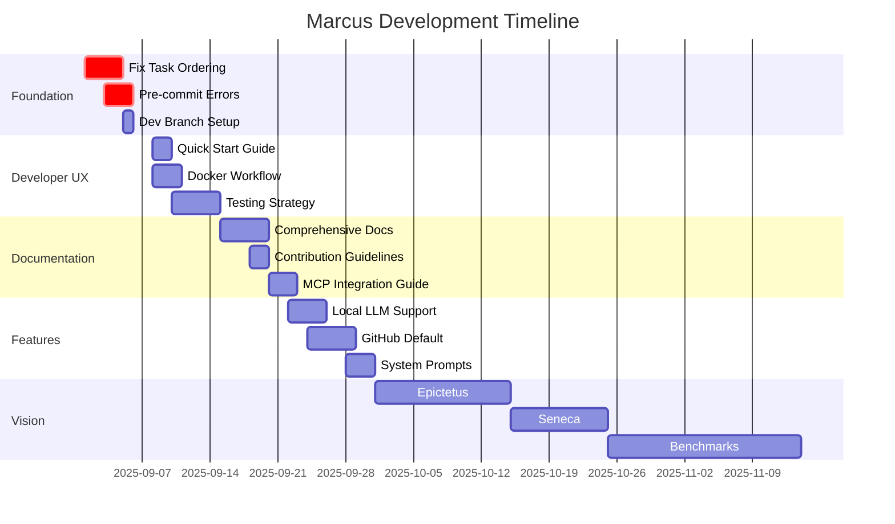

# Marcus Development Roadmap - Comprehensive Checklist

**Last Updated:** September 3, 2025

## 🔴 **PRIORITY 1: Foundation & Stability** (Weeks 1-2: Sep 1-14, 2025)
*These block everything else - must be done first*

### 1. Fix Task Ordering Logic ⚡ CRITICAL
- [ ] Debug dependency inference in Context system
- [ ] Fix task priority calculation in ai_powered_task_assignment.py
- [ ] Implement phase-based filtering (Design → Implement → Test)
- [ ] Add safety checks preventing test before implementation
- [ ] Create unit tests for ordering scenarios
- [ ] Test with real project: "Build a REST API"
- **Related Issues:**
  - [#34: PROJECT_SUCCESS task not being assigned](https://github.com/lwgray/marcus/issues/34)
  - [#36: Task execution order verification test suite](https://github.com/lwgray/marcus/issues/36)
- **Files:** `src/core/context.py`, `src/intelligence/dependency_inferer_hybrid.py`
- **Estimate:** 3-4 days

### 2. Handle Pre-commit Errors 🔧
- [ ] Run full pre-commit check: `pre-commit run --all-files`
- [ ] Fix mypy type errors
- [ ] Fix ruff/flake8 linting issues
- [ ] Fix formatting issues (black, isort)
- [ ] Update detect-secrets baseline
- [ ] Document pre-commit setup in CONTRIBUTING.md
- [ ] Add CI/CD pipeline to enforce pre-commit
- **Estimate:** 2-3 days

### 3. Development Branch Setup 🌿
- [ ] Create 'develop' branch from main
- [ ] Set up branch protection rules
- [ ] Configure PR templates
- [ ] Create GitHub Actions for:
  - [ ] Auto-run tests on PR
  - [ ] Check pre-commit compliance
  - [ ] Build verification
- [ ] Document branching strategy in CONTRIBUTING.md
- [ ] Create release process (develop → main)
- **Estimate:** 1 day

## 🔥 **PRIORITY 1.5: Critical Bug Fixes & Enhancements** (Immediate)
*These need attention for improved operation*

### Open Issues
- [ ] **[#39](https://github.com/lwgray/marcus/issues/39):** Implement artifact session isolation (Future)
  - Prepare for working in existing repositories
  - Prevent scanning thousands of existing docs
  - **Impact:** Medium (will be High when working in existing repos)

- [ ] **[#40](https://github.com/lwgray/marcus/issues/40):** Enhancement: Implement hybrid artifact filtering
  - Smart filtering to optimize context retrieval
  - Balance between relevant context and token limits
  - **Impact:** Medium - improves performance and usability

- [ ] **[#50](https://github.com/lwgray/marcus/issues/50):** 🔴 KanbanInterface.update_task() None returns not handled
  - Fix silent failures in task update operations
  - Prevent state divergence between Marcus and Kanban boards
  - **Impact:** High - affects core functionality and data consistency

## 🟡 **PRIORITY 2: Developer Experience** (Weeks 2-3: Sep 8-21, 2025)
*Enable contributors to work effectively*

### 4. Quick Start Guide 📚
- [ ] Write "Marcus in 5 minutes" section
- [ ] Create setup script: `./setup.sh`
- [ ] Document ENV variables clearly:
  - [ ] Required vs Optional
  - [ ] Example .env.template file
  - [ ] MCP-specific settings
- [ ] Add troubleshooting section
- [ ] Create video walkthrough (optional)
- [ ] Test with fresh developer
- **Deliverable:** Updated README.md with clear sections
- **Estimate:** 2 days

### 5. Docker Workflow 🐳
- [ ] Create multi-stage Dockerfile
- [ ] Set up docker-compose.yml with:
  - [ ] Marcus server
  - [ ] Planka (kanban)
  - [ ] Redis (if needed)
  - [ ] PostgreSQL (if needed)
- [ ] Handle ENV variables in Docker
- [ ] Create docker-compose.dev.yml for development
- [ ] Add volume mounts for hot-reload
- [ ] Document Docker usage
- [ ] Create Docker Hub image (optional)
- **Files:** `Dockerfile`, `docker-compose.yml`
- **Estimate:** 3 days

### 6. Testing Strategy 🧪
- [ ] Define testing standards:
  - [ ] Unit test structure
  - [ ] Integration test patterns
  - [ ] Mock strategies
- [ ] Create test templates/generators
- [ ] Achieve 80% coverage on core modules:
  - [ ] Context system
  - [ ] Task assignment
  - [ ] MCP tools
- [ ] Implement tests for 14 new test directories (#53):
  - [ ] Unit tests for api, workflow, operations, modes modules
  - [ ] Unit tests for logging, infrastructure, performance modules
  - [ ] Unit tests for remaining 7 modules
  - [ ] Integration tests for api and external directories
- [ ] 🔴 [Comprehensive Test Coverage - Systems Architecture Based](https://github.com/lwgray/marcus/issues/54) - Systematic coverage improvement across 53 Marcus systems (current: 44%, target: 80%)
- [ ] Set up pytest fixtures for common scenarios
- [ ] Add performance benchmarks
- [ ] Create test data factories
- [ ] Document testing guidelines
- **Related Issues:**
  - [#35: Task completion simulation test suite](https://github.com/lwgray/marcus/issues/35)
  - [#37: Automated testing framework for task ordering experiments](https://github.com/lwgray/marcus/issues/37)
  - [#46: Improve test organization to align with application structure](https://github.com/lwgray/marcus/issues/46)
  - [#53: Implement tests for 14 new test directories created in issue #46](https://github.com/lwgray/marcus/issues/53)
  - [#54: Comprehensive Test Coverage Analysis - Systems Architecture Based](https://github.com/lwgray/marcus/issues/54)
- **Tools:** pytest, pytest-cov, pytest-asyncio, pytest-mock
- **Estimate:** 5 days

## 🟢 **PRIORITY 3: Documentation & Onboarding** (Weeks 3-4: Sep 15-28, 2025)
*Make Marcus accessible to contributors*

### 7. Comprehensive Documentation 📖
- [ ] Create docs/README.md with navigation
- [ ] Organize into clear sections:
  ```
  docs/
  ├── getting-started/
  │   ├── installation.md
  │   ├── quick-start.md
  │   └── first-contribution.md
  ├── user-guide/
  │   ├── creating-projects.md
  │   ├── agent-management.md
  │   └── monitoring.md
  ├── developer-guide/
  │   ├── architecture.md
  │   ├── adding-tools.md
  │   └── testing.md
  └── reference/
      ├── mcp-tools.md
      ├── api.md
      └── configuration.md
  ```
- [ ] Add diagrams using Mermaid
- [ ] Create searchable docs site (MkDocs/Sphinx)
- [ ] Add code examples
- [ ] Review and update existing system docs
- [ ] 🔴 [Create Comprehensive Internal Systems Documentation](https://github.com/lwgray/marcus/issues/52) - Document internal orchestration behind all agent tools
- **Estimate:** 5 days

### 8. Contribution Guidelines 🤝
- [ ] Create CONTRIBUTING.md with:
  - [ ] Code of Conduct
  - [ ] How to report bugs
  - [ ] How to suggest features
  - [ ] PR process
  - [ ] Code style guide
  - [ ] Commit message format
- [ ] Set up issue templates
- [ ] Create "good first issue" labels
- [ ] Document review process
- [ ] Create contributor recognition system
- **File:** `CONTRIBUTING.md`, `.github/ISSUE_TEMPLATE/`
- **Estimate:** 2 days

### 9. MCP Integration Guide 🔌
- [ ] Create integration guides for:
  - [ ] Claude Desktop (primary)
  - [ ] VS Code + Continue
  - [ ] Gemini (when available)
  - [ ] OpenAI (future)
- [ ] Document MCP server setup:
  - [ ] Port configuration
  - [ ] Authentication
  - [ ] Tool permissions
- [ ] Create troubleshooting guide
- [ ] Add example configurations
- [ ] Test on each platform
- **Files:** `docs/integrations/*.md`
- **Estimate:** 3 days

## 🔵 **PRIORITY 4: Core Features** (Weeks 4-6: Sep 22 - Oct 5, 2025)
*Enhance Marcus capabilities*

### 10. Local LLM Support 🤖
- [ ] Research and test models:
  - [ ] Ollama integration
  - [ ] Test: Llama 3, Mistral, DeepSeek
  - [ ] Benchmark on todo app creation
- [ ] Create LLM abstraction layer
- [ ] Add model selection in config
- [ ] Document performance vs quality tradeoffs
- [ ] Create model recommendation guide
- [ ] Add fallback strategies
- **Tools:** Ollama, LangChain, llama.cpp
- **Estimate:** 4 days

### 11. GitHub as Default Board 🐙
- [ ] Complete GitHub Projects integration
- [ ] Map Marcus concepts to GitHub:
  - [ ] Projects → Boards
  - [ ] Issues → Tasks
  - [ ] Labels → Task metadata
- [ ] Handle GitHub-specific features:
  - [ ] Milestones
  - [ ] Assignees
  - [ ] Pull request links
- [ ] Update documentation
- [ ] Create migration tool from Planka
- [ ] Test with real projects
- **Files:** `src/integrations/github_kanban.py`
- **Estimate:** 5 days

### 12. System Prompt Optimization 🧠
- [ ] Analyze current Agent_prompt.md
- [ ] Create prompt variations for:
  - [ ] Different task types
  - [ ] Skill levels
  - [ ] Project phases
- [ ] A/B test prompt effectiveness
- [ ] Add dynamic prompt adjustment
- [ ] Document prompt engineering guidelines
- [ ] Create prompt template library
- **Files:** `prompts/*.md`
- **Estimate:** 3 days

## 🟣 **PRIORITY 5: Long-term Vision** (Weeks 6+: Oct 6, 2025 onwards)
*Strategic initiatives for Marcus growth*

### 13. Epictetus Observability Layer 🔬
- [ ] Design observability architecture
- [ ] Implement comprehensive event capture:
  - [ ] Agent decisions
  - [ ] Task assignments
  - [ ] Communication patterns
  - [ ] Performance metrics
- [ ] Create data export pipeline
- [ ] Build analysis tools
- [ ] Document research applications
- [ ] Partner with academic institutions
- [ ] Publish dataset format
- **Estimate:** 2-3 weeks

### 14. Seneca Integration 🏛️
- [ ] Complete Seneca API integration (github.com/lwgray/seneca)
- [ ] Add advanced features:
  - [ ] Resource planning
  - [ ] Gantt charts
  - [ ] Budget tracking
- [ ] Create seamless handoff between Marcus and Seneca
- [ ] Document integration points
- **Estimate:** 2 weeks

### 15. Multi-Agent Benchmarks 📊
- [ ] Identify target benchmarks:
  - [ ] SWE-bench
  - [ ] CodeActAgent
  - [ ] Others
- [ ] Adapt Marcus for benchmark formats
- [ ] Optimize performance
- [ ] Publish results
- [ ] Create comparison table
- **Estimate:** 3-4 weeks

## Implementation Timeline



## Success Metrics

1. **Week 1 (Sep 7)**: Task ordering works, pre-commits pass
2. **Week 2 (Sep 14)**: New developer can start in < 30 minutes
3. **Week 3 (Sep 21)**: Test coverage > 80% on core modules
4. **Week 4 (Sep 28)**: Documentation complete and searchable
5. **Week 6 (Oct 12)**: Local LLM working, GitHub integration complete
6. **Week 8+ (Oct 26+)**: Research framework operational

## How to Use This Checklist

1. **Daily:** Check off completed subtasks
2. **Weekly:** Review progress against timeline
3. **Bi-weekly:** Adjust priorities based on progress
4. **Monthly:** Celebrate wins and reassess roadmap

## Contributing to This Roadmap

See CONTRIBUTING.md for how to suggest changes to this roadmap.
