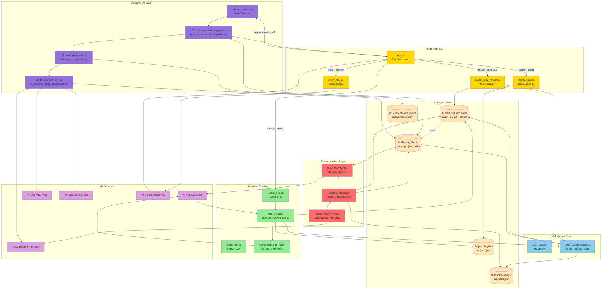

# Task & Subtask Architecture Diagram

This diagram shows the component relationships and data flow in Marcus's task management system.



## Component Overview

### Storage Layers (5-Layer Architecture)
| Layer | Location | Purpose | Persistence |
|-------|----------|---------|-------------|
| **Kanban Provider** | Planka/GitHub/Linear | Source of truth, human visibility | Permanent |
| **In-Memory Graph** | `server.project_tasks` | Fast access, unified task/subtask view | Session |
| **Assignment Persistence** | `data/assignments/assignments.json` | Prevent duplicate assignments | Permanent |
| **Project Registry** | `data/marcus_state/projects.json` | Project configs, agent mappings | Permanent |
| **Subtask Manager** | `data/marcus_state/subtasks.json` | Hierarchy metadata | Permanent |

### MCP Server Core
- **server.py**: Main MCP server handling tool requests
- **refresh_project_state()**: Synchronizes all storage layers
  - Triggered on: startup, project change, before assignment, after completion
  - Loads tasks from provider → wires dependencies → rebuilds graph

### Creation Pipeline
- **create_project**: MCP tool entry point for new projects
- **create_tasks**: MCP tool for adding tasks to existing projects
- **NLP Pipeline**: 7-stage pipeline (PRD → tasks → deps → board → upload → register → sync)
- **PRD Parser**: AI-powered task generation (8-15 tasks with inferred dependencies)

### Decomposition Layer
- **Task Decomposer**: Heuristic checks (>4hrs, not deployment)
- **Subtask Manager**: Creates Task objects with `is_subtask=True`, `parent_task_id`, `subtask_index`
- **Cross-Parent Wiring**: Embedding similarity + LLM validation for inter-subtask dependencies

**CRITICAL**: Decomposition happens during **project creation** (via NLP Pipeline), NOT during task assignment!

### Assignment Layer
- **request_next_task**: MCP tool for agents to get work
- **Task Assignment Integration**: Orchestrates subtask priority + regular tasks
- **Subtask Assignment**: Filters and scores available subtasks
- **AI Assignment Engine**: 4-phase scoring (safety, dependencies, skills, impact)

### Agent Interface
- **register_agent**: Register with Marcus (once per agent)
- **report_task_progress**: Update status (in_progress, completed, with percentage)
- **report_blocker**: Get AI suggestions for obstacles

### AI Services (LLM-Powered)
- **PRD Analysis**: Extract requirements and generate tasks
- **Skill Matching**: Match agent capabilities to task needs
- **Dependency Scoring**: Prioritize tasks that unblock others
- **Impact Prediction**: Forecast cascade effects of assignments
- **Blocker Recovery**: Generate solutions for reported obstacles

## Data Flow Paths

### 1. Project Creation Flow (Green)
```
Agent → create_project → NLP Pipeline → AI Analysis → Kanban Provider
                                      ↓               ↓
                          Task Decomposition    Project Registry + State Sync
                                      ↓
                          Subtask Manager → Kanban Provider
```

**Note**: Task decomposition happens immediately after tasks are uploaded, BEFORE project registration

### 2. Decomposition Flow (Red) - During Project Creation
```
NLP Pipeline → Decomposer → AI Analysis → Subtask Manager
                                        ↓
                         Cross-Wiring → Provider + Memory
```

**IMPORTANT**: This flow occurs during project creation, not during task assignment

### 3. Assignment Flow (Purple) - After Project Creation
```
Agent → request_next_task → Assignment Integration → Search Existing Subtasks
                                                   ↓
                              AI Engine → Assignments.json → Agent
```

**Note**: Assignment only searches for existing subtasks; no decomposition occurs here

### 4. Execution Flow (Gold)
```
Agent → report_progress → Provider + State Sync
Agent → report_blocker → AI Suggestions → Agent
```

## Key Design Patterns

### Unified Graph Architecture
- Tasks and subtasks stored as same `Task` type in single list
- Subtasks marked with boolean flag and hierarchy metadata
- Enables simpler dependency analysis across all task types

### Reservation Pattern
- Immediate `tasks_being_assigned.add()` on selection
- Prevents race conditions in multi-agent environments
- Persisted to `assignments.json` before returning to agent

### Eager Decomposition
- Subtasks created immediately during project creation
- Generated right after tasks are uploaded to Kanban board
- All decomposition happens upfront in parallel for speed

### Layered Storage
- Provider as source of truth for human visibility
- Multiple caches for speed and conflict prevention
- State sync maintains consistency across layers

### Subtask Priority
- System ALWAYS checks subtasks before regular tasks
- Encourages bottom-up completion of complex work
- Parent tasks naturally complete when all subtasks done

## File Locations

```
src/marcus_mcp/
├── server.py                          # MCP Server + State Sync
├── tools/
│   ├── nlp.py                         # create_project, create_tasks
│   ├── task.py                        # request_next_task, report_*
│   └── agent.py                       # register_agent
└── coordinator/
    ├── decomposer.py                  # Task decomposition logic
    ├── subtask_manager.py             # Subtask hierarchy management
    ├── subtask_assignment.py          # Subtask filtering/selection
    ├── task_assignment_integration.py # Unified assignment orchestration
    └── dependency_wiring.py           # Cross-parent dependency discovery

src/integrations/
├── nlp_tools.py                       # NLP implementation
├── pipeline_tracked_nlp.py            # Pipeline tracking wrapper
└── kanban_interface.py                # Abstract provider interface

src/core/
├── models.py                          # Task + TaskStatus models
├── project_registry.py                # ProjectRegistry + Config
├── assignment_persistence.py          # Assignment tracking
└── ai_powered_task_assignment.py      # 4-phase AI engine

data/
├── assignments/assignments.json       # Assignment persistence
└── marcus_state/
    ├── projects.json                  # Project registry
    └── subtasks.json                  # Subtask metadata
```

## Color Legend
- 🟡 **Tan/Beige**: Storage layers (databases, files)
- 🔵 **Blue**: Core MCP server components
- 🟢 **Green**: Creation pipeline (project/task generation)
- 🔴 **Red**: Decomposition layer (subtask creation)
- 🟣 **Purple**: Assignment layer (task selection)
- 🟡 **Gold**: Agent interface (human/AI interaction)
- 🟪 **Light Purple**: AI services (LLM-powered)
