# Task & Subtask Creation and Assignment Flowchart

This flowchart shows the complete flow from project creation through task decomposition to agent assignment.

```mermaid
flowchart TD
    Start([User Request: create_project]) --> PRDAnalysis[AI PRD Analysis<br/>Parse requirements]
    PRDAnalysis --> TaskGen[Task Generation<br/>AdvancedPRDParser<br/>Creates 8-15 tasks]
    TaskGen --> DepWiring[Dependency Application<br/>Wire task dependencies]
    DepWiring --> BoardCreate[Board Creation<br/>Planka/GitHub/Linear]
    BoardCreate --> Upload[Task Upload<br/>Push to provider]

    Upload --> CheckDecomp{Check each task:<br/>Should decompose?}
    CheckDecomp -->|Yes: >4hrs, not deployment| Decompose[Subtask Decomposition<br/>3-5 subtasks with contracts]
    CheckDecomp -->|No| Register

    Decompose --> SubtaskReg[Subtask Registration<br/>Create Task objects<br/>is_subtask=True]
    SubtaskReg --> CrossWire[Cross-Parent Wiring<br/>Embedding + LLM validation]
    CrossWire --> Register[Project Registration<br/>ProjectRegistry]

    Register --> StateRefresh[State Refresh<br/>Load into unified graph]

    StateRefresh --> AgentReq{Agent requests<br/>next_task?}

    AgentReq -->|Yes| FindTask[Find Optimal Task]

    FindTask --> PriorityCheck{Subtasks<br/>available?}

    PriorityCheck -->|Yes| SubtaskFilter[Filter Subtasks:<br/>- is_subtask=True<br/>- Not assigned<br/>- Parent deps satisfied]
    PriorityCheck -->|No| RegTaskFilter[Filter Regular Tasks:<br/>- Dependencies met<br/>- Not assigned<br/>- Safety checks]

    SubtaskFilter --> AIScore[AI Assignment Engine<br/>4 phases:<br/>1. Safety<br/>2. Dependency scoring<br/>3. Skill matching<br/>4. Impact prediction]
    RegTaskFilter --> AIScore

    AIScore --> Reserve[Immediate Reservation<br/>Prevent race conditions]
    Reserve --> Persist[Persist Assignment<br/>assignments.json]
    Persist --> Return[Return Task to Agent]

    Return --> AgentWork[Agent Works on Task]
    AgentWork --> Progress{Task Status?}

    Progress -->|In Progress| Report[report_task_progress]
    Progress -->|Blocked| Blocker[report_blocker<br/>AI suggestions]
    Progress -->|Completed| Complete[Mark DONE<br/>Sync to provider]

    Report --> AgentWork
    Blocker --> AgentWork
    Complete --> StateRefresh

    style Start fill:#90EE90
    style Return fill:#87CEEB
    style Complete fill:#FFD700
    style Decompose fill:#FF6B6B
    style AIScore fill:#9370DB
```

## Key Flow Stages

### 1. Project Creation with Immediate Decomposition (Top Section)
- Starts with `create_project` MCP tool call
- AI analyzes requirements and generates 8-15 tasks
- Dependencies are wired automatically
- Tasks uploaded to Kanban provider (Planka/GitHub/Linear)
- **CRITICAL**: Immediately after upload, tasks are checked for decomposition
- Heuristics: >4 hours estimated AND not deployment task
- Eligible tasks decomposed into 3-5 subtasks with semantic contracts
- Cross-parent dependency wiring using embeddings + LLM
- Project registered and state loaded into memory

### 2. Task Assignment (Middle Section)
- **Priority**: Subtasks (already created) checked FIRST
- Filters applied based on dependencies and assignment status
- AI Assignment Engine scores candidates in 4 phases
- Immediate reservation prevents race conditions

### 3. Execution Loop (Lower Right)
- Agent works on task and reports progress
- Can report blockers for AI suggestions
- On completion, syncs to provider and refreshes state
- Loop continues with next task request

## Color Legend
- 🟢 Green: Start/Entry points
- 🔵 Blue: Assignment/Return points
- 🟡 Gold: Completion states
- 🔴 Red: Decomposition/Complex processing
- 🟣 Purple: AI-powered decision making
