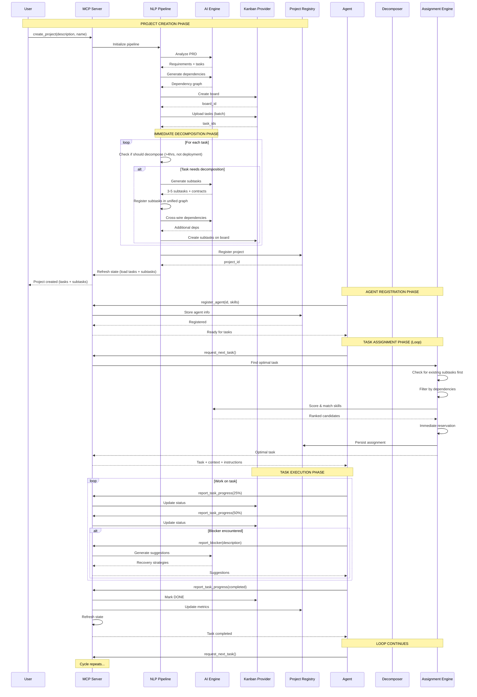

# Task & Subtask Timing Chart

This sequence diagram shows the temporal order of events during task creation, decomposition, and assignment.

## Timeline Phases

### Phase 1: Project Creation with Decomposition (Seconds 0-20)
- User initiates project with natural language description
- NLP Pipeline processes requirements through AI
- Tasks generated (8-15 tasks typical)
- Dependencies inferred and wired
- Board created on Kanban provider
- All tasks uploaded in batch
- **CRITICAL**: Immediately after upload, eligible tasks are decomposed:
  - Heuristics check (>4 hours AND not deployment)
  - AI generates 3-5 subtasks per eligible task
  - Subtasks registered in unified graph
  - Cross-parent dependencies wired
  - Subtasks created on Kanban board
- Project registered in Marcus state
- **Duration**: ~15-20 seconds (task creation ~8s + decomposition ~8s in parallel)

### Phase 2: Agent Registration (Second 11)
- Agent registers with Marcus
- Provides agent_id, name, role, skills
- Stored in project registry
- Agent marked ready for assignment
- **Duration**: <1 second

### Phase 3: Task Assignment Loop (Ongoing)
Each iteration:
1. **Request** (~100ms): Agent calls `request_next_task()`
2. **Assignment Selection** (~2-3s):
   - Priority check: Search existing subtasks first
   - Dependency filtering (both task and subtask dependencies)
   - AI skill matching and scoring
   - Immediate reservation
   - Persistence to assignments.json
3. **Return** (~100ms): Task + context returned to agent

**Note**: No decomposition happens during assignment - subtasks were already created during project creation phase

### Phase 4: Task Execution (Variable Duration)
- Agent works autonomously on assigned task
- Progress reports at milestones (25%, 50%, 75%, 100%)
- Each report syncs to Kanban provider
- Optional blocker reporting with AI recovery suggestions
- Completion triggers state refresh
- **Duration**: Minutes to hours depending on task complexity

### Phase 5: Loop Continuation
- Agent immediately requests next task
- System returns to Phase 3
- Continues until all tasks completed

## Timing Observations

1. **Parallel AI Calls**: Project creation AND decomposition optimized with concurrent API calls (10x speedup)
2. **Eager Decomposition**: Subtasks created immediately during project creation, NOT during assignment
3. **Immediate Reservation**: Assignment happens instantly to prevent race conditions
4. **Continuous Sync**: Every state change persisted to Kanban provider
5. **State Refresh**: Triggered on completion to ensure dependency accuracy
6. **Assignment Speed**: Fast (<3s) because subtasks already exist - just filtering and scoring
