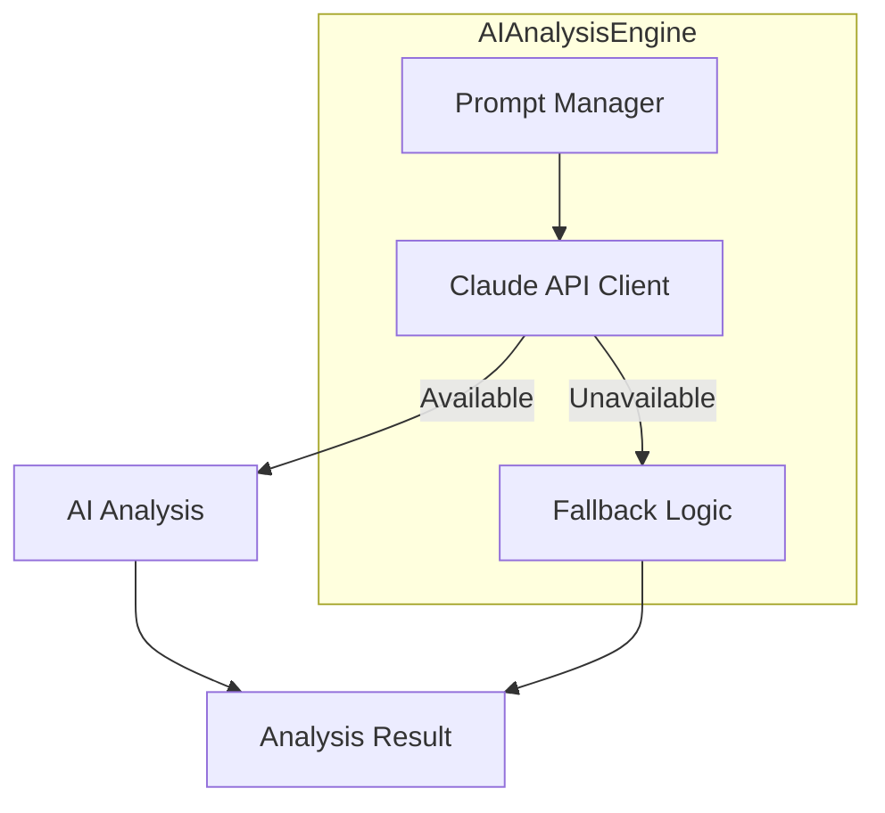

# System 07 Documentation Correction Required

**File:** `docs/source/systems/intelligence/07-ai-intelligence-engine.md`
**Implementation:** `src/integrations/ai_analysis_engine.py` (1685 lines)
**Issue:** CRITICAL - Documentation describes complex hybrid AI architecture that doesn't exist
**Priority:** P0 - Immediate correction required

---

## Problem Summary

The System 07 documentation describes an elaborate multi-layer AI intelligence architecture with 7+ major components:
- MarcusAIEngine (central coordinator)
- RuleBasedEngine (safety foundation)
- HybridDecisionFramework (decision merger)
- LLMAbstraction (provider management)
- AdvancedPRDParser (requirements parser)
- IntelligentTaskEnricher (task enhancement)
- ContextualLearningSystem (pattern learning)

**The actual implementation is a single class `AIAnalysisEngine` with straightforward Claude API integration and simple fallback logic.**

---

## Documented (ASPIRATIONAL) Architecture

### From Lines 86-110:
```markdown
1. **MarcusAIEngine** (Central Coordinator)
   - Orchestrates all AI operations
   - Manages rule-AI integration
   - Provides main API interface

2. **RuleBasedEngine** (Safety Foundation)
   - Implements Phase 1-2 safety logic
   - Provides deterministic validation
   - Cannot be overridden by AI

3. **HybridDecisionFramework** (Decision Merger)
   - Combines rule and AI results
   - Manages confidence weighting
   - Ensures safety compliance

4. **LLMAbstraction** (Provider Management)
   - Unified interface across LLM providers
   - Automatic fallback handling
   - Performance tracking

5. **Advanced Features** (AI Enhancement)
   - AdvancedPRDParser: Requirements → Tasks
   - IntelligentTaskEnricher: AI task enhancement
   - ContextualLearningSystem: Pattern learning
```

### From Lines 255-269:
```python
class MarcusAIEngine:
    async def analyze_with_hybrid_intelligence(self, context: AnalysisContext) -> HybridAnalysis:
        # Step 1: Rule validation (mandatory, never bypassed)
        rule_result = await self.rule_engine.analyze(context)

        # Step 2: AI enhancement (only when rules allow)
        if rule_result.is_valid:
            ai_insights = await self._get_ai_insights(context)

        # Step 3: Hybrid confidence calculation
        final_confidence = self._calculate_hybrid_confidence(
            rule_result.confidence,
            ai_insights.confidence if ai_insights else None
        )
```

**NONE OF THIS EXISTS in the actual implementation!**

---

## Actual Implementation

### From `src/integrations/ai_analysis_engine.py`:
```python
class AIAnalysisEngine:
    """
    AI-powered analysis and decision engine using Claude API.

    This class provides intelligent analysis for project management decisions,
    including task assignment optimization, blocker resolution, and risk analysis.
    It gracefully falls back to rule-based approaches when AI is unavailable.
    """

    def __init__(self) -> None:
        """Initialize the AI Analysis Engine."""
        self.client: Optional[anthropic.Anthropic] = None
        self.current_project_id: Optional[str] = None
        self.current_agent_id: Optional[str] = None

        # Simple Anthropic client initialization
        api_key = config.get("ai.anthropic_api_key") or os.environ.get("ANTHROPIC_API_KEY")
        if api_key:
            self.client = anthropic.Anthropic(api_key=api_key)

        self.model: str = "claude-3-5-sonnet-20241022"
```

**Key Differences:**
1. **Single class, not 7 components** - Just `AIAnalysisEngine`
2. **Direct Claude API calls** - No LLMAbstraction layer
3. **Simple fallback logic** - Not hybrid rule-AI framework
4. **No MarcusAIEngine** - Central coordinator doesn't exist
5. **No RuleBasedEngine** - No safety validation layer
6. **No HybridDecisionFramework** - No confidence merging
7. **No AdvancedPRDParser class** - PRD parsing in create_project tool
8. **No IntelligentTaskEnricher** - Task enrichment in generate_task_instructions()
9. **No ContextualLearningSystem** - No pattern learning component

---

## What Actually Exists

The `AIAnalysisEngine` class provides:

### 1. Basic Initialization (Lines 73-125)
- Anthropic client setup with API key from config
- Model selection (claude-3-5-sonnet-20241022)
- Prompt templates for different analysis types

### 2. Task Assignment (Lines 266-376)
```python
async def match_task_to_agent(
    self, available_tasks, agent, project_state
) -> Optional[Task]:
    """Find the optimal task for an agent using AI analysis."""
    if not self.client:
        return self._fallback_task_matching(available_tasks, agent)

    # AI analysis via Claude
    response = await self._call_claude(prompt)
    result = json.loads(response)
    # ... return matched task
```

### 3. Task Instructions (Lines 427-500)
```python
async def generate_task_instructions(
    self, task, agent
) -> str:
    """Generate detailed instructions for a task."""
    if not self.client:
        return self._generate_fallback_instructions(task, agent)

    instructions = await self._call_claude(prompt)
    return instructions
```

### 4. Blocker Analysis (Lines 608-706)
```python
async def analyze_blocker(
    self, task_id, description, severity, agent, task
) -> Dict[str, Any]:
    """Analyze a blocker and suggest resolution steps."""
    if not self.client:
        return self._generate_fallback_blocker_analysis(...)

    response = await self._call_claude(prompt)
    return json.loads(response)
```

### 5. Project Risk Analysis (Lines 829-949)
```python
async def analyze_project_risks(
    self, project_state, recent_blockers, team_status
) -> List[ProjectRisk]:
    """Analyze and identify project risks."""
    if not self.client:
        return self._generate_fallback_risk_analysis(project_state)

    response = await self._call_claude(prompt)
    # ... convert to ProjectRisk objects
```

### 6. Simple Fallback Methods
- `_fallback_task_matching()` - Priority + skill scoring
- `_generate_fallback_instructions()` - Template-based
- `_generate_fallback_blocker_analysis()` - Rule-based
- `_generate_fallback_risk_analysis()` - Metric-based

### 7. Claude API Wrapper (Lines 1514-1584)
```python
async def _call_claude(self, prompt: str) -> str:
    """Call Claude API with error handling."""
    response = self.client.messages.create(
        model=self.model,
        max_tokens=2000,
        temperature=0.7,
        messages=[{"role": "user", "content": prompt}]
    )
    return str(response.content[0].text)
```

---

## What Needs to Change

### 1. Overview Section (Lines 18-34)
**Current:** "hybrid AI system that combines rule-based safety guarantees with advanced AI capabilities"
**Should be:** "AI-enhanced analysis engine that uses Claude API for intelligent task assignment and project insights, with fallback to rule-based logic when AI is unavailable"

### 2. Architecture Diagram (Lines 39-83)
**Remove entirely:** The complex mermaid diagram showing 7+ components
**Replace with:**
```markdown
## Architecture

The AI Analysis Engine is a single-class implementation that provides:



- **Claude API Client**: Direct Anthropic API integration
- **Prompt Manager**: Template-based prompts for different analysis types
- **Fallback Logic**: Rule-based alternatives when AI unavailable
```

### 3. Component Hierarchy Section (Lines 85-111)
**Remove entirely** - Lists non-existent classes

**Replace with:**
```markdown
## Core Components

### AIAnalysisEngine
The single class providing all AI analysis functionality:

**Responsibilities:**
- Task-to-agent matching optimization
- Task instruction generation
- Blocker analysis and resolution suggestions
- Project risk assessment
- Project health analysis
- Feature request analysis

**Key Methods:**
- `match_task_to_agent()` - AI-powered task assignment
- `generate_task_instructions()` - Context-aware instruction generation
- `analyze_blocker()` - Blocker root cause and resolution
- `analyze_project_risks()` - Risk identification
- `analyze_project_health()` - Overall project health assessment
- `_call_claude()` - Direct Claude API integration

**Fallback Methods:**
- `_fallback_task_matching()` - Priority + skill scoring
- `_generate_fallback_instructions()` - Template-based instructions
- `_generate_fallback_blocker_analysis()` - Rule-based blocker analysis
- `_generate_fallback_risk_analysis()` - Metric-based risk assessment
```

### 4. Special Features Section (Lines 249-318)
**Remove:**
- "Hybrid Intelligence Model" (Lines 251-269)
- "Provider Abstraction with Intelligent Fallback" (Lines 271-287)
- "Contextual Learning System" (Lines 289-299)
- "Advanced PRD Parsing" (Lines 301-318)

**Replace with:**
```markdown
## Key Features

### 1. AI-Enhanced Decision Making
When Claude API is available, the engine provides:
- Semantic understanding of tasks and agent capabilities
- Context-aware assignment optimization
- Intelligent blocker resolution suggestions
- Risk pattern identification

```python
async def match_task_to_agent(self, available_tasks, agent, project_state):
    if not self.client:
        return self._fallback_task_matching(available_tasks, agent)

    # Use Claude for intelligent matching
    response = await self._call_claude(prompt)
    return matched_task
```

### 2. Graceful Fallback
When AI is unavailable, the engine falls back to:
- Priority-based task scoring
- Skill-match calculations
- Template-based instructions
- Rule-based analysis

```python
def _fallback_task_matching(self, tasks, agent):
    # Score based on priority and skill match
    priority_scores = {Priority.URGENT: 10, Priority.HIGH: 3, ...}
    # Find best match
    return best_task
```

### 3. Prompt Template System
Maintains templates for different analysis types:
- `task_assignment` - Agent-task matching
- `task_instructions` - Detailed task guidance
- `blocker_analysis` - Problem resolution
- `project_risk` - Risk identification

### 4. Token Tracking Integration
Automatically tracks Claude API usage for cost monitoring:
```python
async def _call_claude(self, prompt: str):
    response = self.client.messages.create(...)
    # Track tokens for cost analysis
    await token_tracker.track_tokens(...)
```
```

### 5. Technical Implementation Section (Lines 320-410)
**Current:** Shows non-existent `AnalysisContext`, `HybridAnalysis`, `LLMAbstraction` classes

**Should show actual implementation:**
```markdown
## Technical Implementation

### Initialization

```python
class AIAnalysisEngine:
    def __init__(self) -> None:
        # Initialize Anthropic client
        api_key = config.get("ai.anthropic_api_key") or os.getenv("ANTHROPIC_API_KEY")
        self.client = anthropic.Anthropic(api_key=api_key) if api_key else None

        # Model configuration
        self.model = "claude-3-5-sonnet-20241022"

        # Prompt templates
        self.prompts: Dict[str, str] = {
            "task_assignment": "...",
            "task_instructions": "...",
            "blocker_analysis": "...",
            "project_risk": "..."
        }
```

### Core Analysis Flow

```python
async def match_task_to_agent(self, available_tasks, agent, project_state):
    # 1. Check if AI available
    if not self.client:
        return self._fallback_task_matching(available_tasks, agent)

    # 2. Prepare data for AI
    tasks_data = [serialize(t) for t in available_tasks[:10]]
    agent_data = serialize(agent)
    project_data = serialize(project_state)

    # 3. Call Claude
    prompt = self.prompts["task_assignment"].format(
        tasks=json.dumps(tasks_data),
        agent=json.dumps(agent_data),
        project_state=json.dumps(project_data)
    )

    # 4. Parse response
    response = await self._call_claude(prompt)
    result = json.loads(response)

    # 5. Return matched task
    return find_task_by_id(result["recommended_task_id"])
```

### Error Handling

```python
async def analyze_blocker(self, task_id, description, severity, agent, task):
    try:
        response = await self._call_claude(prompt)
        return json.loads(response)
    except Exception as e:
        print(f"AI analysis failed: {e}", file=sys.stderr)
        return self._generate_fallback_blocker_analysis(...)
```
```

### 6. Pros and Cons Section (Lines 412-467)
**Remove fictional pros:**
- "Safety Guarantees" (rule-based foundation)
- "Hybrid confidence weighting"
- "Multiple AI provider support"
- "Contextual learning from project history"

**Actual Pros:**
- Simple, straightforward architecture
- Direct Claude API integration
- Graceful fallback when AI unavailable
- Cost tracking for API usage
- Template-based prompt management
- Fast task assignment (<1s)
- No complex dependencies

**Actual Cons:**
- Single AI provider (Anthropic only)
- No rule-based safety validation layer
- No learning/pattern storage
- No provider abstraction/fallback between providers
- Limited to Claude's capabilities
- Requires API key for full functionality
- No hybrid confidence scoring

---

## Missing Documented Components

These classes are documented but DO NOT exist:

1. **MarcusAIEngine** - No central coordinator class
2. **RuleBasedEngine** - No safety validation layer
3. **HybridDecisionFramework** - No decision merger
4. **LLMAbstraction** - Uses direct Anthropic client (though src/ai/providers/llm_abstraction.py exists, it's not used here)
5. **AdvancedPRDParser** - PRD parsing handled in create_project MCP tool
6. **IntelligentTaskEnricher** - Task enrichment in generate_task_instructions()
7. **ContextualLearningSystem** - No learning component

---

## Recommended Actions

### Option 1: Update Documentation to Match Reality (Recommended)
**Time:** 4-6 hours
**Effort:** Medium-High (773 lines to rewrite)

1. Simplify architecture description (remove fictional components)
2. Update diagrams to show actual single-class design
3. Document actual methods and their behavior
4. Remove references to non-existent hybrid intelligence
5. Correct integration points (MCP tools, not internal components)
6. Update Pros/Cons to reflect actual implementation
7. Move aspirational features to "Future Evolution" section

### Option 2: Implement Documented Architecture
**Time:** 4-6 weeks
**Effort:** Very High

1. Implement MarcusAIEngine coordinator
2. Create RuleBasedEngine safety layer
3. Build HybridDecisionFramework
4. Implement LLMAbstraction with multi-provider support
5. Create AdvancedPRDParser class
6. Build IntelligentTaskEnricher
7. Implement ContextualLearningSystem
8. Integrate all components with existing MCP tools

---

## Files Affected

### Must Fix
- `docs/source/systems/intelligence/07-ai-intelligence-engine.md` - Complete rewrite needed (773 lines)

### Verify/Update
- Any documentation referencing "hybrid intelligence"
- README sections mentioning rule-based safety
- System architecture diagrams showing AI Engine components
- MCP integration docs (should reference AIAnalysisEngine, not MarcusAIEngine)

---

## Impact Assessment

**User Impact:** CRITICAL
- Users expecting advanced hybrid AI with safety guarantees
- Documentation claims rule-based safety that doesn't exist
- False expectations about multi-provider support
- Misleading architecture creates confusion

**Developer Impact:** CRITICAL
- Integration examples reference non-existent classes
- Will waste time searching for MarcusAIEngine, RuleBasedEngine, etc.
- Cannot implement features assuming hybrid architecture exists
- Code examples in docs won't work

**System Impact:** MEDIUM
- Actual implementation works correctly despite doc mismatch
- AIAnalysisEngine is functional and well-designed
- Core functionality (task matching, blocker analysis) is solid

---

## Testing After Fix

After updating documentation:
1. ✅ Verify all code examples reference actual AIAnalysisEngine class
2. ✅ Confirm method signatures match implementation
3. ✅ Remove references to MarcusAIEngine, RuleBasedEngine, etc.
4. ✅ Validate integration examples use correct class names
5. ✅ Check cross-references from other documentation files

---

## Conclusion

System 07's documentation is **aspirational/planning documentation** for a sophisticated hybrid AI architecture that was never built. The actual implementation is a simpler, single-class design that directly integrates with Claude API and provides fallback logic.

The implementation is functional and well-designed, but the documentation creates completely false expectations about hybrid intelligence, rule-based safety, multi-provider support, and contextual learning.

**Immediate action required:** Rewrite documentation to accurately reflect the AIAnalysisEngine implementation.

---

**Prepared by:** Documentation Audit - Deep Scan Session
**Date:** 2025-11-07
**Priority:** P0 - CRITICAL
**Related Issue:** Similar to System 44 (Enhanced Task Classifier) - aspirational docs
