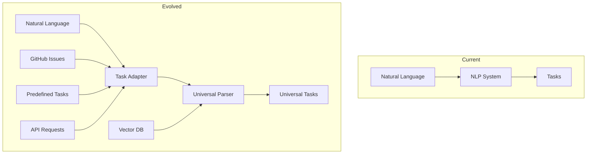
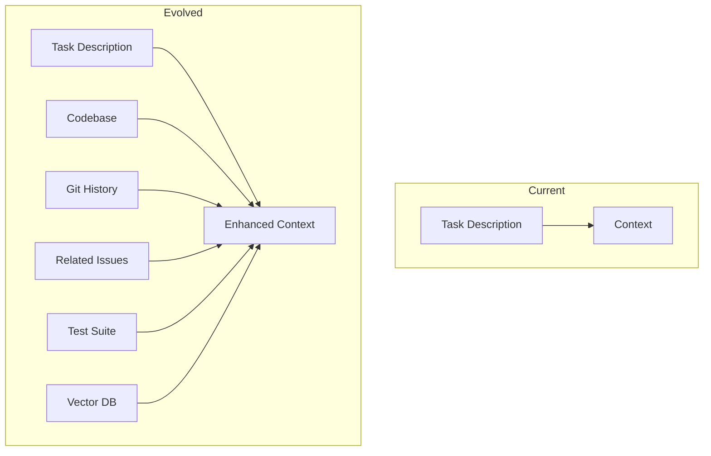
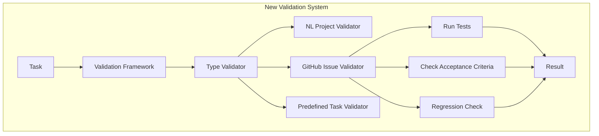

# Marcus Evolution: From Project Creation to Universal Software Engineering Assistant

## Executive Summary

This document outlines a comprehensive strategy for evolving Marcus from a natural language project creation tool into a universal software engineering assistant capable of handling pre-defined tasks, GitHub issues (SWE-bench-lite), and eventually becoming a general-purpose AI-powered development platform.

## Table of Contents

1. [Current State Analysis](#current-state-analysis)
2. [Evolution Phases](#evolution-phases)
3. [System-by-System Evolution Plan](#system-by-system-evolution-plan)
4. [Vector Database Integration](#vector-database-integration)
5. [Architecture Modifications](#architecture-modifications)
6. [Implementation Roadmap](#implementation-roadmap)
7. [Risk Analysis and Mitigation](#risk-analysis-and-mitigation)

## Current State Analysis

### Core Strengths

Marcus currently excels at:
- **Natural Language Understanding**: Sophisticated PRD parsing that extracts 7 key components
- **Task Orchestration**: AI-powered task assignment with phase-based dependencies
- **Multi-Agent Coordination**: Event-driven architecture supporting multiple AI workers
- **Learning Systems**: Dual-layer learning (PatternLearner + ProjectPatternLearner) with AI enhancement
- **Extensible Design**: Provider-based abstractions and plugin architecture
- **Recommendation Engine**: Pattern-based recommendations from historical data
- **Pipeline Analysis**: Comprehensive tracking with replay, what-if analysis, and comparison
- **Detection Systems**: Intelligent mode selection based on board state analysis
- **Orphan Recovery**: Robust task recovery mechanisms for failed agents
- **Quality Assurance**: Built-in validation and quality metrics tracking

### Current Limitations

- **Single Source Input**: Only handles natural language project descriptions
- **Limited Context**: No integration with existing codebases or issue tracking
- **Project-Centric**: Designed around creating new projects, not modifying existing ones
- **No Code Understanding**: Tasks are text-based without semantic code comprehension

## Evolution Phases

### Phase 1: Pre-defined Task Support (3-4 months)

Enable Marcus to accept and execute pre-defined task lists while maintaining its intelligent orchestration capabilities.

**Key Deliverables:**
1. Task Import System
2. Template Engine for common workflows
3. External task metadata preservation
4. Validation and normalization layer

### Phase 2: GitHub Issue Integration (4-6 months)

Transform Marcus into a GitHub issue resolution engine capable of understanding, planning, and executing fixes.

**Key Deliverables:**
1. GitHub issue analyzer with NLP
2. Code context extraction system
3. Bi-directional GitHub synchronization
4. Issue relationship mapping

### Phase 3: SWE-bench-lite Capability (6-8 months)

Enable Marcus to autonomously solve real-world software engineering problems from GitHub issues.

**Key Deliverables:**
1. Code comprehension system
2. Test-driven fix validation
3. Automated PR generation
4. Success metric tracking

### Phase 4: Universal Engineering Assistant (8-12 months)

Transform Marcus into a general-purpose software engineering platform.

**Key Deliverables:**
1. Multi-repository understanding
2. Cross-project learning
3. Proactive issue detection
4. Architectural recommendations

## System-by-System Evolution Plan

### 1. Natural Language Processing System

**Current State:**
- Parses natural language into structured tasks
- Creates comprehensive project structures
- Handles multiple complexity levels

**Evolution:**
```python
# New input sources
class TaskSourceAdapter(ABC):
    @abstractmethod
    async def parse_input(self, source_data: Any) -> TaskCollection:
        pass

class GitHubIssueAdapter(TaskSourceAdapter):
    async def parse_input(self, issue: GitHubIssue) -> TaskCollection:
        # Extract tasks from issue description
        # Parse checklists into subtasks
        # Analyze linked issues for dependencies
        # Extract acceptance criteria from comments
        
class PreDefinedTaskAdapter(TaskSourceAdapter):
    async def parse_input(self, task_list: List[Dict]) -> TaskCollection:
        # Validate task format
        # Normalize task structure
        # Infer missing metadata
        # Apply templates for common patterns
```

**Key Changes:**
- Abstract input parsing from task generation
- Support multiple input formats (Markdown, YAML, JSON, GitHub)
- Preserve source metadata throughout lifecycle
- Enable task template matching

### 2. Context & Dependency System

**Current State:**
- Infers dependencies from task descriptions
- Tracks architectural decisions
- Provides rich context for agents

**Evolution:**
```python
# Enhanced context building
class CodebaseContextBuilder:
    def __init__(self, vector_db: VectorDatabase):
        self.vector_db = vector_db
        self.code_analyzer = CodeSemanticAnalyzer()
    
    async def build_issue_context(self, issue: GitHubIssue) -> IssueContext:
        # Extract mentioned files from issue
        # Analyze code in mentioned files
        # Find similar code patterns in vector DB
        # Build dependency graph
        # Include test coverage information
        # Add historical change patterns

class CrossRepositoryDependencyTracker:
    async def find_dependencies(self, task: Task) -> List[ExternalDependency]:
        # Search vector DB for API usage
        # Identify shared libraries
        # Track configuration dependencies
        # Monitor breaking changes
```

**Key Changes:**
- Add code-aware context building
- Enable cross-repository dependency tracking
- Integrate with vector database for similarity search
- Support external dependency resolution

### 3. AI Intelligence Engine

**Current State:**
- Hybrid rule-based and AI system
- Task enrichment and analysis
- Blocker resolution suggestions

**Evolution:**
```python
# Code comprehension layer
class CodeComprehensionEngine:
    def __init__(self, vector_db: VectorDatabase):
        self.embeddings = CodeEmbeddingModel()
        self.understanding = CodeUnderstandingLLM()
    
    async def analyze_codebase(self, repo: Repository) -> CodebaseUnderstanding:
        # Generate embeddings for all code
        # Build semantic code map
        # Identify architectural patterns
        # Extract API contracts
        # Map test coverage
    
    async def suggest_fix_location(self, issue: Issue) -> List[FileLocation]:
        # Use vector similarity to find relevant code
        # Analyze call graphs
        # Identify test files to update
        # Suggest minimal change set

# Issue understanding enhancement
class GitHubIssueAnalyzer:
    async def analyze_issue(self, issue: Issue) -> IssueAnalysis:
        # Extract technical requirements
        # Identify issue type (bug, feature, refactor)
        # Estimate complexity
        # Find similar resolved issues
        # Generate fix strategy
```

**Key Changes:**
- Add code comprehension capabilities
- Enable fix location suggestions
- Support issue pattern matching
- Integrate historical fix data

### 4. Learning System Enhancement

**Current State:**
Marcus already has TWO sophisticated learning systems:
- **PatternLearner**: Basic pattern extraction (estimation, dependencies, workflows)
- **ProjectPatternLearner**: Advanced analysis with AI-powered insights
- **Pattern Database**: Stores success patterns, failure patterns, optimization rules
- **GitHub Integration**: Already analyzes code patterns and technology stacks

**Evolution (Enhancements Needed):**
```python
# Enhance existing learning systems for cross-project and issue-specific patterns
class EnhancedProjectPatternLearner(ProjectPatternLearner):
    def __init__(self, vector_db: VectorDatabase):
        super().__init__()
        self.vector_db = vector_db
        self.pattern_extractor = PatternExtractor()
    
    async def learn_from_github_issue(self, issue: Issue, resolution: Resolution):
        # Extend existing learn_from_project to handle issues
        # Extract fix patterns from code changes
        # Store issue-specific patterns
        # Link to existing project patterns
    
    async def find_similar_issues(self, issue: Issue) -> List[SimilarIssue]:
        # Use vector DB to find similar issues
        # Leverage existing similarity algorithms
        # Adapt recommendations to issue context

# New: Issue-specific pattern extension
class IssuePatternExtension:
    async def remember_fix(self, issue: Issue, fix: Fix):
        # Store issue embedding
        # Record fix approach
        # Track success metrics
        # Update pattern library
    
    async def suggest_fix_approach(self, issue: Issue) -> List[FixApproach]:
        # Find similar issues in vector DB
        # Rank previous fixes by success
        # Adapt to current codebase
        # Generate confidence scores
```

**Key Enhancements Needed:**
- Extend existing pattern types to include GitHub issue patterns
- Add vector database to complement existing Pattern Database
- Enhance similarity algorithms to work with code changes
- Build on existing GitHub integration to analyze issue resolutions
- Leverage existing AI-powered analysis for issue understanding

### 5. Task Management Evolution

**Current State:**
- Phase-based task execution with dependency enforcement
- AI-powered assignment with skill matching
- Progress tracking with blocker resolution
- Orphan task recovery system
- Assignment persistence and monitoring

**Evolution:**
```python
# Task source abstraction
class UniversalTask(Task):
    source_type: TaskSourceType  # nlp, github_issue, predefined
    source_ref: str  # Original source reference
    validation_spec: ValidationSpec  # How to verify completion
    success_criteria: List[Criterion]  # Measurable outcomes
    
# GitHub-aware task types
class GitHubTaskType(Enum):
    ISSUE_TRIAGE = "issue_triage"
    BUG_FIX = "bug_fix"
    PR_REVIEW = "pr_review"
    TEST_ADDITION = "test_addition"
    DOCUMENTATION = "documentation"
    REFACTORING = "refactoring"

# Validation framework
class TaskValidationFramework:
    async def validate_completion(self, task: UniversalTask) -> ValidationResult:
        validator = self.get_validator(task.source_type)
        return await validator.validate(task)

class GitHubIssueValidator(TaskValidator):
    async def validate(self, task: UniversalTask) -> ValidationResult:
        # Run associated tests
        # Check issue acceptance criteria
        # Verify no regressions
        # Validate PR is mergeable
```

**Key Changes:**
- Abstract task model for multiple sources
- Add validation framework
- Support GitHub-specific task types
- Enable automated completion verification

### 6. Recommendation Engine Evolution

**Current State:**
- Pattern-based recommendations from historical data
- Success factor analysis
- Template suggestions
- Performance optimization guidance

**Evolution:**
```python
# Extend for GitHub issue recommendations
class GitHubRecommendationEngine(PipelineRecommendationEngine):
    async def recommend_fix_approach(self, issue: Issue) -> List[Recommendation]:
        # Search pattern database for similar issues
        # Analyze code complexity around issue
        # Suggest fix locations using vector similarity
        # Recommend testing strategies
        # Estimate fix complexity and time
    
    async def recommend_reviewers(self, pr: PullRequest) -> List[Recommendation]:
        # Analyze code changes
        # Find developers with expertise in affected areas
        # Consider workload and availability
        # Suggest optimal review assignments

# Cross-repository pattern sharing
class FederatedRecommendationEngine:
    async def share_successful_patterns(self, pattern: Pattern):
        # Anonymize sensitive information
        # Extract generalizable insights
        # Upload to shared pattern repository
        # Tag with effectiveness metrics
```

**Key Changes:**
- Add issue-specific recommendation types
- Integrate with vector database for code-aware suggestions
- Enable cross-repository pattern sharing
- Support reviewer recommendations based on expertise

### 7. Pipeline Systems Evolution

**Current State:**
- Comprehensive tracking and replay
- What-if analysis for alternatives
- Flow comparison and visualization
- Performance monitoring

**Evolution:**
```python
# GitHub issue pipeline tracking
class IssuePipelineTracker(PipelineTracker):
    async def track_issue_resolution(self, issue: Issue):
        # Track issue analysis phase
        # Monitor code exploration steps
        # Record fix implementation progress
        # Capture test creation/updates
        # Log PR creation and review cycles
    
    async def predict_issue_complexity(self, issue: Issue) -> ComplexityPrediction:
        # Analyze similar issues in pipeline history
        # Consider code area complexity
        # Factor in test coverage
        # Predict timeline and blockers

# Enhanced what-if analysis
class GitHubWhatIfEngine(WhatIfAnalysisEngine):
    async def simulate_fix_approaches(self, issue: Issue) -> List[Simulation]:
        # Generate multiple fix strategies
        # Simulate each approach
        # Predict success probability
        # Estimate resource requirements
        # Rank by risk/reward
```

**Key Changes:**
- Track GitHub-specific pipeline events
- Add issue complexity prediction
- Enhance what-if analysis for fix strategies
- Monitor PR lifecycle events

### 8. Detection Systems Evolution

**Current State:**
- Board state analysis
- Mode recommendation
- Context detection from user messages
- Chaos scoring

**Evolution:**
```python
# Repository health detection
class RepositoryAnalyzer(BoardAnalyzer):
    async def analyze_repository_health(self, repo: Repository) -> RepoHealth:
        # Analyze issue backlog growth rate
        # Detect technical debt indicators
        # Identify hotspots needing refactoring
        # Monitor test coverage trends
        # Flag security vulnerabilities
    
    async def detect_intervention_needs(self, repo: Repository) -> List[Intervention]:
        # Identify stale PRs needing review
        # Detect recurring issue patterns
        # Find undertested code areas
        # Suggest proactive improvements

# Enhanced context detection for issues
class IssueContextDetector(ContextDetector):
    async def detect_issue_context(self, issue: Issue) -> IssueContext:
        # Parse issue for technical details
        # Extract mentioned files/functions
        # Identify related issues
        # Determine issue priority
        # Suggest initial approach
```

**Key Changes:**
- Add repository-level health analysis
- Detect when Marcus intervention would help
- Enhanced context extraction from issues
- Proactive problem detection

### 9. Orphan Task Recovery Evolution

**Current State:**
- Monitor task assignments
- Detect orphaned tasks
- Automatic recovery
- Health checking

**Evolution:**
```python
# GitHub-aware recovery
class GitHubTaskRecovery(OrphanTaskRecovery):
    async def recover_pr_tasks(self, pr: PullRequest):
        # Detect stalled PR reviews
        # Identify abandoned fix attempts
        # Reassign to available agents
        # Preserve PR context and history
    
    async def handle_merge_conflicts(self, task: Task):
        # Detect tasks blocked by conflicts
        # Attempt automatic resolution
        # Escalate complex conflicts
        # Update task dependencies

# Cross-repository task coordination
class DistributedTaskRecovery:
    async def coordinate_cross_repo_tasks(self):
        # Track tasks spanning repositories
        # Detect cross-repo blockers
        # Coordinate recovery actions
        # Maintain consistency
```

**Key Changes:**
- Handle GitHub-specific failure modes
- Recover from PR-related blocks
- Support cross-repository coordination
- Enhanced merge conflict handling

### 10. Kanban Integration Enhancement

**Current State:**
- Multi-provider support
- Basic GitHub Projects integration
- One-way task creation

**Evolution:**
```python
# Enhanced GitHub integration
class GitHubEnhancedProvider(KanbanProvider):
    async def sync_with_issues(self):
        # Two-way synchronization
        # Issue state mapping
        # Label synchronization
        # Milestone tracking
    
    async def create_pr_from_task(self, task: Task) -> PullRequest:
        # Generate PR from task completion
        # Link to original issue
        # Include task context
        # Add implementation notes
    
    async def monitor_pr_status(self, pr: PullRequest):
        # Track review status
        # Monitor CI/CD results
        # Update task accordingly
        # Handle merge conflicts
```

**Key Changes:**
- Full bi-directional GitHub sync
- Automated PR generation
- CI/CD integration
- Review process tracking

### 11. Quality Assurance Evolution

**Current State:**
- Board quality validation
- Task completeness checking
- Estimation accuracy tracking
- Basic quality metrics

**Evolution:**
```python
# GitHub-aware quality validation
class GitHubQualityValidator(QualityValidator):
    async def validate_fix_quality(self, issue: Issue, fix: Fix) -> QualityReport:
        # Verify issue requirements are met
        # Check test coverage for changes
        # Validate no regressions introduced
        # Ensure code style compliance
        # Verify documentation updates
    
    async def validate_pr_quality(self, pr: PullRequest) -> PRQualityReport:
        # Check PR description completeness
        # Verify linked issues
        # Validate test results
        # Check merge readiness
        # Assess review quality

# Automated quality enforcement
class QualityEnforcementEngine:
    async def enforce_fix_standards(self, task: Task):
        # Run automated tests
        # Check coverage thresholds
        # Validate against issue criteria
        # Generate quality report
        # Block or approve progression
```

**Key Changes:**
- Add GitHub-specific quality metrics
- Validate fixes against issue requirements
- Automated quality gates for PRs
- Integration with CI/CD quality checks

### 12. Communication Hub Evolution

**Current State:**
- Event routing between components
- Message formatting and delivery
- Channel management

**Evolution:**
```python
# GitHub event integration
class GitHubCommunicationHub(CommunicationHub):
    async def handle_github_webhooks(self, event: GitHubEvent):
        # Route issue events to appropriate handlers
        # Convert PR events to Marcus tasks
        # Notify agents of review requests
        # Broadcast merge notifications
    
    async def create_github_notifications(self, action: Action):
        # Generate issue comments
        # Create PR review comments
        # Update issue status
        # Notify mentioned users

# Cross-platform communication
class UnifiedCommunicationHub:
    async def bridge_platforms(self):
        # Sync between Slack, GitHub, and Marcus
        # Unified notification preferences
        # Cross-platform mentions
        # Activity aggregation
```

**Key Changes:**
- Native GitHub webhook handling
- Bi-directional communication with GitHub
- Unified messaging across platforms
- Rich notification context

### 13. Monitoring Systems Evolution

**Current State:**
- Agent performance tracking
- Task completion monitoring
- System health metrics
- Alert generation

**Evolution:**
```python
# Repository monitoring
class GitHubMonitor(Monitor):
    async def monitor_repository_metrics(self, repo: Repository):
        # Track issue velocity
        # Monitor PR cycle time
        # Measure code quality trends
        # Alert on degradation
        # Generate insights
    
    async def monitor_agent_github_performance(self, agent: Agent):
        # Track PR success rate
        # Measure fix quality
        # Monitor review turnaround
        # Identify skill gaps
        # Suggest training

# Predictive monitoring
class PredictiveGitHubMonitor:
    async def predict_issue_escalation(self, issue: Issue):
        # Analyze issue patterns
        # Predict complexity growth
        # Alert on risk factors
        # Suggest early intervention
```

**Key Changes:**
- GitHub-specific metrics and KPIs
- Agent performance on GitHub tasks
- Predictive analytics for issues
- Proactive alerting

### 14. Error Framework Evolution

**Current State:**
- Six-tier error classification
- Recovery strategies
- Context-rich error handling
- Pattern detection

**Evolution:**
```python
# GitHub-specific errors
class GitHubErrorHandler(ErrorHandler):
    async def handle_api_errors(self, error: GitHubAPIError):
        # Rate limit handling with backoff
        # Permission error resolution
        # Network retry strategies
        # Webhook delivery failures
    
    async def handle_merge_errors(self, error: MergeError):
        # Conflict resolution strategies
        # Build failure handling
        # Review requirement errors
        # Branch protection violations

# Cross-repository error correlation
class DistributedErrorAnalyzer:
    async def correlate_errors(self, errors: List[Error]):
        # Identify systemic issues
        # Detect cascading failures
        # Suggest root cause
        # Coordinate recovery
```

**Key Changes:**
- GitHub API error handling
- Merge and conflict error strategies
- Cross-repository error correlation
- Enhanced recovery mechanisms

## Vector Database Integration

### Purpose

A vector database would transform Marcus's ability to understand and navigate complex codebases by:

1. **Semantic Code Search**: Find similar code patterns across repositories
2. **Issue Similarity**: Match new issues with previously solved problems
3. **Cross-Project Learning**: Share patterns between Marcus instances
4. **Dependency Understanding**: Map semantic relationships in code

### Architecture

```python
# Vector database integration
class MarcusVectorDB:
    def __init__(self, provider: VectorDBProvider):
        self.provider = provider  # Pinecone, Weaviate, Qdrant
        self.embedding_model = CodeEmbeddingModel()
    
    async def index_codebase(self, repo: Repository):
        # Parse all code files
        # Generate embeddings for functions/classes
        # Store with metadata
        # Build relationship graph
    
    async def index_issue(self, issue: Issue):
        # Embed issue description
        # Include code context
        # Store resolution if available
        # Link to related issues
    
    async def find_similar_code(self, code_snippet: str) -> List[CodeMatch]:
        # Generate embedding
        # Query vector database
        # Rank by similarity
        # Include context
    
    async def find_fix_patterns(self, issue: Issue) -> List[FixPattern]:
        # Embed issue
        # Search for similar resolved issues
        # Extract fix patterns
        # Adapt to current context
```

### Use Cases

#### 1. Issue Resolution
```python
# When receiving a new GitHub issue
issue_embedding = await vector_db.embed_issue(issue)
similar_issues = await vector_db.find_similar_issues(issue_embedding)
fix_patterns = await vector_db.extract_fix_patterns(similar_issues)
suggested_approach = await ai_engine.adapt_fix_pattern(fix_patterns, current_context)
```

#### 2. Code Navigation
```python
# When agent needs to find where to implement a fix
mentioned_symbols = extract_symbols(issue.description)
code_locations = await vector_db.find_symbol_definitions(mentioned_symbols)
related_code = await vector_db.find_related_code(code_locations)
impact_analysis = await vector_db.analyze_change_impact(code_locations)
```

#### 3. Cross-Project Learning
```python
# Share successful patterns
pattern = extract_pattern(completed_task)
anonymized_pattern = anonymize(pattern)
await vector_db.store_pattern(anonymized_pattern)

# Use patterns from other projects
similar_context = await vector_db.find_similar_contexts(current_task)
applicable_patterns = await vector_db.get_patterns(similar_context)
adapted_solution = await ai_engine.adapt_pattern(applicable_patterns)
```

### Implementation Strategy

1. **Phase 1**: Local codebase indexing
   - Index current repository
   - Build function/class embeddings
   - Create dependency graph

2. **Phase 2**: Issue pattern matching
   - Index resolved issues
   - Build fix pattern library
   - Enable similarity search

3. **Phase 3**: Cross-project sharing
   - Anonymization pipeline
   - Pattern extraction
   - Federated learning

4. **Phase 4**: Real-time updates
   - Incremental indexing
   - Live code changes
   - Dynamic pattern updates

## Architecture Modifications

### 1. Input Abstraction Layer



### 2. Context Enhancement



### 3. Validation Framework



## Implementation Roadmap

### Quarter 1: Foundation (Months 1-3)

**Month 1: Input Abstraction**
- Design universal task model
- Implement task adapters
- Create validation framework
- Update existing systems for compatibility

**Month 2: Context Enhancement**
- Integrate code analysis tools
- Build issue context extractor
- Implement dependency analyzer
- Create context API

**Month 3: Initial GitHub Integration**
- Enhance GitHub provider
- Implement issue parsing
- Add bi-directional sync
- Create PR automation

### Quarter 2: Intelligence Enhancement (Months 4-6)

**Month 4: Vector Database Setup**
- Select and integrate vector DB
- Implement code embedding pipeline
- Create indexing system
- Build search APIs

**Month 5: Code Comprehension**
- Integrate code understanding models
- Build semantic search
- Implement fix location detection
- Create impact analysis

**Month 6: Pattern Learning**
- Extract fix patterns
- Build pattern library
- Implement pattern matching
- Create adaptation system

### Quarter 3: SWE-bench-lite Capability (Months 7-9)

**Month 7: Issue Resolution Pipeline**
- Complete issue analyzer
- Implement fix generator
- Add test validation
- Create success metrics

**Month 8: Autonomous Operation**
- Build end-to-end automation
- Implement self-validation
- Add monitoring systems
- Create feedback loops

**Month 9: Performance Optimization**
- Optimize vector searches
- Improve pattern matching
- Enhance parallelization
- Scale testing

### Quarter 4: Universal Platform (Months 10-12)

**Month 10: Cross-Project Features**
- Implement pattern sharing
- Build federated learning
- Create privacy controls
- Add organization features

**Month 11: Advanced Capabilities**
- Proactive issue detection
- Architectural analysis
- Performance optimization suggestions
- Security vulnerability detection

**Month 12: Platform Polish**
- UI/UX improvements
- API standardization
- Documentation completion
- Launch preparation

## Risk Analysis and Mitigation

### Technical Risks

1. **Code Understanding Complexity**
   - Risk: LLMs may misunderstand complex code
   - Mitigation: Hybrid approach with static analysis, extensive testing

2. **Vector Database Scalability**
   - Risk: Performance degradation with large codebases
   - Mitigation: Hierarchical indexing, caching, distributed architecture

3. **GitHub API Limitations**
   - Risk: Rate limits and API restrictions
   - Mitigation: Intelligent caching, webhook usage, bulk operations

### Organizational Risks

1. **Adoption Resistance**
   - Risk: Developers skeptical of AI modifications
   - Mitigation: Start with low-risk tasks, provide override controls

2. **Training Data Quality**
   - Risk: Poor patterns from bad code
   - Mitigation: Curated training sets, quality filters

### Security Risks

1. **Code Exposure**
   - Risk: Sensitive code in vector database
   - Mitigation: Encryption, access controls, anonymization

2. **Malicious Patterns**
   - Risk: Learning from compromised code
   - Mitigation: Security scanning, pattern validation

## Success Metrics

### Phase 1 Metrics
- Successfully import 95% of standard task formats
- Maintain current task execution success rate
- Zero regression in existing functionality

### Phase 2 Metrics
- Resolve 50% of simple GitHub issues autonomously
- Reduce issue resolution time by 40%
- 90% accuracy in issue classification

### Phase 3 Metrics
- Pass 30% of SWE-bench-lite tests
- Generate mergeable PRs 70% of the time
- Reduce human intervention by 60%

### Phase 4 Metrics
- 80% user satisfaction rating
- 50% reduction in bug resolution time
- 10x increase in handled issue volume

## Conclusion

The evolution of Marcus from a project creation tool to a universal software engineering assistant is both ambitious and achievable. The existing architecture provides a solid foundation with its event-driven design, AI integration, and extensible provider system.

The key to success lies in:
1. Gradual evolution maintaining backward compatibility
2. Vector database integration for semantic understanding
3. Strong validation and testing frameworks
4. Community-driven pattern learning

By following this roadmap, Marcus can become the first truly intelligent, general-purpose software engineering assistant capable of understanding, planning, and executing complex development tasks across any codebase.