# Workspace Isolation and Feature Context Design

**Status**: Draft
**Created**: 2025-01-05
**Target Version**: Marcus v2.0
**Authors**: Development Team

---

## Table of Contents

1. [Executive Summary](#executive-summary)
2. [Background: How Marcus Works Today](#background-how-marcus-works-today)
3. [The Problem We're Solving](#the-problem-were-solving)
4. [Core Concepts](#core-concepts)
5. [Detailed Design](#detailed-design)
6. [Implementation Guide](#implementation-guide)
7. [Agent Integration](#agent-integration)
8. [Context Flow & Guarantees](#context-flow--guarantees)
9. [Caveats and Gotchas](#caveats-and-gotchas)
10. [Testing Strategy](#testing-strategy)
11. [Rollout Plan](#rollout-plan)

---

## Executive Summary

### What We're Building

We're adding **workspace isolation** and **feature-level context** to Marcus to enable safe, scalable multi-agent development.

**Key Capabilities:**
- **Per-task workspaces**: Each task gets its own Git branch and filesystem directory
- **Feature-level aggregation**: All artifacts and decisions for a feature are accessible in one view
- **Zero conflicts**: Multiple agents can work simultaneously without stepping on each other
- **Rich context**: Agents automatically receive all design decisions and artifacts they need

### Why This Matters

**Current Pain Points:**
1. Multiple agents might work in the same directory → file conflicts
2. No way to ask "what's the status of the auth feature?" → scattered information
3. Agents don't know which Git branch to use → inconsistent versioning
4. Hard to track what artifacts exist for a feature → agents miss critical context

**After This Change:**
1. ✅ Each agent works in isolated workspace → no conflicts possible
2. ✅ `get_feature_context(feature_id)` → complete feature view
3. ✅ Marcus tells agents exactly which branch to use → automatic isolation
4. ✅ Feature context aggregates all artifacts → nothing is missed

### For Junior Engineers

Think of it like this:

**Before**: All agents work in the same shared folder. It's like 5 people trying to edit the same Google Doc at once - chaos!

**After**: Each agent gets their own copy of the codebase in a separate folder, tied to a specific Git branch. It's like each person gets their own Google Doc to work on, and Marcus merges them together safely when done.

---

## Background: How Marcus Works Today

### Current Architecture

Marcus is a **multi-agent orchestration system** that coordinates coding agents working on the same project. Here's how it works right now:

#### 1. Project Creation

When a user calls `create_project`:

```python
# Example: User wants to build a task management API
create_project(
    description="Build a REST API for managing tasks with CRUD operations",
    project_name="task-management-api",
    options={"complexity": "standard"}
)
```

**What happens:**
1. **AI Analysis**: Marcus uses `AdvancedPRDParser` to analyze the description
2. **Task Decomposition**: Creates a DAG (Directed Acyclic Graph) of tasks
3. **Kanban Integration**: Creates a Planka board with lists for Design/Implement/Test
4. **Task Types Based on Complexity**:
   - **Prototype**: 1 Design + 2-5 Implement tasks (no tests)
   - **Standard**: 1 Design + 8-15 Implement + 1-2 Test tasks
   - **Enterprise**: 1-2 Design + 15-30 Implement + 3+ Test tasks

#### 2. Bundled Design Tasks

**Critical Concept**: A Design task is NOT a single feature - it's a **bundled specification** covering multiple related domains.

**Example Design Task**:
```
Task ID: T-DESIGN-1
Name: "Design Task Management System"
Description: |
  Design comprehensive task management system including:
  - Task creation (title, description, due date, priority)
  - Task viewing/listing with pagination
  - Task deletion with soft-delete pattern
  - Task status updates (todo → in_progress → done)
  - Task filtering by status/priority

  Architecture decisions:
  - RESTful API design
  - PostgreSQL for persistence
  - Redis for caching
  - JWT authentication required
```

**This ONE design task splits into MULTIPLE implementation tasks**:
- T-IMPL-1: Implement Create Task
- T-IMPL-2: Implement View Tasks
- T-IMPL-3: Implement Delete Task
- T-IMPL-4: Implement Task Status Updates
- T-IMPL-5: Implement Task Filtering

#### 3. Task Assignment Flow

```mermaid
sequenceDiagram
    participant Agent as Agent A
    participant Marcus as Marcus Server
    participant DAG as Task Graph
    participant Kanban as Planka Board

    Agent->>Marcus: request_next_task(agent_id="Agent-A")
    Marcus->>DAG: Find next ready task (deps satisfied)
    DAG-->>Marcus: T-IMPL-1 (depends on T-DESIGN-1)
    Marcus->>Marcus: Build task context
    Marcus-->>Agent: Task with instructions + context
    Agent->>Agent: Work on task (WHERE?? 🤔)
    Agent->>Marcus: report_task_progress(status="completed")
    Marcus->>Kanban: Update card to "Done"
    Marcus->>DAG: Mark task complete
```



**The Problem**: See that "Work on task (WHERE?? 🤔)" step? **There's no isolation!**

#### 4. Current Context System

Marcus already has `get_task_context(task_id)`:

```python
# Agent working on T-IMPL-1 calls:
context = get_task_context("T-IMPL-1")

# Returns:
{
    "task_id": "T-IMPL-1",
    "dependencies": ["T-DESIGN-1"],
    "parent_task": {
        "id": "T-DESIGN-1",
        "name": "Design Task Management System"
    },
    "artifacts": [
        {
            "filename": "task-management-spec.md",
            "location": "docs/design/task-management-spec.md",
            "type": "design",
            "created_by": "Agent-Design-1"
        }
    ],
    "decisions": [
        {
            "decision": "Use PostgreSQL for persistence",
            "rationale": "Need ACID transactions for task updates",
            "task_id": "T-DESIGN-1"
        },
        {
            "decision": "Implement soft-delete pattern",
            "rationale": "Allow task recovery and audit trail",
            "task_id": "T-DESIGN-1"
        }
    ]
}
```

**This works!** But it's **task-centric**, not **feature-centric**.

#### 5. Artifact Storage

When agents create artifacts:

```python
# Agent completing design task logs artifact:
log_artifact(
    task_id="T-DESIGN-1",
    filename="task-management-spec.md",
    content=design_spec,
    artifact_type="design",
    project_root="/Users/lwgray/dev/task-api",  # ⚠️ Single shared directory!
    description="Complete task management system design"
)
```

**Storage locations** (from `log_artifact`):
- Design artifacts → `{project_root}/docs/design/`
- API specs → `{project_root}/docs/api/`
- Implementation docs → `{project_root}/docs/`
- Test artifacts → `{project_root}/tests/`

**Problem**: All agents write to the SAME `project_root` directory!

### What's Missing

| Capability | Current State | Problem |
|-----------|---------------|---------|
| **Workspace Isolation** | ❌ All agents share `project_root` | File conflicts when multiple agents work simultaneously |
| **Branch Management** | ❌ Agents don't know which branch to use | Inconsistent Git history, hard to review changes |
| **Feature-Level View** | ❌ Only task-level context exists | Can't answer "what's everything about the task management feature?" |
| **Artifact Aggregation** | ❌ Artifacts scattered across tasks | Agents might miss relevant design decisions from related tasks |
| **Concurrent Safety** | ❌ No isolation mechanism | Two agents editing same file = data loss |

---

## The Problem We're Solving

### Problem 1: Concurrent Agent Conflicts

**Scenario**: Two agents work on the same feature simultaneously.

```
Agent A: Working on T-IMPL-1 (Implement Create Task)
Agent B: Working on T-IMPL-2 (Implement View Tasks)

Both agents are in: /Users/lwgray/dev/task-api/

Agent A writes: src/api/tasks.py (POST endpoint)
Agent B writes: src/api/tasks.py (GET endpoint)

💥 CONFLICT! Who wins? File gets corrupted or one agent's work is lost.
```

**Real-World Impact**:
- Lost work when agents overwrite each other
- Merge conflicts that can't be resolved (agents don't coordinate)
- Race conditions in file system operations
- Impossible to review changes per-agent

### Problem 2: No Feature-Level Understanding

**Scenario**: PM wants to know "What's the status of task management?"

**Current Approach** (manual):
```bash
# Find all tasks related to task management
SELECT * FROM tasks WHERE name LIKE '%task%'

# Found: T-DESIGN-1, T-IMPL-1, T-IMPL-2, T-IMPL-3, T-IMPL-4, T-TEST-1

# Check artifacts for each task
cat docs/design/task-management-spec.md  # From T-DESIGN-1
cat docs/api/create-task.md             # From T-IMPL-1
cat docs/api/view-tasks.md              # From T-IMPL-2
# ... manually aggregate 6 tasks worth of artifacts
```

**Problem**: No programmatic way to aggregate!

### Problem 3: Agents Don't Know What Branch to Use

**Current Agent Workflow**:
```python
# Agent gets task
task = request_next_task(agent_id="Agent-A")

# Agent wants to commit work... but to which branch?
# Agent's prompt says: "work on your dedicated branch: {BRANCH_NAME}"
# But {BRANCH_NAME} is never filled in!

# Agent guesses:
git checkout -b "implement-create-task"  # ❓ Is this right?
# or
git checkout main  # ❓ Work directly on main?
# or
git checkout develop  # ❓ Use develop?

# Result: Inconsistent branching strategy, hard to review PRs
```

### Problem 4: Context Gaps Across Related Tasks

**Scenario**: Agent working on T-IMPL-3 (Delete Task) needs context from T-IMPL-1 and T-IMPL-2.

**Current Behavior**:
```python
context = get_task_context("T-IMPL-3")

# Returns only DIRECT dependencies:
{
    "dependencies": ["T-DESIGN-1"],  # ✅ Has design
    "artifacts": [
        "docs/design/task-management-spec.md"  # ✅ Has design artifact
    ]
}

# ❌ MISSING: Artifacts from T-IMPL-1 and T-IMPL-2!
# T-IMPL-1 might have created: docs/api/task-model.ts (model definition)
# T-IMPL-2 might have created: docs/api/response-format.json (API patterns)

# Agent implements delete endpoint WITHOUT knowing:
# - What the task model looks like (from T-IMPL-1)
# - What response format to use (from T-IMPL-2)
# - What error codes others are using
```

**Why This Happens**:
- T-IMPL-3 doesn't list T-IMPL-1 or T-IMPL-2 as dependencies
- They're "sibling" tasks (all depend on T-DESIGN-1)
- Task-level context doesn't see "sibling" artifacts

**What We Need**:
- **Feature-level context** that shows ALL artifacts from ALL tasks in the feature
- So T-IMPL-3 can see what T-IMPL-1 and T-IMPL-2 created

---

## Core Concepts

### Hierarchy: Project → Feature → Tasks

```
Project (Repository)
  ├─ Feature F-100 (User Authentication)
  │   ├─ T-DESIGN-1: Design auth system
  │   ├─ T-IMPL-1: Implement JWT generation
  │   ├─ T-IMPL-2: Implement login endpoint
  │   ├─ T-IMPL-3: Implement password reset
  │   └─ T-TEST-1: Auth integration tests
  │
  ├─ Feature F-200 (Task Management)
  │   ├─ T-DESIGN-1: Design task CRUD system
  │   ├─ T-IMPL-1: Implement Create Task
  │   ├─ T-IMPL-2: Implement View Tasks
  │   ├─ T-IMPL-3: Implement Delete Task
  │   ├─ T-IMPL-4: Implement Task Status Updates
  │   └─ T-TEST-1: Task CRUD tests
  │
  └─ Feature F-300 (Notifications)
      ├─ T-DESIGN-1: Design notification system
      ├─ T-IMPL-1: Implement email notifications
      ├─ T-IMPL-2: Implement in-app notifications
      └─ T-TEST-1: Notification tests
```

### Definition: Project

**Project** = The codebase/repository where all work happens

**Examples**:
- `marcus` (this orchestration system)
- `task-management-api` (a REST API project)
- `field-yield-dashboard` (an agricultural analytics app)

**Properties**:
- Single Git repository
- Single `main` branch
- Has `project_root` filesystem path
- Multiple features in progress simultaneously

**Current Marcus**:
```python
# When Marcus initializes, it tracks projects like:
projects = {
    "proj-marcus": {
        "name": "marcus",
        "repo_url": "https://github.com/lwgray/marcus",
        "main_branch": "main",
        "local_path": "/Users/lwgray/dev/marcus"
    }
}
```

**⚠️ Current Confusion**: `create_project()` actually creates a **feature**, not a project!

### Definition: Feature

**Feature** = A cohesive piece of functionality defined by a bundled design task

**Key Property**: Feature boundary = Design task scope

A feature includes:
1. **ONE bundled design task** (covers multiple domains)
2. **N implementation tasks** (split from design domains)
3. **M test tasks** (validates implementations)

**Examples**:

```
Feature F-200: "Task Management System"
├─ Design Task (T-DESIGN-1): Bundled specification for:
│   ├─ Domain: Task creation
│   ├─ Domain: Task viewing
│   ├─ Domain: Task deletion
│   ├─ Domain: Task status updates
│   └─ Domain: Task filtering
│
├─ Implementation Tasks (one per domain):
│   ├─ T-IMPL-1: Implement Create Task
│   ├─ T-IMPL-2: Implement View Tasks
│   ├─ T-IMPL-3: Implement Delete Task
│   ├─ T-IMPL-4: Implement Task Status Updates
│   └─ T-IMPL-5: Implement Task Filtering
│
└─ Test Tasks:
    ├─ T-TEST-1: Integration tests for task CRUD
    └─ T-TEST-2: E2E tests for task workflows
```

**Why Design Task Defines Feature Boundary**:
1. It **bundles related domains** into one specification
2. It **determines scope** of all implementation tasks
3. It **creates shared context** all implementations depend on
4. It **produces key artifact** (design spec) that unifies the feature

**Properties**:
- `feature_id`: e.g., `F-200`
- `feature_name`: e.g., `task-management-system`
- `feature_branch`: `feature/F-200-task-management`
- **Feature Context**: Aggregated view of all tasks, artifacts, decisions

### Definition: Task

**Task** = Unit of work within a feature with clear inputs/outputs

**Properties**:
- `task_id`: e.g., `T-IMPL-1`
- `feature_id`: e.g., `F-200`
- `phase`: DESIGN, IMPLEMENT, or TEST
- `task_branch`: `task/F-200/T-IMPL-1-create-task`
- `workspace_path`: `/tmp/marcus/workspaces/F-200/T-IMPL-1/`
- **Dependencies**: Other tasks in the DAG
- **Artifacts**: Files created (specs, code, tests)
- **Decisions**: Architectural choices logged

**Task Phases**:

| Phase | Purpose | Artifacts | Dependencies |
|-------|---------|-----------|--------------|
| **DESIGN** | Create specifications, make architecture decisions | Design docs, API specs, diagrams | None (or other DESIGN tasks) |
| **IMPLEMENT** | Write code based on design | Source code, documentation | DESIGN task(s) |
| **TEST** | Validate implementations | Test files, test reports | IMPLEMENT task(s) |

**Complexity Affects Task Count**:

```python
# Prototype Mode (3-5 core features)
Feature F-200
├─ T-DESIGN-1: Quick design (minimal spec)
└─ T-IMPL-1, T-IMPL-2: Core implementations
   (No test tasks - happy path only)

# Standard Mode (8-15 features)
Feature F-200
├─ T-DESIGN-1: Standard design
├─ T-IMPL-1...T-IMPL-5: Core + essential features
└─ T-TEST-1: Integration tests

# Enterprise Mode (15-30+ features)
Feature F-200
├─ T-DESIGN-1: Comprehensive design (security, monitoring, etc.)
├─ T-IMPL-1...T-IMPL-12: All implementations + observability
├─ T-TEST-1: Integration tests
├─ T-TEST-2: E2E tests
└─ T-TEST-3: Performance/security tests
```

### Git Branching Strategy

```
Repository: task-management-api

main (stable)
│
├─ feature/F-100-user-auth
│   ├─ task/F-100/T-DESIGN-1-auth-spec
│   ├─ task/F-100/T-IMPL-1-jwt-generation
│   ├─ task/F-100/T-IMPL-2-login-endpoint
│   └─ task/F-100/T-TEST-1-auth-tests
│
├─ feature/F-200-task-management
│   ├─ task/F-200/T-DESIGN-1-task-spec
│   ├─ task/F-200/T-IMPL-1-create-task
│   ├─ task/F-200/T-IMPL-2-view-tasks
│   ├─ task/F-200/T-IMPL-3-delete-task
│   ├─ task/F-200/T-IMPL-4-status-updates
│   └─ task/F-200/T-TEST-1-crud-tests
│
└─ feature/F-300-notifications
    └─ ...
```

**Branch Naming Rules**:
- **Feature branch**: `feature/<feature-id>-<name>`
  - Example: `feature/F-200-task-management`
- **Task branch**: `task/<feature-id>/<task-id>-<short-name>`
  - Example: `task/F-200/T-IMPL-1-create-task`

**Merge Flow**:
```
task/F-200/T-IMPL-1 → feature/F-200 → main
                     ↑                ↑
                     Marcus merges    Marcus merges when
                     when task done   feature complete
```

**Who Can Merge**:
- ✅ **Marcus orchestrator**: Can merge task → feature, feature → main
- ❌ **Agents**: NEVER merge, only commit to their task branch

### Workspace Isolation

**Workspace** = Isolated filesystem directory tied to a task branch

**Directory Structure**:
```
/tmp/marcus/workspaces/
├─ F-100/  (User Auth feature)
│   ├─ T-DESIGN-1/
│   │   ├─ .git → worktree for task/F-100/T-DESIGN-1-auth-spec
│   │   ├─ docs/design/auth-spec.md  (agent creates)
│   │   └─ docs/api/auth-api.yaml    (agent creates)
│   │
│   ├─ T-IMPL-1/
│   │   ├─ .git → worktree for task/F-100/T-IMPL-1-jwt-generation
│   │   ├─ docs/design/auth-spec.md  (FROM design task, read-only)
│   │   └─ src/auth/jwt.py            (agent creates)
│   │
│   └─ T-IMPL-2/
│       ├─ .git → worktree for task/F-100/T-IMPL-2-login-endpoint
│       ├─ docs/design/auth-spec.md  (FROM design task, read-only)
│       ├─ src/auth/jwt.py            (FROM T-IMPL-1, read-only)
│       └─ src/api/login.py           (agent creates)
│
└─ F-200/  (Task Management feature)
    ├─ T-DESIGN-1/
    ├─ T-IMPL-1/
    └─ T-IMPL-2/
```

**Key Properties**:
- **1:1 mapping**: One workspace per task
- **Git worktree**: Each workspace is a Git worktree (not a clone!)
- **Branch bound**: Workspace checked out to task branch
- **Isolated**: Agents cannot see each other's workspaces
- **Clean**: Workspace deleted after task completion

**Why Git Worktrees?**:
```bash
# Instead of:
git clone repo.git workspace-1/  # Full copy (slow, large)
git clone repo.git workspace-2/  # Another full copy

# Use worktrees:
git worktree add /tmp/marcus/workspaces/F-200/T-IMPL-1 task/F-200/T-IMPL-1
git worktree add /tmp/marcus/workspaces/F-200/T-IMPL-2 task/F-200/T-IMPL-2

# Benefits:
# - Share .git history (efficient)
# - Isolated working directories
# - Fast creation/deletion
# - No need to fetch/pull separately
```

### Task Context vs Feature Context

**Two complementary views**:

#### Task Context (Existing)

**Purpose**: "What do I need to do MY job?"

**Scope**: Current task + direct dependencies

**Example**:
```python
get_task_context("T-IMPL-3")  # Delete Task implementation

# Returns:
{
    "task_id": "T-IMPL-3",
    "feature_id": "F-200",
    "phase": "IMPLEMENT",
    "dependencies": ["T-DESIGN-1"],  # Direct dependency only
    "parent_task": {
        "id": "T-DESIGN-1",
        "name": "Design Task Management System"
    },
    "artifacts": [
        # Only artifacts from T-DESIGN-1 (direct dependency)
        {
            "filename": "task-management-spec.md",
            "location": "docs/design/task-management-spec.md",
            "task_id": "T-DESIGN-1"
        }
    ],
    "decisions": [
        # Only decisions from T-DESIGN-1
        {"decision": "Use soft-delete pattern", "task_id": "T-DESIGN-1"}
    ]
}
```

**Limitations**:
- ❌ Doesn't see sibling task artifacts (T-IMPL-1, T-IMPL-2)
- ❌ Can't answer "what's everything about this feature?"
- ❌ Misses implementation patterns from other tasks

#### Feature Context (New)

**Purpose**: "What's EVERYTHING about this feature?"

**Scope**: ALL tasks in the feature

**Example**:
```python
get_feature_context("F-200")  # Task Management feature

# Returns:
{
    "feature_id": "F-200",
    "feature_name": "Task Management System",
    "project_id": "proj-task-api",
    "feature_branch": "feature/F-200-task-management",

    # The bundled design that defines this feature
    "design_task": {
        "task_id": "T-DESIGN-1",
        "status": "done",
        "artifact": "docs/design/task-management-spec.md",
        "domains_covered": [
            "Task creation",
            "Task viewing",
            "Task deletion",
            "Task status updates"
        ],
        "decisions": [
            "Use PostgreSQL for persistence",
            "Implement soft-delete pattern",
            "Use Redis for caching"
        ]
    },

    # ALL implementation tasks, not just dependencies
    "implement_tasks": [
        {
            "task_id": "T-IMPL-1",
            "name": "Implement Create Task",
            "status": "done",
            "branch": "task/F-200/T-IMPL-1-create-task",
            "artifacts": [
                "src/api/tasks/create.py",
                "docs/api/create-task-endpoint.md",
                "docs/api/task-model.ts"  # ⭐ T-IMPL-3 needs this!
            ],
            "decisions": [
                "Use UUID for task IDs",
                "Validate due_date is future"
            ]
        },
        {
            "task_id": "T-IMPL-2",
            "name": "Implement View Tasks",
            "status": "done",
            "artifacts": [
                "src/api/tasks/list.py",
                "docs/api/response-format.json"  # ⭐ T-IMPL-3 needs this!
            ],
            "decisions": [
                "Paginate at 50 items per page",
                "Use cursor-based pagination"
            ]
        },
        {
            "task_id": "T-IMPL-3",
            "name": "Implement Delete Task",
            "status": "in_progress",
            "artifacts": []
        },
        {
            "task_id": "T-IMPL-4",
            "name": "Implement Task Status Updates",
            "status": "pending",
            "artifacts": []
        }
    ],

    "test_tasks": [
        {
            "task_id": "T-TEST-1",
            "name": "Task CRUD integration tests",
            "status": "pending"
        }
    ],

    "summary": "Design complete. 2/4 implementations done, 1 in progress, 1 pending. Tests not started.",

    # Aggregated artifacts by phase
    "all_artifacts": {
        "design": ["docs/design/task-management-spec.md"],
        "implementation": [
            "src/api/tasks/create.py",
            "src/api/tasks/list.py",
            "docs/api/task-model.ts",
            "docs/api/response-format.json"
        ],
        "test": []
    }
}
```

**Benefits**:
- ✅ Agent on T-IMPL-3 can see task-model.ts from T-IMPL-1
- ✅ Agent can match response format from T-IMPL-2
- ✅ Humans can see complete feature status
- ✅ PM knows exactly what's done/in-progress/pending

**When to Use Each**:

| Question | Use |
|----------|-----|
| "What do I need to implement THIS task?" | `get_task_context(task_id)` |
| "What patterns should I follow from other implementations?" | `get_feature_context(feature_id)` |
| "What's the status of the auth feature?" | `get_feature_context(feature_id)` |
| "What design decisions apply to my task?" | `get_task_context(task_id)` |
| "What did other agents build for this feature?" | `get_feature_context(feature_id)` |

---

## Detailed Design

### Component 1: WorkspaceManager

**Purpose**: Create and manage isolated workspaces for tasks

**Location**: `src/workspace/workspace_manager.py` (new module)

**Class Definition**:

```python
from dataclasses import dataclass
from typing import Optional
from pathlib import Path

@dataclass
class WorkspaceInfo:
    """Information about a task workspace."""
    feature_id: str
    task_id: str
    branch_name: str
    workspace_path: Path
    base_ref: str
    created_at: datetime

class WorkspaceManager:
    """
    Manages isolated Git worktree workspaces for tasks.

    Each task gets its own workspace (directory) tied to its task branch.
    Uses Git worktrees for efficiency (shares .git history, isolated working dir).
    """

    def __init__(self, repo_path: Path, workspaces_root: Path):
        """
        Initialize workspace manager.

        Parameters
        ----------
        repo_path : Path
            Path to the main Git repository
        workspaces_root : Path
            Root directory for all workspaces (e.g., /tmp/marcus/workspaces)
        """
        self.repo_path = repo_path
        self.workspaces_root = workspaces_root
        self._workspace_cache: dict[tuple[str, str], WorkspaceInfo] = {}

    async def create_task_workspace(
        self,
        feature_id: str,
        task_id: str,
        base_ref: str,
        project_root: Optional[Path] = None
    ) -> WorkspaceInfo:
        """
        Create or retrieve workspace for a task.

        This is IDEMPOTENT - calling multiple times returns the same workspace.

        Parameters
        ----------
        feature_id : str
            Feature ID (e.g., "F-200")
        task_id : str
            Task ID (e.g., "T-IMPL-1")
        base_ref : str
            Git ref to base this task on (e.g., "main" or "feature/F-200")
        project_root : Optional[Path]
            Project root for artifact access (defaults to repo_path)

        Returns
        -------
        WorkspaceInfo
            Contains branch_name, workspace_path, etc.

        Process
        -------
        1. Check if workspace already exists (cache + filesystem)
        2. If exists, return existing WorkspaceInfo
        3. If not:
           a. Generate branch name: task/{feature_id}/{task_id}-{short-name}
           b. Create task branch from base_ref (if doesn't exist)
           c. Create worktree: /tmp/marcus/workspaces/{feature_id}/{task_id}/
           d. Cache WorkspaceInfo
           e. Return WorkspaceInfo
        """

    async def get_workspace_for_task(
        self,
        feature_id: str,
        task_id: str
    ) -> Optional[WorkspaceInfo]:
        """
        Retrieve existing workspace info (doesn't create).

        Returns None if workspace doesn't exist.
        """

    async def cleanup_workspace(
        self,
        feature_id: str,
        task_id: str
    ) -> None:
        """
        Clean up workspace after task completion.

        Process:
        1. Remove Git worktree
        2. Delete workspace directory
        3. Remove from cache

        Note: Does NOT delete the task branch (that stays for history).
        """

    async def list_workspaces(
        self,
        feature_id: Optional[str] = None
    ) -> list[WorkspaceInfo]:
        """
        List all active workspaces.

        If feature_id provided, only list workspaces for that feature.
        """
```

**Implementation Details**:

```python
# Example implementation of create_task_workspace
async def create_task_workspace(
    self,
    feature_id: str,
    task_id: str,
    base_ref: str,
    project_root: Optional[Path] = None
) -> WorkspaceInfo:
    # Check cache first
    cache_key = (feature_id, task_id)
    if cache_key in self._workspace_cache:
        return self._workspace_cache[cache_key]

    # Check filesystem
    workspace_path = self.workspaces_root / feature_id / task_id
    if workspace_path.exists():
        # Load from disk
        return self._load_workspace_info(workspace_path)

    # Create new workspace
    # 1. Generate branch name
    branch_name = f"task/{feature_id}/{task_id}"

    # 2. Create branch from base_ref (if doesn't exist)
    await self._ensure_branch_exists(branch_name, base_ref)

    # 3. Create worktree
    workspace_path.parent.mkdir(parents=True, exist_ok=True)

    # git worktree add /tmp/marcus/workspaces/F-200/T-IMPL-1 task/F-200/T-IMPL-1
    await asyncio.create_subprocess_exec(
        "git", "worktree", "add",
        str(workspace_path),
        branch_name,
        cwd=self.repo_path
    )

    # 4. Create WorkspaceInfo
    info = WorkspaceInfo(
        feature_id=feature_id,
        task_id=task_id,
        branch_name=branch_name,
        workspace_path=workspace_path,
        base_ref=base_ref,
        created_at=datetime.now(timezone.utc)
    )

    # 5. Cache and persist
    self._workspace_cache[cache_key] = info
    await self._persist_workspace_info(info)

    return info

async def _ensure_branch_exists(self, branch_name: str, base_ref: str):
    """Create branch if it doesn't exist."""
    # Check if branch exists
    result = await asyncio.create_subprocess_exec(
        "git", "rev-parse", "--verify", branch_name,
        cwd=self.repo_path,
        stdout=asyncio.subprocess.PIPE,
        stderr=asyncio.subprocess.PIPE
    )
    await result.wait()

    if result.returncode != 0:
        # Branch doesn't exist, create it
        await asyncio.create_subprocess_exec(
            "git", "checkout", "-b", branch_name, base_ref,
            cwd=self.repo_path
        )
```

**Workspace Persistence**:

Each workspace has a metadata file:
```
/tmp/marcus/workspaces/F-200/T-IMPL-1/.marcus-workspace.json

{
    "feature_id": "F-200",
    "task_id": "T-IMPL-1",
    "branch_name": "task/F-200/T-IMPL-1-create-task",
    "base_ref": "feature/F-200",
    "created_at": "2025-01-05T10:30:00Z",
    "project_root": "/Users/lwgray/dev/task-api"
}
```

**Error Handling**:

```python
class WorkspaceError(Exception):
    """Base exception for workspace operations."""

class WorkspaceAlreadyExistsError(WorkspaceError):
    """Workspace already exists (shouldn't happen with idempotent design)."""

class WorkspaceBranchConflictError(WorkspaceError):
    """Task branch exists but points to different base."""

class WorkspaceCleanupError(WorkspaceError):
    """Failed to clean up workspace."""
```

### Component 2: FeatureContextService

**Purpose**: Aggregate artifacts and decisions across all tasks in a feature

**Location**: `src/context/feature_context.py` (new module)

**Class Definition**:

```python
from typing import Any, Dict, List, Optional
from dataclasses import dataclass
from enum import Enum

class TaskPhase(Enum):
    DESIGN = "DESIGN"
    IMPLEMENT = "IMPLEMENT"
    TEST = "TEST"

@dataclass
class FeatureArtifact:
    """An artifact associated with a feature."""
    filename: str
    location: str
    task_id: str
    phase: TaskPhase
    artifact_type: str  # "api", "design", "specification", etc.
    description: str
    created_at: datetime
    created_by: str

@dataclass
class FeatureDecision:
    """An architectural decision for a feature."""
    decision: str
    rationale: str
    task_id: str
    phase: TaskPhase
    created_at: datetime
    created_by: str

@dataclass
class FeatureTaskSummary:
    """Summary of a task within a feature."""
    task_id: str
    name: str
    phase: TaskPhase
    status: str
    branch_name: str
    artifacts: list[FeatureArtifact]
    decisions: list[FeatureDecision]

@dataclass
class FeatureContext:
    """Complete context for a feature."""
    feature_id: str
    feature_name: str
    project_id: str
    feature_branch: str

    # The bundled design task
    design_task: Optional[FeatureTaskSummary]

    # All implementation tasks
    implement_tasks: list[FeatureTaskSummary]

    # All test tasks
    test_tasks: list[FeatureTaskSummary]

    # Aggregated artifacts by phase
    all_artifacts: Dict[str, list[FeatureArtifact]]

    # All decisions chronologically
    all_decisions: list[FeatureDecision]

    # Status summary
    summary: str

class FeatureContextService:
    """
    Service for retrieving feature-level context.

    Aggregates artifacts and decisions across all tasks in a feature.
    """

    def __init__(self, state: Any):
        """
        Initialize feature context service.

        Parameters
        ----------
        state : Any
            Marcus server state (has access to tasks, artifacts, decisions)
        """
        self.state = state

    async def get_feature_context(self, feature_id: str) -> FeatureContext:
        """
        Get complete context for a feature.

        Parameters
        ----------
        feature_id : str
            Feature ID (e.g., "F-200")

        Returns
        -------
        FeatureContext
            Complete feature context with all tasks, artifacts, decisions

        Process
        -------
        1. Find all tasks with matching feature_id
        2. Group tasks by phase (DESIGN/IMPLEMENT/TEST)
        3. Collect all artifacts for each task
        4. Collect all decisions for each task
        5. Generate summary (X/Y tasks done, etc.)
        6. Return aggregated FeatureContext
        """

    async def get_feature_decisions(self, feature_id: str) -> list[FeatureDecision]:
        """
        Get all decisions for a feature.

        Returns decisions chronologically (oldest first).
        """

    async def get_feature_artifacts(
        self,
        feature_id: str,
        phase: Optional[TaskPhase] = None,
        artifact_type: Optional[str] = None
    ) -> list[FeatureArtifact]:
        """
        Get artifacts for a feature with optional filtering.

        Parameters
        ----------
        feature_id : str
            Feature ID
        phase : Optional[TaskPhase]
            Filter by phase (DESIGN, IMPLEMENT, TEST)
        artifact_type : Optional[str]
            Filter by type ("api", "design", "specification", etc.)
        """
```

**Storage: Extend Existing Artifact/Decision Logging**:

Currently, `log_artifact` and `log_decision` only store `task_id`. We need to add `feature_id`:

```python
# CURRENT: src/marcus_mcp/tools/task.py
async def log_artifact(
    task_id: str,
    filename: str,
    content: str,
    artifact_type: str,
    project_root: str,
    description: str = "",
    location: Optional[str] = None,
    state: Any = None,
) -> Dict[str, Any]:
    # ... stores artifact with task_id

# NEW: Add feature_id parameter
async def log_artifact(
    task_id: str,
    feature_id: str,  # ⭐ NEW
    filename: str,
    content: str,
    artifact_type: str,
    project_root: str,
    description: str = "",
    location: Optional[str] = None,
    state: Any = None,
) -> Dict[str, Any]:
    # ... stores artifact with task_id AND feature_id
```

**Artifact Index Structure**:

We'll extend `.marcus/artifact_index.json`:

```json
{
  "artifacts": [
    {
      "artifact_id": "art-001",
      "feature_id": "F-200",
      "task_id": "T-DESIGN-1",
      "phase": "DESIGN",
      "filename": "task-management-spec.md",
      "location": "docs/design/task-management-spec.md",
      "artifact_type": "design",
      "description": "Complete task management system design",
      "created_at": "2025-01-05T10:00:00Z",
      "created_by": "Agent-Design-1"
    },
    {
      "artifact_id": "art-002",
      "feature_id": "F-200",
      "task_id": "T-IMPL-1",
      "phase": "IMPLEMENT",
      "filename": "task-model.ts",
      "location": "docs/api/task-model.ts",
      "artifact_type": "specification",
      "description": "TypeScript model definition for frontend",
      "created_at": "2025-01-05T11:30:00Z",
      "created_by": "Agent-Backend-1"
    }
  ],
  "decisions": [
    {
      "decision_id": "dec-001",
      "feature_id": "F-200",
      "task_id": "T-DESIGN-1",
      "phase": "DESIGN",
      "decision": "Use PostgreSQL for persistence",
      "rationale": "Need ACID transactions for task updates",
      "created_at": "2025-01-05T10:15:00Z",
      "created_by": "Agent-Design-1"
    },
    {
      "decision_id": "dec-002",
      "feature_id": "F-200",
      "task_id": "T-IMPL-1",
      "phase": "IMPLEMENT",
      "decision": "Use UUID for task IDs",
      "rationale": "Avoid collisions in distributed system",
      "created_at": "2025-01-05T11:45:00Z",
      "created_by": "Agent-Backend-1"
    }
  ]
}
```

**Implementation Example**:

```python
async def get_feature_context(self, feature_id: str) -> FeatureContext:
    # 1. Load artifact index
    with open(".marcus/artifact_index.json") as f:
        index = json.load(f)

    # 2. Filter artifacts and decisions for this feature
    feature_artifacts = [
        a for a in index["artifacts"]
        if a["feature_id"] == feature_id
    ]

    feature_decisions = [
        d for d in index["decisions"]
        if d["feature_id"] == feature_id
    ]

    # 3. Get all tasks for this feature from task graph
    feature_tasks = await self.state.get_tasks_for_feature(feature_id)

    # 4. Group tasks by phase
    design_tasks = [t for t in feature_tasks if t.phase == "DESIGN"]
    implement_tasks = [t for t in feature_tasks if t.phase == "IMPLEMENT"]
    test_tasks = [t for t in feature_tasks if t.phase == "TEST"]

    # 5. Build task summaries
    design_task_summary = None
    if design_tasks:
        design_task = design_tasks[0]  # Should only be one
        design_task_summary = FeatureTaskSummary(
            task_id=design_task.id,
            name=design_task.name,
            phase=TaskPhase.DESIGN,
            status=design_task.status,
            branch_name=f"task/{feature_id}/{design_task.id}",
            artifacts=[a for a in feature_artifacts if a["task_id"] == design_task.id],
            decisions=[d for d in feature_decisions if d["task_id"] == design_task.id]
        )

    implement_task_summaries = [
        FeatureTaskSummary(
            task_id=t.id,
            name=t.name,
            phase=TaskPhase.IMPLEMENT,
            status=t.status,
            branch_name=f"task/{feature_id}/{t.id}",
            artifacts=[a for a in feature_artifacts if a["task_id"] == t.id],
            decisions=[d for d in feature_decisions if d["task_id"] == t.id]
        )
        for t in implement_tasks
    ]

    # 6. Aggregate artifacts by phase
    all_artifacts_by_phase = {
        "design": [a for a in feature_artifacts if a["phase"] == "DESIGN"],
        "implement": [a for a in feature_artifacts if a["phase"] == "IMPLEMENT"],
        "test": [a for a in feature_artifacts if a["phase"] == "TEST"]
    }

    # 7. Generate summary
    total_tasks = len(feature_tasks)
    done_tasks = len([t for t in feature_tasks if t.status == "done"])
    in_progress = len([t for t in feature_tasks if t.status == "in_progress"])
    pending = len([t for t in feature_tasks if t.status == "pending"])

    summary = f"Design {'complete' if design_task_summary and design_task_summary.status == 'done' else 'in progress'}. {done_tasks}/{total_tasks} tasks done, {in_progress} in progress, {pending} pending."

    # 8. Return FeatureContext
    return FeatureContext(
        feature_id=feature_id,
        feature_name=f"Feature {feature_id}",  # TODO: Get actual name
        project_id=self.state.current_project_id,
        feature_branch=f"feature/{feature_id}",
        design_task=design_task_summary,
        implement_tasks=implement_task_summaries,
        test_tasks=[...],
        all_artifacts=all_artifacts_by_phase,
        all_decisions=feature_decisions,
        summary=summary
    )
```

### Component 3: Extended request_next_task

**Purpose**: Wire workspace creation into task assignment flow

**Location**: Extend `src/marcus_mcp/tools/task.py::request_next_task()`

**Current Signature**:
```python
async def request_next_task(agent_id: str, state: Any) -> Any:
    """
    Agents call this to request their next optimal task.
    """
```

**Current Return Value**:
```python
{
    "success": True,
    "task": {
        "id": "T-IMPL-1",
        "name": "Implement Create Task",
        "description": "...",
        "priority": "high",
        "estimated_hours": 4,
        "dependencies": ["T-DESIGN-1"],
        "phase": "IMPLEMENT"
    },
    "instructions": "..."  # From _format_subtask_instructions()
}
```

**New Return Value** (with workspace info):
```python
{
    "success": True,
    "task": {
        "id": "T-IMPL-1",
        "name": "Implement Create Task",
        "description": "...",
        "priority": "high",
        "estimated_hours": 4,
        "dependencies": ["T-DESIGN-1"],
        "phase": "IMPLEMENT",
        # ⭐ NEW FIELDS
        "feature_id": "F-200",
        "project_id": "proj-task-api"
    },
    "workspace": {  # ⭐ NEW SECTION
        "branch_name": "task/F-200/T-IMPL-1-create-task",
        "workspace_path": "/tmp/marcus/workspaces/F-200/T-IMPL-1",
        "base_ref": "feature/F-200",
        "project_root": "/Users/lwgray/dev/task-api"
    },
    "context": {  # ⭐ ENHANCED (includes feature context)
        "task_context": {...},  # Existing get_task_context()
        "feature_context": {...}  # NEW: get_feature_context()
    },
    "instructions": "..."
}
```

**Implementation Changes**:

```python
async def request_next_task(agent_id: str, state: Any) -> Any:
    """
    Agents call this to request their next optimal task.

    NEW BEHAVIOR:
    - Creates isolated workspace for the task
    - Returns branch name and workspace path
    - Includes feature context in addition to task context
    """
    # ... existing task selection logic ...

    # After task is selected:
    task = selected_task

    # ⭐ NEW: Determine base ref for workspace
    base_ref = await _determine_base_ref(task, state)

    # ⭐ NEW: Create workspace
    workspace_manager = state.workspace_manager
    workspace_info = await workspace_manager.create_task_workspace(
        feature_id=task.feature_id,
        task_id=task.id,
        base_ref=base_ref,
        project_root=state.project_root
    )

    # Get task context (existing)
    task_context = await get_task_context(task.id, state)

    # ⭐ NEW: Get feature context
    feature_context_service = FeatureContextService(state)
    feature_context = await feature_context_service.get_feature_context(
        feature_id=task.feature_id
    )

    # Format instructions (existing)
    instructions = _format_subtask_instructions(task, state)

    # ⭐ NEW: Return enhanced payload
    return {
        "success": True,
        "task": {
            "id": task.id,
            "name": task.name,
            "description": task.description,
            "priority": task.priority,
            "estimated_hours": task.estimated_hours,
            "dependencies": task.dependencies,
            "phase": task.phase,
            # ⭐ NEW
            "feature_id": task.feature_id,
            "project_id": state.current_project_id
        },
        "workspace": {  # ⭐ NEW
            "branch_name": workspace_info.branch_name,
            "workspace_path": str(workspace_info.workspace_path),
            "base_ref": workspace_info.base_ref,
            "project_root": str(state.project_root)
        },
        "context": {
            "task_context": task_context,
            "feature_context": feature_context  # ⭐ NEW
        },
        "instructions": instructions
    }

async def _determine_base_ref(task: Task, state: Any) -> str:
    """
    Determine which Git ref to base this task's workspace on.

    Rules:
    - Design tasks: Base on 'main' or 'feature/{feature_id}' (if exists)
    - Implement/Test tasks: Base on 'feature/{feature_id}'

    Returns
    -------
    str
        Git ref to use as base (e.g., "main" or "feature/F-200")
    """
    if task.phase == "DESIGN":
        # Design tasks base on main (or feature branch if continuing work)
        feature_branch = f"feature/{task.feature_id}"

        # Check if feature branch exists
        result = await asyncio.create_subprocess_exec(
            "git", "rev-parse", "--verify", feature_branch,
            stdout=asyncio.subprocess.PIPE,
            stderr=asyncio.subprocess.PIPE
        )
        await result.wait()

        if result.returncode == 0:
            return feature_branch  # Feature branch exists, use it
        else:
            return "main"  # New feature, base on main

    else:  # IMPLEMENT or TEST
        # These always base on feature branch
        return f"feature/{task.feature_id}"
```

**Base Ref Decision Logic**:

```
┌─────────────────────────────────────────────────────┐
│ Task Assignment: Determine base_ref                 │
└─────────────────────────────────────────────────────┘
                       │
                       ▼
              ┌────────────────┐
              │ What is task   │
              │ phase?         │
              └────────────────┘
                 │           │
        DESIGN   │           │   IMPLEMENT/TEST
                 ▼           ▼
        ┌─────────────┐   ┌──────────────────────┐
        │ Does        │   │ Base on:             │
        │ feature/    │   │ feature/{feature_id} │
        │ {fid}       │   │                      │
        │ branch      │   │ (Must exist from     │
        │ exist?      │   │  design task)        │
        └─────────────┘   └──────────────────────┘
          │        │
      YES │        │ NO
          │        │
          ▼        ▼
    ┌──────────┐  ┌─────────┐
    │ Base on: │  │ Base on:│
    │ feature/ │  │ main    │
    │ {fid}    │  │         │
    └──────────┘  └─────────┘
```

**Why These Rules**:

1. **Design tasks base on main**: Design is starting fresh, defines the feature
2. **Design tasks can continue on feature branch**: If feature already exists (e.g., adding more design docs), use existing feature branch
3. **Implement/Test always use feature branch**: They depend on design, which must have created the feature branch

### Component 4: Updated Agent Prompt

**Purpose**: Tell agents about workspace isolation and feature context

**Location**: `prompts/Agent_prompt.md`

**Changes to Make**:

#### Section 1: Git Workflow (lines 144-158)

**CURRENT**:
```markdown
GIT_WORKFLOW:
- You work exclusively on your dedicated branch: {BRANCH_NAME}
- Commit messages MUST describe implementations: "feat(task-123): implement POST /api/users returning {id, email, token}"
```

**NEW**:
```markdown
GIT_WORKFLOW:
- Marcus provides your workspace and branch information when you request a task
- You MUST work in the workspace_path directory provided
- You MUST commit to the branch_name provided
- NEVER switch branches or merge - Marcus handles that
- Your workspace is ISOLATED - you cannot see other agents' work directly
- To see what other agents built, use feature_context provided in your task payload

Example task response:
{
  "task": {...},
  "workspace": {
    "branch_name": "task/F-200/T-IMPL-1-create-task",
    "workspace_path": "/tmp/marcus/workspaces/F-200/T-IMPL-1",
    "base_ref": "feature/F-200"
  }
}

YOUR WORKFLOW:
1. cd {workspace_path}  # ALWAYS work here
2. Verify you're on correct branch: git branch (should show {branch_name})
3. Do your work (the workspace already has context from dependencies)
4. Commit: git commit -m "feat({task_id}): ..."
5. Push: git push origin {branch_name}
6. Report completion

IMPORTANT:
- workspace_path is YOUR isolated directory
- Other agents have their own workspaces
- You cannot see their uncommitted work
- You CAN see their completed work via artifacts in feature_context
```

#### Section 2: Context Usage (lines 66-92)

**CURRENT**:
```markdown
CONTEXT AND DECISION TOOLS:

Using get_task_context:
- ALWAYS use when your task has dependencies listed
- Use when task mentions "integrate", "extend", "based on", "following"
```

**NEW**:
```markdown
CONTEXT AND DECISION TOOLS:

Marcus provides TWO types of context:

1. TASK CONTEXT (task_context in payload):
   - What do I need to do MY specific task?
   - Includes artifacts from direct dependencies
   - Includes decisions from upstream tasks
   - Use this for: "What did the design task specify?"

2. FEATURE CONTEXT (feature_context in payload):
   - What's EVERYTHING about this feature?
   - Includes artifacts from ALL tasks in the feature
   - Includes decisions from ALL tasks
   - Use this for: "What patterns did other implementations use?"

Example: You're working on T-IMPL-3 (Delete Task)

task_context shows:
- Design spec (your direct dependency)
- Decisions from design

feature_context shows:
- Design spec (same as above)
- Task model from T-IMPL-1 ⭐ (sibling task)
- Response format from T-IMPL-2 ⭐ (sibling task)
- All decisions from all tasks

WHY THIS MATTERS:
Your task only depends on T-DESIGN-1, but you SHOULD follow the patterns
from T-IMPL-1 and T-IMPL-2 (task model, response format, error handling).

Feature context lets you see these patterns without explicit dependencies.

WHEN TO USE EACH:
- "What does the design say?" → task_context
- "What model should I use?" → feature_context (check T-IMPL-1 artifacts)
- "What response format should I match?" → feature_context (check other impl tasks)
- "What error codes are we using?" → feature_context (check decisions)
```

#### Section 3: Artifact Reading (new section after line 92)

**ADD NEW SECTION**:
```markdown
READING ARTIFACTS FROM FEATURE CONTEXT:

Feature context provides artifact locations from ALL tasks, not just dependencies.

Example feature_context payload:
{
  "all_artifacts": {
    "design": ["docs/design/task-spec.md"],
    "implementation": [
      "src/api/tasks/create.py",          # From T-IMPL-1
      "docs/api/task-model.ts",           # From T-IMPL-1 ⭐
      "src/api/tasks/list.py",            # From T-IMPL-2
      "docs/api/response-format.json"     # From T-IMPL-2 ⭐
    ]
  }
}

SMART READING STRATEGY:
1. Start with task_context artifacts (your dependencies)
2. Check feature_context for patterns from sibling tasks
3. Read artifacts you haven't seen before
4. Skip artifacts you already know

Example workflow for T-IMPL-3 (Delete Task):
```python
# 1. Read design spec (from task_context)
design_spec = Read("docs/design/task-spec.md")

# 2. Check feature_context for sibling task artifacts
# Feature context shows T-IMPL-1 created: docs/api/task-model.ts
task_model = Read("docs/api/task-model.ts")  # ⭐ Learn the model structure

# 3. Check response format from T-IMPL-2
response_format = Read("docs/api/response-format.json")  # ⭐ Match this format

# 4. Now implement delete endpoint matching existing patterns
```

IMPORTANT:
- Your workspace already has these files (from base_ref)
- You're reading from YOUR workspace_path
- These are committed files from completed tasks
- You CANNOT read uncommitted work from active tasks
```

#### Section 4: Workspace Isolation (new section)

**ADD NEW SECTION AFTER GIT_WORKFLOW**:
```markdown
WORKSPACE ISOLATION:

You work in an ISOLATED workspace, not in the main project directory.

What this means:
- workspace_path is a separate directory just for your task
- It's a Git worktree of your task branch
- Other agents cannot see your uncommitted changes
- You cannot see other agents' uncommitted changes
- You CAN see committed work from completed tasks (via base_ref)

Your workspace contains:
1. All files from base_ref (usually feature/{feature_id})
2. Artifacts from completed dependency tasks
3. Your changes (uncommitted or committed to your task branch)

Example structure:
/tmp/marcus/workspaces/F-200/T-IMPL-3/
├─ .git → worktree for task/F-200/T-IMPL-3-delete-task
├─ docs/
│   ├─ design/task-spec.md              # From T-DESIGN-1 (completed)
│   └─ api/
│       ├─ task-model.ts                # From T-IMPL-1 (completed)
│       └─ response-format.json         # From T-IMPL-2 (completed)
├─ src/
│   └─ api/tasks/
│       ├─ create.py                    # From T-IMPL-1 (completed)
│       ├─ list.py                      # From T-IMPL-2 (completed)
│       └─ delete.py                    # ⭐ YOUR WORK (new file)

WORKFLOW:
1. cd {workspace_path}  # Enter your isolated workspace
2. Verify files from dependencies are present
3. Create new files or edit existing files
4. Commit to your task branch
5. Push to remote
6. Report completion

Marcus will:
- Merge your task branch into feature branch
- Make your work available to future tasks
- Clean up your workspace when task is done

BENEFITS:
- No file conflicts with other agents
- Clean Git history per task
- Easy to review changes (one task = one branch)
- Can work offline (workspace is local)
```

### Component 5: Marcus State Extensions

**Purpose**: Track projects and features in Marcus state

**Location**: `src/marcus_mcp/state.py`

**Current State** (simplified):
```python
class MarcusState:
    def __init__(self):
        self.current_project_id: Optional[str] = None
        self.task_graph: TaskGraph = TaskGraph()
        self.agent_status: Dict[str, AgentStatus] = {}
        self.project_root: Optional[Path] = None
```

**Extended State**:
```python
@dataclass
class Project:
    """Represents a project (repository)."""
    project_id: str
    name: str
    repo_url: str
    local_path: Path
    main_branch: str
    created_at: datetime

@dataclass
class Feature:
    """Represents a feature within a project."""
    feature_id: str
    feature_name: str
    project_id: str
    design_task_id: Optional[str]  # The bundled design task
    feature_branch: str
    status: str  # "planning", "in_progress", "review", "done"
    created_at: datetime

class MarcusState:
    def __init__(self):
        # Existing
        self.current_project_id: Optional[str] = None
        self.task_graph: TaskGraph = TaskGraph()
        self.agent_status: Dict[str, AgentStatus] = {}

        # ⭐ NEW
        self.projects: Dict[str, Project] = {}  # project_id → Project
        self.features: Dict[str, Feature] = {}  # feature_id → Feature
        self.workspace_manager: Optional[WorkspaceManager] = None
        self.feature_context_service: Optional[FeatureContextService] = None

    # ⭐ NEW METHODS

    async def register_project(
        self,
        name: str,
        repo_url: str,
        local_path: Path
    ) -> str:
        """Register a project (repository)."""
        project_id = f"proj-{len(self.projects) + 1}"
        project = Project(
            project_id=project_id,
            name=name,
            repo_url=repo_url,
            local_path=local_path,
            main_branch="main",
            created_at=datetime.now(timezone.utc)
        )
        self.projects[project_id] = project
        return project_id

    async def create_feature(
        self,
        project_id: str,
        feature_name: str,
        design_task_id: Optional[str] = None
    ) -> str:
        """Create a feature within a project."""
        feature_id = f"F-{len(self.features) + 1}"
        feature = Feature(
            feature_id=feature_id,
            feature_name=feature_name,
            project_id=project_id,
            design_task_id=design_task_id,
            feature_branch=f"feature/{feature_id}-{feature_name}",
            status="planning",
            created_at=datetime.now(timezone.utc)
        )
        self.features[feature_id] = feature
        return feature_id

    async def get_tasks_for_feature(self, feature_id: str) -> list[Task]:
        """Get all tasks for a feature."""
        return [
            task for task in self.task_graph.nodes.values()
            if task.feature_id == feature_id
        ]

    async def initialize_workspace_manager(self):
        """Initialize workspace manager for current project."""
        if not self.current_project_id:
            raise ValueError("No current project set")

        project = self.projects[self.current_project_id]
        self.workspace_manager = WorkspaceManager(
            repo_path=project.local_path,
            workspaces_root=Path("/tmp/marcus/workspaces")
        )

        self.feature_context_service = FeatureContextService(self)
```

### Component 6: Rename create_project to create_feature

**Purpose**: Clarify that `create_project` actually creates a **feature**

**Location**: `src/marcus_mcp/server.py` and `src/marcus_mcp/tools/nlp.py`

**Current Confusion**:
```python
# This name suggests it creates a PROJECT (repository)
# But it actually creates a FEATURE (bundled design + implement + test tasks)
create_project(
    description="Build task management API",
    project_name="task-management-api"
)
```

**Proposed Changes**:

**Option 1**: Rename everything
```python
# NEW MCP tool
create_feature(
    project_id="proj-task-api",  # Which project this belongs to
    description="Task management with CRUD operations",
    feature_name="task-management"
)
```

**Option 2**: Keep for backwards compatibility, add new tool
```python
# Keep old tool (deprecated)
create_project(...)  # Warns: "Deprecated, use create_feature"

# Add new tool
create_feature(
    project_id="proj-task-api",
    description="...",
    feature_name="..."
)
```

**Recommended**: Option 2 for smooth migration

**Implementation**:
```python
# src/marcus_mcp/server.py

@app.tool()
async def create_feature(
    project_id: str,
    description: str,
    feature_name: str,
    options: Optional[Dict[str, Any]] = None
) -> Dict[str, Any]:
    """
    Create a feature within a project.

    A feature includes:
    - One bundled design task (covers multiple domains)
    - Multiple implementation tasks (one per domain)
    - Test tasks (validates implementations)

    Parameters
    ----------
    project_id : str
        Project this feature belongs to
    description : str
        Natural language description of the feature
    feature_name : str
        Short name for the feature (e.g., "task-management")
    options : Optional[Dict[str, Any]]
        - complexity: "prototype" | "standard" | "enterprise"
        - team_size: 1-20

    Returns
    -------
    Dict[str, Any]
        {
          "success": True,
          "feature_id": "F-200",
          "feature_branch": "feature/F-200-task-management",
          "tasks_created": 6,
          "tasks": [...]
        }
    """
    # 1. Create feature in state
    feature_id = await server.create_feature(
        project_id=project_id,
        feature_name=feature_name
    )

    # 2. Create feature branch
    project = server.projects[project_id]
    await asyncio.create_subprocess_exec(
        "git", "checkout", "-b", f"feature/{feature_id}-{feature_name}",
        cwd=project.local_path
    )

    # 3. Use existing task decomposition logic
    from .tools.nlp import create_project as create_tasks_impl

    result = await create_tasks_impl(
        description=description,
        project_name=feature_name,  # Actually feature name
        options=options,
        state=server
    )

    # 4. Tag all created tasks with feature_id
    for task in result["tasks"]:
        task["feature_id"] = feature_id

    # 5. Update feature with design_task_id
    design_tasks = [t for t in result["tasks"] if t["phase"] == "DESIGN"]
    if design_tasks:
        server.features[feature_id].design_task_id = design_tasks[0]["id"]

    return {
        "success": True,
        "feature_id": feature_id,
        "feature_name": feature_name,
        "feature_branch": f"feature/{feature_id}-{feature_name}",
        "tasks_created": len(result["tasks"]),
        "tasks": result["tasks"]
    }

@app.tool()
async def create_project(
    description: str,
    project_name: str,
    options: Optional[Dict[str, Any]] = None
) -> Dict[str, Any]:
    """
    ⚠️ DEPRECATED: Use create_feature() instead.

    This tool name is misleading - it actually creates a FEATURE, not a PROJECT.
    A project is a repository. A feature is work within that repository.

    For backwards compatibility, this still works but will be removed in v3.0.
    """
    logger.warning(
        f"create_project() is deprecated. Use create_feature() instead. "
        f"Called with project_name={project_name}"
    )

    # Assume current project
    if not server.current_project_id:
        return {
            "success": False,
            "error": "No active project. Use create_feature() with project_id instead."
        }

    # Delegate to create_feature
    return await create_feature(
        project_id=server.current_project_id,
        description=description,
        feature_name=project_name,
        options=options
    )
```

---

## Implementation Guide

### Phase 1: Foundation (Week 1)

**Goal**: Set up infrastructure without breaking existing functionality

#### Step 1.1: Add Project/Feature to Marcus State

```python
# src/marcus_mcp/state.py

# Add dataclasses
@dataclass
class Project:
    project_id: str
    name: str
    repo_url: str
    local_path: Path
    main_branch: str
    created_at: datetime

@dataclass
class Feature:
    feature_id: str
    feature_name: str
    project_id: str
    design_task_id: Optional[str]
    feature_branch: str
    status: str
    created_at: datetime

# Extend MarcusState
class MarcusState:
    def __init__(self):
        # ... existing fields ...

        # NEW
        self.projects: Dict[str, Project] = {}
        self.features: Dict[str, Feature] = {}

    async def register_project(...):
        # Implementation

    async def create_feature(...):
        # Implementation
```

**Test**:
```python
# tests/unit/state/test_project_feature.py

def test_register_project():
    state = MarcusState()
    project_id = await state.register_project(
        name="test-project",
        repo_url="https://github.com/test/test",
        local_path=Path("/tmp/test-project")
    )
    assert project_id in state.projects
    assert state.projects[project_id].name == "test-project"

def test_create_feature():
    state = MarcusState()
    project_id = await state.register_project(...)
    feature_id = await state.create_feature(
        project_id=project_id,
        feature_name="test-feature"
    )
    assert feature_id in state.features
    assert state.features[feature_id].project_id == project_id
```

#### Step 1.2: Add feature_id to Task Model

```python
# src/core/models.py

@dataclass
class Task:
    id: str
    name: str
    description: str
    # ... existing fields ...

    # NEW
    feature_id: Optional[str] = None  # Make optional for backwards compatibility
    project_id: Optional[str] = None
```

**Migration**: Existing tasks without feature_id will still work

#### Step 1.3: Extend Artifact/Decision Logging

```python
# src/marcus_mcp/tools/task.py

async def log_artifact(
    task_id: str,
    filename: str,
    content: str,
    artifact_type: str,
    project_root: str,
    description: str = "",
    location: Optional[str] = None,
    feature_id: Optional[str] = None,  # ⭐ NEW (optional for now)
    state: Any = None,
) -> Dict[str, Any]:
    # ... existing logic ...

    # NEW: If feature_id provided, include in artifact index
    artifact_record = {
        "artifact_id": f"art-{uuid.uuid4()}",
        "task_id": task_id,
        "filename": filename,
        "location": final_location,
        "artifact_type": artifact_type,
        "description": description,
        "created_at": datetime.now(timezone.utc).isoformat(),
        "created_by": state.current_agent_id if state else "unknown"
    }

    if feature_id:
        artifact_record["feature_id"] = feature_id

    # Store in .marcus/artifact_index.json
    # ... existing storage logic ...
```

**Test**:
```python
def test_log_artifact_with_feature_id():
    result = await log_artifact(
        task_id="T-IMPL-1",
        feature_id="F-200",  # NEW
        filename="test.md",
        content="test content",
        artifact_type="design",
        project_root="/tmp/test"
    )

    # Verify artifact_index.json includes feature_id
    with open(".marcus/artifact_index.json") as f:
        index = json.load(f)

    artifact = index["artifacts"][-1]
    assert artifact["feature_id"] == "F-200"
```

### Phase 2: WorkspaceManager (Week 2)

**Goal**: Implement workspace creation and isolation

#### Step 2.1: Implement WorkspaceManager

```python
# src/workspace/workspace_manager.py

# Create the full WorkspaceManager class as designed above
class WorkspaceManager:
    def __init__(self, repo_path: Path, workspaces_root: Path):
        ...

    async def create_task_workspace(...):
        ...

    async def cleanup_workspace(...):
        ...
```

**Test Strategy**:
```python
# tests/unit/workspace/test_workspace_manager.py

@pytest.fixture
def test_repo(tmp_path):
    """Create a test Git repository."""
    repo_path = tmp_path / "test-repo"
    repo_path.mkdir()

    # Initialize Git repo
    subprocess.run(["git", "init"], cwd=repo_path)
    subprocess.run(["git", "checkout", "-b", "main"], cwd=repo_path)

    # Create initial commit
    (repo_path / "README.md").write_text("Test repo")
    subprocess.run(["git", "add", "."], cwd=repo_path)
    subprocess.run(["git", "commit", "-m", "Initial commit"], cwd=repo_path)

    return repo_path

@pytest.fixture
def workspace_manager(test_repo, tmp_path):
    workspaces_root = tmp_path / "workspaces"
    return WorkspaceManager(test_repo, workspaces_root)

@pytest.mark.asyncio
async def test_create_workspace(workspace_manager):
    # Create workspace
    info = await workspace_manager.create_task_workspace(
        feature_id="F-TEST",
        task_id="T-TEST-1",
        base_ref="main"
    )

    # Verify branch exists
    result = subprocess.run(
        ["git", "rev-parse", "--verify", info.branch_name],
        cwd=workspace_manager.repo_path,
        capture_output=True
    )
    assert result.returncode == 0

    # Verify workspace directory exists
    assert info.workspace_path.exists()
    assert (info.workspace_path / ".git").exists()

    # Verify it's a worktree
    assert (info.workspace_path / ".git").is_file()  # Worktrees have .git file, not dir

@pytest.mark.asyncio
async def test_workspace_idempotent(workspace_manager):
    # Create workspace twice
    info1 = await workspace_manager.create_task_workspace(
        feature_id="F-TEST",
        task_id="T-TEST-1",
        base_ref="main"
    )

    info2 = await workspace_manager.create_task_workspace(
        feature_id="F-TEST",
        task_id="T-TEST-1",
        base_ref="main"
    )

    # Should return same workspace
    assert info1.workspace_path == info2.workspace_path
    assert info1.branch_name == info2.branch_name

@pytest.mark.asyncio
async def test_cleanup_workspace(workspace_manager):
    # Create workspace
    info = await workspace_manager.create_task_workspace(
        feature_id="F-TEST",
        task_id="T-TEST-1",
        base_ref="main"
    )

    assert info.workspace_path.exists()

    # Cleanup
    await workspace_manager.cleanup_workspace("F-TEST", "T-TEST-1")

    # Verify removed
    assert not info.workspace_path.exists()

    # Verify branch still exists (we keep it for history)
    result = subprocess.run(
        ["git", "rev-parse", "--verify", info.branch_name],
        cwd=workspace_manager.repo_path,
        capture_output=True
    )
    assert result.returncode == 0
```

**Integration Test**:
```python
# tests/integration/workspace/test_workspace_integration.py

@pytest.mark.integration
async def test_agent_can_work_in_workspace(workspace_manager):
    # Create workspace
    info = await workspace_manager.create_task_workspace(
        feature_id="F-TEST",
        task_id="T-IMPL-1",
        base_ref="main"
    )

    # Simulate agent working in workspace
    test_file = info.workspace_path / "test.py"
    test_file.write_text("print('Hello from workspace')")

    # Commit in workspace
    subprocess.run(["git", "add", "."], cwd=info.workspace_path)
    subprocess.run(
        ["git", "commit", "-m", "Test commit"],
        cwd=info.workspace_path
    )

    # Verify commit exists on task branch
    result = subprocess.run(
        ["git", "log", "--oneline", info.branch_name],
        cwd=workspace_manager.repo_path,
        capture_output=True,
        text=True
    )
    assert "Test commit" in result.stdout
```

#### Step 2.2: Wire WorkspaceManager to Marcus State

```python
# src/marcus_mcp/state.py

class MarcusState:
    async def initialize_workspace_manager(self):
        """Initialize workspace manager for current project."""
        if not self.current_project_id:
            raise ValueError("No current project set")

        project = self.projects[self.current_project_id]
        self.workspace_manager = WorkspaceManager(
            repo_path=project.local_path,
            workspaces_root=Path("/tmp/marcus/workspaces")
        )
```

**Test**:
```python
async def test_state_initializes_workspace_manager():
    state = MarcusState()
    project_id = await state.register_project(
        name="test",
        repo_url="http://test.git",
        local_path=Path("/tmp/test-repo")
    )
    state.current_project_id = project_id

    await state.initialize_workspace_manager()

    assert state.workspace_manager is not None
    assert state.workspace_manager.repo_path == Path("/tmp/test-repo")
```

### Phase 3: FeatureContextService (Week 3)

**Goal**: Implement feature-level context aggregation

#### Step 3.1: Implement FeatureContextService

```python
# src/context/feature_context.py

# Implement full FeatureContextService as designed above
class FeatureContextService:
    def __init__(self, state: Any):
        self.state = state

    async def get_feature_context(self, feature_id: str) -> FeatureContext:
        # Full implementation
        ...

    async def get_feature_decisions(self, feature_id: str) -> list[FeatureDecision]:
        ...

    async def get_feature_artifacts(self, feature_id: str, ...) -> list[FeatureArtifact]:
        ...
```

**Test Strategy**:
```python
# tests/unit/context/test_feature_context.py

@pytest.fixture
def mock_state():
    state = Mock()
    state.current_project_id = "proj-test"

    # Mock tasks
    state.get_tasks_for_feature = AsyncMock(return_value=[
        Task(
            id="T-DESIGN-1",
            name="Design Test Feature",
            feature_id="F-TEST",
            phase="DESIGN",
            status="done"
        ),
        Task(
            id="T-IMPL-1",
            name="Implement Test Feature",
            feature_id="F-TEST",
            phase="IMPLEMENT",
            status="done"
        ),
        Task(
            id="T-IMPL-2",
            name="Implement Test Feature 2",
            feature_id="F-TEST",
            phase="IMPLEMENT",
            status="in_progress"
        ),
    ])

    return state

@pytest.fixture
def feature_context_service(mock_state):
    return FeatureContextService(mock_state)

@pytest.mark.asyncio
async def test_get_feature_context_aggregates_tasks(feature_context_service, mock_state):
    # Setup artifact index
    with open(".marcus/artifact_index.json", "w") as f:
        json.dump({
            "artifacts": [
                {
                    "feature_id": "F-TEST",
                    "task_id": "T-DESIGN-1",
                    "filename": "design.md",
                    "location": "docs/design/design.md",
                    "phase": "DESIGN"
                },
                {
                    "feature_id": "F-TEST",
                    "task_id": "T-IMPL-1",
                    "filename": "impl.py",
                    "location": "src/impl.py",
                    "phase": "IMPLEMENT"
                }
            ],
            "decisions": [
                {
                    "feature_id": "F-TEST",
                    "task_id": "T-DESIGN-1",
                    "decision": "Use PostgreSQL"
                }
            ]
        }, f)

    # Get feature context
    context = await feature_context_service.get_feature_context("F-TEST")

    # Verify aggregation
    assert context.feature_id == "F-TEST"
    assert context.design_task is not None
    assert context.design_task.task_id == "T-DESIGN-1"
    assert len(context.implement_tasks) == 2
    assert len(context.all_artifacts["design"]) == 1
    assert len(context.all_artifacts["implement"]) == 1
    assert len(context.all_decisions) == 1
    assert "2/3 tasks done" in context.summary

@pytest.mark.asyncio
async def test_get_feature_decisions(feature_context_service):
    # Setup
    with open(".marcus/artifact_index.json", "w") as f:
        json.dump({
            "artifacts": [],
            "decisions": [
                {
                    "feature_id": "F-TEST",
                    "task_id": "T-DESIGN-1",
                    "decision": "Use PostgreSQL",
                    "created_at": "2025-01-05T10:00:00Z"
                },
                {
                    "feature_id": "F-TEST",
                    "task_id": "T-IMPL-1",
                    "decision": "Use UUIDs for IDs",
                    "created_at": "2025-01-05T11:00:00Z"
                },
                {
                    "feature_id": "F-OTHER",
                    "task_id": "T-OTHER-1",
                    "decision": "Should not appear"
                }
            ]
        }, f)

    # Get decisions
    decisions = await feature_context_service.get_feature_decisions("F-TEST")

    # Verify
    assert len(decisions) == 2
    assert decisions[0]["decision"] == "Use PostgreSQL"
    assert decisions[1]["decision"] == "Use UUIDs for IDs"
    assert all(d["feature_id"] == "F-TEST" for d in decisions)
```

#### Step 3.2: Wire to Marcus State

```python
# src/marcus_mcp/state.py

class MarcusState:
    async def initialize_workspace_manager(self):
        # ... existing workspace manager init ...

        # NEW: Also initialize feature context service
        self.feature_context_service = FeatureContextService(self)
```

### Phase 4: Wire to request_next_task (Week 4)

**Goal**: Agents receive workspace info and feature context

#### Step 4.1: Extend request_next_task

```python
# src/marcus_mcp/tools/task.py

async def request_next_task(agent_id: str, state: Any) -> Any:
    # ... existing task selection logic ...

    # After task is selected:
    task = selected_task

    # ⭐ NEW: Ensure workspace manager is initialized
    if not state.workspace_manager:
        await state.initialize_workspace_manager()

    # ⭐ NEW: Determine base ref
    base_ref = await _determine_base_ref(task, state)

    # ⭐ NEW: Create workspace
    workspace_info = await state.workspace_manager.create_task_workspace(
        feature_id=task.feature_id,
        task_id=task.id,
        base_ref=base_ref,
        project_root=state.project_root
    )

    # Existing: Get task context
    task_context = await get_task_context(task.id, state)

    # ⭐ NEW: Get feature context
    feature_context = None
    if task.feature_id and state.feature_context_service:
        feature_context = await state.feature_context_service.get_feature_context(
            feature_id=task.feature_id
        )

    # Format instructions (existing)
    instructions = _format_subtask_instructions(task, state)

    # ⭐ NEW: Return enhanced payload
    return {
        "success": True,
        "task": {
            "id": task.id,
            "name": task.name,
            "description": task.description,
            "priority": task.priority,
            "estimated_hours": task.estimated_hours,
            "dependencies": task.dependencies,
            "phase": task.phase,
            # NEW
            "feature_id": task.feature_id,
            "project_id": state.current_project_id
        },
        "workspace": {  # ⭐ NEW
            "branch_name": workspace_info.branch_name,
            "workspace_path": str(workspace_info.workspace_path),
            "base_ref": workspace_info.base_ref,
            "project_root": str(state.project_root)
        },
        "context": {
            "task_context": task_context,
            "feature_context": feature_context  # ⭐ NEW (may be None)
        },
        "instructions": instructions
    }

async def _determine_base_ref(task: Task, state: Any) -> str:
    """
    Determine base ref for task workspace.

    Rules:
    - Design tasks: 'main' or 'feature/{feature_id}' if exists
    - Implement/Test: 'feature/{feature_id}'
    """
    if task.phase == "DESIGN":
        # Check if feature branch exists
        if task.feature_id:
            feature_branch = f"feature/{task.feature_id}"
            project = state.projects[state.current_project_id]

            result = await asyncio.create_subprocess_exec(
                "git", "rev-parse", "--verify", feature_branch,
                cwd=project.local_path,
                stdout=asyncio.subprocess.PIPE,
                stderr=asyncio.subprocess.PIPE
            )
            await result.wait()

            if result.returncode == 0:
                return feature_branch

        return "main"

    else:  # IMPLEMENT or TEST
        if not task.feature_id:
            logger.warning(f"Task {task.id} has no feature_id, using main")
            return "main"

        return f"feature/{task.feature_id}"
```

**Test**:
```python
# tests/integration/tools/test_request_next_task_with_workspace.py

@pytest.mark.integration
@pytest.mark.asyncio
async def test_request_next_task_creates_workspace(test_state):
    # Setup: Register agent
    await register_agent("agent-1", "Test Agent", "backend", ["python"], test_state)

    # Setup: Create feature and task
    feature_id = await test_state.create_feature(
        project_id=test_state.current_project_id,
        feature_name="test-feature"
    )

    task = Task(
        id="T-IMPL-1",
        name="Test Task",
        feature_id=feature_id,
        phase="IMPLEMENT",
        dependencies=[],
        status="todo"
    )
    test_state.task_graph.add_node(task)

    # Request task
    result = await request_next_task("agent-1", test_state)

    # Verify workspace created
    assert result["success"]
    assert "workspace" in result
    assert result["workspace"]["branch_name"] == f"task/{feature_id}/T-IMPL-1"
    assert Path(result["workspace"]["workspace_path"]).exists()

    # Verify feature context included
    assert "context" in result
    assert "feature_context" in result["context"]
    assert result["context"]["feature_context"]["feature_id"] == feature_id

@pytest.mark.integration
@pytest.mark.asyncio
async def test_request_next_task_determines_correct_base_ref(test_state):
    feature_id = await test_state.create_feature(
        project_id=test_state.current_project_id,
        feature_name="test-feature"
    )

    # Test 1: Design task bases on main
    design_task = Task(
        id="T-DESIGN-1",
        name="Design Task",
        feature_id=feature_id,
        phase="DESIGN",
        dependencies=[],
        status="todo"
    )
    test_state.task_graph.add_node(design_task)

    await register_agent("agent-design", "Designer", "design", [], test_state)
    result = await request_next_task("agent-design", test_state)

    assert result["workspace"]["base_ref"] == "main"

    # Simulate design completion (creates feature branch)
    project = test_state.projects[test_state.current_project_id]
    subprocess.run(
        ["git", "checkout", "-b", f"feature/{feature_id}"],
        cwd=project.local_path
    )

    # Mark design task done
    design_task.status = "done"

    # Test 2: Implement task bases on feature branch
    impl_task = Task(
        id="T-IMPL-1",
        name="Implement Task",
        feature_id=feature_id,
        phase="IMPLEMENT",
        dependencies=["T-DESIGN-1"],
        status="todo"
    )
    test_state.task_graph.add_node(impl_task)

    await register_agent("agent-impl", "Implementer", "backend", [], test_state)
    result = await request_next_task("agent-impl", test_state)

    assert result["workspace"]["base_ref"] == f"feature/{feature_id}"
```

### Phase 5: Update Agent Prompt (Week 4)

**Goal**: Agents know how to use workspace isolation and feature context

#### Step 5.1: Update Agent_prompt.md

Make the changes outlined in "Component 4: Updated Agent Prompt" above.

**Key sections to add**:
1. Workspace Isolation explanation
2. Updated Git Workflow with workspace_path
3. Feature Context usage guide
4. Artifact reading from feature context

#### Step 5.2: Test with Real Agent

```python
# tests/integration/e2e/test_agent_workspace_workflow.py

@pytest.mark.e2e
@pytest.mark.asyncio
async def test_agent_works_in_isolated_workspace(test_state, claude_agent):
    """
    End-to-end test: Agent requests task, works in workspace, commits.
    """
    # Setup feature with design task
    feature_id = await test_state.create_feature(
        project_id=test_state.current_project_id,
        feature_name="user-auth"
    )

    design_task = Task(
        id="T-DESIGN-1",
        name="Design User Authentication",
        feature_id=feature_id,
        phase="DESIGN",
        dependencies=[],
        status="todo"
    )
    test_state.task_graph.add_node(design_task)

    # Agent registers
    await claude_agent.register_with_marcus(test_state)

    # Agent requests task
    task_payload = await claude_agent.request_next_task(test_state)

    assert task_payload["success"]
    workspace_path = Path(task_payload["workspace"]["workspace_path"])
    branch_name = task_payload["workspace"]["branch_name"]

    # Simulate agent working
    # Agent should cd into workspace_path
    assert workspace_path.exists()

    # Agent creates design artifact
    design_doc = workspace_path / "docs" / "design" / "auth-spec.md"
    design_doc.parent.mkdir(parents=True, exist_ok=True)
    design_doc.write_text("# User Authentication Design\n...")

    # Agent commits
    subprocess.run(["git", "add", "."], cwd=workspace_path)
    subprocess.run(
        ["git", "commit", "-m", "feat(T-DESIGN-1): add auth design spec"],
        cwd=workspace_path
    )

    # Agent reports completion
    await claude_agent.report_task_progress(
        task_id=design_task.id,
        status="completed",
        message="Created authentication design specification"
    )

    # Verify commit exists on task branch
    project = test_state.projects[test_state.current_project_id]
    result = subprocess.run(
        ["git", "log", "--oneline", branch_name],
        cwd=project.local_path,
        capture_output=True,
        text=True
    )
    assert "feat(T-DESIGN-1): add auth design spec" in result.stdout

    # Marcus merges task branch into feature branch
    subprocess.run(
        ["git", "checkout", f"feature/{feature_id}"],
        cwd=project.local_path
    )
    subprocess.run(
        ["git", "merge", "--no-ff", branch_name],
        cwd=project.local_path
    )

    # Verify design artifact is now on feature branch
    subprocess.run(
        ["git", "checkout", f"feature/{feature_id}"],
        cwd=project.local_path
    )
    assert (project.local_path / "docs" / "design" / "auth-spec.md").exists()
```

### Phase 6: create_feature Tool (Week 5)

**Goal**: Add proper `create_feature` tool, deprecate `create_project`

#### Step 6.1: Implement create_feature

```python
# src/marcus_mcp/server.py

@app.tool()
async def create_feature(
    project_id: str,
    description: str,
    feature_name: str,
    options: Optional[Dict[str, Any]] = None
) -> Dict[str, Any]:
    """Create a feature within a project."""
    # Full implementation as designed above
    ...

@app.tool()
async def create_project(
    description: str,
    project_name: str,
    options: Optional[Dict[str, Any]] = None
) -> Dict[str, Any]:
    """⚠️ DEPRECATED: Use create_feature() instead."""
    # Delegates to create_feature with warning
    ...
```

#### Step 6.2: Migration Guide

Create `docs/migration/create_project_to_create_feature.md`:

```markdown
# Migration Guide: create_project → create_feature

## Why the Change?

The `create_project` tool name was misleading:
- **Project** = Repository (e.g., `marcus`, `task-api`)
- **Feature** = Work within repository (e.g., "user auth", "task management")

`create_project` was actually creating **features**, not projects.

## Migration Steps

### Before (Old Way)
```python
# This creates a FEATURE, not a PROJECT
result = await create_project(
    description="Build user authentication",
    project_name="user-auth"
)
```

### After (New Way)
```python
# 1. Register your project (one-time setup)
project_id = await register_project(
    name="my-app",
    repo_url="https://github.com/user/my-app",
    local_path="/Users/user/dev/my-app"
)

# 2. Create features within that project
result = await create_feature(
    project_id=project_id,
    description="Build user authentication",
    feature_name="user-auth"
)
```

## Backwards Compatibility

`create_project` still works but shows a deprecation warning:
```
⚠️ create_project() is deprecated. Use create_feature() instead.
```

It will be removed in Marcus v3.0 (June 2025).

## Benefits of New Approach

1. **Clear hierarchy**: Projects contain features
2. **Multiple features per project**: Work on auth + task management + notifications in same repo
3. **Proper Git branching**: feature/F-100-user-auth, feature/F-200-task-mgmt
4. **Feature-level context**: See everything about a feature in one place
```

---

## Agent Integration

### How Agents Learn About Workspaces

**Key Mechanism**: The `request_next_task` response includes everything

**Agent Workflow**:

```python
# 1. Agent requests task
response = await request_next_task(agent_id="agent-1")

# 2. Response includes workspace info
{
    "task": {...},
    "workspace": {
        "branch_name": "task/F-200/T-IMPL-1-create-task",
        "workspace_path": "/tmp/marcus/workspaces/F-200/T-IMPL-1",
        "base_ref": "feature/F-200",
        "project_root": "/Users/lwgray/dev/task-api"
    },
    "context": {...}
}

# 3. Agent changes to workspace
import os
os.chdir(response["workspace"]["workspace_path"])

# 4. Agent verifies correct branch
import subprocess
result = subprocess.run(["git", "branch"], capture_output=True, text=True)
assert response["workspace"]["branch_name"] in result.stdout

# 5. Agent does work
# Files created here are automatically on the task branch

# 6. Agent commits
subprocess.run(["git", "add", "."])
subprocess.run([
    "git", "commit", "-m",
    f"feat({response['task']['id']}): implement create task endpoint"
])

# 7. Agent pushes
subprocess.run([
    "git", "push", "origin", response["workspace"]["branch_name"]
])

# 8. Agent reports completion
await report_task_progress(
    task_id=response["task"]["id"],
    status="completed",
    message="Implemented create task endpoint"
)
```

### Agent Prompt Updates

**Section 1: Task Request Response**

```markdown
When you call request_next_task, you receive:

{
  "task": {
    "id": "T-IMPL-1",
    "name": "Implement Create Task",
    "feature_id": "F-200",
    "phase": "IMPLEMENT",
    ...
  },
  "workspace": {
    "branch_name": "task/F-200/T-IMPL-1-create-task",
    "workspace_path": "/tmp/marcus/workspaces/F-200/T-IMPL-1",
    "base_ref": "feature/F-200",
    "project_root": "/Users/lwgray/dev/task-api"
  },
  "context": {
    "task_context": {...},
    "feature_context": {...}
  },
  "instructions": "..."
}

YOUR FIRST ACTIONS:
1. cd {workspace_path}
2. Verify branch: git branch (should show * {branch_name})
3. Check what files are present (these come from base_ref)
4. Read instructions and context
5. Begin work
```

**Section 2: Feature Context Usage**

```markdown
FEATURE CONTEXT - What is it?

feature_context shows EVERYTHING about your feature, not just your dependencies.

Example: You're on T-IMPL-3 (Delete Task)

task_context shows:
- Design spec (T-DESIGN-1) ✅

feature_context shows:
- Design spec (T-DESIGN-1) ✅
- Task model from T-IMPL-1 ⭐ (sibling, not dependency)
- Response format from T-IMPL-2 ⭐ (sibling, not dependency)
- UUID decision from T-IMPL-1 ⭐ (sibling)
- Pagination pattern from T-IMPL-2 ⭐ (sibling)

WHY YOU NEED THIS:
Even though T-IMPL-3 doesn't depend on T-IMPL-1 or T-IMPL-2, you should:
- Use the same task model ✅
- Match the response format ✅
- Follow the UUID pattern ✅
- Use consistent error codes ✅

feature_context gives you these patterns!

HOW TO USE IT:
```python
# 1. Check feature_context for existing patterns
feature_context = response["context"]["feature_context"]

# 2. Find artifacts from sibling tasks
implement_artifacts = feature_context["all_artifacts"]["implementation"]
# -> ["src/api/tasks/create.py", "docs/api/task-model.ts", ...]

# 3. Read relevant artifacts
task_model = Read("docs/api/task-model.ts")  # From T-IMPL-1
response_format = Read("docs/api/response-format.json")  # From T-IMPL-2

# 4. Implement matching the patterns
# Now you know to return {id, title, description, due_date, priority, status}
# in the same format as T-IMPL-1 and T-IMPL-2
```
```

**Section 3: Workspace Isolation**

```markdown
WORKSPACE ISOLATION

You work in YOUR OWN isolated directory.

What this means:
✅ You have your own copy of the codebase
✅ Your changes are isolated from other agents
✅ You cannot accidentally overwrite another agent's work
✅ You cannot see uncommitted changes from other agents
❌ You cannot coordinate with other agents in real-time

Your workspace contains:
1. All files from base_ref (usually feature/{feature_id})
   - This includes completed work from dependencies
2. Your changes (as you make them)

Example:
/tmp/marcus/workspaces/F-200/T-IMPL-3/
├─ docs/
│   ├─ design/task-spec.md        ← From T-DESIGN-1 (completed)
│   └─ api/
│       ├─ task-model.ts          ← From T-IMPL-1 (completed)
│       └─ response-format.json   ← From T-IMPL-2 (completed)
├─ src/api/tasks/
│   ├─ create.py                  ← From T-IMPL-1 (completed)
│   ├─ list.py                    ← From T-IMPL-2 (completed)
│   └─ delete.py                  ← YOUR WORK (new file)

ISOLATION BENEFITS:
- No file conflicts
- Clean Git history (one task = one branch)
- Easy code review (just look at task branch)
- Can work offline

ISOLATION LIMITATIONS:
- Cannot see Agent B's uncommitted work on T-IMPL-4
- Must rely on artifacts/decisions for coordination
- Need feature_context to see sibling patterns
```

---

## Context Flow & Guarantees

### The Context Problem

**Scenario**: Agent working on T-IMPL-3 needs context from T-IMPL-1 and T-IMPL-2

**Challenge**: T-IMPL-3 doesn't list T-IMPL-1 or T-IMPL-2 as dependencies (they're siblings)

**Question**: How does the agent get the context it needs?

### The Solution: Multi-Layer Context

```
┌─────────────────────────────────────────────────────────┐
│ Agent requests T-IMPL-3                                 │
└─────────────────────────────────────────────────────────┘
                       │
                       ▼
┌─────────────────────────────────────────────────────────┐
│ Marcus provides THREE mechanisms for context:           │
│                                                          │
│ 1. Workspace Base Ref (filesystem level)               │
│ 2. Task Context (dependency level)                      │
│ 3. Feature Context (feature level)                      │
└─────────────────────────────────────────────────────────┘
```

#### Mechanism 1: Workspace Base Ref

**What**: Workspace is checked out from `base_ref`

**For T-IMPL-3**: `base_ref = "feature/F-200"`

**What's in feature/F-200 branch**:
- Merged changes from T-DESIGN-1 (design spec)
- Merged changes from T-IMPL-1 (create.py, task-model.ts)
- Merged changes from T-IMPL-2 (list.py, response-format.json)

**Result**: Agent's workspace ALREADY HAS these files!

```bash
# Agent's workspace at /tmp/marcus/workspaces/F-200/T-IMPL-3/
# is a checkout of feature/F-200 branch

ls src/api/tasks/
# create.py       ← From T-IMPL-1 ✅
# list.py         ← From T-IMPL-2 ✅
# (delete.py will be created by agent)

ls docs/api/
# task-model.ts           ← From T-IMPL-1 ✅
# response-format.json    ← From T-IMPL-2 ✅
```

**Agent can**:
- Read these files directly (they're in the workspace)
- Import modules from completed implementations
- See actual code patterns, not just descriptions

#### Mechanism 2: Task Context (Direct Dependencies)

**What**: `get_task_context(task_id)` returns artifacts and decisions from direct dependencies

**For T-IMPL-3**: Only direct dependency is T-DESIGN-1

```python
task_context = {
    "dependencies": ["T-DESIGN-1"],
    "artifacts": [
        {
            "filename": "task-spec.md",
            "location": "docs/design/task-spec.md",
            "task_id": "T-DESIGN-1",
            "type": "design"
        }
    ],
    "decisions": [
        {
            "decision": "Use soft-delete pattern",
            "task_id": "T-DESIGN-1"
        },
        {
            "decision": "Use PostgreSQL",
            "task_id": "T-DESIGN-1"
        }
    ]
}
```

**Agent gets**:
- Design specification ✅
- Architecture decisions from design ✅

**Agent does NOT get**:
- Artifacts from T-IMPL-1 (task model) ❌
- Artifacts from T-IMPL-2 (response format) ❌
- Implementation decisions ❌

#### Mechanism 3: Feature Context (All Tasks)

**What**: `get_feature_context(feature_id)` returns artifacts and decisions from ALL tasks in the feature

**For Feature F-200**:

```python
feature_context = {
    "feature_id": "F-200",

    "design_task": {
        "task_id": "T-DESIGN-1",
        "artifacts": ["docs/design/task-spec.md"],
        "decisions": ["Use soft-delete", "Use PostgreSQL"]
    },

    "implement_tasks": [
        {
            "task_id": "T-IMPL-1",
            "name": "Implement Create Task",
            "status": "done",
            "artifacts": [
                "src/api/tasks/create.py",
                "docs/api/task-model.ts",           # ⭐ Important!
                "docs/api/create-endpoint.md"
            ],
            "decisions": [
                "Use UUID for task IDs",            # ⭐ Important!
                "Validate due_date is future"
            ]
        },
        {
            "task_id": "T-IMPL-2",
            "name": "Implement View Tasks",
            "status": "done",
            "artifacts": [
                "src/api/tasks/list.py",
                "docs/api/response-format.json",    # ⭐ Important!
                "docs/api/pagination.md"
            ],
            "decisions": [
                "Paginate at 50 items",             # ⭐ Important!
                "Use cursor-based pagination"
            ]
        },
        {
            "task_id": "T-IMPL-3",
            "name": "Implement Delete Task",
            "status": "in_progress",               # ⭐ Current task
            "artifacts": [],
            "decisions": []
        }
    ],

    "all_artifacts": {
        "design": ["docs/design/task-spec.md"],
        "implementation": [
            "src/api/tasks/create.py",
            "src/api/tasks/list.py",
            "docs/api/task-model.ts",
            "docs/api/response-format.json",
            "docs/api/create-endpoint.md",
            "docs/api/pagination.md"
        ]
    },

    "all_decisions": [
        "Use soft-delete pattern",
        "Use PostgreSQL",
        "Use UUID for task IDs",
        "Validate due_date is future",
        "Paginate at 50 items",
        "Use cursor-based pagination"
    ]
}
```

**Agent gets**:
- Everything from task_context ✅
- Artifacts from sibling tasks (T-IMPL-1, T-IMPL-2) ✅
- Implementation patterns and decisions ✅
- Complete feature picture ✅

### Complete Context Flow

```
Agent Working on T-IMPL-3 (Delete Task)
│
├─ Workspace (Mechanism 1)
│   ├─ Files from feature/F-200 branch
│   ├─ src/api/tasks/create.py        ← Can import and read
│   ├─ src/api/tasks/list.py          ← Can import and read
│   ├─ docs/api/task-model.ts         ← Can read
│   └─ docs/api/response-format.json  ← Can read
│
├─ Task Context (Mechanism 2)
│   ├─ Design spec: docs/design/task-spec.md
│   └─ Design decisions: "soft-delete", "PostgreSQL"
│
└─ Feature Context (Mechanism 3)
    ├─ All design artifacts and decisions
    ├─ T-IMPL-1 artifacts: task-model.ts, UUID decision
    ├─ T-IMPL-2 artifacts: response-format.json, pagination
    └─ Complete feature story
```

### Context Guarantees

**Guarantee 1: No Missing Files**

✅ **Workspace base_ref ensures files are present**

Agent working on T-IMPL-3 is based on `feature/F-200`, which has:
- Merged commits from T-DESIGN-1
- Merged commits from T-IMPL-1
- Merged commits from T-IMPL-2

Result: All files created by completed tasks are in the workspace

**Guarantee 2: No Missing Decisions**

✅ **Feature context aggregates all decisions**

Even though T-IMPL-3 doesn't depend on T-IMPL-1:
- Feature context shows: "Use UUID for task IDs" (from T-IMPL-1)
- Agent knows to use UUIDs when implementing delete endpoint

**Guarantee 3: No Missing Patterns**

✅ **Feature context shows all implementation artifacts**

Agent can see:
- Task model structure (from T-IMPL-1)
- Response format (from T-IMPL-2)
- Pagination pattern (from T-IMPL-2)
- Error handling (from any previous task)

**Guarantee 4: Isolation Safety**

✅ **Workspace isolation prevents conflicts**

- Agent A working on T-IMPL-3 in `/tmp/.../F-200/T-IMPL-3/`
- Agent B working on T-IMPL-4 in `/tmp/.../F-200/T-IMPL-4/`
- Different directories = no file conflicts
- Different branches = clean Git history

### Example: Agent Implements Delete Task

```python
# Agent receives task
response = await request_next_task("agent-1")
task = response["task"]  # T-IMPL-3
workspace = response["workspace"]
context = response["context"]

# Step 1: Enter workspace
os.chdir(workspace["workspace_path"])
# Now in: /tmp/marcus/workspaces/F-200/T-IMPL-3/

# Step 2: Read design spec (from task_context)
design_spec = Read("docs/design/task-spec.md")
# Learns: Soft-delete pattern, return 204 on success

# Step 3: Check feature context for implementation patterns
feature_context = context["feature_context"]

# Step 3a: Find task model (from T-IMPL-1)
# feature_context shows: docs/api/task-model.ts
task_model = Read("docs/api/task-model.ts")
# Learns: Task has {id (UUID), title, description, due_date, priority, status}

# Step 3b: Check response format (from T-IMPL-2)
# feature_context shows: docs/api/response-format.json
response_format = Read("docs/api/response-format.json")
# Learns: Success format: {success: true, data: {...}}
#         Error format: {success: false, error: {...}}

# Step 3c: Check decisions
decisions = feature_context["all_decisions"]
# "Use UUID for task IDs" ← From T-IMPL-1
# "Paginate at 50 items" ← From T-IMPL-2
# "Use soft-delete pattern" ← From T-DESIGN-1

# Step 4: Implement delete endpoint MATCHING patterns
delete_impl = """
# src/api/tasks/delete.py

from uuid import UUID
from fastapi import APIRouter, HTTPException, status

router = APIRouter()

@router.delete("/tasks/{task_id}", status_code=status.HTTP_204_NO_CONTENT)
async def delete_task(task_id: UUID):  # ⭐ UUID from decisions
    \"\"\"
    Delete a task (soft delete).

    Follows soft-delete pattern from design spec.
    Uses UUID for task_id (consistent with T-IMPL-1).
    Returns 204 No Content on success (REST best practice).
    \"\"\"
    task = await Task.get_or_none(id=task_id)

    if not task:
        raise HTTPException(
            status_code=404,
            detail={"success": False, "error": "Task not found"}  # ⭐ Format from T-IMPL-2
        )

    # Soft delete: Set deleted_at timestamp
    task.deleted_at = datetime.now(timezone.utc)
    await task.save()

    return None  # 204 No Content
"""

Write("src/api/tasks/delete.py", delete_impl)

# Step 5: Create artifact for future tasks
log_artifact(
    task_id="T-IMPL-3",
    feature_id="F-200",
    filename="delete-endpoint.md",
    content="# Delete Task Endpoint\n\nDELETE /tasks/{id}\n...",
    artifact_type="api",
    description="Delete task endpoint documentation"
)

# Step 6: Commit
subprocess.run(["git", "add", "."])
subprocess.run([
    "git", "commit", "-m",
    "feat(T-IMPL-3): implement delete task endpoint with soft-delete pattern"
])

# Step 7: Push
subprocess.run(["git", "push", "origin", workspace["branch_name"]])

# Step 8: Report completion
await report_task_progress(
    task_id="T-IMPL-3",
    status="completed",
    message="Implemented delete endpoint. Uses UUID (T-IMPL-1 pattern), soft-delete (design spec), matches response format (T-IMPL-2)."
)
```

**Result**:
- ✅ Follows UUID pattern from T-IMPL-1
- ✅ Matches response format from T-IMPL-2
- ✅ Implements soft-delete from design spec
- ✅ Creates artifact for future tasks
- ✅ No conflicts with other agents

---

## Caveats and Gotchas

### Caveat 1: Base Ref Timing

**Issue**: Implementation tasks base on `feature/{feature_id}`, but what if design task hasn't been merged yet?

**Scenario**:
```
T-DESIGN-1 is assigned to Agent A (in progress)
T-IMPL-1 depends on T-DESIGN-1

Agent B requests a task:
- Marcus tries to assign T-IMPL-1
- T-IMPL-1 base_ref = feature/F-200
- But feature/F-200 doesn't exist yet! (Design not merged)
```

**Solution**: DAG dependency enforcement

```python
# In request_next_task:
async def request_next_task(agent_id: str, state: Any) -> Any:
    # ... task selection logic ...

    # Before assigning, verify all dependencies are DONE
    task = selected_task

    for dep_id in task.dependencies:
        dep_task = state.task_graph.get_node(dep_id)
        if dep_task.status != "done":
            # Dependency not complete, can't assign this task
            logger.info(f"Task {task.id} blocked: waiting for {dep_id}")
            return {
                "success": False,
                "error": "No tasks available (waiting for dependencies)",
                "retry_after_seconds": 30
            }

    # All dependencies done, safe to create workspace
    workspace_info = await create_task_workspace(...)
```

**Result**: T-IMPL-1 is only assigned AFTER T-DESIGN-1 is done and merged into feature/F-200

### Caveat 2: Concurrent Implement Tasks

**Issue**: Multiple implement tasks can work in parallel (they all depend on same design)

**Scenario**:
```
T-DESIGN-1: done (merged to feature/F-200)

T-IMPL-1 and T-IMPL-2 both depend on T-DESIGN-1
Both are assigned simultaneously to Agent A and Agent B
```

**Question**: Do they conflict?

**Answer**: NO, because of workspace isolation!

```
Agent A workspace: /tmp/marcus/workspaces/F-200/T-IMPL-1/
├─ Based on feature/F-200 (has design)
├─ Branch: task/F-200/T-IMPL-1
└─ Agent A creates: src/api/tasks/create.py

Agent B workspace: /tmp/marcus/workspaces/F-200/T-IMPL-2/
├─ Based on feature/F-200 (has design)
├─ Branch: task/F-200/T-IMPL-2
└─ Agent B creates: src/api/tasks/list.py

Different files, different branches, different workspaces = NO CONFLICT
```

**BUT**: What if they edit the same file?

```
Agent A: Edits src/api/tasks/tasks.py (adds create function)
Agent B: Edits src/api/tasks/tasks.py (adds list function)
```

**Solution**: Marcus merges sequentially

```python
# When Agent A finishes T-IMPL-1:
# 1. Marcus merges task/F-200/T-IMPL-1 → feature/F-200
#    - Now feature/F-200 has create function

# When Agent B finishes T-IMPL-2:
# 2. Marcus merges task/F-200/T-IMPL-2 → feature/F-200
#    - Merge might have conflicts!
#    - Marcus must resolve OR ask for help

# Resolution options:
# Option A: Marcus auto-resolves (both editing different parts of file)
# Option B: Marcus creates "conflict resolution" task for human
# Option C: Marcus asks Agent B to rebase on latest feature/F-200
```

**Recommended**: Option C (agent rebase)

```python
# When merging T-IMPL-2:
try:
    subprocess.run(
        ["git", "merge", "--no-ff", "task/F-200/T-IMPL-2"],
        cwd=project.local_path,
        check=True
    )
except subprocess.CalledProcessError:
    # Merge conflict!
    # Ask Agent B to rebase
    await report_blocker(
        agent_id="Agent-B",
        task_id="T-IMPL-2",
        blocker_description="Merge conflict with feature branch. Please rebase your task branch on latest feature/F-200.",
        severity="medium"
    )
```

### Caveat 3: Feature Context Staleness

**Issue**: Feature context is a snapshot. What if tasks complete while agent is working?

**Scenario**:
```
Agent A requests T-IMPL-3 at 10:00 AM
- feature_context shows: T-IMPL-1 (done), T-IMPL-2 (in progress)

Agent A works for 2 hours

At 11:30 AM: T-IMPL-2 completes (Agent B finishes)
At 11:45 AM: T-IMPL-4 starts (Agent C)

Agent A finishes T-IMPL-3 at 12:00 PM
- Agent A's feature_context is stale (doesn't show T-IMPL-2 completion or T-IMPL-4)
```

**Is this a problem?**

**No, because**:
1. Agent A's workspace is based on feature/F-200 at 10:00 AM
2. T-IMPL-2 completion at 11:30 doesn't affect Agent A's workspace
3. Agent A has all the context needed (from snapshot)

**But**: Agent A misses new artifacts from T-IMPL-2 (if any)

**Solution**: Agent can re-fetch feature context

```python
# Agent working for 2+ hours:
# Periodically refresh feature context

if time_working > 2_hours:
    # Re-fetch feature context
    feature_context = await get_feature_context(task["feature_id"])

    # Check for new artifacts from completed tasks
    for impl_task in feature_context["implement_tasks"]:
        if impl_task["task_id"] != current_task_id:
            if impl_task["status"] == "done":
                # Check if there are new artifacts we haven't seen
                for artifact in impl_task["artifacts"]:
                    if artifact not in previously_seen_artifacts:
                        logger.info(f"New artifact available: {artifact}")
                        # Optionally read and incorporate
```

**Recommended**: For now, don't worry about staleness. Feature context at task start is sufficient.

### Caveat 4: Workspace Cleanup Timing

**Issue**: When should Marcus clean up workspaces?

**Options**:

**Option A**: Immediately after task completion
```python
# Agent finishes T-IMPL-1
await report_task_progress(task_id="T-IMPL-1", status="completed")

# Marcus immediately cleans up workspace
await workspace_manager.cleanup_workspace("F-200", "T-IMPL-1")
```

**Pro**: Saves disk space
**Con**: Can't debug if there are issues

**Option B**: Keep for 24 hours
```python
# Marcus cleans up workspaces older than 24 hours
async def cleanup_old_workspaces():
    for workspace_info in workspace_manager.list_workspaces():
        age = datetime.now(timezone.utc) - workspace_info.created_at
        if age > timedelta(hours=24) and task_is_done(workspace_info.task_id):
            await workspace_manager.cleanup_workspace(
                workspace_info.feature_id,
                workspace_info.task_id
            )
```

**Pro**: Can debug issues, agents can review work
**Con**: Uses more disk space

**Option C**: Keep until feature is done
```python
# Marcus cleans up all workspaces for a feature when feature merges to main
async def merge_feature_to_main(feature_id: str):
    # 1. Merge feature branch to main
    subprocess.run(["git", "merge", "--no-ff", f"feature/{feature_id}"])

    # 2. Clean up ALL workspaces for this feature
    for workspace_info in workspace_manager.list_workspaces(feature_id=feature_id):
        await workspace_manager.cleanup_workspace(
            workspace_info.feature_id,
            workspace_info.task_id
        )
```

**Pro**: All workspaces available until feature is completely done
**Con**: Most disk space

**Recommended**: Option B (24 hour retention)

### Caveat 5: Git Worktree Limitations

**Issue**: Git worktrees have some limitations

**Limitation 1**: Can't checkout same branch in multiple worktrees
```bash
# This fails:
git worktree add /tmp/workspaces/F-200/T-IMPL-1-agent-A task/F-200/T-IMPL-1
git worktree add /tmp/workspaces/F-200/T-IMPL-1-agent-B task/F-200/T-IMPL-1
# Error: 'task/F-200/T-IMPL-1' is already checked out at '...'
```

**Implication**: Only one agent can work on a task at a time

**This is GOOD**: Prevents conflicts

**Limitation 2**: Worktrees share .git directory
```
main-repo/
├─ .git/         ← Shared
├─ file1.txt

/tmp/workspaces/F-200/T-IMPL-1/
├─ .git          ← Points to main-repo/.git
├─ file1.txt
```

**Implication**: Garbage collection, refs, etc. are shared

**This is FINE**: Marcus manages this

**Limitation 3**: Moving main repo breaks worktrees
```bash
# Main repo at /Users/lwgray/dev/marcus
git worktree add /tmp/workspaces/F-200/T-IMPL-1 task/F-200/T-IMPL-1

# Move main repo
mv /Users/lwgray/dev/marcus /Users/lwgray/projects/marcus

# Worktree is now broken!
cd /tmp/workspaces/F-200/T-IMPL-1
git status
# Error: could not find main .git directory
```

**Solution**: Don't move main repo. If you must, re-create workspaces.

### Caveat 6: Artifact Locations

**Issue**: Agents create artifacts in their workspace. Where do they go?

**Scenario**:
```
Agent A working on T-IMPL-1 in workspace:
/tmp/marcus/workspaces/F-200/T-IMPL-1/

Agent creates artifact:
log_artifact(
    task_id="T-IMPL-1",
    filename="task-model.ts",
    content="...",
    artifact_type="specification",
    project_root=???  # What path to use?
)
```

**Options**:

**Option A**: Use workspace_path
```python
log_artifact(
    ...,
    project_root=workspace_path  # /tmp/marcus/workspaces/F-200/T-IMPL-1
)

# Artifact saved to:
# /tmp/marcus/workspaces/F-200/T-IMPL-1/docs/specifications/task-model.ts
```

**Pro**: Artifact is in workspace, will be committed with task
**Con**: When workspace is deleted, artifact location is gone

**Option B**: Use main project_root
```python
log_artifact(
    ...,
    project_root="/Users/lwgray/dev/task-api"  # Main repo
)

# Artifact saved to:
# /Users/lwgray/dev/task-api/docs/specifications/task-model.ts
```

**Pro**: Artifact persists even if workspace deleted
**Con**: Writes to main repo, not workspace

**Recommended**: Option A (workspace_path)

**Why**:
- Artifact is part of task work
- Will be committed to task branch
- Will be merged to feature branch
- Will be accessible to future tasks via base_ref

**Implementation**:
```python
# In request_next_task response:
{
    "workspace": {
        "workspace_path": "/tmp/marcus/workspaces/F-200/T-IMPL-1",
        "project_root": "/tmp/marcus/workspaces/F-200/T-IMPL-1"  # Same as workspace_path
    }
}

# Agent uses project_root for log_artifact:
await log_artifact(
    task_id=task["id"],
    filename="task-model.ts",
    content=content,
    artifact_type="specification",
    project_root=workspace["project_root"]  # Uses workspace path
)
```

---

## Testing Strategy

### Unit Tests

**Focus**: Individual components in isolation

```python
# tests/unit/workspace/test_workspace_manager.py
- test_create_workspace_creates_branch
- test_create_workspace_creates_worktree
- test_create_workspace_idempotent
- test_cleanup_removes_worktree
- test_cleanup_keeps_branch
- test_get_workspace_returns_none_if_not_exists

# tests/unit/context/test_feature_context.py
- test_get_feature_context_aggregates_tasks
- test_get_feature_context_groups_by_phase
- test_get_feature_decisions_filters_by_feature
- test_get_feature_artifacts_filters_by_phase

# tests/unit/state/test_state_extensions.py
- test_register_project
- test_create_feature
- test_get_tasks_for_feature
```

### Integration Tests

**Focus**: Components working together

```python
# tests/integration/workspace/test_workspace_integration.py
- test_agent_can_commit_in_workspace
- test_workspace_base_ref_has_dependency_files
- test_multiple_workspaces_isolated

# tests/integration/context/test_context_integration.py
- test_feature_context_includes_completed_task_artifacts
- test_task_context_includes_direct_dependencies
- test_feature_context_shows_sibling_artifacts

# tests/integration/tools/test_request_next_task_integration.py
- test_request_next_task_creates_workspace
- test_request_next_task_determines_correct_base_ref
- test_request_next_task_includes_feature_context
```

### End-to-End Tests

**Focus**: Full agent workflow

```python
# tests/e2e/test_agent_workspace_workflow.py
- test_agent_design_task_workflow
- test_agent_implement_task_workflow
- test_multiple_agents_parallel_implement
- test_agent_uses_feature_context

# Scenario: Full feature workflow
@pytest.mark.e2e
async def test_full_feature_workflow():
    """
    Simulate complete feature development:
    1. Create feature
    2. Agent A does design task
    3. Agents B and C do implement tasks in parallel
    4. Agent D does test task
    5. Marcus merges feature to main
    """
    # Create feature
    feature_id = await create_feature(
        project_id="proj-test",
        description="Task management CRUD",
        feature_name="task-management"
    )

    # Agent A: Design task
    agent_a = TestAgent("agent-design")
    await agent_a.register()

    design_task = await agent_a.request_next_task()
    assert design_task["task"]["phase"] == "DESIGN"

    # Agent A works in workspace
    await agent_a.cd(design_task["workspace"]["workspace_path"])
    await agent_a.create_artifact("docs/design/task-spec.md", "...")
    await agent_a.commit("feat(T-DESIGN-1): add task management spec")
    await agent_a.report_completion()

    # Marcus merges design task
    await merge_task_branch(design_task["task"]["id"])

    # Agents B and C: Implement tasks in parallel
    agent_b = TestAgent("agent-impl-1")
    agent_c = TestAgent("agent-impl-2")

    await agent_b.register()
    await agent_c.register()

    impl_task_1 = await agent_b.request_next_task()
    impl_task_2 = await agent_c.request_next_task()

    # Both tasks should be IMPLEMENT phase
    assert impl_task_1["task"]["phase"] == "IMPLEMENT"
    assert impl_task_2["task"]["phase"] == "IMPLEMENT"

    # Both should have feature context with design
    assert impl_task_1["context"]["feature_context"]["design_task"]["task_id"] == design_task["task"]["id"]
    assert impl_task_2["context"]["feature_context"]["design_task"]["task_id"] == design_task["task"]["id"]

    # Agents work in isolated workspaces
    await agent_b.cd(impl_task_1["workspace"]["workspace_path"])
    await agent_c.cd(impl_task_2["workspace"]["workspace_path"])

    # No conflicts (different workspaces)
    await agent_b.create_file("src/api/tasks/create.py", "...")
    await agent_c.create_file("src/api/tasks/list.py", "...")

    await agent_b.commit_and_report()
    await agent_c.commit_and_report()

    # Marcus merges both
    await merge_task_branch(impl_task_1["task"]["id"])
    await merge_task_branch(impl_task_2["task"]["id"])

    # Verify feature branch has both implementations
    feature_branch_files = get_files_in_branch(f"feature/{feature_id}")
    assert "src/api/tasks/create.py" in feature_branch_files
    assert "src/api/tasks/list.py" in feature_branch_files
```

### Performance Tests

```python
# tests/performance/test_workspace_performance.py

def test_workspace_creation_time():
    """Verify workspace creation is fast."""
    start = time.time()

    workspace_info = await workspace_manager.create_task_workspace(
        feature_id="F-PERF",
        task_id="T-PERF-1",
        base_ref="main"
    )

    elapsed = time.time() - start
    assert elapsed < 2.0  # Should take < 2 seconds

def test_many_workspaces():
    """Verify Marcus can handle 50+ concurrent workspaces."""
    feature_id = "F-PERF"

    # Create 50 workspaces
    workspaces = []
    for i in range(50):
        workspace_info = await workspace_manager.create_task_workspace(
            feature_id=feature_id,
            task_id=f"T-PERF-{i}",
            base_ref="main"
        )
        workspaces.append(workspace_info)

    # Verify all exist
    for workspace_info in workspaces:
        assert workspace_info.workspace_path.exists()

    # Cleanup all
    for workspace_info in workspaces:
        await workspace_manager.cleanup_workspace(
            workspace_info.feature_id,
            workspace_info.task_id
        )
```

---

## Rollout Plan

### Phase 1: Foundation (Week 1) - Internal Only

**Goal**: Set up infrastructure, no user-facing changes

**Tasks**:
1. Add Project/Feature to state
2. Add feature_id to Task model
3. Extend log_artifact with feature_id
4. Write unit tests

**Validation**:
- All existing tests still pass
- New state methods work
- Artifact logging includes feature_id (optional for now)

**Rollback**: Easy (no user-facing changes)

### Phase 2: WorkspaceManager (Week 2) - Internal Only

**Goal**: Implement workspace creation and management

**Tasks**:
1. Implement WorkspaceManager class
2. Wire to Marcus State
3. Write unit and integration tests
4. Test with real Git repo

**Validation**:
- Can create workspaces for tasks
- Workspaces are isolated
- Cleanup works correctly
- Git worktrees function properly

**Rollback**: Easy (not wired to agents yet)

### Phase 3: FeatureContextService (Week 3) - Internal Only

**Goal**: Implement feature-level context aggregation

**Tasks**:
1. Implement FeatureContextService
2. Wire to Marcus State
3. Write unit tests
4. Create artifact index structure

**Validation**:
- Can aggregate artifacts by feature
- Can aggregate decisions by feature
- Returns correct structure
- Handles missing features gracefully

**Rollback**: Easy (not wired to agents yet)

### Phase 4: Wire to Agents (Week 4) - Beta

**Goal**: Agents start receiving workspace info and feature context

**Tasks**:
1. Extend request_next_task
2. Update agent prompt
3. Test with one agent
4. Write integration tests

**Validation**:
- Agent receives workspace info
- Agent can work in workspace
- Agent can commit to task branch
- Agent can see feature context

**Rollback**: Medium difficulty (requires agent update)

**Beta Strategy**:
- Enable for ONE agent first
- Monitor for issues
- If problems, disable feature flag
- Roll out to more agents gradually

### Phase 5: Full Rollout (Week 5)

**Goal**: All agents use workspace isolation

**Tasks**:
1. Enable for all agents
2. Update documentation
3. Create migration guide
4. Monitor for issues

**Validation**:
- All agents work in workspaces
- No file conflicts
- Feature context used correctly
- Performance acceptable

**Rollback**: Difficult (all agents affected)

**Monitoring**:
- Track workspace creation time
- Monitor disk usage
- Watch for merge conflicts
- Check agent success rate

### Phase 6: Cleanup (Week 6)

**Goal**: Deprecate old patterns, add create_feature tool

**Tasks**:
1. Add create_feature MCP tool
2. Deprecate create_project
3. Write migration guide
4. Update all examples

**Validation**:
- create_feature works correctly
- create_project shows deprecation warning
- Documentation updated

---

## Success Metrics

### Technical Metrics

1. **Workspace Creation Time**
   - Target: < 2 seconds per workspace
   - Measure: Time from create_task_workspace call to return

2. **Zero File Conflicts**
   - Target: 0 conflicts between agents
   - Measure: Git merge conflicts during task branch → feature branch merges

3. **Context Completeness**
   - Target: 100% of sibling artifacts available via feature context
   - Measure: Count of "missing artifact" errors

4. **Disk Usage**
   - Target: < 10GB for 50 concurrent workspaces
   - Measure: `du -sh /tmp/marcus/workspaces`

### Agent Effectiveness Metrics

1. **Agent Success Rate**
   - Current baseline: TBD
   - Target: Same or higher after rollout
   - Measure: % of tasks completed without blockers

2. **Context Usage**
   - Target: Agents reference feature_context in 50%+ of implement tasks
   - Measure: Parse agent logs for "feature_context" reads

3. **Pattern Consistency**
   - Target: 80%+ of implement tasks follow patterns from sibling tasks
   - Measure: Code review checks (manual or automated)

### Developer Experience Metrics

1. **Feature Visibility**
   - Target: 100% of features have complete context view
   - Measure: All features have get_feature_context response

2. **Git History Clarity**
   - Target: One task = one branch = clean history
   - Measure: Git log shows clear task-level commits

3. **Debugging Speed**
   - Target: 50% faster debugging (developers can see exact task branch)
   - Measure: Time to identify which task introduced a bug

---

## Future Enhancements

### Enhancement 1: Automatic Rebase

**Problem**: Agent B's task branch may conflict with Agent A's merged changes

**Solution**: Auto-rebase task branches when feature branch updates

```python
# When T-IMPL-1 merges to feature/F-200:
# Auto-rebase all other in-progress task branches

async def merge_task_to_feature(task_id: str, feature_id: str):
    # 1. Merge task branch
    subprocess.run([
        "git", "merge", "--no-ff", f"task/{feature_id}/{task_id}"
    ])

    # 2. Find all other in-progress tasks for this feature
    in_progress_tasks = [
        t for t in get_tasks_for_feature(feature_id)
        if t.status == "in_progress" and t.id != task_id
    ]

    # 3. Rebase their branches
    for task in in_progress_tasks:
        subprocess.run([
            "git", "rebase", f"feature/{feature_id}", f"task/{feature_id}/{task.id}"
        ])

        # 4. Update their workspaces
        workspace_info = workspace_manager.get_workspace_for_task(feature_id, task.id)
        if workspace_info:
            subprocess.run([
                "git", "pull", "--rebase"
            ], cwd=workspace_info.workspace_path)
```

### Enhancement 2: Feature Status Dashboard

**Problem**: Hard to visualize feature progress

**Solution**: Web UI showing feature status

```
┌─────────────────────────────────────────────────────────────┐
│ Feature F-200: Task Management System                      │
│ Status: In Progress | 2/4 tasks done                       │
├─────────────────────────────────────────────────────────────┤
│                                                             │
│ [✓] T-DESIGN-1: Design Task Management                     │
│     └─ Artifacts: task-spec.md, api.yaml                   │
│                                                             │
│ [✓] T-IMPL-1: Implement Create Task                        │
│     └─ Artifacts: create.py, task-model.ts                 │
│                                                             │
│ [→] T-IMPL-2: Implement View Tasks (Agent B)              │
│     └─ Progress: 75% (commit 3/4)                          │
│                                                             │
│ [ ] T-IMPL-3: Implement Delete Task                        │
│     └─ Blocked: Waiting for T-IMPL-2                       │
│                                                             │
│ [ ] T-TEST-1: Integration Tests                            │
│     └─ Blocked: Waiting for all implementations            │
│                                                             │
└─────────────────────────────────────────────────────────────┘
```

### Enhancement 3: Cross-Feature Context

**Problem**: Features might depend on each other

**Example**:
```
Feature F-200: Task Management (uses auth)
Feature F-100: User Authentication

T-IMPL-1 in F-200 needs to know about auth from F-100
```

**Solution**: Cross-feature context links

```python
get_feature_context("F-200", include_dependencies=True)

# Returns:
{
    "feature_id": "F-200",
    ...,
    "dependent_features": [
        {
            "feature_id": "F-100",
            "feature_name": "User Authentication",
            "relevant_artifacts": [
                "docs/api/auth-api.yaml",
                "src/auth/jwt.py"
            ],
            "relevant_decisions": [
                "Use JWT with 24h expiry",
                "Store tokens in HTTP-only cookies"
            ]
        }
    ]
}
```

### Enhancement 4: Workspace Snapshots

**Problem**: Agent makes mistake, wants to start over

**Solution**: Snapshot workspaces before major changes

```python
# Before agent starts complex refactor:
await workspace_manager.snapshot_workspace(
    feature_id="F-200",
    task_id="T-IMPL-1",
    snapshot_name="before-refactor"
)

# Agent makes changes...
# Agent realizes mistake

# Restore snapshot:
await workspace_manager.restore_snapshot(
    feature_id="F-200",
    task_id="T-IMPL-1",
    snapshot_name="before-refactor"
)
```

---

## Appendix A: File Locations

```
marcus/
├─ src/
│   ├─ workspace/
│   │   ├─ __init__.py
│   │   └─ workspace_manager.py          # NEW: WorkspaceManager class
│   │
│   ├─ context/
│   │   ├─ __init__.py
│   │   └─ feature_context.py            # NEW: FeatureContextService
│   │
│   ├─ marcus_mcp/
│   │   ├─ state.py                       # MODIFIED: Add projects, features
│   │   ├─ server.py                      # MODIFIED: Add create_feature tool
│   │   └─ tools/
│   │       ├─ task.py                    # MODIFIED: Extend request_next_task
│   │       └─ nlp.py                     # MODIFIED: Tag tasks with feature_id
│   │
│   └─ core/
│       └─ models.py                      # MODIFIED: Add feature_id to Task
│
├─ tests/
│   ├─ unit/
│   │   ├─ workspace/
│   │   │   └─ test_workspace_manager.py  # NEW
│   │   ├─ context/
│   │   │   └─ test_feature_context.py    # NEW
│   │   └─ state/
│   │       └─ test_state_extensions.py   # NEW
│   │
│   ├─ integration/
│   │   ├─ workspace/
│   │   │   └─ test_workspace_integration.py  # NEW
│   │   ├─ context/
│   │   │   └─ test_context_integration.py    # NEW
│   │   └─ tools/
│   │       └─ test_request_next_task_integration.py  # NEW
│   │
│   └─ e2e/
│       └─ test_agent_workspace_workflow.py  # NEW
│
├─ prompts/
│   └─ Agent_prompt.md                    # MODIFIED: Add workspace/feature context sections
│
├─ docs/
│   ├─ design/
│   │   └─ workspace-isolation-and-feature-context.md  # THIS FILE
│   │
│   └─ migration/
│       └─ create_project_to_create_feature.md  # NEW
│
├─ .marcus/
│   └─ artifact_index.json                # MODIFIED: Add feature_id field
│
└─ /tmp/marcus/workspaces/               # NEW: Workspace root
    ├─ F-100/
    │   ├─ T-DESIGN-1/
    │   ├─ T-IMPL-1/
    │   └─ T-IMPL-2/
    └─ F-200/
        ├─ T-DESIGN-1/
        ├─ T-IMPL-1/
        ├─ T-IMPL-2/
        └─ T-IMPL-3/
```

---

## Appendix B: Example Artifact Index

```json
{
  "version": "2.0",
  "artifacts": [
    {
      "artifact_id": "art-001",
      "feature_id": "F-200",
      "task_id": "T-DESIGN-1",
      "phase": "DESIGN",
      "filename": "task-management-spec.md",
      "location": "docs/design/task-management-spec.md",
      "artifact_type": "design",
      "description": "Complete task management system design",
      "created_at": "2025-01-05T10:00:00Z",
      "created_by": "Agent-Design-1"
    },
    {
      "artifact_id": "art-002",
      "feature_id": "F-200",
      "task_id": "T-DESIGN-1",
      "phase": "DESIGN",
      "filename": "task-api.yaml",
      "location": "docs/api/task-api.yaml",
      "artifact_type": "api",
      "description": "OpenAPI specification for task endpoints",
      "created_at": "2025-01-05T10:15:00Z",
      "created_by": "Agent-Design-1"
    },
    {
      "artifact_id": "art-003",
      "feature_id": "F-200",
      "task_id": "T-IMPL-1",
      "phase": "IMPLEMENT",
      "filename": "task-model.ts",
      "location": "docs/api/task-model.ts",
      "artifact_type": "specification",
      "description": "TypeScript model definition for frontend",
      "created_at": "2025-01-05T11:30:00Z",
      "created_by": "Agent-Backend-1"
    },
    {
      "artifact_id": "art-004",
      "feature_id": "F-200",
      "task_id": "T-IMPL-1",
      "phase": "IMPLEMENT",
      "filename": "create-endpoint.md",
      "location": "docs/api/create-endpoint.md",
      "artifact_type": "documentation",
      "description": "Documentation for POST /tasks endpoint",
      "created_at": "2025-01-05T11:45:00Z",
      "created_by": "Agent-Backend-1"
    },
    {
      "artifact_id": "art-005",
      "feature_id": "F-200",
      "task_id": "T-IMPL-2",
      "phase": "IMPLEMENT",
      "filename": "response-format.json",
      "location": "docs/api/response-format.json",
      "artifact_type": "specification",
      "description": "Standard API response format",
      "created_at": "2025-01-05T13:00:00Z",
      "created_by": "Agent-Backend-2"
    }
  ],
  "decisions": [
    {
      "decision_id": "dec-001",
      "feature_id": "F-200",
      "task_id": "T-DESIGN-1",
      "phase": "DESIGN",
      "decision": "Use PostgreSQL for persistence",
      "rationale": "Need ACID transactions for task updates",
      "created_at": "2025-01-05T10:10:00Z",
      "created_by": "Agent-Design-1"
    },
    {
      "decision_id": "dec-002",
      "feature_id": "F-200",
      "task_id": "T-DESIGN-1",
      "phase": "DESIGN",
      "decision": "Implement soft-delete pattern",
      "rationale": "Allow task recovery and maintain audit trail",
      "created_at": "2025-01-05T10:12:00Z",
      "created_by": "Agent-Design-1"
    },
    {
      "decision_id": "dec-003",
      "feature_id": "F-200",
      "task_id": "T-IMPL-1",
      "phase": "IMPLEMENT",
      "decision": "Use UUID for task IDs",
      "rationale": "Avoid collisions in distributed system, no auto-increment",
      "created_at": "2025-01-05T11:35:00Z",
      "created_by": "Agent-Backend-1"
    },
    {
      "decision_id": "dec-004",
      "feature_id": "F-200",
      "task_id": "T-IMPL-1",
      "phase": "IMPLEMENT",
      "decision": "Validate due_date must be in future",
      "rationale": "Prevent creating tasks with past due dates",
      "created_at": "2025-01-05T11:40:00Z",
      "created_by": "Agent-Backend-1"
    },
    {
      "decision_id": "dec-005",
      "feature_id": "F-200",
      "task_id": "T-IMPL-2",
      "phase": "IMPLEMENT",
      "decision": "Paginate at 50 items per page",
      "rationale": "Balance between performance and UX",
      "created_at": "2025-01-05T13:05:00Z",
      "created_by": "Agent-Backend-2"
    },
    {
      "decision_id": "dec-006",
      "feature_id": "F-200",
      "task_id": "T-IMPL-2",
      "phase": "IMPLEMENT",
      "decision": "Use cursor-based pagination",
      "rationale": "More efficient than offset-based for large datasets",
      "created_at": "2025-01-05T13:10:00Z",
      "created_by": "Agent-Backend-2"
    }
  ]
}
```

---

## Appendix C: Example Feature Context Response

```json
{
  "feature_id": "F-200",
  "feature_name": "Task Management System",
  "project_id": "proj-task-api",
  "feature_branch": "feature/F-200-task-management",

  "design_task": {
    "task_id": "T-DESIGN-1",
    "name": "Design Task Management System",
    "phase": "DESIGN",
    "status": "done",
    "branch_name": "task/F-200/T-DESIGN-1-design-spec",
    "artifacts": [
      {
        "artifact_id": "art-001",
        "filename": "task-management-spec.md",
        "location": "docs/design/task-management-spec.md",
        "artifact_type": "design",
        "description": "Complete task management system design"
      },
      {
        "artifact_id": "art-002",
        "filename": "task-api.yaml",
        "location": "docs/api/task-api.yaml",
        "artifact_type": "api",
        "description": "OpenAPI specification for task endpoints"
      }
    ],
    "decisions": [
      {
        "decision_id": "dec-001",
        "decision": "Use PostgreSQL for persistence",
        "rationale": "Need ACID transactions for task updates"
      },
      {
        "decision_id": "dec-002",
        "decision": "Implement soft-delete pattern",
        "rationale": "Allow task recovery and maintain audit trail"
      }
    ]
  },

  "implement_tasks": [
    {
      "task_id": "T-IMPL-1",
      "name": "Implement Create Task",
      "phase": "IMPLEMENT",
      "status": "done",
      "branch_name": "task/F-200/T-IMPL-1-create-task",
      "artifacts": [
        {
          "artifact_id": "art-003",
          "filename": "task-model.ts",
          "location": "docs/api/task-model.ts",
          "artifact_type": "specification",
          "description": "TypeScript model definition for frontend"
        },
        {
          "artifact_id": "art-004",
          "filename": "create-endpoint.md",
          "location": "docs/api/create-endpoint.md",
          "artifact_type": "documentation",
          "description": "Documentation for POST /tasks endpoint"
        }
      ],
      "decisions": [
        {
          "decision_id": "dec-003",
          "decision": "Use UUID for task IDs",
          "rationale": "Avoid collisions in distributed system"
        },
        {
          "decision_id": "dec-004",
          "decision": "Validate due_date must be in future",
          "rationale": "Prevent creating tasks with past due dates"
        }
      ]
    },
    {
      "task_id": "T-IMPL-2",
      "name": "Implement View Tasks",
      "phase": "IMPLEMENT",
      "status": "done",
      "branch_name": "task/F-200/T-IMPL-2-view-tasks",
      "artifacts": [
        {
          "artifact_id": "art-005",
          "filename": "response-format.json",
          "location": "docs/api/response-format.json",
          "artifact_type": "specification",
          "description": "Standard API response format"
        }
      ],
      "decisions": [
        {
          "decision_id": "dec-005",
          "decision": "Paginate at 50 items per page",
          "rationale": "Balance between performance and UX"
        },
        {
          "decision_id": "dec-006",
          "decision": "Use cursor-based pagination",
          "rationale": "More efficient than offset-based for large datasets"
        }
      ]
    },
    {
      "task_id": "T-IMPL-3",
      "name": "Implement Delete Task",
      "phase": "IMPLEMENT",
      "status": "in_progress",
      "branch_name": "task/F-200/T-IMPL-3-delete-task",
      "artifacts": [],
      "decisions": []
    },
    {
      "task_id": "T-IMPL-4",
      "name": "Implement Task Status Updates",
      "phase": "IMPLEMENT",
      "status": "pending",
      "branch_name": "task/F-200/T-IMPL-4-status-updates",
      "artifacts": [],
      "decisions": []
    }
  ],

  "test_tasks": [
    {
      "task_id": "T-TEST-1",
      "name": "Task CRUD integration tests",
      "phase": "TEST",
      "status": "pending",
      "branch_name": "task/F-200/T-TEST-1-crud-tests",
      "artifacts": [],
      "decisions": []
    }
  ],

  "all_artifacts": {
    "design": [
      {
        "artifact_id": "art-001",
        "filename": "task-management-spec.md",
        "location": "docs/design/task-management-spec.md"
      },
      {
        "artifact_id": "art-002",
        "filename": "task-api.yaml",
        "location": "docs/api/task-api.yaml"
      }
    ],
    "implementation": [
      {
        "artifact_id": "art-003",
        "filename": "task-model.ts",
        "location": "docs/api/task-model.ts"
      },
      {
        "artifact_id": "art-004",
        "filename": "create-endpoint.md",
        "location": "docs/api/create-endpoint.md"
      },
      {
        "artifact_id": "art-005",
        "filename": "response-format.json",
        "location": "docs/api/response-format.json"
      }
    ],
    "test": []
  },

  "all_decisions": [
    {
      "decision_id": "dec-001",
      "task_id": "T-DESIGN-1",
      "phase": "DESIGN",
      "decision": "Use PostgreSQL for persistence"
    },
    {
      "decision_id": "dec-002",
      "task_id": "T-DESIGN-1",
      "phase": "DESIGN",
      "decision": "Implement soft-delete pattern"
    },
    {
      "decision_id": "dec-003",
      "task_id": "T-IMPL-1",
      "phase": "IMPLEMENT",
      "decision": "Use UUID for task IDs"
    },
    {
      "decision_id": "dec-004",
      "task_id": "T-IMPL-1",
      "phase": "IMPLEMENT",
      "decision": "Validate due_date must be in future"
    },
    {
      "decision_id": "dec-005",
      "task_id": "T-IMPL-2",
      "phase": "IMPLEMENT",
      "decision": "Paginate at 50 items per page"
    },
    {
      "decision_id": "dec-006",
      "task_id": "T-IMPL-2",
      "phase": "IMPLEMENT",
      "decision": "Use cursor-based pagination"
    }
  ],

  "summary": "Design complete. 2/4 implementations done, 1 in progress, 1 pending. Tests not started."
}
```

---

## Questions for Review

1. **Workspace Cleanup Strategy**: Option B (24h retention) or Option C (keep until feature done)?

2. **Base Ref for Continuing Design**: If feature branch exists, should new design tasks base on feature branch or always main?

3. **Artifact Location**: Confirm Option A (workspace_path) is correct for log_artifact project_root?

4. **Merge Conflict Resolution**: Option C (agent rebase) or should Marcus have more sophisticated conflict resolution?

5. **Feature Context Staleness**: Should agents automatically refresh feature context for long-running tasks?

6. **Cross-Feature Dependencies**: Is Enhancement 3 (cross-feature context) needed in v1, or defer to v2?

---

**End of Design Document**
