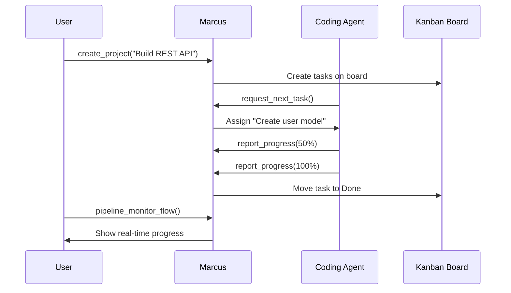
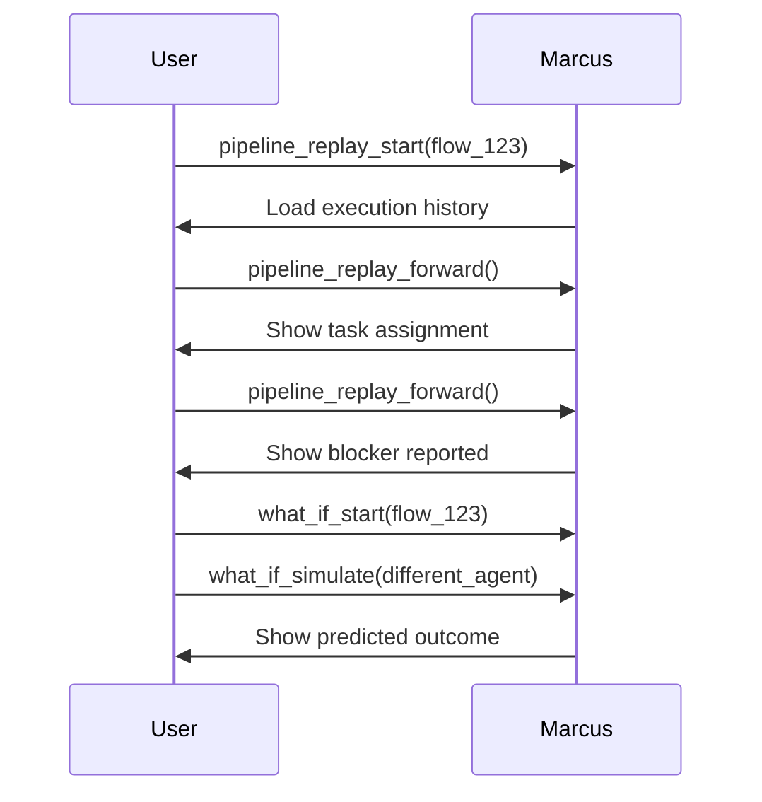

# Marcus Three-Tier Architecture

## Overview

Marcus implements a **three-tier architecture** that separates concerns between observation, coordination, and execution. This design enables scalable AI-powered development with clear boundaries and responsibilities.

## The Three Tiers

```
                    User/Owner
                 (Observation Layer)
                        |
                    Marcus (PM)
                 (Coordination Layer)
                        |
        +-------+-------+-------+-------+
        |       |       |       |       |
    Claude  Gemini   GPT-4  Human   Custom
              (Execution Layer)
```

### 1. Observation Layer (User/Owner)

The **User/Owner** layer provides visibility and control without direct interference in the execution flow. This tier is designed for:

- **Project owners** monitoring AI team progress
- **Developers** debugging and optimizing workflows
- **Managers** analyzing project health and risks

Key capabilities:
- Real-time monitoring of all agent activities
- Time-travel debugging through execution replay
- What-if analysis for testing alternative approaches
- Risk prediction and optimization recommendations

### 2. Coordination Layer (Marcus PM)

**Marcus** acts as the Project Manager, orchestrating work across multiple agents. This tier handles:

- **Planning** - Converts natural language requirements into actionable tasks
- **Assignment** - Matches tasks to agents based on skills and availability
- **Monitoring** - Tracks progress and identifies bottlenecks
- **Learning** - Improves assignment algorithms through pattern analysis

Marcus maintains the single source of truth through integration with Kanban boards (GitHub Projects, Linear, Planka).

### 3. Execution Layer (Coding Agents)

**Coding Agents** are the workers that execute tasks. They can be:

- **AI Assistants** (Claude, Gemini, GPT-4, etc.)
- **Human Developers** using the same interface
- **Custom Agents** built for specific tasks

Agents operate with limited scope:
- Request work when available
- Report progress on assigned tasks
- Escalate blockers when stuck
- Comment on dependencies for other agents

## Tool Distribution by Role

### User/Owner Tools (Observation & Analysis)

#### Time Travel & Debugging
```python
pipeline_replay_start(flow_id)      # Start replay session
pipeline_replay_forward()           # Step forward through execution
pipeline_replay_backward()          # Step backward to see issues
pipeline_replay_jump(position)      # Jump to specific moment
```

#### What-If Analysis
```python
what_if_start(flow_id)             # Begin analysis session
what_if_simulate(modifications)     # Test alternative parameters
what_if_compare()                  # Compare all scenarios
```

#### Real-time Monitoring
```python
pipeline_monitor_dashboard()        # Live system overview
pipeline_monitor_flow(flow_id)      # Track specific workflow
pipeline_predict_risk(flow_id)      # Predict failure risks
pipeline_recommendations(flow_id)   # Get optimization suggestions
```

#### Reporting & Analysis
```python
pipeline_report(flow_id, format)    # Generate reports (HTML/MD/JSON)
pipeline_compare(flow_ids)          # Compare multiple runs
pipeline_find_similar(flow_id)      # Find similar past projects
```

### Marcus Tools (Planning & Coordination)

#### Project Management
```python
create_project(description, name)   # Generate project from description
add_feature(feature_description)    # Add features to existing project
get_project_status()               # Check overall project health
check_assignment_health()          # Verify assignment system health
```

#### Internal Coordination
```python
# These are used internally by Marcus
pattern_learning                   # Learn from agent behaviors
task_dependency_analysis          # Understand task relationships
skill_matching                    # Match agents to tasks
bottleneck_detection             # Identify workflow issues
```

### Coding Agent Tools (Task Execution)

#### The Essential Five
```python
register_agent(agent_id, name, role, skills)  # Join the workforce
request_next_task(agent_id)                   # Get next assignment
report_task_progress(agent_id, task_id,       # Update progress
                    status, progress)
report_blocker(agent_id, task_id,            # Escalate issues
              blocker_description)
get_task_context(task_id)                    # Understand dependencies
```

## Why This Architecture Works

### 1. Clear Separation of Concerns

- **Users observe** without interfering with execution
- **Marcus coordinates** without micromanaging agents
- **Agents execute** without worrying about planning

### 2. Scalability

- One Marcus instance can coordinate unlimited agents
- Agents can be added/removed dynamically
- No inter-agent communication complexity

### 3. Security & Stability

- Agents cannot access monitoring or planning tools
- Users cannot directly assign tasks (must go through Marcus)
- Each tier has minimal required permissions

### 4. Flexibility

- Works with any AI provider (OpenAI, Anthropic, Google, etc.)
- Supports human developers using the same interface
- Integrates with existing tools (GitHub, Linear, Planka)

## Example Workflows

### Project Creation and Execution



### Debugging with Replay



## Best Practices

### For Users/Owners

1. **Monitor, don't micromanage** - Use observation tools to understand, not control
2. **Replay before blaming** - Use time-travel to understand what actually happened
3. **Simulate before changing** - Test modifications with what-if analysis first

### For Marcus Configuration

1. **Let AI enhance decisions** - Configure AI providers for intelligent task matching
2. **Keep Kanban as source of truth** - Don't cache state that belongs on the board
3. **Enable pattern learning** - Let Marcus improve over time

### For Coding Agents

1. **Report progress frequently** - Update at 25%, 50%, 75% milestones
2. **Report blockers early** - Don't wait until deadline to escalate
3. **Document dependencies** - Help other agents understand your work

## Integration Examples

### Claude Desktop Configuration

```json
{
  "mcpServers": {
    "marcus": {
      "command": "docker",
      "args": ["exec", "pm-agent", "python", "-m", "pm_agent"],
      "env": {"PYTHONPATH": "/app"}
    }
  }
}
```

### Custom Python Agent

```python
from marcus_client import CodingAgent

# Initialize agent
agent = CodingAgent(
    role="backend-developer",
    skills=["python", "fastapi", "postgresql"]
)

# Work loop
while True:
    task = agent.request_next_task()
    if not task:
        break

    try:
        # Execute task
        agent.report_progress(25, "Setting up environment")
        # ... implementation ...
        agent.report_progress(100, "Task completed")
    except Exception as e:
        agent.report_blocker(f"Failed: {str(e)}")
```

## Security Considerations

1. **Agent Isolation** - Agents cannot see or modify Marcus code
2. **Scoped Permissions** - Each tier only has access to its required tools
3. **Audit Trail** - All actions logged through Kanban board history
4. **No Direct Execution** - Agents cannot execute arbitrary commands on Marcus host

## Conclusion

The three-tier architecture enables Marcus to coordinate complex multi-agent development projects while maintaining clear boundaries, security, and scalability. By separating observation, coordination, and execution concerns, each component can be optimized for its specific role.
