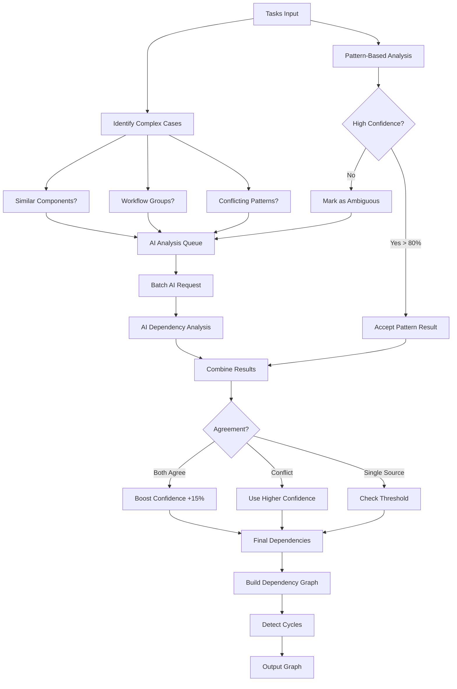

# Hybrid Dependency Inference

## Overview

The hybrid dependency inference system combines the **speed of pattern matching** with the **intelligence of AI analysis** to create a robust and flexible dependency detection system.

## How It Works



## Key Features

### 1. **Pattern-Based Fast Path**
- Uses regex patterns for common dependency types
- Runs first for all task pairs
- Immediate acceptance for high-confidence matches (>80%)
- Examples:
  - "Test X" depends on "Implement X"
  - "Deploy Y" depends on "Test Y"

### 2. **AI Analysis for Complex Cases**
- Triggered for:
  - Low confidence pattern matches (<80%)
  - No pattern match but shared keywords
  - Conflicting patterns (bidirectional dependencies)
  - Complex multi-task workflows
- Batches up to 20 pairs per AI request for efficiency

### 3. **Intelligent Combination**
- **Both agree**: Boost confidence by 15%
- **Only pattern (high confidence)**: Use pattern result
- **Only AI (high confidence)**: Use AI result
- **Conflict**: Use higher confidence source

### 4. **Caching and Performance**
- AI results are cached to avoid repeated analysis
- Pattern matching provides sub-second results
- AI analysis only for ambiguous cases

## Example Workflow

### Input Tasks:
1. "Design User Authentication System"
2. "Create User Database Schema"
3. "Implement User Model"
4. "Build User API Endpoints"
5. "Create Login UI Component"
6. "Test User Authentication Flow"
7. "Deploy Auth Service to Staging"

### Step 1: Pattern Analysis (Fast)
```
✓ "Test User Authentication" → "Implement User Model" (95% confidence)
✓ "Deploy Auth Service" → "Test User Authentication" (95% confidence)
✓ "Build User API" → "Create User Database Schema" (85% confidence)
? "Create Login UI" → ??? (no pattern match)
```

### Step 2: Identify Ambiguous Cases
- "Design" vs "Create Schema" - which comes first?
- "Login UI" dependencies - needs AI to understand
- "User Model" vs "User API" - execution order?

### Step 3: AI Analysis
```json
{
  "task1_id": "design_auth",
  "task2_id": "create_schema",
  "dependency_direction": "1->2",
  "confidence": 0.9,
  "reasoning": "Design documents typically precede schema implementation"
}
```

### Step 4: Combined Results
| Dependency | Pattern Conf | AI Conf | Final Conf | Method |
|------------|-------------|---------|------------|---------|
| Test→Model | 95% | 92% | 100% | Both |
| Deploy→Test | 95% | - | 95% | Pattern |
| Design→Schema | - | 90% | 90% | AI |
| UI→API | 70% | 85% | 92% | Both |

## Configuration

```python
# Initialize with AI engine
from src.intelligence.dependency_inferer_hybrid import HybridDependencyInferer
from src.integrations.ai_analysis_engine import AIAnalysisEngine

ai_engine = AIAnalysisEngine()
inferer = HybridDependencyInferer(ai_engine)

# Configure thresholds
inferer.pattern_confidence_threshold = 0.8  # When to trust patterns alone
inferer.ai_confidence_threshold = 0.7      # Minimum AI confidence
inferer.combined_boost = 0.15              # Confidence boost when both agree

# Use it
graph = await inferer.infer_dependencies(tasks)
```

## Benefits

1. **Performance**: Fast pattern matching for 80% of cases
2. **Intelligence**: AI handles complex, context-dependent cases
3. **Reliability**: Multiple validation sources increase accuracy
4. **Explainability**: Can explain why each dependency exists
5. **Adaptability**: AI can understand new terminology and patterns

## Comparison

| Aspect | Pattern-Only | AI-Only | Hybrid |
|--------|-------------|---------|---------|
| Speed | ⚡ Fast | 🐢 Slow | ⚡ Fast (mostly) |
| Accuracy | 🎯 Good for known patterns | 🎯 Good for complex cases | 🎯 Best overall |
| Adaptability | ❌ Fixed patterns | ✅ Learns new patterns | ✅ Both |
| Cost | 💰 Free | 💰💰 API calls | 💰 Minimal API calls |
| Explainability | ✅ Rule-based | ✅ Natural language | ✅ Both |

## When to Use Each Approach

- **Pattern-Only**: When you have well-defined workflows and terminology
- **AI-Only**: When tasks are highly varied and context-dependent
- **Hybrid**: Best for most projects - fast, accurate, and adaptable
