# How Original Project Description is Preserved

## The Mystery Solved

**Question:** If task descriptions use generic templates, why do agents build the correct features?

**Answer:** Context is preserved through FOUR mechanisms:

---

## 1. Task Names (Primary Context)

**Location:** `src/ai/advanced/prd/advanced_parser.py:1030-1059`

Task names contain the EXACT feature from your description:

```python
# User input: "Build a todo app with authentication, CRUD, and filtering"

# Generated task names:
- "Design User Authentication"          # ✅ Specific feature
- "Design CRUD Operations for Todos"     # ✅ Specific feature + domain
- "Design Filtering by Status"          # ✅ Specific feature
```

**AI sees:** Task name = "Design User Authentication"
**AI infers:** This is about authentication, not generic design

---

## 2. Specific Requirements Appended to Description

**Location:** `src/ai/advanced/prd/advanced_parser.py:1467-1472`

```python
# After template generation
description = "Create detailed UI/UX design for frontend application..."

# THEN requirement is appended:
if context["relevant_requirements"]:
    req = context["relevant_requirements"][0]
    description += f" Specific requirement: {req.get('description', '')[:100]}..."
```

**Example Output:**
```
Description: "Create detailed UI/UX design for frontend application.
Include component hierarchy, design system, responsive layouts, and user
interaction patterns. Focus on achieving: Increase user engagement through
an intuitive and secure todo app.. Define accessibility standards and
usability requirements. Specific requirement: Implement user registration
and login functionality using JWT or similar tokens...."
```

✅ Contains "todo app"
✅ Contains "user registration and login functionality using JWT"

---

## 3. Business Objectives from PRD Analysis

**Location:** `src/ai/advanced/prd/advanced_parser.py:1240-1244`

```python
context = {
    "business_objectives": (
        analysis.business_objectives[:3]  # ✅ From original description
        if analysis.business_objectives
        else ["deliver working solution"]
    ),
}
```

These get inserted into templates:

```python
description = (
    f"Design authentication architecture... "
    f"Goal: {objectives[0] if objectives else 'secure user access'}."
)
# Results in: "Goal: Increase user engagement through an intuitive and secure todo app"
```

---

## 4. Project Context (All Tasks Visible)

**Location:** `src/marcus_mcp/server.py:807`

```python
# When agent requests task
await state.refresh_project_state()
self.project_tasks = await self.kanban_client.get_all_tasks()
```

Agent can see ALL task names:
```
1. Design User Authentication
2. Implement User Authentication
3. Test User Authentication
4. Design CRUD Operations for Todos
5. Implement CRUD Operations for Todos
6. Test CRUD Operations for Todos
7. Design Filtering by Status
8. Implement Filtering by Status
9. Test Filtering by Status
10. Implement Performance
11. Implement Security
```

**AI inference:**
- Sees pattern: "CRUD Operations for Todos"
- Understands: This is a todo management application
- Sees "Filtering by Status"
- Understands: Todos have status field, need filtering feature

---

## Complete Flow

```mermaid
flowchart TD
    A[User: Build todo app with auth, CRUD, filtering] --> B[AI Analysis]

    B --> C[PRDAnalysis Object]
    C --> D[functionalRequirements]
    C --> E[businessObjectives]
    C --> F[technicalConstraints]

    D --> G[User Authentication]
    D --> H[CRUD Operations for Todos]
    D --> I[Filtering by Status]

    G --> J1[TASK NAME: Design User Authentication]
    G --> J2[DESCRIPTION: Template + Requirement]
    G --> J3[OBJECTIVE: todo app goals]

    J1 --> K[Task Created]
    J2 --> K
    J3 --> K

    K --> L[Agent Requests Task]
    L --> M[AI sees Task Data]

    M --> N1[✅ name: Design User Authentication]
    M --> N2[✅ description: ...todo app...JWT auth...]
    M --> N3[✅ labels: feature:user-auth]
    M --> N4[✅ ALL tasks: Design CRUD for Todos, etc]

    N1 --> O[AI Generates Instructions]
    N2 --> O
    N3 --> O
    N4 --> O

    O --> P[Specific Auth Instructions]
    P --> Q[Agent Builds Authentication]

    style N1 fill:#90EE90
    style N2 fill:#90EE90
    style N3 fill:#90EE90
    style N4 fill:#90EE90
    style P fill:#90EE90
```



---

## What AI Actually Sees

```json
{
  "task": {
    "name": "Design User Authentication",          // ✅ SPECIFIC
    "description": "Create detailed UI/UX design for frontend application...
                   Focus on achieving: Increase user engagement through an
                   intuitive and secure todo app. Specific requirement:
                   Implement user registration and login functionality
                   using JWT or similar tokens...",  // ✅ HAS CONTEXT
    "labels": ["feature:user-auth"],                // ✅ SPECIFIC
    "type": "design"
  },
  "agent": {
    "name": "DevAgent",
    "skills": ["python", "javascript"]
  }
}
```

**PLUS** agent has access to `state.project_tasks`:
```python
[
  Task(name="Design User Authentication", ...),
  Task(name="Implement User Authentication", ...),
  Task(name="Design CRUD Operations for Todos", ...),
  // ... all other tasks
]
```

---

## AI Prompt Template

**Location:** `src/integrations/ai_analysis_engine.py:148-177`

```
You are generating detailed task instructions for a developer.

Task: {task}
Assigned to: {agent}

IMPORTANT: Look at the task data to determine the task type...

Generate clear, actionable instructions that:
1. Define the task objective based on its type
2. List specific steps appropriate for the task type
3. Include acceptance criteria
4. Note any dependencies or prerequisites
```

**AI sees:**
- Task name with specific feature
- Description with templates BUT also specific requirements
- Business objectives from original PRD
- ALL other tasks in project

**AI can infer:**
- "Design User Authentication" = authentication feature
- "CRUD Operations for Todos" = todo domain
- "Filtering by Status" = todos have status
- Combined = todo management app with auth

---

## Why Templates Work

Templates provide **STRUCTURE**, while context provides **SPECIFICITY**:

### Template (Structure)
```
"Create detailed UI/UX design for frontend application. Include component
hierarchy, design system, responsive layouts..."
```

### Context (Specificity)
1. **Task name:** "Design User Authentication"
2. **Objective:** "Increase user engagement through an intuitive and secure todo app"
3. **Requirement:** "Implement user registration and login functionality using JWT"
4. **Label:** "feature:user-auth"

### AI combines both:
```
"Design user authentication UI for a todo app. Create registration and
login forms with JWT token handling. Include component hierarchy for auth
flows, responsive layouts for mobile/desktop, and security considerations
for password input..."
```

---

## Evidence from Real Output

Run `python scripts/show_ai_input.py`:

```
📋 TASK DATA (sent to AI):
{
  "name": "Design User Authentication",                      // ✅
  "description": "Create detailed UI/UX design for frontend
                 application... Focus on achieving: Increase user
                 engagement through an intuitive and secure todo
                 app. Define accessibility standards and usability
                 requirements. Specific requirement: Implement user
                 registration and login functionality using JWT or
                 similar tokens....",                          // ✅
  "labels": ["feature:user-auth"],                           // ✅
}
```

---

## Summary: Where Original Context Lives

| Context Element | Location in Code | Example Value |
|----------------|------------------|---------------|
| **Task Name** | `advanced_parser.py:1372` | "Design CRUD Operations for Todos" |
| **Specific Req** | `advanced_parser.py:1470` | "Implement user registration using JWT" |
| **Business Obj** | `advanced_parser.py:1422` | "Increase user engagement through todo app" |
| **Labels** | `advanced_parser.py:1062` | ["feature:user-auth"] |
| **All Tasks** | `server.py:807` | All 11 tasks with specific names |

---

## Conclusion

**The description is NOT fully generic!**

It contains:
1. ✅ Template structure (consistent format)
2. ✅ Specific requirement appended
3. ✅ Business objective injected
4. ✅ Project type from analysis

**PLUS:**
- Task name is feature-specific
- Labels identify the domain
- Agent sees all project tasks
- AI infers from naming patterns

**Result:** Agents get enough context to build the right thing, even though the description template itself is generic!

---

## Test It Yourself

```bash
# See what AI receives
python scripts/show_ai_input.py

# Generate preview
python scripts/preview_project_plan.py "Build a todo app" "todo"

# Check actual output
cat data/diagnostics/project_preview.md
```

Look for:
- Task names with specific features
- Descriptions ending with "Specific requirement: ..."
- Business objectives in "Focus on achieving: ..."
- All tasks listed showing full project scope
