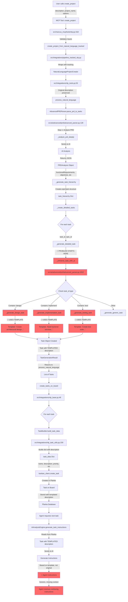

```mermaid
flowchart TD
    A[User calls create_project] -->|description, project_name, options| B[MCP Tool: create_project]
    B --> C[src/marcus_mcp/tools/nlp.py:318]

    C -->|Validates inputs| D[create_project_from_natural_language_tracked]
    D --> E[src/integrations/pipeline_tracked_nlp.py]

    E -->|Wraps with tracking| F[NaturalLanguageProjectCreator]
    F --> G[src/integrations/nlp_tools.py:53]

    G -->|Original description preserved| H[process_natural_language]
    H --> I[AdvancedPRDParser.parse_prd_to_tasks]

    I --> J[src/ai/advanced/prd/advanced_parser.py:128]
    J -->|Step 1: Analyze PRD| K[_analyze_prd_deeply]

    K -->|Sends to AI| L[AI Analysis]
    L -->|Returns JSON| M[PRDAnalysis Object]
    M -->|functionalRequirements, objectives, etc| N[_generate_task_hierarchy]

    N -->|Creates epic/task structure| O[task_hierarchy Dict]
    O --> P[_create_detailed_tasks]

    P --> Q{For each task}
    Q -->|task_id, epic_id| R[_generate_detailed_task]

    R -->|🔴 PROBLEM STARTS HERE| S[_enhance_task_with_ai]
    S --> T[src/ai/advanced/prd/advanced_parser.py:1012]

    T --> U{Check task_id type}
    U -->|Contains 'design'| V[_generate_design_task]
    U -->|Contains 'implement'| W[_generate_implementation_task]
    U -->|Contains 'test'| X[_generate_testing_task]
    U -->|Other| Y[_generate_generic_task]

    V -->|🔴 USES TEMPLATE| V1[Template: 'Create architectural design...']
    W -->|🔴 USES TEMPLATE| W1[Template: 'Build backend services...']
    X -->|🔴 USES TEMPLATE| X1[Template: 'Create test suite...']

    V1 --> Z[Task Object Created]
    W1 --> Z
    X1 --> Z

    Z -->|Task with TEMPLATED description| AA[TaskGenerationResult]
    AA -->|Returns to process_natural_language| AB[List of Tasks]

    AB --> AC[create_tasks_on_board]
    AC --> AD[src/integrations/nlp_base.py:49]

    AD --> AE{For each task}
    AE --> AF[TaskBuilder.build_task_data]
    AF --> AG[src/integrations/nlp_task_utils.py:159]

    AG -->|Builds dict with description| AH[task_data Dict]
    AH -->|name, description, priority, etc| AI[kanban_client.create_task]

    AI -->|Creates in Planka| AJ[Task on Board]
    AJ -->|Stored with templated description| AK[Planka Database]

    AK --> AL[Agent requests next task]
    AL --> AM[AIAnalysisEngine.generate_task_instructions]

    AM -->|Reads from Planka| AN[Task with TEMPLATED description]
    AN -->|Sends to AI| AO[Generate Instructions]

    AO -->|Based on template, not original| AP[🔴 Agent Instructions]
    AP -->|Generic, missing context| AQ[Agent receives confusing instructions]

    style S fill:#ff6b6b
    style T fill:#ff6b6b
    style V fill:#ff6b6b
    style W fill:#ff6b6b
    style X fill:#ff6b6b
    style V1 fill:#ff6b6b
    style W1 fill:#ff6b6b
    style X1 fill:#ff6b6b
    style AP fill:#ff6b6b
    style AQ fill:#ff6b6b
```
