# Task Description Flow: create_project → Agent Instructions

Complete trace of how descriptions transform from user input to agent instructions.

## The Problem

**User describes:** "Build a todo app with authentication, CRUD operations, and filtering"

**Agent receives:** Generic template like "Create API endpoints for REST API. Build features following design specifications..."

**Why?** Descriptions are **replaced by templates** in the AdvancedPRDParser.

---

## Complete Flow Diagram

```mermaid
flowchart TD
    A[User calls create_project] -->|description, project_name, options| B[MCP Tool: create_project]
    B --> C[src/marcus_mcp/tools/nlp.py:318]

    C -->|Validates inputs| D[create_project_from_natural_language_tracked]
    D --> E[src/integrations/pipeline_tracked_nlp.py]

    E -->|Wraps with tracking| F[NaturalLanguageProjectCreator]
    F --> G[src/integrations/nlp_tools.py:53]

    G -->|Original description preserved| H[process_natural_language]
    H --> I[AdvancedPRDParser.parse_prd_to_tasks]

    I --> J[src/ai/advanced/prd/advanced_parser.py:128]
    J -->|Step 1: Analyze PRD| K[_analyze_prd_deeply]

    K -->|Sends to AI| L[AI Analysis]
    L -->|Returns JSON| M[PRDAnalysis Object]
    M -->|functionalRequirements, objectives, etc| N[_generate_task_hierarchy]

    N -->|Creates epic/task structure| O[task_hierarchy Dict]
    O --> P[_create_detailed_tasks]

    P --> Q{For each task}
    Q -->|task_id, epic_id| R[_generate_detailed_task]

    R -->|🔴 PROBLEM STARTS HERE| S[_enhance_task_with_ai]
    S --> T[src/ai/advanced/prd/advanced_parser.py:1012]

    T --> U{Check task_id type}
    U -->|Contains 'design'| V[_generate_design_task]
    U -->|Contains 'implement'| W[_generate_implementation_task]
    U -->|Contains 'test'| X[_generate_testing_task]
    U -->|Other| Y[_generate_generic_task]

    V -->|🔴 USES TEMPLATE| V1[Template: 'Create architectural design...']
    W -->|🔴 USES TEMPLATE| W1[Template: 'Build backend services...']
    X -->|🔴 USES TEMPLATE| X1[Template: 'Create test suite...']

    V1 --> Z[Task Object Created]
    W1 --> Z
    X1 --> Z

    Z -->|Task with TEMPLATED description| AA[TaskGenerationResult]
    AA -->|Returns to process_natural_language| AB[List of Tasks]

    AB --> AC[create_tasks_on_board]
    AC --> AD[src/integrations/nlp_base.py:49]

    AD --> AE{For each task}
    AE --> AF[TaskBuilder.build_task_data]
    AF --> AG[src/integrations/nlp_task_utils.py:159]

    AG -->|Builds dict with description| AH[task_data Dict]
    AH -->|name, description, priority, etc| AI[kanban_client.create_task]

    AI -->|Creates in Planka| AJ[Task on Board]
    AJ -->|Stored with templated description| AK[Planka Database]

    AK --> AL[Agent requests next task]
    AL --> AM[AIAnalysisEngine.generate_task_instructions]

    AM -->|Reads from Planka| AN[Task with TEMPLATED description]
    AN -->|Sends to AI| AO[Generate Instructions]

    AO -->|Based on template, not original| AP[🔴 Agent Instructions]
    AP -->|Generic, missing context| AQ[Agent receives confusing instructions]

    style S fill:#ff6b6b
    style T fill:#ff6b6b
    style V fill:#ff6b6b
    style W fill:#ff6b6b
    style X fill:#ff6b6b
    style V1 fill:#ff6b6b
    style W1 fill:#ff6b6b
    style X1 fill:#ff6b6b
    style AP fill:#ff6b6b
    style AQ fill:#ff6b6b
```



---

## The Critical Problem

### Location: `src/ai/advanced/prd/advanced_parser.py:1358-1650`

These template functions **REPLACE** the original description:

```python
def _generate_design_task(self, context, task_id, original_name=""):
    """Generate design task name and description using PRD context."""
    domain = context["domain"]
    project_type = context["project_type"]
    objectives = context["business_objectives"]

    # 🔴 PROBLEM: Uses generic template, ignores original description
    if domain == "crud_operations":
        description = (
            f"Create architectural design and documentation for CRUD "
            f"operations in {project_type}. Define API endpoints, "
            f"document request/response formats, plan error handling "
            f"strategies, and design pagination approach..."
        )
```

### What Gets Lost

**Input (User):**
```
"Build a todo app with authentication, CRUD operations, and filtering by status"
```

**Step 1 - AI Analysis (Preserved):**
```json
{
  "functionalRequirements": [
    {
      "name": "User Authentication",
      "description": "Users can register, login, and logout"
    },
    {
      "name": "Todo CRUD",
      "description": "Create, read, update, delete todos"
    }
  ]
}
```

**Step 2 - Task Creation (LOST!):**
```python
# Original context: "todo app with filtering by status"
# Template output:
description = "Create architectural design for CRUD operations in REST API..."
# ❌ No mention of todos, filtering, or status!
```

**Step 3 - Agent Receives:**
```
"Create API endpoints for REST API. Build features following design specifications..."
```

---

## Why Templates Are Used

From `_enhance_task_with_ai()` (line 1030-1059):

```python
if "design" in task_id.lower():
    name, description = self._generate_design_task(project_context, task_id, original_name)
elif "implement" in task_id.lower():
    name, description = self._generate_implementation_task(project_context, task_id, original_name)
elif "test" in task_id.lower():
    name, description = self._generate_testing_task(project_context, task_id, original_name)
```

**Rationale:** Provide consistent, detailed task descriptions

**Problem:** Templates are too generic and don't preserve user intent

---

## Data Preserved vs Lost

### ✅ Preserved Throughout Flow

- Project name
- Task names (mostly)
- Priority levels
- Dependencies
- Estimated hours
- Labels/tags

### ❌ Lost in Template Replacement

- **Original project description** - Lost at line 1358-1650
- **Specific feature details** - Replaced with "CRUD operations", "API endpoints"
- **User intent** - "todo app" becomes "REST API"
- **Domain-specific requirements** - "filtering by status" not mentioned

### 🟡 Partially Preserved

- **PRD Analysis** - Stored in `task.source_context` (line 631-639) but NOT in description
- **Business objectives** - Used in template variables but generic

---

## Where Original Description IS Available

The original PRD analysis is stored but **NOT** used for descriptions:

```python
# Line 616-640: Task creation
task = Task(
    id=task_id,
    name=enhanced_details.get("name", f"Task {sequence}"),
    description=enhanced_details.get("description", ""),  # ❌ Template
    # ...
    source_context={  # ✅ Original analysis stored here
        "prd_analysis": analysis.__dict__,
        "task_info": task_info,
        "constraints": constraints.__dict__,
    },
)
```

**The original context exists in `source_context` but description uses templates!**

---

## Solution Options

### Option 1: Use AI-Generated Descriptions (Recommended)

Replace template functions with AI calls that use original PRD:

```python
async def _generate_design_task(self, context, task_id, original_name=""):
    """Generate design task description using AI based on PRD."""
    # Use AI to create description from original PRD
    prd_content = context.get("original_prd", "")
    feature_context = context.get("feature_requirements", {})

    prompt = f"""
    Create a specific, detailed description for this design task:

    Project: {prd_content}
    Feature: {feature_context}
    Task: {original_name}

    Provide a description that:
    - References specific features from the PRD
    - Uses domain terminology (todo, auth, etc.)
    - Includes concrete deliverables
    """

    description = await self.ai_engine.generate(prompt)
    return original_name, description
```

### Option 2: Use PRD Analysis Directly

Extract feature-specific descriptions from PRD analysis:

```python
def _generate_design_task(self, context, task_id, original_name=""):
    """Generate description from PRD analysis."""
    # Find matching functional requirement
    feature_req = next(
        (req for req in context["functional_requirements"]
         if req["id"] in task_id),
        None
    )

    if feature_req:
        description = (
            f"Design {feature_req['name']}: {feature_req['description']}. "
            f"Create architectural diagrams, API specifications, and "
            f"technical documentation specific to {feature_req['name']}."
        )
    else:
        description = self._fallback_template(context, task_id)

    return original_name, description
```

### Option 3: Hybrid Approach

Use templates as fallback, AI for feature-specific:

```python
async def _generate_design_task(self, context, task_id, original_name=""):
    """Generate description with AI enhancement."""
    # Get template base
    template_desc = self._get_design_template(context["domain"])

    # Enhance with AI using original PRD
    if context.get("original_prd"):
        enhanced = await self._enhance_with_prd_context(
            template_desc,
            context["original_prd"],
            original_name
        )
        return original_name, enhanced

    return original_name, template_desc
```

---

## Impact Assessment

### Current Flow Issues

1. **Loss of Context:** Original "todo app" becomes generic "REST API"
2. **Agent Confusion:** Instructions don't match actual requirements
3. **Duplicate Work:** Agents may build wrong features
4. **User Frustration:** "I said todo app, why is it building generic CRUD?"

### Files to Modify

Primary:
- `src/ai/advanced/prd/advanced_parser.py:1358-1650` - Template functions
- `src/ai/advanced/prd/advanced_parser.py:1012-1087` - `_enhance_task_with_ai()`

Secondary (if using AI approach):
- `src/integrations/ai_analysis_engine.py` - Add description generation method

---

## Testing the Fix

### Before Fix
```bash
python scripts/preview_project_plan.py "Build a todo app" "todo"
# Check data/diagnostics/project_preview.md
# Descriptions say: "Create API endpoints for REST API..."
```

### After Fix
```bash
python scripts/preview_project_plan.py "Build a todo app" "todo"
# Check data/diagnostics/project_preview.md
# Descriptions should say: "Design todo management features..."
```

---

## Recommended Action

**Immediate:** Modify `_enhance_task_with_ai()` to pass original PRD content to template functions

**Short-term:** Replace templates with AI-generated descriptions using original PRD

**Long-term:** Store original PRD in Task description, use source_context for metadata only

---

## Related Files

- `src/ai/advanced/prd/advanced_parser.py` - Where templates are defined
- `src/integrations/nlp_tools.py` - Calls parser
- `src/integrations/nlp_base.py` - Creates tasks on board
- `src/integrations/nlp_task_utils.py` - Builds task data
- `src/integrations/ai_analysis_engine.py` - Generates agent instructions
