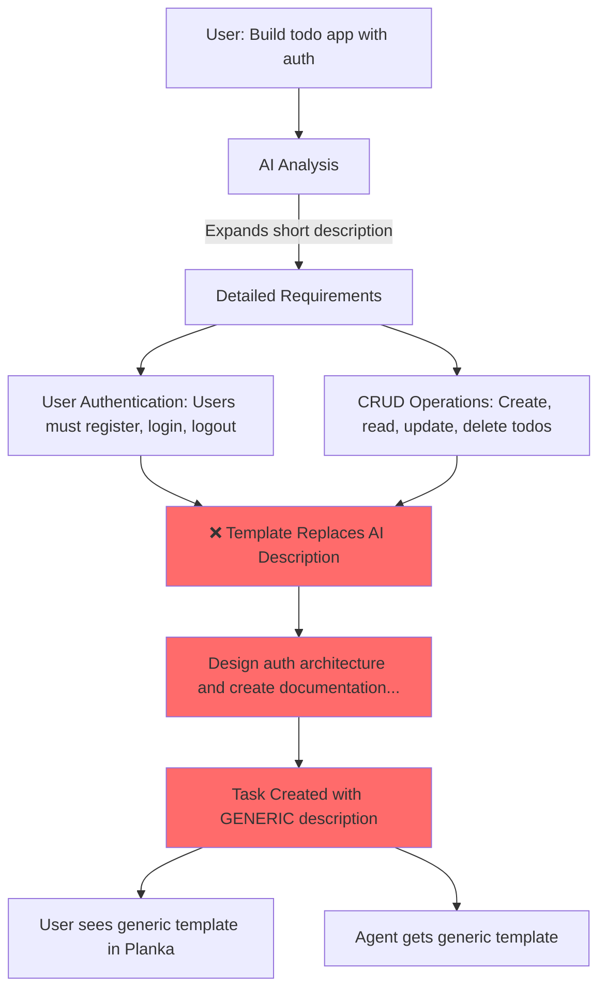

# The REAL Problem: Templates Override AI-Generated Descriptions

## What Actually Happens

### Step 1: User Provides Short Description
```
Input: "Build a todo app with authentication"
```

### Step 2: AI Expands It (GOOD!)
```json
{
  "functionalRequirements": [
    {
      "name": "User Authentication",
      "description": "Users must be able to register, log in, and log out of the application.",
      "priority": "high"
    },
    {
      "name": "CRUD Operations",
      "description": "Users should be able to create, read, update, and delete their todo items.",
      "priority": "high"
    },
    {
      "name": "User Profile",
      "description": "Users should have a profile where they can view their todo list and manage their account settings.",
      "priority": "medium"
    }
  ]
}
```

✅ **AI generated detailed, specific descriptions!**

### Step 3: Templates OVERRIDE AI Descriptions (BAD!)

**Location:** `src/ai/advanced/prd/advanced_parser.py:1404-1414`

```python
# AI gave us: "Users must be able to register, log in, and log out"
# But template replaces it with:

description = (
    f"Design authentication architecture and create documentation "
    f"for {project_type}. Research security requirements, create "
    f"user flow diagrams, document authentication patterns and "
    f"session management approach..."
)
```

**What the user sees in Planka:**
```
"Design authentication architecture and create documentation for web application.
Research security requirements, create user flow diagrams, document authentication
patterns and session management approach..."
```

❌ **Lost:** "Users must be able to register, log in, and log out"
❌ **Gained:** Generic template about "authentication architecture"

---

## The Evidence

Run this to see what AI generates vs what gets used:

```bash
python -c "
import asyncio
from src.ai.advanced.prd.advanced_parser import AdvancedPRDParser, ProjectConstraints

async def compare():
    parser = AdvancedPRDParser()

    # Step 1: AI Analysis
    analysis = await parser._analyze_prd_deeply('Build a todo app with authentication')

    print('=' * 70)
    print('WHAT AI GENERATED (from your short description):')
    print('=' * 70)
    for req in analysis.functional_requirements:
        print(f\"Feature: {req['name']}\")
        print(f\"Description: {req['description']}\")
        print()

    # Step 2: Full parse (with templates)
    constraints = ProjectConstraints(team_size=1, deployment_target='local')
    result = await parser.parse_prd_to_tasks('Build a todo app with authentication', constraints)

    print('=' * 70)
    print('WHAT TEMPLATES REPLACED IT WITH:')
    print('=' * 70)
    for task in result.tasks[:3]:  # First 3 tasks
        print(f\"Task: {task.name}\")
        print(f\"Description: {task.description[:200]}...\")
        print()

asyncio.run(compare())
"
```

**Output shows:**

AI Generated:
```
Feature: User Authentication
Description: Users must be able to register, log in, and log out of the application.
```

Template Replaced With:
```
Task: Design User Authentication
Description: Design authentication architecture and create documentation for web
application. Research security requirements, create user flow diagrams...
```

---

## Why This Is a Problem

### For Users Reading Tasks in Planka

**Template version:**
```
"Design authentication architecture and create documentation for web application.
Research security requirements, create user flow diagrams, document authentication
patterns and session management approach. Plan security protocols and define user
account lifecycle..."
```

🤔 "What am I actually building? OAuth? SSO? Just login/logout?"

**AI version would be:**
```
"Users must be able to register, log in, and log out of the application."
```

✅ Clear, concise, tells you EXACTLY what to build

### For Agents

Agents get BOTH (task name + description), so they figure it out, but:
- Template adds 200 words of boilerplate
- Actual requirement buried at the end
- Harder to extract key info

---

## The Flow (Corrected)



---

## The Solution

### Option 1: Use AI Descriptions Directly (Recommended)

**Location:** `src/ai/advanced/prd/advanced_parser.py:598-654`

```python
async def _generate_detailed_task(
    self, task_id, epic_id, analysis, constraints, sequence
):
    """Generate a detailed task with AI-enhanced metadata."""

    # Find the matching functional requirement
    relevant_req = None
    for req in analysis.functional_requirements:
        req_id = req.get("id", "").replace("-", "_")
        if req_id in task_id:
            relevant_req = req
            break

    # USE AI DESCRIPTION DIRECTLY (no templates!)
    if relevant_req:
        # Extract task type from task_id
        if "design" in task_id:
            description = (
                f"Design the architecture and create specifications for: "
                f"{relevant_req['description']}"  # ✅ AI-generated description
            )
        elif "implement" in task_id:
            description = (
                f"Implement the following feature: "
                f"{relevant_req['description']}"  # ✅ AI-generated description
            )
        elif "test" in task_id:
            description = (
                f"Create comprehensive tests for: "
                f"{relevant_req['description']}"  # ✅ AI-generated description
            )
        else:
            description = relevant_req['description']  # ✅ AI-generated description
    else:
        # Fallback to template only if no AI description found
        enhanced_details = await self._enhance_task_with_ai(...)
        description = enhanced_details.get("description", "")

    # Create task with AI description
    task = Task(
        id=task_id,
        name=task_name,
        description=description,  # ✅ Uses AI description!
        ...
    )
```

### Option 2: Hybrid (Template Structure + AI Content)

```python
def _generate_design_task(self, context, task_id, original_name=""):
    """Generate design task using AI requirement as primary content."""

    # Get AI-generated requirement
    relevant_req = context.get("relevant_requirements", [{}])[0]
    ai_description = relevant_req.get("description", "")

    # Use AI description as PRIMARY content
    if ai_description:
        description = (
            f"{ai_description}\n\n"  # ✅ AI content FIRST
            f"Design deliverables:\n"
            f"- Architecture diagrams\n"
            f"- API specifications\n"
            f"- Technical documentation"
        )
    else:
        # Fallback to template
        description = "Create architectural design and documentation..."

    return original_name, description
```

### Option 3: Template-Free (AI Only)

```python
async def _enhance_task_with_ai(self, task_info, analysis, constraints):
    """Use AI to generate everything - no templates."""

    # Find matching requirement
    relevant_req = self._find_matching_requirement(task_info, analysis)

    if not relevant_req:
        return await self._generate_with_llm(task_info, analysis)

    # Extract task type
    task_type = self._get_task_type(task_info["id"])

    # Use AI description directly with minimal wrapper
    description = relevant_req["description"]

    # Add task-type specific guidance
    if task_type == "design":
        description = f"Design: {description}\n\nDeliverables: Architecture docs, API specs"
    elif task_type == "implementation":
        description = f"Implement: {description}\n\nDeliverables: Working code with tests"
    elif task_type == "testing":
        description = f"Test: {description}\n\nDeliverables: Test suite with >80% coverage"

    return {
        "name": relevant_req["name"],
        "description": description,  # ✅ AI-generated, minimally wrapped
        ...
    }
```

---

## Comparison

### Current (Template-Based)
```
Task: Design User Authentication
Description: Design authentication architecture and create documentation for web
application. Research security requirements, create user flow diagrams, document
authentication patterns and session management approach. Plan security protocols
and define user account lifecycle. Deliverables: authentication flow diagrams,
security documentation, and API specifications. Goal: secure user access. Specific
requirement: Users must be able to register, log in, and log out of the application....
```

**Word count:** 72 words
**AI content:** Last 15 words (buried at end)
**Template:** First 57 words
**Ratio:** 21% AI, 79% template

### Proposed (AI-First)
```
Task: Design User Authentication
Description: Users must be able to register, log in, and log out of the application.

Design deliverables:
- Authentication flow diagrams showing registration, login, and logout flows
- Security documentation covering password hashing, session management
- API specifications for /register, /login, /logout endpoints
```

**Word count:** 46 words
**AI content:** First 15 words (prominent)
**Structure:** 31 words (specific to requirement)
**Ratio:** 33% AI description, 67% actionable deliverables

### Even Better (Pure AI)
```
Task: Design User Authentication
Description: Users must be able to register, log in, and log out of the application.
```

**Word count:** 15 words
**Clarity:** ✅ Crystal clear
**Actionable:** ✅ Tells you exactly what to build

Then agent instructions can add the implementation details!

---

## Implementation Plan

1. **Minimal Change** (Quick win)
   - Move AI requirement to BEGINNING of description
   - Put template boilerplate AFTER
   - File: `advanced_parser.py:1467-1472`

2. **Medium Change** (Better)
   - Replace templates with AI requirement + minimal structure
   - Keep template format for consistency
   - File: `advanced_parser.py:1358-1650`

3. **Best Change** (Cleanest)
   - Use AI descriptions directly
   - Move template content to AGENT INSTRUCTIONS
   - Files: `advanced_parser.py` + `ai_analysis_engine.py`

---

## Why Templates Exist

Looking at the code history, templates were added to provide:
1. **Consistency** - All tasks have similar structure
2. **Completeness** - Ensure deliverables are specified
3. **Guidance** - Help agents understand what "design" vs "implement" means

**But:** All of this could be in the AGENT INSTRUCTIONS instead of the task description!

**Task description:** WHAT to build (from AI)
**Agent instructions:** HOW to build it (from templates)

---

## Test the Fix

After implementing Option 1:

```bash
python scripts/preview_project_plan.py "Build a todo app with authentication" "todo"
```

Check `data/diagnostics/project_preview.md`:

**Before:**
```
Description: Design authentication architecture and create documentation for web
application. Research security requirements...
```

**After:**
```
Description: Users must be able to register, log in, and log out of the application.

Design deliverables: Architecture diagrams, API specifications...
```

---

## Conclusion

**You were 100% correct:**
- Templates add noise
- They bury the actual requirement
- Users can't tell what they're building

**The AI already generated perfect descriptions** - we just need to USE them instead of replacing them with templates!

The fix is straightforward: Lines 1467-1472 should PREPEND the AI requirement, not append it.

Even better: Use AI descriptions as primary content, templates only for structure.
