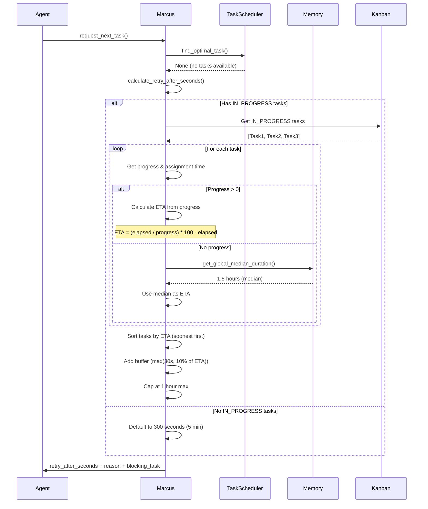
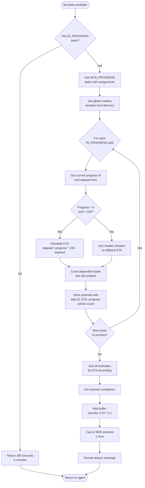
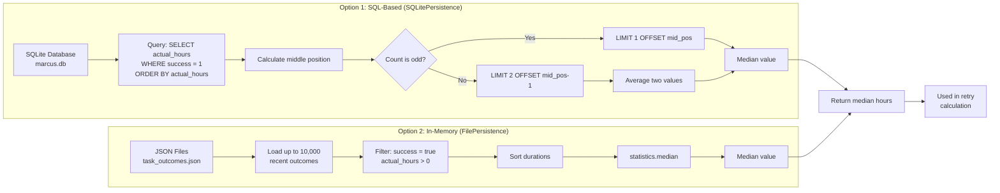

# Intelligent Agent Wait Time System

## Quick Start

When an agent calls `request_next_task` and no tasks are available, Marcus now returns an intelligent wait time instead of making agents check back constantly. The response includes:

```json
{
  "success": false,
  "message": "No suitable tasks available at this time",
  "retry_after_seconds": 660,
  "retry_reason": "Waiting for 'Database Setup' to complete (~10 min, 75% done)",
  "blocking_task": {
    "id": "task_123",
    "name": "Database Setup",
    "progress": 75,
    "eta_seconds": 600
  }
}
```

**External agents should wait `retry_after_seconds` before requesting another task.**

---

## Overview

### Problem This Solves

Previously, when no tasks were available, agents had no guidance on when to check back. This led to:

- **Wasted API calls**: Agents polling every few seconds when tasks wouldn't be ready for 10+ minutes
- **Poor resource utilization**: Agents idle when they could be doing other work
- **Lack of transparency**: No visibility into why tasks are blocked or when they'll be ready

### How It Works

Marcus analyzes all IN_PROGRESS tasks to predict when the next task will become available:

1. **Progress-based predictions**: For tasks with reported progress (e.g., 75% done), calculates time-to-completion using actual elapsed time
2. **Historical fallback**: For tasks without progress updates, uses the global median task duration from historical data
3. **Dependency awareness**: Identifies which IN_PROGRESS tasks will unblock the most waiting tasks
4. **Intelligent buffering**: Adds safety margin to predictions to account for variance

### Benefits for External Agents

- **Reduced API calls**: Wait the recommended time instead of polling constantly
- **Better planning**: Know when to expect new work and allocate resources accordingly
- **Transparency**: Understand what's blocking progress and when it will clear
- **Improved efficiency**: Spend less time waiting and more time working

---

## Architecture

### Sequence Diagram: Agent Request Flow



### Flow Diagram: Retry Calculation Logic



### Data Flow Diagram: Median Calculation



---

## Example Scenarios

### Scenario 1: Task 75% Complete After 30 Minutes

**Context:**
- Task started 30 minutes ago (1800 seconds)
- Current progress: 75%
- No other tasks in progress

**Calculation:**
```python
elapsed_seconds = 1800
progress = 75
estimated_total = (1800 / 75) * 100 = 2400 seconds (40 min)
remaining = 2400 - 1800 = 600 seconds (10 min)
buffer = max(30, 600 * 0.1) = 60 seconds
retry_after = 600 + 60 = 660 seconds (11 min)
```

**Response:**
```json
{
  "retry_after_seconds": 660,
  "retry_reason": "Waiting for 'Database Setup' to complete (~10 min, 75% done)",
  "blocking_task": {
    "id": "task_123",
    "name": "Database Setup",
    "progress": 75,
    "eta_seconds": 600
  }
}
```

### Scenario 2: Multiple Tasks In Progress

**Context:**
- Task A: 90% done, started 45 min ago → ETA: 5 min
- Task B: 25% done, started 15 min ago → ETA: 45 min
- Task C: 0% done, started 2 min ago → Uses median (90 min)

**Calculation:**
Marcus sorts by ETA and picks the soonest (Task A):
```python
soonest_eta = 300 seconds (5 min)
buffer = max(30, 300 * 0.1) = 30 seconds
retry_after = 300 + 30 = 330 seconds (5.5 min)
```

**Response:**
```json
{
  "retry_after_seconds": 330,
  "retry_reason": "Waiting for 'API Integration' to complete (~5 min, 90% done)"
}
```

### Scenario 3: Task Just Started (0% Progress)

**Context:**
- Task started 2 minutes ago
- No progress reported yet
- Global median duration: 1.5 hours

**Calculation:**
```python
progress = 0  # Triggers fallback
median_hours = 1.5
remaining_seconds = 1.5 * 3600 = 5400 seconds (90 min)
buffer = max(30, 5400 * 0.1) = 540 seconds
retry_after = 5400 + 540 = 5940 seconds
# Capped at max
retry_after = min(5940, 3600) = 3600 seconds (1 hour)
```

**Response:**
```json
{
  "retry_after_seconds": 3600,
  "retry_reason": "Waiting for 'Complex Refactoring' to complete (~60 min, 0% done)"
}
```

### Scenario 4: No Tasks In Progress

**Context:**
- All tasks either TODO or DONE
- No active work happening

**Response:**
```json
{
  "retry_after_seconds": 300,
  "retry_reason": "No tasks currently in progress - check back soon",
  "blocking_task": null
}
```

This suggests the project may be:
- Complete (all tasks done)
- Blocked (all tasks waiting on external dependencies)
- Starting up (tasks about to be assigned)

---

## API Response Format

### Success Response (Task Available)

```json
{
  "success": true,
  "task": {
    "id": "task_456",
    "name": "Build User Dashboard",
    "description": "Create dashboard showing user statistics",
    "instructions": "...",
    "priority": "high"
  }
}
```

### No Task Available Response (With Wait Time)

```json
{
  "success": false,
  "message": "No suitable tasks available at this time",
  "retry_after_seconds": 660,
  "retry_reason": "Waiting for 'Database Setup' to complete (~10 min, 75% done)",
  "blocking_task": {
    "id": "task_123",
    "name": "Database Setup",
    "progress": 75,
    "eta_seconds": 600
  },
  "diagnostics": {
    "total_tasks": 25,
    "available_tasks": 0,
    "blocked_tasks": 8,
    "issues_found": 2,
    "top_issues": [
      {
        "type": "missing_dependencies",
        "severity": "high",
        "description": "3 tasks have incomplete dependencies",
        "recommendation": "Check dependency chain for circular references"
      }
    ]
  }
}
```

### Field Descriptions

| Field | Type | Description |
|-------|------|-------------|
| `success` | boolean | False when no task available |
| `message` | string | Human-readable explanation |
| `retry_after_seconds` | integer | Recommended wait time in seconds (30-3600) |
| `retry_reason` | string | Explanation of what's blocking and ETA |
| `blocking_task` | object\|null | Details of the task blocking progress (if any) |
| `blocking_task.id` | string | Task ID of blocking task |
| `blocking_task.name` | string | Human-readable task name |
| `blocking_task.progress` | integer | Current progress percentage (0-100) |
| `blocking_task.eta_seconds` | integer | Estimated time to completion |
| `diagnostics` | object\|null | Optional project health diagnostics |

---

## Implementation Details

### Code Locations

| Component | File | Line | Description |
|-----------|------|------|-------------|
| Main calculation | `src/marcus_mcp/tools/task.py` | 282-398 | `calculate_retry_after_seconds()` function |
| Integration point | `src/marcus_mcp/tools/task.py` | 401-974 | `request_next_task()` calls calculation |
| Median (SQL) | `src/core/persistence.py` | 397-470 | SQL-based median calculation |
| Median (file) | `src/core/persistence.py` | 230-265 | File-based median fallback |
| Memory interface | `src/core/memory.py` | 875-931 | `get_global_median_duration()` |

### Key Algorithms

#### 1. Progress-Based ETA Calculation

When task has progress > 0 and < 100:

```python
elapsed_seconds = (now - assignment.assigned_at).total_seconds()
progress = task.progress  # 0-100

# Estimate total duration based on actual progress
estimated_total_seconds = (elapsed_seconds / progress) * 100

# Calculate remaining time
remaining_seconds = estimated_total_seconds - elapsed_seconds
remaining_seconds = max(0, remaining_seconds)  # Ensure non-negative
```

**Example:**
- Elapsed: 30 minutes (1800s)
- Progress: 60%
- Estimated total: `(1800 / 60) * 100 = 3000s` (50 min)
- Remaining: `3000 - 1800 = 1200s` (20 min)

#### 2. SQL Median Calculation (SQLitePersistence)

```sql
-- Step 1: Count successful tasks
SELECT COUNT(*) FROM persistence
WHERE collection = 'task_outcomes'
  AND json_extract(data, '$.success') = 1
  AND CAST(json_extract(data, '$.actual_hours') AS REAL) > 0

-- Step 2a: For odd count, get single middle element
SELECT CAST(json_extract(data, '$.actual_hours') AS REAL)
FROM persistence
WHERE collection = 'task_outcomes'
  AND json_extract(data, '$.success') = 1
  AND CAST(json_extract(data, '$.actual_hours') AS REAL) > 0
ORDER BY actual_hours
LIMIT 1 OFFSET {middle_position}

-- Step 2b: For even count, get two middle elements and average
SELECT CAST(json_extract(data, '$.actual_hours') AS REAL)
FROM persistence
WHERE collection = 'task_outcomes'
  AND json_extract(data, '$.success') = 1
  AND CAST(json_extract(data, '$.actual_hours') AS REAL) > 0
ORDER BY actual_hours
LIMIT 2 OFFSET {middle_position - 1}
```

**Why SQL?**
- Processes millions of records efficiently without loading into memory
- Uses database indexes for fast sorting
- Scales as historical data grows

#### 3. Buffer Calculation

```python
buffer_seconds = max(30, eta_seconds * 0.1)
retry_after = int(eta_seconds + buffer_seconds)
retry_after = min(retry_after, 3600)  # Cap at 1 hour
```

**Buffer logic:**
- Minimum 30 seconds (allows for small variations)
- 10% of ETA (scales with task duration)
- Maximum total wait: 1 hour (prevents excessive waits from outliers)

**Example buffers:**

| ETA | 10% Buffer | Actual Buffer | Total Wait |
|-----|------------|---------------|------------|
| 2 min (120s) | 12s | 30s (min) | 150s (2.5 min) |
| 10 min (600s) | 60s | 60s | 660s (11 min) |
| 60 min (3600s) | 360s | 360s | 3960s → 3600s (capped) |

---

## Configuration & Tuning

### Default Constants

```python
# Maximum wait time (prevents runaway calculations)
MAX_WAIT_SECONDS = 3600  # 1 hour

# Minimum buffer (accounts for small variations)
MIN_BUFFER_SECONDS = 30  # 30 seconds

# Buffer percentage (scales with task duration)
BUFFER_PERCENTAGE = 0.1  # 10%

# Default wait when no tasks in progress
DEFAULT_WAIT_SECONDS = 300  # 5 minutes

# Default median when no historical data
DEFAULT_MEDIAN_HOURS = 1.0  # 1 hour
```

### Tuning Recommendations

#### For Fast-Moving Projects

Reduce default wait and buffer:

```python
DEFAULT_WAIT_SECONDS = 120  # 2 minutes
MIN_BUFFER_SECONDS = 15  # 15 seconds
BUFFER_PERCENTAGE = 0.05  # 5%
```

**Use when:**
- Tasks typically complete in under 10 minutes
- High agent availability
- Rapid iteration cycles

#### For Long-Running Projects

Increase defaults to reduce unnecessary polling:

```python
DEFAULT_WAIT_SECONDS = 600  # 10 minutes
MIN_BUFFER_SECONDS = 60  # 1 minute
BUFFER_PERCENTAGE = 0.15  # 15%
```

**Use when:**
- Tasks typically take 1+ hours
- Limited agent availability
- Complex, interdependent tasks

#### For High-Variance Projects

Increase buffer to account for unpredictability:

```python
BUFFER_PERCENTAGE = 0.25  # 25%
MAX_WAIT_SECONDS = 7200  # 2 hours
```

**Use when:**
- Task durations vary widely
- New project with little historical data
- External dependencies (APIs, human reviews)

### Configuration Location

To customize these values, modify `calculate_retry_after_seconds()` in:
```
src/marcus_mcp/tools/task.py:282-398
```

---

## Troubleshooting

### Agent Gets Very Long Wait Times (>30 minutes)

**Symptoms:**
- `retry_after_seconds` consistently near maximum (3600s)
- Agents waiting much longer than expected

**Possible Causes:**

1. **Task has no progress updates**
   - System falls back to median duration
   - If median is high, wait time will be high

   **Solution:** Ensure agents call `report_task_progress()` regularly (every 25%, 50%, 75%)

2. **Historical median is inflated**
   - Old, slow tasks skewing the median

   **Solution:**
   ```python
   # Query recent task durations
   await memory.persistence.query(
       "task_outcomes",
       filter_func=lambda x: x.get("success"),
       limit=50
   )
   # If median is too high, clean old data
   await memory.persistence.cleanup(days=30)
   ```

3. **Task just started (0% progress)**
   - No progress data available yet

   **Solution:** This is expected. Wait time will decrease as agent reports progress.

### Agent Gets Very Short Wait Times (<1 minute)

**Symptoms:**
- `retry_after_seconds` always under 60
- Agent polls too frequently

**Possible Causes:**

1. **Task progressing very quickly**
   - ETA calculation is accurate

   **Solution:** This is correct behavior. Agent should check back soon.

2. **Minimum buffer too low**
   - Buffer not accounting for variations

   **Solution:**
   ```python
   MIN_BUFFER_SECONDS = 60  # Increase minimum buffer
   ```

3. **Progress updates too optimistic**
   - Agents reporting 90%+ too early

   **Solution:** Audit progress reporting logic in agents

### Wait Time Doesn't Match Actual Task Completion

**Symptoms:**
- Task completes much sooner/later than predicted
- `retry_reason` shows incorrect ETA

**Possible Causes:**

1. **Agent not reporting progress accurately**
   - Progress jumps from 0% to 100% with no intermediate updates

   **Solution:** Report progress at 25%, 50%, 75% milestones

2. **Task complexity changed mid-execution**
   - Scope expanded or reduced

   **Solution:** Use `report_blocker()` if task will take longer than estimated

3. **Multiple agents working on related tasks**
   - One task completing unblocks multiple tasks

   **Solution:** This is expected. System picks soonest completion.

### No Historical Data Available

**Symptoms:**
- Always falls back to 1 hour default
- `get_global_median_duration()` returns 1.0

**Possible Causes:**

1. **New Marcus installation**
   - No task completion history

   **Solution:** As tasks complete, median will improve. Initial estimates may be inaccurate.

2. **Persistence not configured**
   - Task outcomes not being saved

   **Solution:**
   ```python
   # Verify persistence is working
   outcomes = await memory.persistence.query("task_outcomes", limit=10)
   print(f"Found {len(outcomes)} historical outcomes")
   ```

3. **Database corruption**
   - SQLite database damaged

   **Solution:**
   ```bash
   # Check database integrity
   sqlite3 data/marcus_state.db "PRAGMA integrity_check;"
   # If corrupted, restore from backup or rebuild
   ```

### Debugging Tips

#### Enable Debug Logging

```python
import logging
logging.getLogger("src.marcus_mcp.tools.task").setLevel(logging.DEBUG)
logging.getLogger("src.core.memory").setLevel(logging.DEBUG)
```

You'll see:
```
DEBUG - Global median duration from persistence: 1.35 hours
DEBUG - Task 'API Setup' (75% done): ETA 5.2 minutes
DEBUG - Soonest task: 'API Setup' with ETA 5.2 min
DEBUG - Buffer: 60s, Total wait: 372s (6.2 min)
```

#### Inspect Calculation Manually

```python
from src.marcus_mcp.tools.task import calculate_retry_after_seconds

# Call directly with state
retry_info = await calculate_retry_after_seconds(state)
print(json.dumps(retry_info, indent=2))
```

#### Check Historical Median

```python
median = await memory.get_global_median_duration()
print(f"Global median: {median:.2f} hours")

# Get raw data
outcomes = await memory.persistence.query("task_outcomes", limit=100)
successful = [o for o in outcomes if o.get("success")]
print(f"Successful outcomes: {len(successful)}")
```

---

## Future Enhancements

### Planned Features

1. **Agent-Specific Wait Times**
   - Different wait times based on agent's historical speed
   - Faster agents get shorter waits
   - Slower agents get longer waits to reduce polling

2. **Dependency Chain Analysis**
   - Calculate critical path through dependency graph
   - Prioritize tasks that unblock the most downstream work
   - Warn when delays will cascade

3. **Time-of-Day Patterns**
   - Learn when tasks typically complete faster
   - Adjust wait times based on current time
   - Account for working hours, weekends

4. **Confidence Intervals**
   - Include confidence score with ETA
   - `"eta_seconds": 600, "confidence": 0.85`
   - Allow agents to decide how to handle uncertainty

5. **Adaptive Polling**
   - Suggest exponential backoff for repeated no-task responses
   - First check: 5 min, Second: 10 min, Third: 20 min
   - Reset on successful task assignment

### Proposed API Extensions

```json
{
  "retry_after_seconds": 660,
  "retry_after_confidence": 0.85,
  "alternative_wait_times": {
    "conservative": 900,
    "aggressive": 480
  },
  "expected_tasks_available": 3,
  "recommended_backoff_strategy": "exponential",
  "next_check_times": [
    {"seconds": 660, "probability": 0.85},
    {"seconds": 900, "probability": 0.95},
    {"seconds": 1200, "probability": 0.99}
  ]
}
```

---

## Related Documentation

- [Task Assignment Architecture](./task_assignment.md)
- [Agent Communication Protocol](./agent_protocol.md)
- [Memory System](./memory_system.md)
- [Progress Reporting](./progress_reporting.md)

---

**Last Updated:** 2025-10-19
**Version:** 1.0
**Maintainer:** Marcus Core Team
