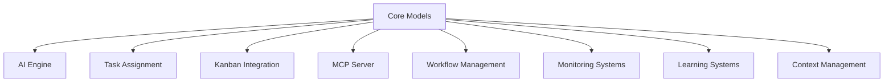

# Core Models System

## Overview

The Core Models system (`src/core/models.py`) is the foundational data modeling layer of the Marcus architecture. It defines the fundamental data structures and enumerations that represent all core business entities within the Marcus ecosystem, providing type-safe, well-documented abstractions for tasks, projects, workers, assignments, and system state.

## System Architecture

### Core Data Models

```
TaskStatus       TaskAssignment      WorkerStatus
    ↓                  ↓                 ↓
   Task ──────────────────────────── ProjectState
    ↓                                     ↓
BlockerReport                      ProjectRisk
```

The system is built around six primary data classes and three enumerations:

**Enumerations:**
- `TaskStatus` - Lifecycle states (TODO, IN_PROGRESS, DONE, BLOCKED)
- `Priority` - Urgency levels (LOW, MEDIUM, HIGH, URGENT)
- `RiskLevel` - Impact severity (LOW, MEDIUM, HIGH, CRITICAL)

**Core Models:**
- `Task` - Individual work items with dependencies and metadata
- `ProjectState` - Aggregate project health and metrics
- `WorkerStatus` - Agent capabilities, workload, and performance
- `TaskAssignment` - Execution context for assigned work
- `BlockerReport` - Issue tracking and resolution
- `ProjectRisk` - Risk assessment and mitigation planning

### Marcus Ecosystem Integration

The Core Models system sits at the architectural center of Marcus, serving as the common language between all subsystems:



## Workflow Position

In the typical Marcus scenario workflow, Core Models are invoked at every stage:

### 1. create_project
- `ProjectState` instances created to track metrics
- `ProjectRisk` models initialized for assessment
- Project metadata stored in model structures

### 2. register_agent
- `WorkerStatus` model populated with agent capabilities
- Skills, availability, and performance scores recorded
- Agent pool state maintained through models

### 3. request_next_task
- `Task` models filtered and analyzed for assignment
- `TaskAssignment` created with execution context
- Dependency graphs traversed using model relationships

### 4. report_progress
- `Task.actual_hours` and status updated
- `ProjectState` metrics recalculated automatically
- Progress tracking through model state transitions

### 5. report_blocker
- `BlockerReport` instances created with AI analysis
- `RiskLevel` assessed and propagated to project state
- Resolution workflows tracked through model lifecycle

### 6. finish_task
- `Task.status` transitioned to DONE
- `ProjectState.completed_tasks` incremented
- Dependency chains unblocked automatically

## What Makes This System Special

### 1. Type Safety with Flexibility
The system uses Python dataclasses with type hints for compile-time safety while maintaining runtime flexibility:

```python
@dataclass
class Task:
    id: str
    name: str
    description: str
    status: TaskStatus
    priority: Priority
    # Optional fields with smart defaults
    actual_hours: float = 0.0
    dependencies: List[str] = field(default_factory=list)
    labels: List[str] = field(default_factory=list)
```

### 2. Temporal Awareness
All models include temporal tracking for audit trails and analytics:
- `created_at` and `updated_at` for lifecycle tracking
- `assigned_at` for assignment timing
- `reported_at` for issue tracking
- `identified_at` for risk management

### 3. Hierarchical Context
Models support both flat and hierarchical project structures:
- Optional `project_id` and `project_name` for multi-project support
- Backward compatibility with single-project deployments
- Context propagation through model relationships

### 4. Performance Optimization
- Immutable enum types for efficient comparison
- Default factory functions prevent mutable default arguments
- Minimal object creation overhead through dataclass optimization

## Technical Implementation Details

### Enum Design Philosophy
```python
class TaskStatus(Enum):
    TODO = "todo"
    IN_PROGRESS = "in_progress"
    DONE = "done"
    BLOCKED = "blocked"
```

String-based enums chosen over integers for:
- JSON serialization compatibility with external systems
- Human-readable database storage
- API transparency and debugging
- Internationalization support

### Dataclass Field Strategies
```python
# Safe mutable defaults
dependencies: List[str] = field(default_factory=list)

# Performance-optimized defaults
actual_hours: float = 0.0

# Optional context fields
project_id: Optional[str] = None
```

### Dependency Graph Modeling
Tasks use string-based dependency references rather than object references:
- Prevents circular import issues
- Enables lazy loading and partial graphs
- Supports distributed task storage
- Simplifies serialization/deserialization

### Security Isolation Features
The `TaskAssignment` model includes security-focused fields:
```python
workspace_path: Optional[str] = None
forbidden_paths: List[str] = field(default_factory=list)
```

These enable sandbox isolation for worker agents, preventing unauthorized file system access.

## Simple vs Complex Task Handling

### Simple Tasks
For basic tasks, the models provide lightweight tracking:
- Minimal required fields (id, name, description, status, priority)
- Default values for complex fields
- Direct status transitions

### Complex Tasks
For sophisticated workflows, models scale up naturally:
- Rich dependency networks through `dependencies` lists
- Multi-project context via `project_id`/`project_name`
- Performance tracking via `estimated_hours`/`actual_hours`
- Risk assessment through `BlockerReport` and `ProjectRisk`

### Adaptive Complexity
The AI-powered task assignment system (`src/core/ai_powered_task_assignment.py`) uses model metadata to determine task complexity:

```python
# Phase 1: Safety filtering uses task.labels and dependencies
safe_tasks = await self._filter_safe_tasks(available_tasks)

# Phase 2: Dependency analysis leverages model relationships
dependency_scores = await self._analyze_dependencies(safe_tasks)

# Phase 3: AI matching considers all model attributes
ai_scores = await self._get_ai_recommendations(safe_tasks, agent_info)
```

## Board-Specific Considerations

### Kanban Integration
Models provide seamless integration with external Kanban systems:

```python
# Planka mapping
task.status -> Planka card status
task.labels -> Planka tags
task.description -> Planka card content

# Linear mapping
task.priority -> Linear priority levels
task.dependencies -> Linear parent/child relationships
task.estimated_hours -> Linear time estimates
```

### Board Quality Validation
The system includes board-specific quality checks:
- Required field validation per provider
- Status transition rules enforcement
- Dependency cycle detection
- Data consistency verification

### Provider Abstraction
Models abstract away provider-specific details:
- Normalized priority levels across systems
- Standardized status workflows
- Common dependency representations
- Unified metadata handling

## Current Implementation: Pros and Cons

### Pros

**1. Consistency Across System**
- Single source of truth for data structures
- Consistent field naming and types
- Unified validation rules

**2. Type Safety**
- Compile-time error detection
- IDE autocomplete support
- Reduced runtime type errors

**3. Documentation Integration**
- Numpy-style docstrings for all models
- Field-level documentation
- Usage examples included

**4. Extensibility**
- Easy to add new fields without breaking changes
- Optional fields support gradual feature rollout
- Enum values can be extended safely

**5. Performance**
- Lightweight dataclass implementation
- Efficient enum comparisons
- Minimal memory overhead

### Cons

**1. Coupling Risk**
- Central models create dependency bottlenecks
- Changes require careful impact analysis
- Version compatibility challenges

**2. Serialization Complexity**
- Datetime handling across timezones
- Enum serialization for different targets
- Nested object serialization overhead

**3. Validation Limitations**
- No built-in field validation
- Complex constraint checking requires external logic
- Cross-field validation not enforced

**4. Database Mapping**
- ORM impedance mismatch potential
- No built-in persistence layer
- Manual mapping to storage formats

## Design Decision Rationale

### Why Dataclasses Over Classes?
- **Reduced boilerplate**: Automatic `__init__`, `__repr__`, `__eq__`
- **Type safety**: Native type hint support
- **Immutability options**: `frozen=True` when needed
- **Performance**: Optimized memory layout

### Why String Enums Over IntEnum?
- **API clarity**: Self-documenting values
- **Debugging ease**: Human-readable in logs
- **JSON compatibility**: No conversion needed
- **Database storage**: Readable column values

### Why Optional Fields Over Required?
- **Backward compatibility**: Existing code continues working
- **Gradual migration**: Features can be adopted incrementally
- **Flexibility**: Different use cases have different requirements
- **Default handling**: Sensible defaults reduce configuration burden

### Why Flat Dependencies Over Object References?
- **Serialization**: Easy JSON conversion
- **Distributed systems**: Works across process boundaries
- **Lazy loading**: Dependencies resolved on demand
- **Circular reference avoidance**: No memory leaks

## Future Evolution

### Planned Enhancements

**1. Validation Framework**
- Pydantic integration for field validation
- Cross-field constraint checking
- Custom validation rules per provider

**2. Persistence Layer**
- SQLAlchemy model mapping
- Document database support
- Caching layer integration

**3. Event Sourcing**
- Model state change events
- Audit trail automation
- Replay capability for debugging

**4. Schema Evolution**
- Automatic migration support
- Version compatibility checking
- Backward compatibility guarantees

### Performance Optimizations

**1. Memory Efficiency**
- `__slots__` for reduced memory usage
- Interning for common string values
- Lazy property evaluation

**2. Serialization Speed**
- Custom serializers for hot paths
- Binary serialization options
- Compression for large datasets

**3. Caching Strategy**
- Model instance caching
- Computed property memoization
- Query result caching

## Integration Points

### Seneca Integration

Currently, the Core Models system does not have direct Seneca integration, as Seneca appears to be a future enhancement. However, the models are designed to support AI coaching systems through:

**Context Awareness:**
```python
# Models provide rich context for AI analysis
task_context = {
    "complexity": len(task.dependencies),
    "urgency": task.priority.value,
    "historical_performance": task.actual_hours / task.estimated_hours
}
```

**Coaching Metadata:**
- `performance_score` in `WorkerStatus` for coaching recommendations
- `BlockerReport` patterns for learning opportunities
- `ProjectRisk` analysis for proactive coaching

**Future Seneca Integration Points:**
- Agent performance coaching based on `WorkerStatus` metrics
- Task difficulty prediction using `Task` historical data
- Risk mitigation coaching through `ProjectRisk` patterns

### AI Engine Integration

Models serve as the primary interface to Marcus's AI capabilities:

**Analysis Context:**
```python
# Task complexity analysis
analysis_context = AnalysisContext(
    task_count=len(project_tasks),
    avg_priority=avg([t.priority for t in tasks]),
    dependency_depth=max_dependency_depth(tasks)
)
```

**Assignment Context:**
```python
# Agent matching context
assignment_context = AssignmentContext(
    agent_skills=worker.skills,
    current_workload=len(worker.current_tasks),
    performance_history=worker.performance_score
)
```

### Error Framework Integration

Models integrate with Marcus's error framework for robust error handling:

```python
# Model validation errors
from src.core.error_framework import ValidationError

if not task.name.strip():
    raise ValidationError(
        field_name="name",
        field_value=task.name,
        validation_rule="non_empty_string"
    )
```

## Best Practices

### Model Usage Guidelines

**1. Immutability Where Possible**
```python
# Good: Use frozen dataclasses for immutable data
@dataclass(frozen=True)
class TaskSnapshot:
    task_id: str
    status: TaskStatus
    timestamp: datetime
```

**2. Defensive Field Access**
```python
# Good: Handle optional fields safely
priority_weight = task.priority.value if task.priority else "medium"
```

**3. Type Validation**
```python
# Good: Validate enum assignments
if status_value in [s.value for s in TaskStatus]:
    task.status = TaskStatus(status_value)
```

### Integration Patterns

**1. Model Conversion**
```python
# Converting to external format
def to_kanban_card(task: Task) -> Dict[str, Any]:
    return {
        "title": task.name,
        "description": task.description,
        "status": task.status.value,
        "labels": task.labels
    }
```

**2. Batch Operations**
```python
# Efficient bulk operations
completed_tasks = [t for t in tasks if t.status == TaskStatus.DONE]
total_effort = sum(t.actual_hours for t in completed_tasks)
```

The Core Models system represents a mature, well-architected foundation that successfully balances simplicity with extensibility, type safety with flexibility, and performance with maintainability. Its position at the center of the Marcus architecture makes it a critical success factor for the entire system's reliability and evolution.
