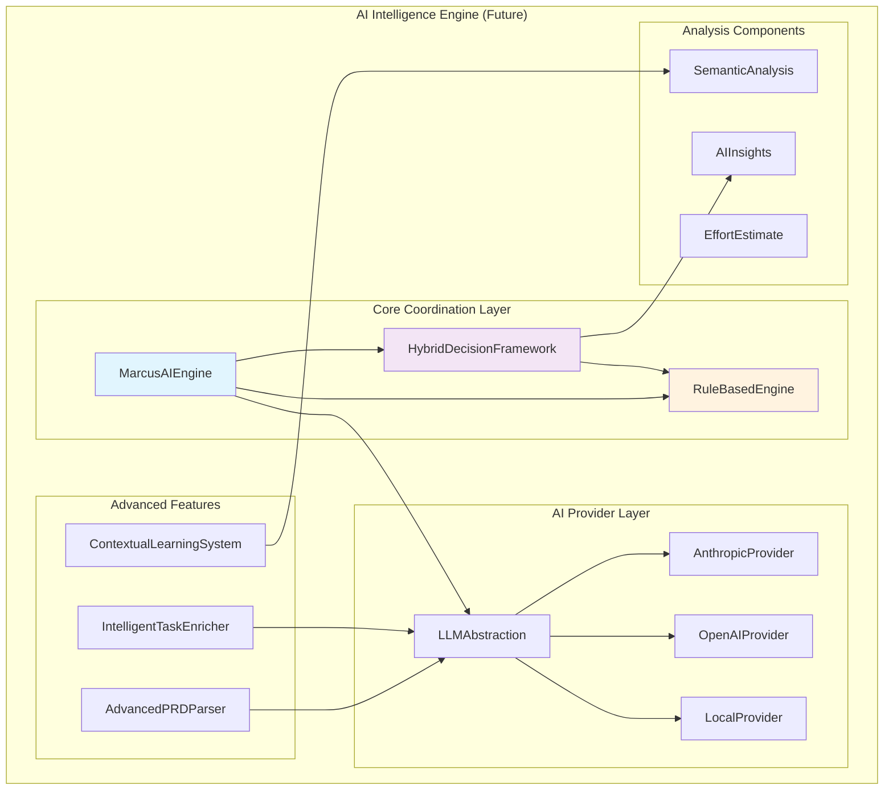

# AI Intelligence Engine - Future Vision

**Status**: 🔮 ASPIRATIONAL - This document describes planned future architecture, not current implementation.

**Current Implementation**: See `07-ai-intelligence-engine.md` for the actual implemented system.

---

## Overview

This document outlines the planned evolution of Marcus's AI Intelligence Engine from its current single-class implementation to a sophisticated multi-component hybrid architecture that combines rule-based safety guarantees with advanced AI capabilities.

## Planned Architecture

### Multi-Layer Hybrid Intelligence



### Component Descriptions

#### 1. MarcusAIEngine (Central Coordinator)

**Purpose**: Orchestrate all AI operations with unified API.

```python
class MarcusAIEngine:
    """
    Central coordinator for hybrid AI intelligence.

    Manages the interaction between rule-based safety validation
    and AI-powered semantic understanding.
    """

    def __init__(self):
        self.rule_engine = RuleBasedEngine()
        self.hybrid_framework = HybridDecisionFramework()
        self.llm = LLMAbstraction()

    async def analyze_with_hybrid_intelligence(
        self, context: AnalysisContext
    ) -> HybridAnalysis:
        """
        Perform hybrid rule-AI analysis.

        Process:
        1. Rule validation (mandatory, never bypassed)
        2. AI enhancement (only when rules allow)
        3. Hybrid confidence calculation
        """
        # Step 1: Rule validation
        rule_result = await self.rule_engine.analyze(context)

        # Step 2: AI enhancement (only if safe)
        if rule_result.is_valid:
            ai_insights = await self._get_ai_insights(context)
        else:
            ai_insights = None

        # Step 3: Merge results
        return self.hybrid_framework.merge_results(
            rule_result, ai_insights
        )
```

**Key Features**:
- Enforces safety-first architecture
- Provides single entry point for AI operations
- Manages component lifecycle

#### 2. RuleBasedEngine (Safety Foundation)

**Purpose**: Provide deterministic safety guarantees that AI cannot override.

```python
class RuleBasedEngine:
    """
    Rule-based safety validation layer.

    Implements hard constraints and safety checks that must
    pass before AI analysis is allowed to influence decisions.
    """

    async def analyze(self, context: AnalysisContext) -> RuleAnalysis:
        """
        Validate safety constraints.

        Returns:
            RuleAnalysis with is_valid flag and safety violations
        """
        violations = []

        # Check Phase 1 safety rules
        if not self._check_phase_ordering(context.task):
            violations.append("Phase ordering violation")

        # Check Phase 2 safety rules
        if not self._check_dependency_safety(context.task):
            violations.append("Unsafe dependency")

        return RuleAnalysis(
            is_valid=len(violations) == 0,
            violations=violations,
            confidence=1.0  # Rules are always 100% confident
        )
```

**Safety Rules Include**:
- Phase ordering (no deploy before test)
- Dependency validation (no circular deps)
- Resource constraints (team capacity limits)
- Timeline feasibility checks

#### 3. HybridDecisionFramework (Decision Merger)

**Purpose**: Intelligently combine rule-based and AI results.

```python
class HybridDecisionFramework:
    """
    Merges rule-based validation with AI insights.

    Ensures rules take precedence while leveraging AI
    for optimization when safe to do so.
    """

    def merge_results(
        self, rule_result: RuleAnalysis, ai_insights: Optional[AIInsights]
    ) -> HybridAnalysis:
        """
        Combine rule and AI analysis.

        Priority:
        1. If rules fail, decision is NO (AI ignored)
        2. If rules pass but AI unavailable, trust rules
        3. If both available, weighted combination (rules 70%, AI 30%)
        """
        # Rules block
        if not rule_result.is_valid:
            return HybridAnalysis(
                allow_assignment=False,
                confidence=1.0,
                reason=f"Safety violation: {rule_result.violations}",
                safety_critical=True
            )

        # No AI insights
        if ai_insights is None:
            return HybridAnalysis(
                allow_assignment=True,
                confidence=rule_result.confidence,
                reason="Rule-based validation only",
                safety_critical=False
            )

        # Hybrid confidence calculation
        final_confidence = self._calculate_hybrid_confidence(
            rule_result.confidence,
            ai_insights.confidence
        )

        return HybridAnalysis(
            allow_assignment=True,
            confidence=final_confidence,
            reason=ai_insights.reasoning,
            ai_insights=ai_insights,
            confidence_breakdown={
                "rule_confidence": rule_result.confidence,
                "ai_confidence": ai_insights.confidence,
                "final": final_confidence
            }
        )

    def _calculate_hybrid_confidence(
        self, rule_conf: float, ai_conf: float
    ) -> float:
        """Weight rules 70%, AI 30% for safety."""
        return (rule_conf * 0.7) + (ai_conf * 0.3)
```

#### 4. LLMAbstraction (Provider Management)

**Purpose**: Unified interface across multiple LLM providers with intelligent fallback.

```python
class LLMAbstraction:
    """
    Multi-provider LLM abstraction layer.

    Supports Anthropic, OpenAI, and local models with
    automatic fallback and performance tracking.
    """

    def __init__(self):
        self.providers: Dict[str, BaseLLMProvider] = {}
        self.current_provider = "anthropic"
        self.fallback_chain = ["anthropic", "openai", "local"]

    async def analyze(self, prompt: str, context: Dict) -> str:
        """
        Call LLM with automatic fallback.

        Tries providers in order:
        1. Primary provider (anthropic)
        2. Fallback providers (openai, local)
        3. Returns error if all fail
        """
        for provider_name in self.fallback_chain:
            try:
                provider = self.providers[provider_name]
                response = await provider.generate(prompt, context)
                self._track_success(provider_name)
                return response
            except Exception as e:
                self._track_failure(provider_name, e)
                continue

        raise AllProvidersFailedError("No LLM providers available")
```

**Supported Providers**:
- **Anthropic**: Claude models (primary)
- **OpenAI**: GPT models (fallback)
- **Local**: Ollama, llama.cpp (offline fallback)

#### 5. AdvancedPRDParser

**Purpose**: Convert natural language requirements into complete project breakdowns.

```python
class AdvancedPRDParser:
    """
    AI-powered PRD parsing with intelligent task generation.

    Combines NLP, domain knowledge, and AI to convert
    natural language requirements into structured tasks.
    """

    async def parse_prd_to_tasks(
        self, prd_content: str, constraints: ProjectConstraints
    ) -> TaskGenerationResult:
        """
        Parse PRD and generate complete task breakdown.

        Steps:
        1. Deep PRD analysis (extract features, tech stack, risks)
        2. Generate task hierarchy (phases, epics, tasks)
        3. AI-powered dependency inference
        4. Risk assessment and timeline prediction
        """
        # Deep analysis
        prd_analysis = await self._analyze_prd_deeply(prd_content)

        # Task hierarchy generation
        task_hierarchy = self._create_task_hierarchy(
            prd_analysis, constraints
        )

        # Detailed task creation
        tasks = await self._create_detailed_tasks(
            task_hierarchy, prd_analysis, constraints
        )

        # Smart dependency inference
        dependencies = await self._infer_smart_dependencies(
            tasks, prd_analysis
        )

        # Risk and timeline assessment
        risk_assessment = await self._assess_implementation_risks(
            tasks, prd_analysis, constraints
        )

        return TaskGenerationResult(
            tasks=tasks,
            dependencies=dependencies,
            estimated_timeline=self._estimate_timeline(tasks, dependencies),
            risks=risk_assessment,
            confidence=self._calculate_generation_confidence()
        )
```

#### 6. IntelligentTaskEnricher

**Purpose**: AI-enhance task metadata with detailed instructions, estimates, and criteria.

```python
class IntelligentTaskEnricher:
    """
    AI-powered task enhancement system.

    Enriches basic task data with:
    - Detailed step-by-step instructions
    - Realistic effort estimates
    - Comprehensive acceptance criteria
    - Technology-specific guidance
    """

    async def enrich_task(
        self, task: Task, context: ProjectContext
    ) -> EnrichedTask:
        """
        Enhance task with AI insights.

        Generates:
        - Detailed implementation steps
        - Realistic time estimates (based on complexity)
        - Clear acceptance criteria
        - Testing requirements
        - Potential blockers
        """
        # AI generates comprehensive task details
        enrichment = await self.llm.analyze(
            prompt=self._build_enrichment_prompt(task, context)
        )

        return EnrichedTask(
            **task.__dict__,
            detailed_steps=enrichment["steps"],
            refined_estimate=enrichment["estimate_hours"],
            acceptance_criteria=enrichment["acceptance_criteria"],
            testing_requirements=enrichment["testing"],
            potential_blockers=enrichment["blockers"],
            required_skills=enrichment["skills"]
        )
```

#### 7. ContextualLearningSystem

**Purpose**: Learn team, technology, and project-specific patterns.

```python
class ContextualLearningSystem:
    """
    Contextual pattern learning across projects.

    Learns patterns specific to:
    - Teams (velocity, skills, preferences)
    - Technologies (best practices, common issues)
    - Project types (typical workflows, risks)
    """

    async def learn_team_patterns(
        self, team_id: str, completed_projects: List[Project]
    ) -> TeamLearnings:
        """
        Extract team-specific patterns.

        Learns:
        - Team velocity trends
        - Skill strengths/gaps
        - Communication preferences
        - Common blockers
        - Success factors
        """
        return TeamLearnings(
            average_velocity=self._calculate_velocity(completed_projects),
            skill_matrix=self._build_skill_matrix(completed_projects),
            common_blockers=self._identify_blockers(completed_projects),
            success_patterns=self._find_success_factors(completed_projects)
        )
```

## Benefits of Hybrid Architecture

### 1. Safety Guarantees

**Current System**: AI can make any decision (no validation layer).

**Future System**: Rule layer enforces hard constraints.

```python
# Rules prevent catastrophic decisions
# Example: Can't deploy before testing passes

rule_check = rule_engine.analyze(deploy_task)
if not rule_check.is_valid:
    # Deployment blocked regardless of AI recommendation
    return RejectedDecision(reason="Safety violation")
```

### 2. Multi-Provider Resilience

**Current System**: Anthropic-only (single point of failure).

**Future System**: Automatic fallback across providers.

```python
# Try Anthropic first
# If fails, try OpenAI
# If fails, try local model
# System keeps working
```

### 3. Contextual Learning

**Current System**: No learning, same analysis every time.

**Future System**: Learns from project outcomes.

```python
# Learn that this team is faster at React tasks
# Adjust estimates accordingly
# Recommend similar developers for similar tasks
```

### 4. Advanced PRD Capabilities

**Current System**: PRD parsing in separate module (System 23).

**Future System**: Integrated intelligent PRD analysis.

```python
# AI-powered:
# - Feature extraction from natural language
# - Smart dependency inference
# - Risk identification
# - Realistic timeline prediction
```

## Implementation Roadmap

### Phase 1: Foundation (Months 1-2)

**Goals**: Set up multi-provider abstraction.

**Deliverables**:
- `LLMAbstraction` class with Anthropic + OpenAI support
- Automatic fallback mechanism
- Provider performance tracking

### Phase 2: Safety Layer (Months 3-4)

**Goals**: Implement rule-based safety validation.

**Deliverables**:
- `RuleBasedEngine` with phase ordering rules
- Dependency validation rules
- Resource constraint rules

### Phase 3: Hybrid Framework (Months 5-6)

**Goals**: Merge rule and AI results intelligently.

**Deliverables**:
- `HybridDecisionFramework` class
- Weighted confidence calculation
- Safety-first decision logic

### Phase 4: Learning System (Months 7-9)

**Goals**: Enable contextual learning.

**Deliverables**:
- `ContextualLearningSystem` class
- Team pattern extraction
- Technology-specific learnings

### Phase 5: Advanced Features (Months 10-12)

**Goals**: Complete the vision.

**Deliverables**:
- `AdvancedPRDParser` integration
- `IntelligentTaskEnricher` system
- Full `MarcusAIEngine` coordination layer

## Migration Path

### From Current to Future

**Current (`AIAnalysisEngine`)**:
```python
engine = AIAnalysisEngine()
task = await engine.match_task_to_agent(tasks, agent, state)
```

**Future (`MarcusAIEngine`)**:
```python
engine = MarcusAIEngine()
analysis = await engine.analyze_with_hybrid_intelligence(
    AnalysisContext(task=task, agent=agent, project=state)
)
if analysis.allow_assignment:
    assign_task(task, agent)
```

**Compatibility**: Future system will maintain backward-compatible API.

## Why Not Implement Now?

### Pragmatic Reasons

1. **Current System Works**: `AIAnalysisEngine` successfully handles Marcus's needs
2. **Development Velocity**: Multi-component architecture takes 12+ months
3. **Unclear ROI**: Don't know if benefits justify complexity yet
4. **Team Size**: Small team, simpler systems easier to maintain
5. **Iterate First**: Need real usage data to inform architecture

### When to Build This

**Triggers for starting migration**:
- Marcus user base grows significantly (>100 active projects)
- AI provider outages become frequent problem
- Users request specific features (multi-provider, learning, etc.)
- Development team expands (can handle complexity)
- Clear ROI demonstrated by user feedback

## Conclusion

This aspirational architecture represents a vision for Marcus's AI Intelligence Engine that prioritizes:
- **Safety**: Rule-based guarantees prevent catastrophic decisions
- **Resilience**: Multi-provider support ensures uptime
- **Intelligence**: Learning systems improve over time
- **Sophistication**: Advanced features handle complex scenarios

The current single-class `AIAnalysisEngine` is intentionally simple and pragmatic. This multi-component vision will be built incrementally as Marcus's needs and team grow.

---

**Document Status**: ASPIRATIONAL VISION - Not currently implemented

**See Current Implementation**: `07-ai-intelligence-engine.md`

**Last Updated**: 2025-11-07
