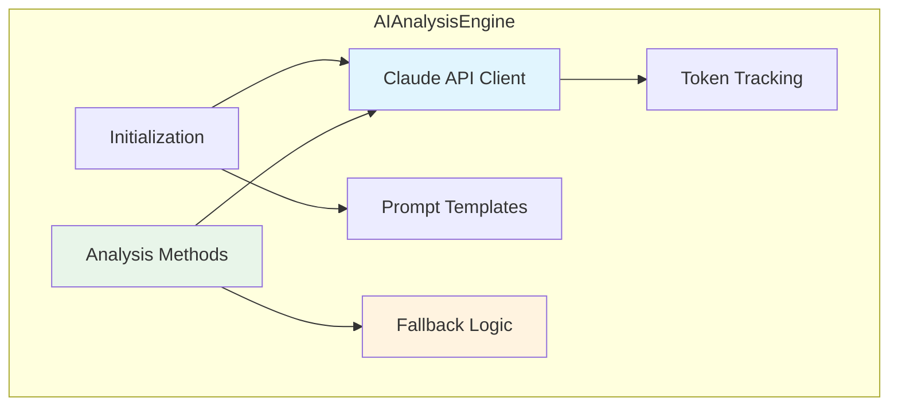
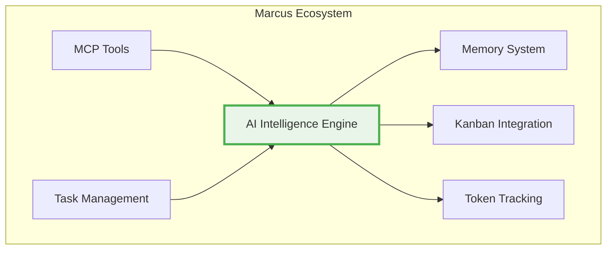

# AI Intelligence Engine System

## Table of Contents
1. [System Overview](#system-overview)
2. [Architecture](#architecture)
3. [Marcus Ecosystem Integration](#marcus-ecosystem-integration)
4. [Workflow Integration](#workflow-integration)
5. [Core Features](#core-features)
6. [Technical Implementation](#technical-implementation)
7. [Pros and Cons](#pros-and-cons)
8. [Design Rationale](#design-rationale)
9. [Future Evolution](#future-evolution)
10. [Task Complexity Handling](#task-complexity-handling)
11. [Board-Specific Considerations](#board-specific-considerations)
12. [Seneca Integration](#seneca-integration)

## System Overview

The AI Intelligence Engine is Marcus's AI-powered analysis and decision engine that provides intelligent task assignment, blocker resolution, and project risk analysis using Claude API. The system gracefully falls back to rule-based approaches when AI is unavailable, ensuring Marcus continues functioning even without AI access.

**Primary Location**: `src/integrations/ai_analysis_engine.py`

### Core Principle
**AI-enhanced decision making with graceful degradation.**

The system operates on a pragmatic principle: use AI when available for intelligent analysis, fall back to deterministic rules when AI is unavailable. This ensures reliability while leveraging AI's semantic understanding capabilities when possible.

### Key Capabilities
- **Intelligent Task Assignment**: AI-powered task-to-agent matching based on skills, capacity, and project context
- **Task Instruction Generation**: Context-aware, detailed task instructions tailored to developer experience
- **Blocker Analysis**: Root cause analysis and resolution suggestions for task blockers
- **Project Risk Assessment**: Proactive risk identification with mitigation strategies
- **Project Health Analysis**: Overall project health monitoring and recommendations
- **Feature Request Analysis**: Intelligent analysis of feature requests and implementation planning
- **Graceful Fallback**: Automatic fallback to rule-based logic when AI unavailable

## Architecture

### Single-Class Design

The AI Intelligence Engine is implemented as a single, cohesive class:



**Component Structure:**
- **AIAnalysisEngine**: Single class providing all AI analysis functionality
  - Claude API client (Anthropic SDK)
  - Prompt template system
  - Analysis methods for different use cases
  - Fallback methods for when AI unavailable
  - Token usage tracking integration

### Core Class Structure

```python
class AIAnalysisEngine:
    """
    AI-powered analysis and decision engine using Claude API.

    Provides intelligent analysis for project management decisions with
    graceful fallback to rule-based approaches when AI is unavailable.
    """

    def __init__(self) -> None:
        # Initialize Anthropic client
        self.client: Optional[anthropic.Anthropic] = None
        self.current_project_id: Optional[str] = None
        self.current_agent_id: Optional[str] = None

        # Load API key from config or environment
        api_key = config.get("ai.anthropic_api_key") or os.getenv("ANTHROPIC_API_KEY")
        if api_key:
            self.client = anthropic.Anthropic(api_key=api_key)

        # Model configuration
        self.model: str = "claude-3-5-sonnet-20241022"

        # Prompt templates
        self.prompts: Dict[str, str] = {
            "task_assignment": "...",
            "task_instructions": "...",
            "blocker_analysis": "...",
            "project_risk": "..."
        }
```

## Marcus Ecosystem Integration

### Position in Marcus Architecture

The AI Intelligence Engine provides cognitive capabilities across the Marcus ecosystem:



### Integration Points

**Consumers of AI Engine:**
- **MCP Tools**: `create_project`, `request_next_task`, `report_blocker`
- **Task Management**: Task assignment optimization
- **Project Analysis**: Risk assessment and health monitoring

**Dependencies:**
- **Anthropic SDK**: Direct Claude API integration
- **Token Tracking**: Cost monitoring via `ai_usage_middleware`
- **Config System**: API key and model configuration
- **Memory System**: Historical context for analysis

### Data Flow

1. **Input**: Task data, agent profiles, project state, blocker descriptions
2. **Processing**:
   - Check if Claude API available
   - If available: AI analysis via Claude
   - If unavailable: Fallback to rule-based logic
3. **Output**: Structured decisions, instructions, risk assessments

## Workflow Integration

The AI Intelligence Engine is invoked at key points in the Marcus workflow:

### 1. Project Creation (`create_project`)

**MCP Tool Integration:**
```python
# Called from create_project MCP tool
# Handles PRD parsing and task generation
# See: src/intelligence/prd_parser.py and intelligent_task_generator.py
```

**Note**: PRD parsing is handled by separate intelligence modules (`PRDParser`, `IntelligentTaskGenerator`), not directly by `AIAnalysisEngine`. See System 23 (Task Management Intelligence) for details.

### 2. Task Assignment (`request_next_task`)

**AI Engine Method:**
```python
async def match_task_to_agent(
    self,
    available_tasks: List[Task],
    agent: WorkerStatus,
    project_state: ProjectState
) -> Optional[Task]:
    """Find optimal task for agent using AI analysis."""

    if not self.client:
        return self._fallback_task_matching(available_tasks, agent)

    # Prepare data for AI (limit to 10 tasks to avoid context limits)
    tasks_data = [serialize(t) for t in available_tasks[:10]]

    # Call Claude with task assignment prompt
    prompt = self.prompts["task_assignment"].format(
        tasks=json.dumps(tasks_data),
        agent=json.dumps(serialize(agent)),
        project_state=project_state.value
    )

    response = await self._call_claude(prompt)
    result = json.loads(response)

    # Find and return the recommended task
    return find_task_by_id(result["recommended_task_id"])
```

**Fallback Logic:**
```python
def _fallback_task_matching(
    self, tasks: List[Task], agent: WorkerStatus
) -> Optional[Task]:
    """Rule-based task matching when AI unavailable."""

    # Score tasks by priority and skill match
    priority_scores = {
        Priority.URGENT: 10,
        Priority.HIGH: 3,
        Priority.MEDIUM: 1,
        Priority.LOW: 0.5
    }

    # Find best scoring task
    best_task = max(tasks, key=lambda t: (
        priority_scores.get(t.priority, 0) +
        skill_match_score(t, agent)
    ))

    return best_task
```

### 3. Task Instructions (`generate_task_instructions`)

**AI Engine Method:**
```python
async def generate_task_instructions(
    self, task: Task, agent: WorkerStatus
) -> str:
    """Generate detailed instructions for a task."""

    if not self.client:
        return self._generate_fallback_instructions(task, agent)

    # AI-generated instructions tailored to task type
    prompt = self.prompts["task_instructions"].format(
        task=json.dumps(serialize(task)),
        agent=json.dumps(serialize(agent))
    )

    instructions = await self._call_claude(prompt)
    return instructions
```

**Fallback Logic:**
```python
def _generate_fallback_instructions(
    self, task: Task, agent: WorkerStatus
) -> str:
    """Template-based instructions when AI unavailable."""

    instructions = f"""Task: {task.name}

Description:
{task.description}

Steps:
1. Review the task requirements
2. Implement the necessary changes
3. Test your implementation
4. Submit for review

Acceptance Criteria:
{task.acceptance_criteria or 'Complete the task as described'}
"""
    return instructions
```

### 4. Blocker Analysis (`report_blocker`)

**AI Engine Method:**
```python
async def analyze_blocker(
    self,
    task_id: str,
    description: str,
    severity: str,
    agent: WorkerStatus,
    task: Task
) -> Dict[str, Any]:
    """Analyze blocker and suggest resolution steps."""

    if not self.client:
        return self._generate_fallback_blocker_analysis(...)

    # AI analysis with agent context
    prompt = self.prompts["blocker_analysis"].format(
        task_id=task_id,
        description=description,
        severity=severity,
        agent_context=f"Agent: {agent.name}, Skills: {agent.skills}",
        task_context=f"Task: {task.name}"
    )

    response = await self._call_claude(prompt)
    return json.loads(response)
```

**Fallback Logic:**
```python
def _generate_fallback_blocker_analysis(
    self, description: str, severity: str, ...
) -> Dict[str, Any]:
    """Rule-based blocker analysis."""

    return {
        "root_cause": f"Blocker: {description}",
        "impact_assessment": f"Severity: {severity}",
        "resolution_steps": [
            "Review the error message or issue",
            "Check documentation for similar issues",
            "Consider asking team for assistance"
        ],
        "estimated_hours": 2.0,
        "escalation_needed": severity == "high"
    }
```

### 5. Project Risk Analysis (`analyze_project_risks`)

**AI Engine Method:**
```python
async def analyze_project_risks(
    self,
    project_state: ProjectState,
    recent_blockers: List[BlockerReport],
    team_status: List[WorkerStatus]
) -> List[ProjectRisk]:
    """Analyze and identify project risks."""

    if not self.client:
        return self._generate_fallback_risk_analysis(project_state)

    # AI-powered risk identification
    prompt = self.prompts["project_risk"].format(
        project_state=project_state.value,
        recent_blockers=json.dumps([serialize(b) for b in recent_blockers[:5]]),
        team_status=json.dumps([serialize(a) for a in team_status])
    )

    response = await self._call_claude(prompt)
    risks_data = json.loads(response)

    # Convert to ProjectRisk objects
    return [
        ProjectRisk(
            risk_level=RiskLevel[r["impact"].upper()],
            description=r["description"],
            mitigation_strategy=r["mitigation"]
        )
        for r in risks_data["risks"]
    ]
```

## Core Features

### 1. AI-Enhanced Decision Making

**What makes it special**: When Claude API is available, provides semantic understanding of tasks, agents, and context for intelligent decisions.

**Capabilities:**
- Semantic task-agent matching (not just keyword matching)
- Context-aware instruction generation
- Intelligent blocker root cause analysis
- Risk pattern identification across project history
- Recommendations tailored to agent skill level

**Example AI Analysis:**
```python
# AI considers:
# - Agent's Python skills match backend task requirements
# - Agent has bandwidth (40% capacity remaining)
# - Task is on critical path for milestone
# - Agent previously succeeded on similar tasks
# → Confidence: 0.85, Recommended: Yes
```

### 2. Graceful Fallback System

**What makes it special**: Marcus continues functioning even when AI is completely unavailable.

**Fallback Strategy:**
```python
if not self.client:  # AI unavailable
    return self._fallback_method(...)  # Use rules instead
```

**Fallback Methods:**
- `_fallback_task_matching()` - Priority + skill-based scoring
- `_generate_fallback_instructions()` - Template-based instructions
- `_generate_fallback_blocker_analysis()` - Rule-based analysis
- `_generate_fallback_risk_analysis()` - Metric-based assessment

**Fallback Quality:**
- Basic but functional - allows project to continue
- Deterministic and predictable
- No API costs
- Instant response (no network latency)

### 3. Prompt Template System

**What makes it special**: Maintainable, version-controlled prompts for different analysis types.

**Template Categories:**
```python
self.prompts = {
    "task_assignment": "...",      # Task-to-agent matching
    "task_instructions": "...",     # Detailed task guidance
    "blocker_analysis": "...",      # Problem resolution
    "project_risk": "...",          # Risk identification
    "project_health": "...",        # Overall health assessment
    "feature_analysis": "..."       # Feature request analysis
}
```

**Template Design:**
- Clear instructions to Claude
- Structured JSON output format
- Context-specific guidance
- Examples where helpful

### 4. Token Usage Tracking

**What makes it special**: Automatic cost monitoring for all Claude API calls.

**Implementation:**
```python
async def _call_claude(self, prompt: str) -> str:
    """Call Claude API with error handling and token tracking."""

    response = self.client.messages.create(
        model=self.model,
        max_tokens=2000,
        temperature=0.7,
        messages=[{"role": "user", "content": prompt}]
    )

    # Token tracking happens automatically via middleware
    # See: ai_usage_middleware.wrap_ai_provider()

    return str(response.content[0].text)
```

**Tracking Benefits:**
- Cost per project/task/agent
- Usage trends over time
- Budget alerts
- Optimization opportunities

## Technical Implementation

### Initialization

```python
class AIAnalysisEngine:
    def __init__(self) -> None:
        """Initialize with Anthropic client."""

        # Load API key
        from src.config.config_loader import get_config
        config = get_config()
        api_key = config.get("ai.anthropic_api_key") or os.getenv("ANTHROPIC_API_KEY")

        # Initialize client (None if no key)
        if api_key:
            self.client = anthropic.Anthropic(api_key=api_key)
        else:
            print("⚠️  No API key - AI features will use fallback mode")
            self.client = None

        # Model selection
        self.model = config.get("ai.model", "claude-3-5-sonnet-20241022")
```

### Claude API Integration

```python
async def _call_claude(self, prompt: str) -> str:
    """
    Call Claude API with error handling.

    Parameters
    ----------
    prompt : str
        The prompt to send to Claude

    Returns
    -------
    str
        Claude's response text

    Raises
    ------
    Exception
        If API call fails after retries
    """
    try:
        response = self.client.messages.create(
            model=self.model,
            max_tokens=2000,
            temperature=0.7,
            messages=[{"role": "user", "content": prompt}]
        )
        return str(response.content[0].text)

    except Exception as e:
        print(f"Claude API error: {e}", file=sys.stderr)
        raise
```

### Error Handling

**Approach**: Fail gracefully to fallback methods rather than crash.

```python
async def match_task_to_agent(self, tasks, agent, project_state):
    """AI task matching with fallback."""

    # Check if AI available
    if not self.client:
        return self._fallback_task_matching(tasks, agent)

    try:
        # Try AI analysis
        response = await self._call_claude(prompt)
        return parse_and_find_task(response)

    except Exception as e:
        # AI failed - use fallback
        print(f"AI analysis failed: {e}", file=sys.stderr)
        return self._fallback_task_matching(tasks, agent)
```

### Context Serialization

**Challenge**: Convert Marcus domain objects to JSON for Claude.

**Solution**: Serialization helpers that extract relevant fields.

```python
def serialize(obj: Any) -> Dict[str, Any]:
    """Convert domain object to JSON-serializable dict."""

    if isinstance(obj, Task):
        return {
            "id": obj.id,
            "name": obj.name,
            "description": obj.description,
            "type": obj.type.value,
            "priority": obj.priority.value,
            "estimated_hours": obj.estimated_hours,
            "labels": obj.labels,
            "skills_required": obj.skills_required
        }
    elif isinstance(obj, WorkerStatus):
        return {
            "name": obj.name,
            "skills": obj.skills,
            "capacity": obj.capacity,
            "current_load": obj.current_load,
            "experience_level": obj.experience_level
        }
    # ... other types
```

## Pros and Cons

### Advantages

1. **Simple Architecture**: Single class, easy to understand and maintain
2. **Direct Integration**: No abstraction layers, minimal overhead
3. **Graceful Degradation**: Works without AI (fallback mode)
4. **Cost Tracking**: Built-in token usage monitoring
5. **Fast Task Assignment**: Typically < 1 second with AI, instant with fallback
6. **Flexible Prompts**: Easy to update and version control
7. **No Complex Dependencies**: Just Anthropic SDK + Marcus core
8. **Battle-Tested**: Claude 3.5 Sonnet proven for this use case

### Limitations

1. **Single AI Provider**: Anthropic/Claude only (no OpenAI, local models, etc.)
2. **No Rule-Based Safety Layer**: AI can make any decision (no validation layer)
3. **No Learning/Pattern Storage**: Doesn't persist insights across sessions
4. **No Provider Abstraction**: Tightly coupled to Anthropic SDK
5. **Limited Context**: Max 10 tasks per analysis (context window limits)
6. **No Hybrid Confidence**: Simple AI-or-fallback, no weighted combination
7. **Basic Fallback**: Rule-based fallbacks are functional but not sophisticated
8. **No Streaming**: Waits for complete response (no real-time output)

### Trade-offs Made

**Chose Simplicity Over Sophistication:**
- Single provider vs multi-provider abstraction
- Direct API calls vs complex framework
- Simple fallbacks vs advanced rule engine
- Template prompts vs dynamic prompt generation

**Reasoning**: Get Marcus working with AI quickly, iterate based on real usage.

## Design Rationale

### Why This Approach Was Chosen

#### 1. Single Class Design

**Decision**: Implement as one cohesive `AIAnalysisEngine` class.

**Rationale**:
- Easier to understand and maintain
- Faster development iteration
- Sufficient for current needs
- Can refactor later if needed

**Trade-off**: Less modular than multi-class architecture, harder to extend certain features.

#### 2. Claude API Direct Integration

**Decision**: Use Anthropic SDK directly, no abstraction layer.

**Rationale**:
- Claude 3.5 Sonnet excellent for these tasks
- Anthropic SDK stable and well-documented
- No need for multi-provider support yet
- Faster to implement

**Trade-off**: Vendor lock-in, can't easily switch to OpenAI or local models.

#### 3. Graceful Fallback

**Decision**: Every AI method has a fallback version.

**Rationale**:
- Marcus must work even if API down or key missing
- Fallbacks provide basic functionality
- Users can use Marcus without AI budget
- Development/testing doesn't require API access

**Trade-off**: Maintaining two code paths for each feature.

#### 4. Template-Based Prompts

**Decision**: Store prompts as string templates in code.

**Rationale**:
- Easy to version control
- Quick to iterate and improve
- No external prompt management needed
- Reviewable in code reviews

**Trade-off**: Less flexible than dynamic prompt construction.

## Future Evolution

### Planned Enhancements

See `docs/source/systems/intelligence/07-ai-intelligence-engine-FUTURE.md` for the aspirational multi-component hybrid architecture.

**Near-term improvements (Current System):**
1. **Streaming Responses**: Real-time output for long analyses
2. **Better Fallbacks**: More sophisticated rule-based logic
3. **Prompt Versioning**: A/B test different prompt styles
4. **Context Expansion**: Handle more tasks per analysis

**Medium-term improvements:**
5. **Learning System**: Persist AI insights across sessions
6. **Multi-Model Support**: Use different models for different tasks
7. **Confidence Calibration**: Better confidence score accuracy
8. **Cost Optimization**: Smarter decisions about when to use AI

**Long-term vision** (see aspirational doc):
- Multi-provider LLM abstraction
- Hybrid rule-based + AI architecture
- Contextual learning system
- Advanced PRD parsing with dependency inference

## Task Complexity Handling

### Simple Tasks

**Approach**: Fast AI analysis or instant fallback.

```python
# For simple tasks:
# - AI response typically < 1 second
# - Fallback response instant
# - Simple prompt, concise analysis
```

**Example**: "Implement login button"
- AI quickly identifies: frontend task, junior-friendly, 2 hours
- Fallback: Check labels, match to frontend dev, assign

### Complex Tasks

**Approach**: More detailed AI analysis with richer context.

```python
# For complex tasks:
# - Include project history
# - Reference similar past tasks
# - Detailed prompt with examples
# - Longer max_tokens for thorough analysis
```

**Example**: "Design and implement payment system with Stripe"
- AI analyzes: security implications, integration complexity, testing needs
- Considers: agent experience level, needs senior dev, estimates 40 hours
- Fallback: Priority-based assignment, generic instructions

## Board-Specific Considerations

### Kanban Integration

**Data Sources:**
- Task metadata from Kanban cards
- Agent availability from board state
- Project progress from board metrics

**Adaptations:**
- Different task types → different analysis depth
- Board structure affects priority scoring
- Team size impacts assignment strategy

### Board Quality Impact

**High-Quality Boards** (clear descriptions, good labels):
- AI analysis more accurate
- Better task-agent matching
- Richer instructions possible

**Low-Quality Boards** (sparse descriptions, poor labels):
- AI does best with limited data
- Fallback methods work same regardless
- Recommendations to improve board quality

## Seneca Integration

### Current Integration

**Marcus Role**: Provides AI analysis capabilities via MCP tools.

**Seneca Role**: Consumes analysis results for visualization and UI.

**Data Exchange**: JSON-formatted analysis results via MCP protocol.

### API Patterns

```python
# Marcus MCP tool calls AI Engine
result = await ai_engine.analyze_blocker(...)

# Returns structured data
{
    "root_cause": "...",
    "resolution_steps": [...],
    "estimated_hours": 2.0
}

# Seneca displays in UI
```

### Shared Context

- Project state
- Team information
- Historical data
- Analysis results

---

**This documentation represents the current state of the AI Intelligence Engine as implemented in `src/integrations/ai_analysis_engine.py`. For the aspirational multi-component hybrid architecture, see `07-ai-intelligence-engine-FUTURE.md`.**
