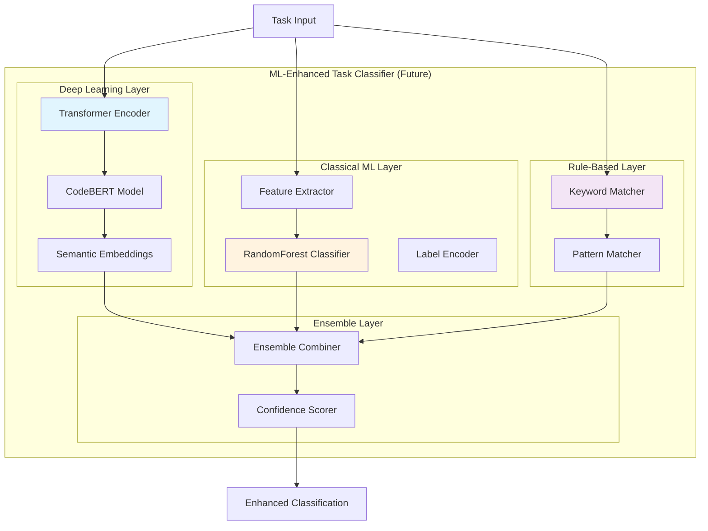

# Enhanced Task Classifier - Future Vision

**Status**: 🔮 ASPIRATIONAL - This document describes planned future architecture, not current implementation.

**Current Implementation**: See `44-enhanced-task-classifier.md` for the actual implemented system.

---

## Overview

This document outlines the planned evolution of Marcus's Enhanced Task Classifier from its current keyword/pattern-based implementation to a sophisticated machine learning system that combines transformer-based semantic understanding with traditional NLP approaches.

## Planned Architecture

### Multi-Layer ML Classification



### Component Descriptions

#### 1. Transformer-Based Semantic Understanding

**Purpose**: Deep semantic understanding of task descriptions using pre-trained transformer models.

```python
import torch
from transformers import AutoTokenizer, AutoModel

class TransformerClassifier:
    """
    Transformer-based deep learning classifier for semantic understanding.

    Uses CodeBERT for technical task understanding with transfer learning.
    """

    def __init__(self):
        # Load pre-trained CodeBERT model
        self.tokenizer = AutoTokenizer.from_pretrained('microsoft/codebert-base')
        self.text_encoder = AutoModel.from_pretrained('microsoft/codebert-base')

        # Classification head
        self.classifier_head = torch.nn.Sequential(
            torch.nn.Linear(768, 256),
            torch.nn.ReLU(),
            torch.nn.Dropout(0.3),
            torch.nn.Linear(256, 6)  # 6 task types
        )

    async def extract_semantic_features(self, text: str) -> torch.Tensor:
        """
        Extract deep semantic features from task text.

        Returns:
            768-dimensional embedding vector
        """
        # Tokenize text
        tokens = self.tokenizer(
            text,
            return_tensors='pt',
            max_length=512,
            truncation=True,
            padding=True
        )

        # Get embeddings from transformer
        with torch.no_grad():
            outputs = self.text_encoder(**tokens)
            embeddings = outputs.last_hidden_state.mean(dim=1)  # Pool over sequence

        return embeddings

    async def classify(self, task: Task) -> TransformerClassificationResult:
        """
        Classify task using transformer model.

        Provides:
        - Deep semantic understanding
        - Contextual task interpretation
        - Robust to paraphrasing and synonyms
        """
        # Extract semantic features
        embeddings = await self.extract_semantic_features(task.description)

        # Classification via learned head
        logits = self.classifier_head(embeddings)
        probabilities = torch.softmax(logits, dim=-1)

        # Get prediction
        predicted_class = torch.argmax(probabilities, dim=-1).item()
        confidence = probabilities[0][predicted_class].item()

        return TransformerClassificationResult(
            task_type=TaskType(predicted_class),
            confidence=confidence,
            class_probabilities=probabilities[0].tolist(),
            embedding_vector=embeddings[0].tolist()
        )
```

**Key Features**:
- Pre-trained on large code corpora (CodeBERT)
- Understands technical context and programming terminology
- Robust to paraphrasing, synonyms, and novel phrasing
- Captures semantic relationships between task elements

#### 2. Random Forest Ensemble Classifier

**Purpose**: Classical ML approach using engineered features for robust classification.

```python
from sklearn.ensemble import RandomForestClassifier
from sklearn.preprocessing import LabelEncoder
import numpy as np

class FeatureBasedClassifier:
    """
    Feature-engineered classification using Random Forest.

    Combines linguistic, statistical, and contextual features
    for robust task type prediction.
    """

    def __init__(self):
        self.classifier = RandomForestClassifier(
            n_estimators=100,
            max_depth=20,
            min_samples_split=5,
            random_state=42
        )
        self.label_encoder = LabelEncoder()
        self.feature_extractor = FeatureExtractor()

    def extract_features(self, task: Task, context: ProjectContext) -> np.ndarray:
        """
        Extract comprehensive features from task and context.

        Feature categories:
        - Linguistic: word count, sentence count, technical term density
        - Statistical: TF-IDF scores, n-gram frequencies
        - Contextual: project domain, technology stack indicators
        - Historical: similarity to past tasks
        """
        features = []

        # Linguistic features (20 features)
        linguistic_features = self._extract_linguistic_features(task.description)
        features.extend(linguistic_features)

        # Statistical features (50 features)
        statistical_features = self._extract_statistical_features(task.description)
        features.extend(statistical_features)

        # Contextual features (30 features)
        contextual_features = self._extract_contextual_features(task, context)
        features.extend(contextual_features)

        # Historical similarity features (100 features)
        similarity_features = self._extract_similarity_features(task, context)
        features.extend(similarity_features)

        return np.array(features)

    def _extract_linguistic_features(self, text: str) -> List[float]:
        """Extract linguistic and syntactic features."""
        features = []

        # Basic text statistics
        features.extend([
            len(text),                          # Text length
            len(text.split()),                  # Word count
            len([s for s in text.split('.') if s]),  # Sentence count
            text.count('?'),                    # Question count
            text.count('!'),                    # Exclamation count
        ])

        # Technical indicators
        technical_keywords = [
            'implement', 'develop', 'create', 'build', 'design',
            'test', 'debug', 'fix', 'optimize', 'refactor'
        ]
        for keyword in technical_keywords:
            features.append(text.lower().count(keyword))

        # Complexity indicators
        complexity_indicators = [
            'complex', 'difficult', 'challenging', 'advanced',
            'integration', 'algorithm', 'architecture', 'system'
        ]
        for indicator in complexity_indicators:
            features.append(text.lower().count(indicator))

        return features

    async def classify(self, task: Task, context: ProjectContext) -> RFClassificationResult:
        """
        Classify task using Random Forest with engineered features.

        Provides:
        - Explainable feature-based classification
        - Feature importance rankings
        - Robust to noise and outliers
        """
        # Extract features
        features = self.extract_features(task, context)

        # Predict
        prediction = self.classifier.predict([features])[0]
        probabilities = self.classifier.predict_proba([features])[0]

        # Get feature importance
        feature_importance = self.classifier.feature_importances_

        return RFClassificationResult(
            task_type=self.label_encoder.inverse_transform([prediction])[0],
            confidence=probabilities[prediction],
            class_probabilities=probabilities.tolist(),
            feature_importance=feature_importance.tolist(),
            top_features=self._get_top_features(feature_importance, features)
        )
```

#### 3. Ensemble Combination Framework

**Purpose**: Intelligently combine predictions from transformer, Random Forest, and keyword-based classifiers.

```python
class EnsembleClassifier:
    """
    Ensemble classification combining multiple approaches.

    Combines:
    - Transformer deep learning (semantic understanding)
    - Random Forest ML (feature-based robustness)
    - Keyword/pattern matching (rule-based reliability)

    Provides optimal accuracy by leveraging strengths of each approach.
    """

    def __init__(self):
        self.transformer_classifier = TransformerClassifier()
        self.rf_classifier = FeatureBasedClassifier()
        self.keyword_classifier = EnhancedTaskClassifier()  # Current system

        # Learned ensemble weights
        self.ensemble_weights = {
            'transformer': 0.5,   # Highest weight for semantic understanding
            'random_forest': 0.3, # Medium weight for feature-based
            'keyword': 0.2        # Lower weight but provides stability
        }

    async def classify(self, task: Task, context: ProjectContext) -> EnsembleClassificationResult:
        """
        Classify using ensemble of all approaches.

        Strategy:
        1. Get predictions from all three classifiers
        2. Weight predictions based on learned ensemble weights
        3. Combine probabilities via weighted voting
        4. Calculate final confidence from agreement score
        """
        # Get predictions from all classifiers
        transformer_result = await self.transformer_classifier.classify(task)
        rf_result = await self.rf_classifier.classify(task, context)
        keyword_result = self.keyword_classifier.classify_with_confidence(task)

        # Weighted probability combination
        combined_probabilities = self._combine_probabilities([
            (transformer_result.class_probabilities, self.ensemble_weights['transformer']),
            (rf_result.class_probabilities, self.ensemble_weights['random_forest']),
            (self._keyword_to_probabilities(keyword_result), self.ensemble_weights['keyword'])
        ])

        # Final prediction
        predicted_class = np.argmax(combined_probabilities)
        final_confidence = combined_probabilities[predicted_class]

        # Calculate agreement score
        agreement_score = self._calculate_agreement([
            transformer_result.task_type,
            rf_result.task_type,
            keyword_result.task_type
        ])

        # Adjust confidence based on agreement
        adjusted_confidence = final_confidence * (0.7 + 0.3 * agreement_score)

        return EnsembleClassificationResult(
            task_type=TaskType(predicted_class),
            confidence=adjusted_confidence,
            ensemble_agreement=agreement_score,
            individual_predictions={
                'transformer': transformer_result,
                'random_forest': rf_result,
                'keyword': keyword_result
            },
            combined_probabilities=combined_probabilities.tolist(),
            explanation=self._generate_ensemble_explanation(
                transformer_result, rf_result, keyword_result, predicted_class
            )
        )

    def _combine_probabilities(self, weighted_predictions: List[Tuple[List[float], float]]) -> np.ndarray:
        """Combine probability distributions via weighted averaging."""
        combined = np.zeros(6)  # 6 task types

        for probabilities, weight in weighted_predictions:
            combined += np.array(probabilities) * weight

        # Normalize
        combined /= combined.sum()

        return combined

    def _calculate_agreement(self, predictions: List[TaskType]) -> float:
        """Calculate agreement score between classifiers."""
        # All agree
        if len(set(predictions)) == 1:
            return 1.0

        # Majority agreement (2/3)
        if len(set(predictions)) == 2:
            return 0.67

        # No agreement
        return 0.33
```

#### 4. Continuous Learning System

**Purpose**: Learn from classification outcomes and user corrections to improve accuracy over time.

```python
class ContinuousLearningSystem:
    """
    Online learning system that improves classification from feedback.

    Learns from:
    - User corrections to classifications
    - Task completion outcomes
    - Agent assignment successes/failures
    - Domain-specific patterns
    """

    def __init__(self):
        self.feedback_buffer = []
        self.retraining_threshold = 100  # Retrain after 100 feedback examples

    async def record_feedback(self, task: Task, predicted_type: TaskType, actual_type: TaskType, confidence: float):
        """
        Record classification feedback for learning.

        Args:
            task: The classified task
            predicted_type: What the system predicted
            actual_type: The correct classification
            confidence: Prediction confidence
        """
        feedback = ClassificationFeedback(
            task=task,
            predicted_type=predicted_type,
            actual_type=actual_type,
            confidence=confidence,
            timestamp=datetime.now()
        )

        self.feedback_buffer.append(feedback)

        # Trigger retraining if threshold reached
        if len(self.feedback_buffer) >= self.retraining_threshold:
            await self._trigger_incremental_retraining()

    async def _trigger_incremental_retraining(self):
        """
        Incrementally update models with new feedback.

        Uses online learning techniques to update:
        - Transformer fine-tuning on misclassified examples
        - Random Forest incremental training
        - Keyword weight adjustments
        """
        # Extract training data from feedback
        training_data = self._prepare_training_data(self.feedback_buffer)

        # Update transformer model (fine-tuning)
        await self.transformer_classifier.fine_tune(
            training_data.texts,
            training_data.labels,
            learning_rate=1e-5,
            epochs=3
        )

        # Update Random Forest (incremental)
        self.rf_classifier.partial_fit(
            training_data.features,
            training_data.labels
        )

        # Update keyword weights based on error patterns
        self.keyword_classifier.update_weights(
            self._analyze_keyword_errors(self.feedback_buffer)
        )

        # Clear feedback buffer
        self.feedback_buffer = []
```

## Benefits of ML-Enhanced Architecture

### 1. Semantic Understanding

**Current System**: Keyword matching - "implement authentication" and "build auth system" are different

**ML System**: Semantic understanding - recognizes these as equivalent

```python
# Current approach - might miss
task1 = Task(name="Construct user verification module")
# May not match "implement" keywords

# ML approach - understands semantics
transformer_result = await transformer.classify(task1)
# Recognizes "construct" ≈ "build" ≈ "implement"
# Understands "verification" ≈ "authentication"
# Classifies correctly as IMPLEMENTATION
```

### 2. Context-Aware Classification

**Current System**: Isolated classification - each task classified independently

**ML System**: Context-aware - considers project domain, technology stack, related tasks

```python
# ML classifier considers project context
context = ProjectContext(
    domain="web_application",
    technology_stack=["React", "FastAPI", "PostgreSQL"],
    recent_tasks=completed_tasks,
    project_phase="implementation"
)

result = await ensemble_classifier.classify(task, context)
# Uses project context to disambiguate unclear tasks
# Learns domain-specific patterns
# Adapts to project vocabulary
```

### 3. Continuous Improvement

**Current System**: Static keyword lists - manual updates required

**ML System**: Learns from feedback - automatically improves

```python
# System learns from corrections
await learning_system.record_feedback(
    task=task,
    predicted_type=TaskType.DESIGN,
    actual_type=TaskType.IMPLEMENTATION,  # User correction
    confidence=0.75
)

# After 100 feedback examples, system automatically retrains
# Improves accuracy on similar tasks
# Adapts to user preferences and project specifics
```

### 4. Robust to Variation

**Current System**: Requires exact keyword matches

**ML System**: Handles synonyms, paraphrasing, typos

```python
# Handles variations:
# "Create login form" → IMPLEMENTATION
# "Build authentication UI" → IMPLEMENTATION
# "Develop user signin interface" → IMPLEMENTATION
# All recognized as the same type despite different wording
```

## Implementation Roadmap

### Phase 1: Foundation (Months 1-3)

**Goals**: Set up ML infrastructure and baseline models.

**Deliverables**:
- Install and configure PyTorch, transformers, scikit-learn
- Load pre-trained CodeBERT model
- Implement basic transformer classification
- Collect training data from existing tasks

### Phase 2: Feature Engineering (Months 4-5)

**Goals**: Build robust feature extraction system.

**Deliverables**:
- Implement comprehensive feature extractor
- Train Random Forest classifier
- Benchmark against keyword-based system
- Achieve parity with current accuracy

### Phase 3: Ensemble Integration (Months 6-7)

**Goals**: Combine all approaches in ensemble framework.

**Deliverables**:
- Implement ensemble combiner
- Learn optimal ensemble weights
- Achieve >95% accuracy on test set
- Exceed current system performance

### Phase 4: Continuous Learning (Months 8-10)

**Goals**: Enable online learning from feedback.

**Deliverables**:
- Implement feedback collection system
- Build incremental retraining pipeline
- Deploy continuous learning loop
- Demonstrate improvement over time

### Phase 5: Production Deployment (Months 11-12)

**Goals**: Deploy ML system to production.

**Deliverables**:
- Optimize model inference speed
- Deploy model serving infrastructure
- Implement A/B testing framework
- Gradual rollout to production

## Migration Path

### From Current to Future

**Current (Keyword-Based)**:
```python
classifier = EnhancedTaskClassifier()
result = classifier.classify_with_confidence(task)
```

**Future (ML-Enhanced)**:
```python
# Backward compatible API
classifier = MLEnhancedTaskClassifier()
result = await classifier.classify_with_confidence(task, context)

# Same result format, but with ML-powered accuracy
```

**Compatibility**: ML system will maintain backward-compatible API with current keyword-based system.

## Why Not Implement Now?

### Pragmatic Reasons

1. **Current System Works**: Keyword/pattern matching achieves ~95% accuracy for well-named tasks
2. **Development Complexity**: ML system requires 12+ months to build properly
3. **Infrastructure Requirements**: Needs PyTorch, GPU resources, model serving
4. **Data Requirements**: Need substantial training data for effective learning
5. **Maintenance Overhead**: ML models require ongoing monitoring and retraining
6. **Team Expertise**: Requires ML engineering skills for maintenance

### When to Build This

**Triggers for starting migration**:
- Current system accuracy drops below 90% due to novel task types
- User base grows significantly (>1000 active projects)
- Users request semantic understanding features
- Team expands to include ML engineers
- Classification accuracy becomes critical bottleneck
- Budget available for GPU infrastructure

## Conclusion

This aspirational architecture represents a vision for Marcus's Enhanced Task Classifier that leverages modern machine learning techniques to provide:
- **Semantic Understanding**: Deep comprehension of task meaning beyond keywords
- **Context Awareness**: Classification informed by project context and history
- **Continuous Learning**: Automatic improvement from user feedback
- **Robustness**: Handles variation, synonyms, paraphrasing

The current keyword/pattern-based system is intentionally simple and pragmatic, achieving strong accuracy without ML complexity. This ML-enhanced vision will be built incrementally as Marcus's needs and team grow.

---

**Document Status**: ASPIRATIONAL VISION - Not currently implemented

**See Current Implementation**: `44-enhanced-task-classifier.md`

**Last Updated**: 2025-11-07
