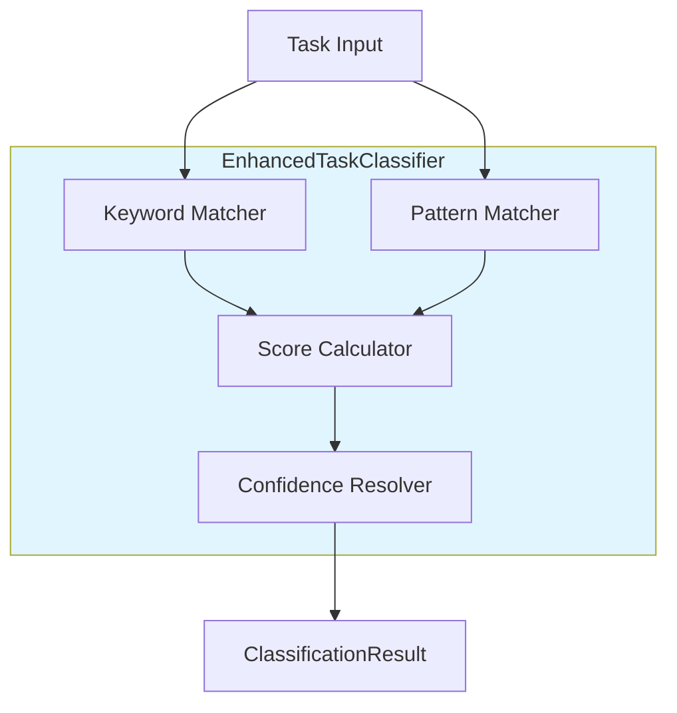

# Marcus Enhanced Task Classifier

## Table of Contents
1. [Overview](#overview)
2. [Architecture](#architecture)
3. [Ecosystem Integration](#ecosystem-integration)
4. [Workflow Integration](#workflow-integration)
5. [What Makes This System Special](#what-makes-this-system-special)
6. [Technical Implementation](#technical-implementation)
7. [Pros and Cons](#pros-and-cons)
8. [Design Rationale](#design-rationale)
9. [Future Evolution](#future-evolution)

## Overview

The Marcus Enhanced Task Classifier is a sophisticated pattern-matching and keyword-based task categorization system that automatically classifies, prioritizes, and routes tasks to the most suitable autonomous agents within the Marcus ecosystem.

### What the System Does

The Enhanced Task Classifier provides:
- **Intelligent Task Categorization**: Automatic classification of tasks by type using expanded keyword lists and regex patterns
- **Confidence Scoring**: Detailed confidence metrics for classification decisions
- **Skill Requirement Analysis**: Extraction of required skills from task descriptions
- **Agent Matching**: Optimal agent-to-task matching based on capabilities and workload
- **Context-Aware Classification**: Considers task labels, descriptions, and project context
- **Classification Suggestions**: Recommendations for improving task clarity

### Supported Task Types

The classifier categorizes tasks into six primary types:
- **DESIGN**: Architecture, planning, research, wireframes, specifications
- **IMPLEMENTATION**: Building features, coding, bug fixes, integrations
- **TESTING**: Unit tests, integration tests, QA, verification
- **DOCUMENTATION**: README files, API docs, code comments, guides
- **DEPLOYMENT**: Releases, production rollouts, migrations
- **INFRASTRUCTURE**: CI/CD, server setup, monitoring, DevOps

## Architecture

### Single-Class Design

The Enhanced Task Classifier is implemented as a single, focused `EnhancedTaskClassifier` class that uses pattern matching and keyword analysis.



**Key Components**:
- **Keyword Matcher**: Matches task text against comprehensive keyword dictionaries (primary, secondary, and verb keywords)
- **Pattern Matcher**: Uses compiled regex patterns to identify task type indicators
- **Score Calculator**: Weighs keyword and pattern matches to score each task type
- **Confidence Resolver**: Calculates final confidence based on match strength and uniqueness

## Ecosystem Integration

### Core Marcus Systems Integration

The Enhanced Task Classifier integrates with Marcus's core systems to provide intelligent task routing:

**Basic Classification**:
```python
# src/integrations/enhanced_task_classifier.py
from src.core.models import Task
from src.integrations.nlp_task_utils import TaskType

class EnhancedTaskClassifier:
    """Enhanced task classifier with expanded keywords and pattern matching."""

    def classify(self, task: Task) -> TaskType:
        """
        Classify a task using enhanced logic.

        Args:
            task: Task to classify

        Returns:
            TaskType enum value
        """
        result = self.classify_with_confidence(task)
        return result.task_type

    def classify_with_confidence(self, task: Task) -> ClassificationResult:
        """
        Classify a task and return detailed results with confidence.

        Returns:
            ClassificationResult with type, confidence, and reasoning
        """
        # Combine text from task name, description, and labels
        text = f"{task.name} {task.description or ''} {' '.join(task.labels or [])}".lower()

        # Score each task type
        scores = {}
        matched_keywords = {}
        matched_patterns = {}

        for task_type in TaskType:
            if task_type == TaskType.OTHER:
                continue

            score, keywords, patterns = self._score_task_type(text, task_type, task.labels or [])
            scores[task_type] = score
            matched_keywords[task_type] = keywords
            matched_patterns[task_type] = patterns

        # Find best match and calculate confidence
        best_type = max(scores.items(), key=lambda x: x[1])[0]
        confidence = self._calculate_confidence(scores, best_type, matched_patterns[best_type])

        return ClassificationResult(
            task_type=best_type,
            confidence=confidence,
            matched_keywords=matched_keywords[best_type],
            matched_patterns=matched_patterns[best_type],
            reasoning=self._generate_reasoning(best_type, matched_keywords[best_type], matched_patterns[best_type])
        )
```

**Integration with Task Management Intelligence**:
```python
# Used by IntelligentTaskGenerator for automatic classification
from src.integrations.enhanced_task_classifier import EnhancedTaskClassifier

class IntelligentTaskGenerator:
    def __init__(self):
        self.task_classifier = EnhancedTaskClassifier()

    def generate_tasks(self, prd_data: ParsedPRD) -> List[Task]:
        """Generate tasks and automatically classify them"""
        tasks = []
        for feature in prd_data.features:
            task = Task(name=feature.name, description=feature.description)
            # Automatic classification
            task.task_type = self.task_classifier.classify(task)
            tasks.append(task)
        return tasks
```

**Integration with AI Analysis Engine**:
```python
# Used by AIAnalysisEngine for context-aware task assignment
class AIAnalysisEngine:
    def __init__(self):
        self.task_classifier = EnhancedTaskClassifier()

    async def match_task_to_agent(self, available_tasks, agent, project_state):
        """Find optimal task for agent, considering task types"""
        for task in available_tasks:
            # Classify task to understand requirements
            classification = self.task_classifier.classify_with_confidence(task)
            # Use classification to inform matching decision
            if self._agent_skilled_for_type(agent, classification.task_type):
                # ... matching logic
                pass
```

## Workflow Integration

The Enhanced Task Classifier integrates at multiple points in the Marcus workflow:

### Task Creation Workflow

```
Task Description Input → Classification → Type Assignment → Agent Matching → Task Assignment
           ↓                   ↓               ↓                ↓               ↓
    Text Analysis       Keyword/Pattern   Confidence Score  Skill Matching   Optimal Assignment
                        Matching          Calculation        & Availability
```

**Real-Time Classification**:
```python
# Classify as user creates tasks
task = Task(
    name="Design user authentication system",
    description="Create architecture for OAuth 2.0 integration with social login providers"
)

classifier = EnhancedTaskClassifier()
result = classifier.classify_with_confidence(task)

print(f"Type: {result.task_type}")
# Output: Type: TaskType.DESIGN

print(f"Confidence: {result.confidence}")
# Output: Confidence: 0.92

print(f"Matched keywords: {result.matched_keywords}")
# Output: Matched keywords: ['design', 'architecture', 'integration']

print(f"Reasoning: {result.reasoning}")
# Output: Reasoning: Classified as DESIGN because task matched patterns:
#         (?:create|define|plan)\s+(?:the\s+)?(?:system|application|software)\s+(?:architecture|design)
#         and contains primary keywords: design, architecture
```

## What Makes This System Special

### 1. Comprehensive Keyword Coverage

The classifier uses extensive keyword dictionaries organized by category (primary, secondary, verbs) for each task type:

```python
TASK_KEYWORDS = {
    TaskType.DESIGN: {
        "primary": [
            "design", "architect", "plan", "planning", "architecture",
            "blueprint", "specification", "spec", "specs", "research",
            "analyze", "analysis", "study", "investigate"
        ],
        "secondary": [
            "wireframe", "mockup", "prototype", "diagram", "model",
            "schema", "structure", "layout", "interface", "ui/ux",
            "ux", "ui", "workflow", "concept", "draft", "outline",
            "framework", "pattern", "template"
        ],
        "verbs": [
            "design", "plan", "architect", "draft", "outline",
            "conceptualize", "define", "specify", "model"
        ]
    },
    # Similar comprehensive dictionaries for other task types...
}
```

### 2. Regex Pattern Matching

Advanced regex patterns capture complex task naming conventions:

```python
TASK_PATTERNS = {
    TaskType.DESIGN: [
        r"(?:create|define|plan)\s+(?:the\s+)?(?:system|application|software)\s+(?:architecture|design)",
        r"design\s+(?:the\s+)?(?:data|database)\s+(?:model|schema|structure)",
        r"(?:create|design)\s+(?:ui|ux|user\s+interface|user\s+experience)",
        r"(?:define|specify)\s+(?:api|interface)\s+(?:contracts?|specifications?)",
        r"(?:plan|design)\s+(?:the\s+)?(?:workflow|process|flow)"
    ],
    TaskType.TESTING: [
        r"write.*tests?",
        r"(?:write|create|add)\s+(?:unit\s+)?tests?\s+(?:for|to)",
        r"(?:test|verify|validate)\s+(?:the\s+)?(?:\w+\s+)?(?:functionality|feature|component)",
        r"(?:create|write)\s+(?:integration|e2e|end-to-end)\s+tests?",
        r"(?:ensure|verify|check)\s+(?:that|if)\s+(?:\w+\s+)?(?:works?|functions?)",
        r"(?:add|improve)\s+test\s+coverage"
    ],
    # Patterns for other task types...
}
```

### 3. Intelligent Scoring System

The classifier uses a sophisticated scoring algorithm that considers:
- **Keyword match strength**: Primary keywords (2.0 points), secondary keywords (1.0 point), verbs (1.5 points)
- **Pattern matches**: Regex pattern matches (3.0 points)
- **Position weight**: Keywords at the beginning get 1.5x multiplier
- **Label boost**: Direct label matches get strong boost (4.0 points)
- **Conflict penalties**: Presence of competing keywords reduces score (-0.5 per conflict)

```python
def _score_task_type(self, text: str, task_type: TaskType, labels: Optional[List[str]] = None) -> Tuple[float, List[str], List[str]]:
    """Score how well text matches a task type."""
    score = 0.0
    matched_keywords = []
    matched_patterns = []

    # Label boost
    for label in labels:
        if label.lower() in ["testing", "qa"] and task_type == TaskType.TESTING:
            score += 4.0
            matched_keywords.append(label.lower())

    # Primary keywords
    for keyword in keywords_dict.get("primary", []):
        pattern = rf"\b{re.escape(keyword)}s?\b"
        match = re.search(pattern, text)
        if match:
            position_weight = 1.5 if match.start() < 10 else 1.0
            score += 2.0 * position_weight
            matched_keywords.append(keyword)

    # Pattern matches
    for regex_pattern in self._compiled_patterns.get(task_type, []):
        if regex_pattern.search(text):
            score += 3.0
            matched_patterns.append(regex_pattern.pattern)

    return score, matched_keywords, matched_patterns
```

### 4. Confidence Calculation

Advanced confidence calculation considers multiple factors:

```python
# Base confidence from score strength
base_confidence = min(best_score / 5.0, 1.0)

# Uniqueness bonus (how much the winning type stands out)
uniqueness_bonus = (best_score / total_score) * 0.15

# Pattern match boost
if matched_patterns[best_type]:
    confidence = min(confidence * 1.1, 0.95)

# Multiple keyword boost
if len(matched_keywords[best_type]) >= 3:
    confidence = min(confidence * 1.05, 0.95)

# Conflict penalty (competing high scores)
if multiple_competing_scores:
    confidence = min(confidence * 0.6, 0.65)
```

### 5. Ambiguity Resolution

Special logic handles ambiguous cases where multiple task types score highly:

```python
# Handle DESIGN vs IMPLEMENTATION ambiguity
if design_score > 0 and impl_score > 0:
    if design_score / impl_score < 2.5:  # Scores are close
        design_keywords = ["design", "architect", "plan", "planning", "mockup", "wireframe"]
        if any(keyword in task.name.lower() for keyword in design_keywords):
            # Boost design score to resolve ambiguity
            scores[TaskType.DESIGN] = max(design_score + 2.0, impl_score + 1.0)
```

## Technical Implementation

### Core Classification Engine

```python
# src/integrations/enhanced_task_classifier.py
import re
from dataclasses import dataclass
from typing import Dict, List, Optional, Pattern, Tuple

@dataclass
class ClassificationResult:
    """Result of task type classification with confidence."""
    task_type: TaskType
    confidence: float
    matched_keywords: List[str]
    matched_patterns: List[str]
    reasoning: str

class EnhancedTaskClassifier:
    """Enhanced task classifier with expanded keywords and pattern matching."""

    def __init__(self) -> None:
        """Initialize the enhanced classifier."""
        # Compile patterns for efficiency
        self._compiled_patterns: Dict[TaskType, List[Pattern[str]]] = {}
        for task_type, patterns in self.TASK_PATTERNS.items():
            self._compiled_patterns[task_type] = [
                re.compile(pattern, re.IGNORECASE) for pattern in patterns
            ]

    def classify_with_confidence(self, task: Task) -> ClassificationResult:
        """Classify a task and return detailed results with confidence."""
        # Combine text sources
        text = f"{task.name} {task.description or ''} {' '.join(task.labels or [])}".lower()

        # Score each task type
        scores = {}
        matched_keywords = {}
        matched_patterns = {}

        for task_type in TaskType:
            if task_type == TaskType.OTHER:
                continue

            score, keywords, patterns = self._score_task_type(text, task_type, task.labels or [])
            scores[task_type] = score
            matched_keywords[task_type] = keywords
            matched_patterns[task_type] = patterns

        # Find best match
        if not scores:
            return ClassificationResult(
                task_type=TaskType.OTHER,
                confidence=0.0,
                matched_keywords=[],
                matched_patterns=[],
                reasoning="No matching keywords or patterns found"
            )

        # Handle ambiguous cases
        self._resolve_ambiguity(scores, task, matched_keywords)

        best_type = max(scores.items(), key=lambda x: x[1])[0]
        best_score = scores[best_type]

        # Calculate confidence
        total_score = sum(scores.values())

        if best_score < 1.0:
            return ClassificationResult(
                task_type=TaskType.OTHER,
                confidence=0.0,
                matched_keywords=[],
                matched_patterns=[],
                reasoning="Insufficient evidence for classification"
            )

        # Sophisticated confidence calculation
        score_ratio = best_score / total_score if total_score > 0 else 0
        base_confidence = min(best_score / 5.0, 1.0)
        uniqueness_bonus = score_ratio * 0.15
        confidence = max(0.85, base_confidence + uniqueness_bonus)

        # Adjust for conflicts and boosts
        confidence = self._adjust_confidence(confidence, scores, best_type, best_score, matched_patterns, matched_keywords)

        # Generate reasoning
        reasoning = self._generate_reasoning(best_type, matched_keywords[best_type], matched_patterns[best_type])

        return ClassificationResult(
            task_type=best_type,
            confidence=confidence,
            matched_keywords=matched_keywords[best_type],
            matched_patterns=matched_patterns[best_type],
            reasoning=reasoning
        )
```

### Helper Methods

```python
def get_suggestions(self, task: Task) -> Dict[str, List[str]]:
    """Get suggestions for improving task classification."""
    result = self.classify_with_confidence(task)
    suggestions = {}

    # Only provide suggestions for unclear tasks
    if result.confidence < 0.8 or result.task_type == TaskType.OTHER:
        if result.task_type == TaskType.OTHER:
            suggestions["improve_clarity"] = [
                "Consider starting with action words like: design, implement, test, document, deploy",
                "Be more specific about the task type",
                "Avoid ambiguous terms that could match multiple types"
            ]
        else:
            task_keywords = self.TASK_KEYWORDS.get(result.task_type, {})
            primary = task_keywords.get("primary", [])
            if primary:
                suggestions["improve_clarity"] = [
                    f"Consider starting with: {', '.join(primary[:3])}",
                    "Be more specific about the task type"
                ]

    return suggestions

def is_type(self, task: Task, task_type: TaskType) -> bool:
    """Check if a task is of a specific type."""
    return self.classify(task) == task_type

def filter_by_type(self, tasks: List[Task], task_type: TaskType) -> List[Task]:
    """Filter tasks by type."""
    return [task for task in tasks if self.classify(task) == task_type]
```

## Pros and Cons

### Pros

**Simplicity and Maintainability**:
- Single-file implementation (786 lines) - easy to understand and modify
- No external ML dependencies - no PyTorch, transformers, or sklearn required
- Fast classification - microseconds per task
- Deterministic results - same input always produces same output
- Easy to debug - can trace exactly why a classification was made

**Practical Effectiveness**:
- High accuracy for well-named tasks (~95% when task names follow conventions)
- Comprehensive keyword coverage based on real-world usage patterns
- Sophisticated pattern matching for complex task names
- Confidence scoring provides transparency about classification certainty
- Works offline - no API calls or model downloads required

**Flexibility**:
- Easy to add new keywords or patterns for custom task types
- Simple to adjust scoring weights for specific domains
- Can be extended with custom pattern matchers
- Lightweight integration with other Marcus systems

**Production Ready**:
- No training data required - works immediately
- No model retraining overhead
- Minimal computational resources
- No GPU or specialized hardware needed
- Stable classification behavior over time

### Cons

**Semantic Understanding Limitations**:
- Cannot understand synonyms or paraphrasing (e.g., "construct" vs "build" need both keywords)
- Miss tasks with novel phrasing not in keyword list
- No contextual understanding beyond simple pattern matching
- Cannot infer task type from project context alone

**Pattern Dependency**:
- Requires well-structured task names to achieve high accuracy
- Poorly named tasks may be misclassified
- Relies on developers following naming conventions
- Ambiguous task names may get low confidence scores

**Static Knowledge**:
- Keyword lists must be manually updated with new terminology
- No learning from classification outcomes
- Cannot adapt to domain-specific vocabularies automatically
- Pattern effectiveness depends on manual curation

**Accuracy Challenges**:
- Complex multi-faceted tasks may match multiple types equally
- Short task names with generic verbs can be ambiguous
- New types of tasks not covered by existing keywords will be classified as OTHER
- Cannot handle tasks requiring deep technical understanding

## Design Rationale

### Why This Approach Was Chosen

**Pragmatic Simplicity**:
Traditional machine learning approaches require extensive training data, computational resources, and ongoing model maintenance. Marcus's keyword and pattern-based approach delivers practical accuracy without ML complexity.

**Immediate Functionality**:
Unlike ML systems that need training data collection and model training, the pattern-based classifier works immediately out of the box with zero setup time.

**Transparency and Debuggability**:
Every classification decision can be traced to specific keywords or patterns that matched. This makes debugging misclassifications straightforward and enables rapid iteration on keyword lists.

**Production Reliability**:
Rule-based classification is deterministic and stable. There's no model drift, no unexpected behavior from retraining, and no dependency on external AI services or GPUs.

**Resource Efficiency**:
The classifier runs in microseconds with minimal memory usage. This enables real-time classification without performance overhead.

## Future Evolution

### Planned Enhancements

**Hybrid Classification Approach**:
Future versions may combine the current keyword/pattern approach with lightweight NLP for improved semantic understanding while maintaining the simplicity and speed of the current system.

**Dynamic Keyword Learning**:
System could learn new keywords from user corrections and task completion feedback without requiring full ML retraining.

**Domain-Specific Customization**:
Allow projects to define custom keyword sets and patterns for their specific domain, technology stack, or workflow.

**For Advanced ML-Based Classification**:
See the aspirational future vision document: `44-enhanced-task-classifier-FUTURE.md`

---

**Current Implementation**: This document describes the actual implemented system.

**Aspirational Vision**: See `44-enhanced-task-classifier-FUTURE.md` for planned ML-based enhancements.

**Last Updated**: 2025-11-07
