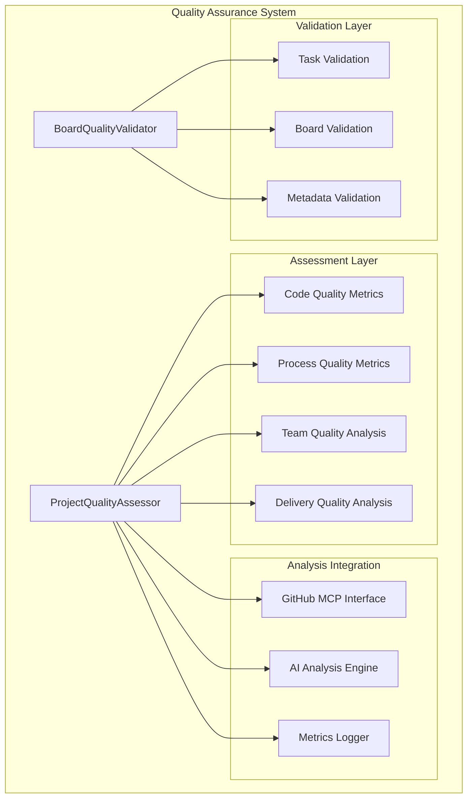
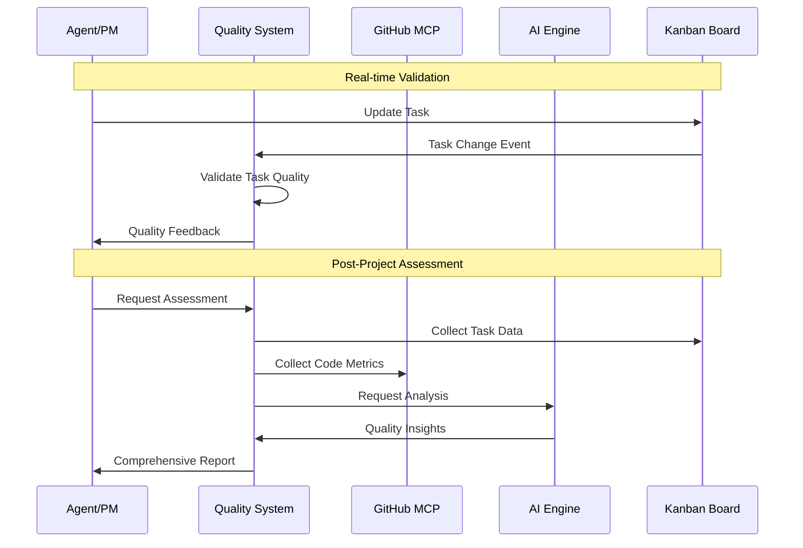
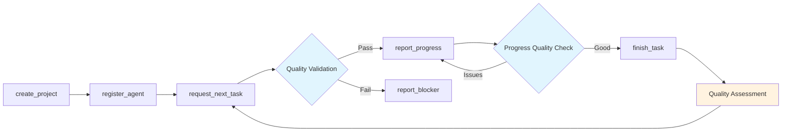

# System 18: Quality Assurance

## Overview

The Quality Assurance system is Marcus's comprehensive quality evaluation framework that provides multi-dimensional assessment of both in-progress and completed projects. It consists of two primary components: **BoardQualityValidator** for real-time task and board validation, and **ProjectQualityAssessor** for holistic post-project analysis.

This system serves as Marcus's "quality consciousness" - ensuring that autonomous agents not only complete tasks but do so to high standards while providing actionable feedback for continuous improvement.

## Architecture

### Core Components



### Data Flow Architecture



## Marcus Ecosystem Integration

### Position in the Workflow

The Quality Assurance system operates at multiple points in the Marcus lifecycle:

1. **Pre-Assignment Validation**: Validates task quality before assignment
2. **Real-time Monitoring**: Continuous validation during agent work
3. **Progress Checkpoints**: Quality gates at milestone reports
4. **Post-Completion Assessment**: Comprehensive project evaluation

### Integration Points

- **Task Management System**: Validates task metadata and structure
- **Agent Coordination**: Provides quality feedback to agents
- **Project Management**: Influences task prioritization and assignment
- **Learning Systems**: Feeds quality patterns into organizational learning
- **Monitoring Systems**: Triggers alerts for quality degradation
- **GitHub Integration**: Correlates code quality with task completion

## Typical Workflow Integration



### Quality Gates

1. **Task Assignment Gate**: BoardQualityValidator checks task completeness
2. **Progress Gates**: Quality checks at 25%, 50%, 75% completion
3. **Completion Gate**: Final validation before task marking as done
4. **Project Gate**: Comprehensive assessment post-completion

## System Specialties

### 1. Multi-Dimensional Quality Model

The system evaluates quality across four dimensions:

```python
# Weighted quality calculation
overall_score = (
    code_quality_score * 0.30      # Code metrics from GitHub
    + process_quality_score * 0.20  # Development process
    + delivery_quality_score * 0.30 # Timeline and completion
    + team_quality_score * 0.20     # Collaboration metrics
)
```

### 2. Adaptive Validation Rules

Quality standards adapt based on project characteristics:

- **Project Size**: Smaller projects have relaxed documentation requirements
- **Team Experience**: Stricter validation for junior teams
- **Project Type**: Different standards for research vs. production projects
- **Timeline**: Emergency projects get focused quality checks

### 3. Predictive Quality Intelligence

Uses historical patterns to predict quality issues:

- **Risk Assessment**: Early warning for quality degradation
- **Pattern Recognition**: Identifies recurring quality anti-patterns
- **Trend Analysis**: Tracks quality improvement over time

## Technical Implementation

### BoardQualityValidator

```python
class BoardQualityValidator:
    """Real-time board and task quality validation"""

    # Quality thresholds
    MIN_DESCRIPTION_LENGTH = 50
    MIN_LABELS_PER_TASK = 2
    REQUIRED_LABEL_CATEGORIES = ["phase", "component", "type"]

    # Scoring weights
    WEIGHTS = {
        "descriptions": 0.25,
        "labels": 0.20,
        "estimates": 0.25,
        "priorities": 0.15,
        "dependencies": 0.15
    }
```

#### Validation Hierarchy

1. **Task-Level Validation**:
   - Description completeness and quality
   - Label coverage and categorization
   - Time estimates and reasonableness
   - Priority assignment
   - Dependency mapping

2. **Board-Level Validation**:
   - Overall completion coverage
   - Workload distribution
   - Phase organization
   - Risk assessment

3. **Metadata Validation**:
   - Acceptance criteria presence
   - Label taxonomy compliance
   - Estimate calibration

### ProjectQualityAssessor

```python
class ProjectQualityAssessor:
    """Comprehensive post-project quality assessment"""

    async def assess_project_quality(
        self,
        project_state: ProjectState,
        tasks: List[Task],
        team_members: List[WorkerStatus],
        github_config: Optional[Dict[str, str]] = None,
    ) -> ProjectQualityAssessment:
```

#### Assessment Components

1. **Code Quality Metrics** (from GitHub):
   - Test coverage percentage
   - Code review coverage
   - Documentation density
   - Commit frequency patterns
   - Technical debt indicators

2. **Process Quality Metrics**:
   - PR approval rates
   - Review turnaround times
   - CI/CD success rates
   - Issue resolution velocity
   - Deployment frequency

3. **Team Quality Analysis**:
   - Workload balance across team
   - Skill diversity utilization
   - Collaboration indicators
   - Individual performance patterns

4. **Delivery Quality Assessment**:
   - On-time completion rates
   - Scope change management
   - Risk mitigation effectiveness
   - Velocity trend analysis

## Quality Scoring System

### Score Calculation

```python
def _determine_quality_level(self, score: float) -> QualityLevel:
    """Map numeric scores to quality levels"""
    if score >= 0.8:
        return QualityLevel.EXCELLENT
    elif score >= 0.6:
        return QualityLevel.GOOD
    elif score >= 0.3:
        return QualityLevel.BASIC
    else:
        return QualityLevel.POOR
```

### Quality Levels

- **EXCELLENT (0.8-1.0)**: Exemplary quality, suitable for production
- **GOOD (0.6-0.8)**: High quality with minor improvements needed
- **BASIC (0.3-0.6)**: Acceptable quality, some areas need attention
- **POOR (0.0-0.3)**: Significant quality issues requiring remediation

## Simple vs Complex Task Handling

### Simple Tasks (< 4 hours, single skill)

```python
# Relaxed validation for simple tasks
simplified_validation = {
    "min_description_length": 25,  # Reduced from 50
    "required_labels": 1,          # Reduced from 2
    "acceptance_criteria": False   # Not required
}
```

**Characteristics**:
- Streamlined validation process
- Focus on essential metadata only
- Faster quality feedback loop
- Emphasis on completion over documentation

### Complex Tasks (> 8 hours, multiple skills)

```python
# Enhanced validation for complex tasks
enhanced_validation = {
    "min_description_length": 100,
    "required_labels": 3,
    "acceptance_criteria": True,
    "dependency_mapping": True,
    "risk_assessment": True
}
```

**Characteristics**:
- Comprehensive validation requirements
- Multi-checkpoint quality reviews
- Detailed documentation expectations
- Cross-team collaboration metrics

## Pros and Cons

### Advantages

1. **Comprehensive Coverage**: Multi-dimensional quality assessment
2. **Real-time Feedback**: Immediate quality validation during work
3. **Predictive Capabilities**: Early warning for quality issues
4. **Integration Depth**: Leverages GitHub, AI, and task data
5. **Adaptive Standards**: Quality requirements adapt to context
6. **Actionable Insights**: Specific improvement recommendations
7. **Historical Learning**: Builds organizational quality intelligence

### Limitations

1. **Complexity Overhead**: Can slow down simple task workflows
2. **Tool Dependencies**: Requires GitHub and AI integrations for full value
3. **Subjective Metrics**: Some quality aspects resist quantification
4. **Learning Curve**: Teams need training on quality standards
5. **Resource Intensive**: Comprehensive assessments require computation
6. **False Positives**: May flag acceptable shortcuts as quality issues

## Design Rationale

### Why This Approach

1. **Quality as a First-Class Concern**: Makes quality visible and measurable
2. **Continuous Improvement**: Provides data for systematic improvement
3. **Autonomous Agent Support**: Gives AI agents quality guidance
4. **Stakeholder Confidence**: Provides quality assurance for production use
5. **Pattern Recognition**: Learns from quality successes and failures

### Alternative Approaches Considered

1. **Checklist-Only Validation**: Too rigid, doesn't adapt to context
2. **Post-Hoc Assessment Only**: Misses real-time correction opportunities
3. **Manual Quality Reviews**: Doesn't scale with autonomous agents
4. **Code-Only Quality**: Ignores process and team dynamics

## Future Evolution

### Near-term Enhancements (3-6 months)

1. **Machine Learning Quality Models**: Learn quality patterns from successful projects
2. **Custom Quality Profiles**: Organization-specific quality standards
3. **Real-time Quality Dashboards**: Live quality monitoring for projects
4. **Quality-Based Agent Assignment**: Route tasks based on quality requirements

### Medium-term Vision (6-12 months)

1. **Predictive Quality Analytics**: Forecast quality issues before they occur
2. **Quality-Driven Resource Allocation**: Adjust team assignments based on quality needs
3. **Industry-Specific Quality Models**: Tailored standards for different domains
4. **Quality ROI Analysis**: Correlate quality investments with project outcomes

### Long-term Aspirations (12+ months)

1. **Self-Improving Quality Standards**: System learns and evolves quality criteria
2. **Quality-Aware AI Agents**: Agents internalize quality patterns
3. **Cross-Project Quality Learning**: Share quality insights across projects
4. **Quality Ecosystem Integration**: Interface with external quality tools

## Board-Specific Considerations

### Kanban Board Quality

The system validates Kanban board organization:

- **Column Structure**: Ensures standard workflow columns exist
- **WIP Limits**: Validates work-in-progress constraints
- **Card Distribution**: Checks for balanced workload distribution
- **Dependency Visualization**: Ensures blocking relationships are clear

### Board Health Metrics

```python
board_metrics = {
    "total_tasks": len(tasks),
    "description_coverage": tasks_with_descriptions / total,
    "label_coverage": tasks_with_labels / total,
    "estimate_coverage": tasks_with_estimates / total,
    "dependency_coverage": tasks_with_dependencies / total,
    "phase_distribution": get_phase_distribution(tasks)
}
```

## Error Handling and Resilience

### Graceful Degradation

The system continues operating even when components fail:

```python
try:
    github_data = await self._collect_github_data(config)
    code_metrics = await self._analyze_code_quality(github_data)
except Exception as e:
    # Continue without GitHub data
    logger.warning(f"GitHub analysis failed: {e}")
    code_metrics = CodeQualityMetrics()  # Default values
```

### Fallback Strategies

1. **GitHub API Failure**: Use task-only quality metrics
2. **AI Engine Unavailable**: Generate rule-based insights
3. **Incomplete Data**: Provide partial assessments with confidence levels
4. **Performance Issues**: Sample large datasets rather than fail

## Performance Characteristics

- **Validation Latency**: < 100ms for task validation
- **Assessment Time**: 2-5 seconds for full project assessment
- **Memory Usage**: ~1MB per 1000 tasks
- **API Dependencies**: GitHub (optional), AI Engine (optional)
- **Caching Strategy**: 15-minute cache for external data

## Integration with Marcus Tools

The Quality Assurance system integrates with Marcus MCP tools:

- `mcp__marcus__get_project_status`: Includes quality metrics
- `mcp__marcus__report_task_progress`: Triggers quality validation
- `mcp__marcus__request_next_task`: Considers quality requirements
- `mcp__marcus__log_decision`: Records quality-related decisions

This system represents Marcus's commitment to not just task completion, but excellence in execution - ensuring that autonomous agents deliver work that meets professional standards while continuously improving their approach based on quality feedback.
