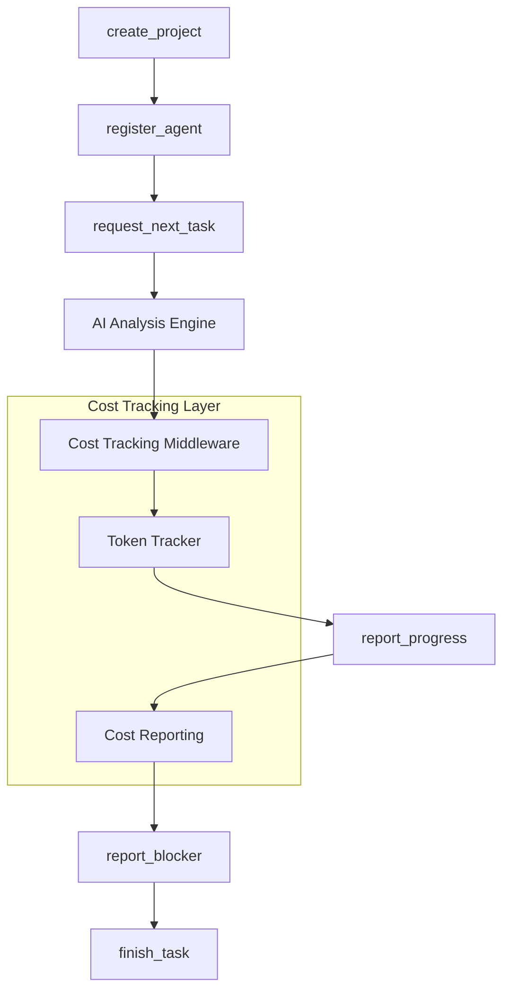

# Cost Tracking System

## Overview

The Cost Tracking system provides real-time monitoring and analysis of AI token consumption and costs across Marcus projects. It tracks actual usage patterns rather than relying on naive time-based estimates, enabling precise cost attribution and intelligent resource management.

## Architecture

### Core Components

```
┌─────────────────┐    ┌──────────────────┐    ┌─────────────────┐
│   TokenTracker  │    │ AIUsageMiddleware│    │  AI Providers   │
│                 │◄───┤                  │◄───┤ (Anthropic,     │
│ - Per-project   │    │ - Method wrapping│    │  OpenAI, etc.)  │
│   tracking      │    │ - Context mgmt   │    │                 │
│ - Rate calc     │    │ - Auto-tracking  │    │                 │
│ - Cost proj     │    │                  │    │                 │
└─────────────────┘    └──────────────────┘    └─────────────────┘
         │                       │
         │                       │
         ▼                       ▼
┌─────────────────┐    ┌──────────────────┐
│  data/token_    │    │ Conversation     │
│  usage.json     │    │ Logger           │
│                 │    │                  │
│ - Historical    │    │ - Usage alerts   │
│   persistence   │    │ - Cost tracking  │
└─────────────────┘    └──────────────────┘
```

### Data Flow

1. **AI Call Interception**: Middleware wraps all AI provider methods
2. **Context Resolution**: Determines project/agent context for attribution
3. **Token Extraction**: Parses API responses for usage data
4. **Real-time Tracking**: Updates counters and rate calculations
5. **Cost Calculation**: Applies pricing models for cost estimation
6. **Persistence**: Stores historical data for trend analysis
7. **Monitoring**: Alerts on usage anomalies and cost spikes

## Integration with Marcus Ecosystem

### Project Lifecycle Integration

The cost tracking system integrates at multiple points in the Marcus workflow:



### Service Dependencies

- **AI Analysis Engine**: Primary integration point for tracking AI usage
- **MCP Server**: Imports cost tracking for agent context management
- **Conversation Logger**: Receives cost alerts and usage notifications
- **Project Registry**: Provides project context for attribution
- **Memory System**: Could leverage usage patterns for optimization

## When Cost Tracking is Invoked

### Automatic Triggers

1. **Agent Registration**: Sets up project context for new agents
2. **AI Provider Calls**: Every call to wrapped AI methods triggers tracking
3. **Task Assignment**: Context switches update project attribution
4. **Progress Reporting**: Cost metrics included in progress updates
5. **Background Monitoring**: Continuous rate calculation and anomaly detection

### Manual Triggers

1. **Context Manager Usage**: Explicit project token tracking scopes
2. **Direct TokenTracker Calls**: Manual token logging for custom scenarios
3. **Stats Queries**: On-demand cost and usage reporting

## What Makes This System Special

### Real-time Rate Calculation

Unlike traditional hourly billing, the system calculates:
- **Current Spend Rate**: Tokens/hour over last 5 minutes
- **Average Spend Rate**: Session-wide usage patterns
- **Sliding Window Analysis**: Recent vs. historical usage trends

### Intelligent Cost Projection

```python
# Example projection logic
def _project_total_cost(self, project_id: str, current_rate: float) -> float:
    current_cost = self.project_costs[project_id]
    # Assumes 20% completion at current progress
    return current_cost * 5  # Placeholder - could integrate task completion %
```

### Anomaly Detection

- **Spend Spike Alerts**: Detects usage > 2x average and > 10k tokens/hour
- **Background Monitoring**: Continuous rate tracking with 1-minute intervals
- **Historical Pattern Analysis**: Maintains 1000-event history per project

### Context-Aware Attribution

```python
# Automatic context resolution
agent_id = kwargs.get('agent_id') or getattr(args[0], 'agent_id', None)
project_id = self.get_current_project(agent_id)
if not project_id:
    project_id = kwargs.get('project_id') or 'unassigned'
```

## Technical Implementation Details

### TokenTracker Class

**Core Data Structures:**
```python
self.project_tokens: Dict[str, int] = defaultdict(int)           # Total tokens per project
self.project_costs: Dict[str, float] = defaultdict(float)        # Total costs per project
self.token_history: Dict[str, deque] = defaultdict(             # Sliding window history
    lambda: deque(maxlen=1000)
)
self.session_start_times: Dict[str, datetime] = {}              # Session tracking
self.spend_rates: Dict[str, List[float]] = defaultdict(list)    # Rate history
```

**Key Algorithms:**

1. **Current Rate Calculation** (5-minute sliding window):
```python
def _calculate_current_spend_rate(self, project_id: str) -> float:
    cutoff = datetime.now() - timedelta(minutes=5)
    recent_events = [e for e in history if e['timestamp'] > cutoff]
    if len(recent_events) < 2:
        recent_events = history[-10:]  # Fallback to last 10 events

    time_span = (recent_events[-1]['timestamp'] - recent_events[0]['timestamp']).total_seconds()
    total_tokens = sum(e['tokens'] for e in recent_events)
    return (total_tokens / time_span) * 3600  # tokens/hour
```

2. **Background Monitoring**:
```python
async def _monitor_rates(self):
    while True:
        await asyncio.sleep(60)  # Check every minute
        for project_id in self.project_tokens:
            current_rate = self.get_project_stats(project_id)['current_spend_rate']
            if current_rate > avg_rate * 2 and current_rate > 10000:
                print(f"⚠️ Token spend spike for {project_id}: {current_rate:.0f} tokens/hour")
```

### AIUsageMiddleware Class

**Method Wrapping Strategy:**
```python
ai_methods = [
    'analyze', 'complete', 'chat', 'generate', 'call_model',
    'generate_task_instructions', 'analyze_blocker', 'generate_response',
    'classify', 'embed', 'summarize'
]
```

**Decorator Implementation:**
```python
@functools.wraps(func)
async def wrapper(*args, **kwargs):
    # Context resolution
    agent_id = kwargs.get('agent_id') or getattr(args[0], 'agent_id', None)
    project_id = self.get_current_project(agent_id)

    # Function execution with timing
    start_time = datetime.now()
    result = await func(*args, **kwargs)
    end_time = datetime.now()

    # Token extraction and tracking
    usage = result.get('usage', {})
    await self.token_tracker.track_tokens(
        project_id=project_id,
        input_tokens=usage.get('input_tokens', 0),
        output_tokens=usage.get('output_tokens', 0),
        metadata={'agent_id': agent_id, 'duration_ms': duration}
    )
```

### Context Management

**Project Context Tracking:**
```python
def set_project_context(self, agent_id: str, project_id: str, task_id: Optional[str] = None):
    self.current_project_context[agent_id] = {
        'project_id': project_id,
        'task_id': task_id,
        'start_time': datetime.now()
    }
```

**Context Manager for Explicit Scoping:**
```python
with track_project_tokens("project_123", "agent_1"):
    # All AI calls tracked to project_123
    await ai_engine.analyze(...)
```

## Pros and Cons

### Advantages

1. **Precise Attribution**: Tracks costs to specific projects/agents/tasks
2. **Real-time Monitoring**: Immediate feedback on usage patterns
3. **Anomaly Detection**: Prevents runaway costs through alerts
4. **Historical Analysis**: Enables cost trend analysis and optimization
5. **Transparent Middleware**: Zero-impact integration with existing code
6. **Flexible Context**: Supports both automatic and manual context management
7. **Persistent Storage**: Survives restarts with historical data preservation

### Limitations

1. **Projection Accuracy**: Cost projections use simple heuristics (5x multiplier)
2. **Limited Provider Support**: Assumes specific API response formats
3. **Memory Usage**: Maintains in-memory deques for recent history (1000 events)
4. **Context Dependency**: Requires proper agent/project context setup
5. **Single Pricing Model**: Fixed cost per 1k tokens across all models
6. **No Budget Enforcement**: Tracks but doesn't prevent overspending

### Technical Debt

1. **Hardcoded Constants**: 5-minute windows, 1000-event limits, rate thresholds
2. **Simple Projection**: Should integrate with actual task completion percentages
3. **Provider Coupling**: Method names hardcoded for specific AI providers
4. **Error Handling**: Limited graceful degradation on tracking failures
5. **Concurrency**: No explicit thread safety for rate calculations

## Why This Approach Was Chosen

### Design Philosophy

1. **Non-intrusive**: Middleware pattern ensures existing code remains unchanged
2. **Real-time**: Immediate feedback enables proactive cost management
3. **Granular**: Project/agent/task level attribution for precise accountability
4. **Extensible**: Decorator pattern allows easy addition of new AI providers
5. **Persistent**: Historical data enables trend analysis and optimization

### Alternative Approaches Considered

1. **Billing Integration**: Direct integration with provider billing APIs
   - **Rejected**: Lag time and lack of real-time feedback
2. **Manual Logging**: Explicit tracking calls throughout codebase
   - **Rejected**: High maintenance burden and error-prone
3. **Proxy Server**: Network-level interception of API calls
   - **Rejected**: Complex setup and limited context awareness
4. **Time-based Estimation**: Hourly rates based on agent activity
   - **Rejected**: Inaccurate and doesn't reflect actual AI usage

## Future Evolution

### Short-term Enhancements

1. **Dynamic Pricing**: Support multiple models with different costs
2. **Budget Enforcement**: Hard limits with graceful degradation
3. **Enhanced Projections**: Integration with task completion tracking
4. **Dashboard Integration**: Real-time cost visualization
5. **Export Capabilities**: CSV/JSON exports for external analysis

### Medium-term Features

1. **Cost Optimization**: AI usage pattern analysis and recommendations
2. **Provider Switching**: Automatic routing based on cost/performance
3. **Resource Allocation**: Dynamic agent assignment based on budget
4. **Predictive Analytics**: ML-based cost forecasting
5. **Integration APIs**: External billing system integration

### Long-term Vision

1. **Multi-tenant Support**: Isolated cost tracking per client/organization
2. **Carbon Footprint**: Environmental impact tracking alongside costs
3. **Performance Correlation**: Cost vs. quality analysis
4. **Automated Optimization**: Self-tuning cost management
5. **Advanced Analytics**: Cost attribution to business outcomes

## Handling Simple vs Complex Tasks

### Task Complexity Detection

Currently, the system tracks all AI usage uniformly, but could be enhanced to differentiate:

```python
# Future enhancement example
def classify_task_complexity(metadata: Dict) -> str:
    token_count = metadata.get('total_tokens', 0)
    if token_count < 1000:
        return 'simple'
    elif token_count < 5000:
        return 'medium'
    else:
        return 'complex'
```

### Differential Cost Management

1. **Simple Tasks** (< 1k tokens):
   - Basic tracking only
   - Minimal rate monitoring
   - Batch processing for efficiency

2. **Complex Tasks** (> 5k tokens):
   - Enhanced monitoring
   - Real-time rate alerts
   - Detailed attribution tracking
   - Performance correlation analysis

## Board-specific Considerations

### Kanban Integration

The cost tracking system considers board-specific factors:

1. **Project Size**: MVP vs. Large projects have different cost profiles
2. **Board Complexity**: Number of lanes affects AI analysis frequency
3. **Agent Density**: More agents = more context switching overhead
4. **Task Dependencies**: Complex dependency graphs require more AI analysis

### Board-aware Cost Attribution

```python
# Future enhancement
def get_board_cost_factors(board_config: Dict) -> Dict:
    return {
        'complexity_multiplier': 1.0 + (board_config.get('lanes', 3) - 3) * 0.1,
        'agent_overhead': board_config.get('max_agents', 5) * 0.05,
        'dependency_factor': 1.0 + board_config.get('dependency_depth', 1) * 0.2
    }
```

## Integration with Seneca

### Current State

The cost tracking system is designed to be Seneca-agnostic, but could integrate for:

1. **Cost Attribution**: Track costs per Seneca reasoning session
2. **Model Selection**: Route to different models based on cost constraints
3. **Quality Correlation**: Analyze cost vs. reasoning quality trade-offs

### Future Seneca Integration

```python
# Potential Seneca integration
class SenecaCostTracker:
    def track_reasoning_session(self, session_id: str, steps: List[Dict]):
        total_tokens = sum(step.get('tokens', 0) for step in steps)
        reasoning_depth = len(steps)
        # Track correlation between depth and cost
```

## Position in Marcus Workflow

### Typical Scenario Flow

```
1. create_project
   ├── Initialize cost tracking context
   └── Set up project cost buckets

2. register_agent
   ├── Create agent cost context
   └── Begin session tracking

3. request_next_task
   ├── AI analysis for task assignment
   ├── Cost tracking middleware intercepts
   └── Update current spend rates

4. report_progress
   ├── Include cost metrics in progress
   ├── Check for spending anomalies
   └── Update cost projections

5. report_blocker
   ├── AI analysis for blocker resolution
   ├── Track additional analysis costs
   └── Cost-aware solution ranking

6. finish_task
   ├── Final cost attribution
   ├── Session cost summary
   └── Update historical patterns
```

### Critical Integration Points

1. **Agent Registration**: Establishes cost attribution context
2. **Task Assignment**: Major AI analysis point requiring cost tracking
3. **Progress Updates**: Opportunity for cost reporting and alerts
4. **Blocker Analysis**: High-cost AI operation requiring monitoring
5. **Project Completion**: Final cost accounting and pattern analysis

### Cost Visibility

At each stage, the system provides:
- **Real-time rates**: Current tokens/hour consumption
- **Total costs**: Accumulated project expenses
- **Projections**: Estimated final costs at current burn rate
- **Alerts**: Anomaly detection for unusual spending patterns
- **Attribution**: Detailed breakdown by agent, task, and operation type

The cost tracking system serves as a critical observability layer, ensuring that Marcus operates within budgetary constraints while providing the intelligence needed for effective project management.
