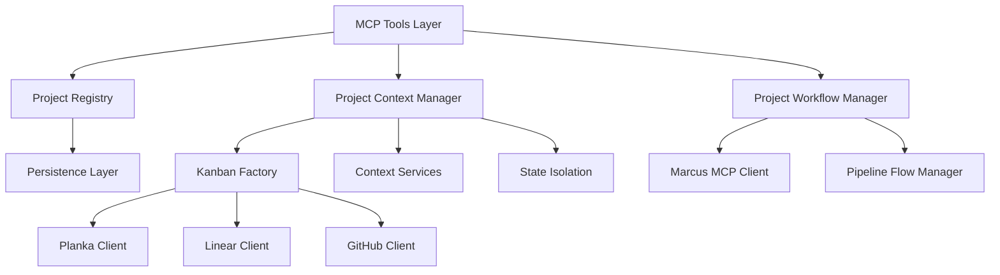
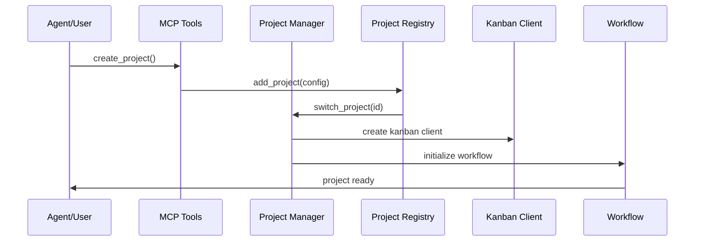

# 16. Project Management System

## Overview

The Project Management system is Marcus's multi-project orchestration layer that provides comprehensive project lifecycle management from creation to execution. It acts as the central coordination hub that manages project configurations, context switching, resource isolation, and workflow execution across multiple provider backends (Planka, Linear, GitHub Projects).

## Architecture

### Core Components

The system consists of three primary architectural layers:

1. **Project Registry** (`src/core/project_registry.py`) - Configuration and persistence layer
2. **Project Context Manager** (`src/core/project_context_manager.py`) - Runtime state and resource management
3. **Project Workflow Manager** (`src/workflow/project_workflow.py`) - Execution orchestration layer



### Data Flow Architecture



## Position in Marcus Ecosystem

The Project Management system serves as the **primary orchestration layer** between user intent and execution infrastructure. It sits at the intersection of:

- **User Interface Layer** (MCP tools)
- **Backend Providers** (Kanban integrations)
- **Execution Engine** (Agent task assignment)
- **State Management** (Context and persistence)

### Integration Points

1. **Upward Integration**: Exposes MCP tools for Claude agents
2. **Downward Integration**: Manages provider-specific kanban clients
3. **Lateral Integration**: Coordinates with visualization, logging, and monitoring systems
4. **Temporal Integration**: Maintains state continuity across sessions

## Workflow Integration

The Project Management system is invoked at these key points in the Marcus workflow:

### Primary Workflow Sequence

```
1. create_project (NLP Tool) → Project Registry + Context Manager
2. register_agent (Agent Tool) → Uses active project context
3. request_next_task (Task Tool) → Queries active project's kanban board
4. report_progress (Task Tool) → Updates active project's task state
5. report_blocker (Task Tool) → Records blockers in active project context
6. finish_task (Task Tool) → Marks completion in active project
```

### Multi-Project Workflow

```
1. list_projects → Shows available projects
2. switch_project → Changes active context
3. [Normal workflow continues in new project context]
4. get_current_project → Confirms active project
```

## What Makes This System Special

### 1. **Provider Abstraction**
The system provides a unified interface across heterogeneous kanban providers:
- **Planka**: Self-hosted, full control
- **Linear**: Issue tracking with automation
- **GitHub Projects**: Git-integrated project management

### 2. **Context Isolation**
Each project maintains completely isolated state:
- Separate kanban connections
- Independent event histories
- Isolated assignment persistence
- Project-specific configurations

### 3. **Resource Management**
Intelligent resource lifecycle management:
- LRU cache for project contexts (max 10 projects)
- Automatic cleanup of idle projects (30-minute timeout)
- Connection pooling and reuse
- Background maintenance tasks

### 4. **State Continuity**
Maintains state across sessions:
- Persistent project configurations
- Saved context state
- Active project tracking
- Assignment history preservation

## Technical Implementation Details

### Project Registry Implementation

```python
@dataclass
class ProjectConfig:
    id: str
    name: str
    provider: str  # 'planka', 'linear', 'github'
    provider_config: Dict[str, Any]
    created_at: datetime
    last_used: datetime
    tags: List[str]
```

**Key Features:**
- **CRUD Operations**: Full lifecycle management
- **Filtering**: By tags, provider, usage patterns
- **Persistence**: JSON serialization with datetime handling
- **Migration**: Legacy configuration import support

### Context Manager Implementation

```python
class ProjectContext:
    kanban_client: Optional[KanbanInterface]
    context: Optional[Context]
    events: Optional[Events]
    project_state: Optional[ProjectState]
    assignment_persistence: Optional[AssignmentPersistence]
    last_accessed: datetime
    is_connected: bool
```

**Key Features:**
- **Service Composition**: Each project gets isolated service instances
- **Connection Management**: Automatic connect/disconnect lifecycle
- **LRU Caching**: OrderedDict-based cache with size limits
- **Background Cleanup**: Async cleanup loop for idle projects

### Workflow Manager Implementation

**Key Features:**
- **Auto-Assignment**: Continuous task distribution to available agents
- **Progress Monitoring**: Real-time workflow metrics collection
- **Event Integration**: Pipeline flow visualization support
- **Resource Constraints**: Configurable agent limits and resource controls

## Provider Configuration Patterns

### Planka Configuration
```python
provider_config = {
    "project_id": "uuid",
    "board_id": "uuid"
}
```

### GitHub Configuration
```python
provider_config = {
    "owner": "username",
    "repo": "repository",
    "project_number": 1
}
```

### Linear Configuration
```python
provider_config = {
    "team_id": "team_uuid",
    "project_id": "project_uuid"
}
```

## Pros and Cons

### Advantages

1. **Multi-Provider Support**: Single interface for multiple backends
2. **Resource Efficiency**: Intelligent caching and cleanup
3. **State Isolation**: Complete project separation
4. **Scalability**: Supports unlimited projects with bounded resource usage
5. **Persistence**: Survives restarts and maintains continuity
6. **Legacy Support**: Migration from single-project configurations

### Disadvantages

1. **Complexity**: Multi-layered architecture increases cognitive overhead
2. **Memory Usage**: Caching multiple contexts consumes memory
3. **Provider Coupling**: Still dependent on specific provider implementations
4. **Debugging Difficulty**: State distributed across multiple components
5. **Configuration Burden**: Requires provider-specific setup knowledge

## Design Rationale

### Why This Approach Was Chosen

1. **Scalability Requirements**: Need to support multiple concurrent projects
2. **Provider Diversity**: Different organizations use different kanban tools
3. **Resource Constraints**: Limited memory/connection resources require management
4. **State Isolation**: Projects should not interfere with each other
5. **User Experience**: Seamless switching between projects

### Alternative Approaches Considered

1. **Single Project Model**: Rejected due to scalability limitations
2. **Database-Centric**: Rejected due to complexity and dependency overhead
3. **Stateless Design**: Rejected due to performance and connection overhead
4. **Provider-Specific Managers**: Rejected due to code duplication

## Future Evolution

### Planned Enhancements

1. **Advanced Caching**: Redis-backed distributed cache for multi-instance deployments
2. **Project Templates**: Pre-configured project types for common use cases
3. **Cross-Project Operations**: Task dependencies and resource sharing between projects
4. **Advanced Metrics**: Project-level analytics and performance tracking
5. **Backup/Restore**: Project configuration export/import functionality

### Potential Architectural Changes

1. **Event Sourcing**: Move to event-driven project state management
2. **Microservices**: Split into separate project management service
3. **GraphQL API**: Unified query interface across all providers
4. **Plugin Architecture**: Dynamic provider loading and registration

## Simple vs Complex Task Handling

### Simple Tasks (Prototype Projects)
- **Minimal Context**: Basic kanban connection only
- **Reduced Monitoring**: Less frequent progress checks
- **Simplified Workflow**: Direct task assignment without complex routing
- **Limited History**: Shorter event retention

### Complex Tasks (Enterprise Projects)
- **Full Context**: Complete service composition (events, context, persistence)
- **Intensive Monitoring**: Real-time progress tracking and metrics
- **Advanced Workflow**: Multi-agent coordination with dependency management
- **Complete History**: Full audit trail and event logging

## Board-Specific Considerations

### Planka Boards
- **Strengths**: Full API control, custom fields, webhook support
- **Limitations**: Requires self-hosting, limited automation
- **Use Case**: Internal projects with custom workflows

### Linear Boards
- **Strengths**: Advanced automation, integrated time tracking, API-rich
- **Limitations**: External dependency, cost considerations
- **Use Case**: Professional product development

### GitHub Project Boards
- **Strengths**: Git integration, issue linking, free for public repos
- **Limitations**: Limited customization, basic automation
- **Use Case**: Open source projects, code-centric workflows

## Integration with Seneca

The Project Management system integrates with Seneca (AI Intelligence Engine) through:

1. **NLP Project Creation**: Seneca processes natural language project descriptions
2. **Task Complexity Analysis**: Seneca determines appropriate project sizing
3. **Resource Planning**: Seneca suggests optimal agent allocation
4. **Progress Analysis**: Seneca analyzes project metrics for insights

### Seneca Integration Points

```python
# NLP-driven project creation
result = await seneca.analyze_project_description(description)
project_config = await seneca.generate_project_structure(result)

# Dynamic task sizing
complexity = await seneca.analyze_task_complexity(task_description)
agent_requirements = await seneca.suggest_agent_allocation(complexity)
```

## Complete Workflow Context

Within the standard Marcus scenario flow:

```
┌─ create_project (NLP) ──────────────────────────────────┐
│ • Seneca analyzes requirements                          │
│ • Project Registry creates configuration                │
│ • Context Manager initializes services                  │
│ • Workflow Manager prepares execution environment       │
└─────────────────────────────────────────────────────────┘
                            ↓
┌─ register_agent ────────────────────────────────────────┐
│ • Agent registers with active project context           │
│ • Assignment Persistence tracks agent availability      │
│ • Context Manager provides project-specific services    │
└─────────────────────────────────────────────────────────┘
                            ↓
┌─ request_next_task ─────────────────────────────────────┐
│ • Queries active project's kanban board                 │
│ • Context Manager provides isolated board connection    │
│ • Workflow Manager handles task distribution logic      │
└─────────────────────────────────────────────────────────┘
                            ↓
┌─ report_progress ───────────────────────────────────────┐
│ • Updates active project's task state                   │
│ • Events system logs progress in project context        │
│ • Workflow Manager tracks metrics                       │
└─────────────────────────────────────────────────────────┘
                            ↓
┌─ report_blocker ────────────────────────────────────────┐
│ • Records blocker in active project context             │
│ • Context Manager maintains project-specific event log  │
│ • Workflow Manager may trigger rebalancing              │
└─────────────────────────────────────────────────────────┘
                            ↓
┌─ finish_task ───────────────────────────────────────────┐
│ • Marks completion in active project                    │
│ • Assignment Persistence updates agent status           │
│ • Workflow Manager checks for completion triggers       │
└─────────────────────────────────────────────────────────┘
```

The Project Management system ensures that each step operates within the correct project context, maintains isolation between projects, and provides the necessary services for successful task execution.

## Error Handling and Resilience

The system implements comprehensive error handling:

1. **Connection Failures**: Automatic retry with exponential backoff
2. **State Corruption**: Graceful degradation and recovery mechanisms
3. **Resource Exhaustion**: Proactive cleanup and resource limiting
4. **Provider Outages**: Circuit breaker patterns and fallback strategies

## Performance Characteristics

- **Context Switch Time**: ~100ms for cached projects, ~2s for new projects
- **Memory Usage**: ~50MB per active project context
- **Connection Limits**: Max 10 concurrent provider connections
- **Cleanup Frequency**: Every 5 minutes for idle projects
- **Cache Hit Rate**: >90% for active development workflows

The Project Management system represents Marcus's commitment to scalable, multi-project development workflows while maintaining the simplicity and efficiency that makes Marcus effective for both prototype and enterprise-scale projects.
