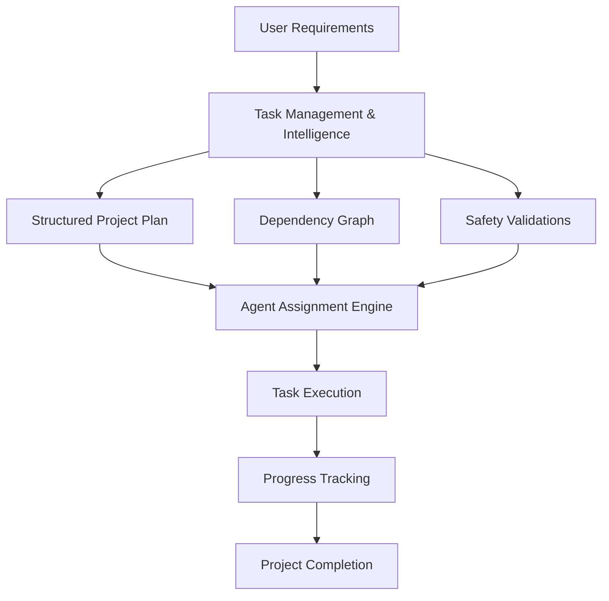

# Task Management & Intelligence System - Technical Documentation

## Overview

The Task Management & Intelligence system is Marcus's sophisticated AI-powered engine for generating, parsing, and intelligently managing project tasks. This system transforms natural language project requirements into structured, dependency-aware task hierarchies while preventing illogical assignments like "Deploy to production" before development is complete. It combines rule-based pattern matching with AI inference to create robust, realistic project plans.

## System Architecture

### Core Components

```
┌─────────────────────────────────────────────────────────────────────────────────┐
│                         Task Management & Intelligence System                    │
├─────────────────────────────────────────────────────────────────────────────────┤
│                                                                                 │
│  ┌───────────────────┐  ┌─────────────────────┐  ┌─────────────────────────────┐ │
│  │  PRD Parser       │  │ Intelligent Task    │  │ Hybrid Dependency          │ │
│  │                   │  │ Generator           │  │ Inferer                    │ │
│  │ • Format Detection│  │                     │  │                            │ │
│  │ • Feature Extract │  │ • Template Engine   │  │ • Pattern Rules            │ │
│  │ • Tech Stack ID   │  │ • Phase Generation  │  │ • AI Analysis             │ │
│  │ • Constraint Parse│  │ • Task Creation     │  │ • Conflict Resolution     │ │
│  │ • Complexity Est. │  │ • Dependency Build  │  │ • Cycle Detection         │ │
│  └───────────────────┘  └─────────────────────┘  └─────────────────────────────┘ │
│           │                        │                           │                │
│           └────────────────────────┼───────────────────────────┘                │
│                                    │                                            │
│  ┌─────────────────────────────────┼─────────────────────────────────────────┐   │
│  │                    Integration Layer                                    │   │
│  │                                 │                                       │   │
│  │  • Marcus Workflow Integration  │  • AI Analysis Engine Integration    │   │
│  │  • Board State Analysis         │  • Caching & Performance Optimization│   │
│  │  • Agent Assignment Support     │  • Error Framework Integration       │   │
│  └─────────────────────────────────┼─────────────────────────────────────────┘   │
│                                    │                                            │
│           ┌────────────────────────┼───────────────────────────┐                │
│           │                    Output Layer                   │                │
│           │                        │                         │                │
│           │  • Structured Tasks    │  • Dependency Graph     │                │
│           │  • Project Timeline    │  • Safety Validations   │                │
│           │  • Team Recommendations│  • Execution Roadmap    │                │
│           └─────────────────────────────────────────────────┘                │
└─────────────────────────────────────────────────────────────────────────────────┘
```

## Marcus Ecosystem Integration

### Position in Marcus Architecture

The Task Management & Intelligence system operates as Marcus's "brain" for project planning and task orchestration. It sits between the high-level project requirements (natural language input) and the low-level task execution (agent assignment and progress tracking).



### Integration Points

1. **Input Sources:**
   - Natural language project descriptions (from MCP tools)
   - Existing board state analysis
   - User customization preferences
   - Template library selections

2. **Output Consumers:**
   - AI-powered task assignment engine
   - Kanban board integration
   - Agent coordination system
   - Progress monitoring dashboard

3. **Supporting Systems:**
   - AI Analysis Engine (for complex inference)
   - Error Framework (for robust error handling)
   - Memory system (for context persistence)
   - Configuration management (for tuning)

## Workflow Integration

### Typical Marcus Scenario Flow

```
create_project → register_agent → request_next_task → report_progress → report_blocker → finish_task
      ↓              ↓                   ↓                   ↓               ↓              ↓
[TM&I System] → [Agent Mgmt] → [Intelligent Assignment] → [Progress Track] → [Blocker AI] → [Completion]
```

### When the System is Invoked

1. **Project Creation (create_project)**
   ```
   User Input → PRD Parser → Task Generator → Dependency Inferer → Structured Plan
   ```

2. **Agent Registration (register_agent)**
   ```
   Agent Skills → Task Compatibility Analysis → Assignment Readiness Assessment
   ```

3. **Task Assignment (request_next_task)**
   ```
   Available Tasks → Dependency Check → Safety Validation → AI Assignment → Task Selection
   ```

4. **Progress Updates (report_progress)**
   ```
   Task Status → Dependency Updates → Next Task Preparation → Pipeline Optimization
   ```

5. **Blocker Resolution (report_blocker)**
   ```
   Blocker Analysis → Dependency Re-evaluation → Alternative Path Generation → Recovery Plan
   ```

## What Makes This System Special

### 1. Hybrid Intelligence Approach

**Pattern-Based Rules + AI Inference = Optimal Balance**

- **Fast Pattern Matching:** Handles 80% of common dependencies instantly
- **AI Deep Analysis:** Tackles complex, ambiguous relationships
- **Cost Optimization:** Minimizes API calls while maximizing accuracy
- **Confidence Scoring:** Quantifies certainty for better decision-making

### 2. Multi-Level Safety System

**Prevents Catastrophic Task Ordering Errors**

- **Template-Level Safety:** Built-in logical ordering in task templates
- **Pattern-Level Safety:** Rule-based dependency enforcement
- **AI-Level Safety:** Intelligent validation of complex scenarios
- **Runtime Safety:** Dynamic checks during task assignment

### 3. Adaptive Complexity Handling

**Scales from Simple Scripts to Enterprise Applications**

- **Simple Projects:** Fast template-based generation with minimal overhead
- **Medium Projects:** Hybrid inference with balanced AI usage
- **Complex Projects:** Full AI analysis with sophisticated dependency modeling
- **Enterprise Projects:** Advanced pattern learning and optimization

### 4. Context-Aware Intelligence

**Understands Project Context and Team Dynamics**

- **Technology Stack Awareness:** Different rules for different tech stacks
- **Team Size Optimization:** Adjusts task granularity based on team capacity
- **Timeline Intelligence:** Balances thoroughness with delivery constraints
- **Skill-Based Adaptation:** Considers available agent capabilities

## Technical Implementation Details

### PRD Parser (`prd_parser.py`)

**Purpose:** Extracts structured requirements from various document formats

```python
@dataclass
class ParsedPRD:
    title: str
    overview: str
    goals: List[str]
    features: List[Feature]
    tech_stack: TechStack
    constraints: ProjectConstraints
    assumptions: List[str]
    risks: List[str]
    success_metrics: List[str]
    format_detected: PRDFormat
```

**Key Capabilities:**
- **Format Detection:** Auto-detects Markdown, plain text, user stories, technical specs
- **Feature Extraction:** Uses regex patterns and NLP to identify features
- **Tech Stack Inference:** Recognizes technologies from context clues
- **Complexity Assessment:** Estimates feature complexity based on language patterns
- **Constraint Parsing:** Extracts timelines, budgets, team size requirements

**Algorithm Highlights:**
```python
def _categorize_feature(self, feature: Feature) -> str:
    """Categorize feature to determine task template"""
    feature_text = f"{feature.name} {feature.description}".lower()

    if any(word in feature_text for word in ['auth', 'login', 'register', 'user']):
        return 'user_authentication'
    elif any(word in feature_text for word in ['data', 'crud', 'model', 'database']):
        return 'data_management'
    elif any(word in feature_text for word in ['api', 'endpoint', 'service']):
        return 'api_integration'
    else:
        return 'generic'
```

### Intelligent Task Generator (`intelligent_task_generator.py`)

**Purpose:** Converts parsed requirements into structured task hierarchies

```python
@dataclass
class ProjectStructure:
    phases: List[str]
    tasks: List[Task]
    dependencies: Dict[str, List[str]]
    estimated_duration: int  # in days
    recommended_team_size: int
```

**Architecture Phases:**
1. **Setup Tasks:** Repository, environment, infrastructure
2. **Design Tasks:** Architecture, wireframes, API contracts
3. **Feature Implementation:** Core functionality development
4. **Integration Tasks:** Component connection and data flow
5. **Testing Tasks:** Unit, integration, and manual testing
6. **Deployment Tasks:** Production setup and monitoring

**Template System:**
```python
self.feature_task_templates = {
    'user_authentication': [
        {'name': 'Design user authentication system', 'phase': 'design', 'base_hours': 4},
        {'name': 'Implement user registration', 'phase': 'backend', 'base_hours': 8},
        {'name': 'Implement user login', 'phase': 'backend', 'base_hours': 6},
        {'name': 'Build login/register UI', 'phase': 'frontend', 'base_hours': 8},
        {'name': 'Test authentication flow', 'phase': 'testing', 'base_hours': 4}
    ]
}
```

**Dynamic Customization:**
- **Complexity Multipliers:** Adjust time estimates based on feature complexity
- **Tech Stack Adaptation:** Add technology-specific setup and configuration tasks
- **Team Size Scaling:** Modify task granularity for different team sizes
- **Timeline Constraints:** Compress or expand phases based on delivery requirements

### Base Dependency Inferer (`dependency_inferer.py`)

**Purpose:** Rule-based dependency inference with safety guarantees

```python
@dataclass
class DependencyPattern:
    name: str
    description: str
    condition_pattern: str  # Regex pattern to match dependent task
    dependency_pattern: str  # Regex pattern to match dependency task
    confidence: float
    mandatory: bool  # Whether this dependency is strictly required
```

**Core Safety Patterns:**
```python
DependencyPattern(
    name="testing_before_deployment",
    description="Testing must complete before deployment",
    condition_pattern=r"(deploy|release|launch|production)",
    dependency_pattern=r"(test|qa|quality|verify)",
    confidence=0.95,
    mandatory=True
)
```

**Graph Analysis:**
- **Cycle Detection:** Identifies circular dependencies using DFS
- **Critical Path:** Finds longest dependency chain for timeline estimation
- **Transitive Reduction:** Removes redundant dependencies for cleaner graphs
- **Validation Engine:** Ensures mandatory patterns are satisfied

### Hybrid Dependency Inferer (`dependency_inferer_hybrid.py`)

**Purpose:** Combines pattern matching with AI analysis for optimal accuracy

```python
@dataclass
class HybridDependency(InferredDependency):
    inference_method: str  # 'pattern', 'ai', 'both'
    pattern_confidence: float = 0.0
    ai_confidence: float = 0.0
    ai_reasoning: Optional[str] = None
```

**Hybrid Strategy:**
1. **Fast Pattern Pass:** Apply all rule-based patterns first
2. **Ambiguity Detection:** Identify cases needing AI analysis
3. **Batch AI Processing:** Analyze multiple ambiguous pairs efficiently
4. **Confidence Combination:** Merge pattern and AI results intelligently
5. **Conflict Resolution:** Handle disagreements between methods

**AI Prompt Engineering:**
```python
prompt = f"""Analyze these task pairs and determine if there are dependencies between them.
A dependency exists if one task must be completed before another can reasonably begin.

Focus on logical dependencies based on:
- Technical requirements (can't test non-existent code)
- Data flow (need data model before business logic)
- User workflow (authentication before authorization)
- Architecture layers (database before API before UI)"""
```

**Caching Strategy:**
- **Results Caching:** 24-hour TTL for AI inference results
- **Context Hashing:** Generate cache keys from task content
- **Performance Optimization:** Minimize redundant API calls
- **Cache Invalidation:** Refresh when task content changes significantly

## Configuration and Tuning

### Hybrid Inference Configuration

```python
@dataclass
class HybridInferenceConfig:
    pattern_confidence_threshold: float = 0.8  # Trust patterns above this
    ai_confidence_threshold: float = 0.7       # Accept AI above this
    combined_confidence_boost: float = 0.15    # Boost when both agree
    max_ai_pairs_per_batch: int = 20           # API call optimization
    min_shared_keywords: int = 2               # Relatedness detection
    enable_ai_inference: bool = True           # Master AI switch
    cache_ttl_hours: int = 24                  # Cache lifetime
```

**Preset Configurations:**
- **Conservative:** High thresholds, smaller batches, strict validation
- **Balanced:** Default settings for most use cases
- **Aggressive:** Lower thresholds, larger batches, more dependencies
- **Cost Optimized:** Minimize API calls while maintaining quality
- **Pattern Only:** No AI calls, pure rule-based inference

## Pros and Cons of Current Implementation

### Advantages

1. **Performance Excellence**
   - **Sub-second pattern matching** for common dependency patterns
   - **Intelligent API usage** - only calls AI when genuinely needed
   - **Efficient caching** reduces redundant analysis
   - **Batch processing** optimizes AI inference costs

2. **Accuracy and Safety**
   - **Multi-layer validation** prevents catastrophic task ordering
   - **Confidence scoring** enables informed decision-making
   - **Conflict resolution** handles disagreements between methods
   - **Domain expertise** encoded in dependency patterns

3. **Flexibility and Scalability**
   - **Configurable thresholds** for different use cases
   - **Template extensibility** for new project types
   - **Technology adaptation** supports various tech stacks
   - **Team size scaling** adjusts complexity appropriately

4. **Integration Excellence**
   - **Marcus ecosystem native** - designed for the full workflow
   - **Error framework integration** provides robust error handling
   - **Board state awareness** considers existing project context
   - **Agent compatibility** supports intelligent task assignment

### Limitations

1. **Complexity Trade-offs**
   - **Learning curve** for configuration and tuning
   - **Multiple inference methods** can be confusing to debug
   - **Configuration overhead** requires understanding of thresholds
   - **Pattern maintenance** needs updates as practices evolve

2. **AI Dependency Risks**
   - **API reliability** affects system robustness
   - **Cost scaling** with project complexity
   - **Latency variability** can impact user experience
   - **Model changes** may affect inference quality

3. **Domain Limitations**
   - **Software focus** - primarily designed for software projects
   - **Template boundaries** may not cover all project types
   - **Language dependency** - works best with English descriptions
   - **Context requirements** - needs sufficient detail for good analysis

4. **Scalability Concerns**
   - **Memory usage** grows with project size
   - **Cache management** complexity with many projects
   - **Batch size limits** for very large projects
   - **Configuration proliferation** across different project types

## Why This Approach Was Chosen

### Design Philosophy

**"Intelligent Automation with Human Oversight"**

The hybrid approach was chosen to balance the competing demands of:
- **Speed vs. Accuracy:** Fast patterns for obvious cases, AI for complex ones
- **Cost vs. Quality:** Minimize API calls while maintaining high accuracy
- **Automation vs. Control:** Intelligent defaults with configuration flexibility
- **Simplicity vs. Power:** Easy to use out-of-box, powerful when tuned

### Alternative Approaches Considered

1. **Pure Rule-Based System**
   - **Pros:** Fast, predictable, no API costs
   - **Cons:** Limited to known patterns, poor handling of novel scenarios
   - **Decision:** Too rigid for real-world project variety

2. **Pure AI System**
   - **Pros:** Maximum flexibility, handles any scenario
   - **Cons:** High costs, variable latency, unpredictable failures
   - **Decision:** Too expensive and unreliable for production use

3. **Human-Driven System**
   - **Pros:** Perfect accuracy, full control
   - **Cons:** Slow, expensive, doesn't scale
   - **Decision:** Defeats the purpose of automation

4. **Simple Template System**
   - **Pros:** Fast, simple, predictable
   - **Cons:** No dependency intelligence, prone to ordering errors
   - **Decision:** Insufficient safety guarantees

### Technical Decision Rationale

**Why Hybrid Won:**
- **80/20 Rule:** Patterns handle most cases efficiently, AI handles edge cases accurately
- **Graceful Degradation:** Falls back to patterns if AI unavailable
- **Cost Predictability:** Configurable AI usage for budget control
- **Accuracy Optimization:** Best of both worlds - speed AND intelligence
- **Future Proofing:** Can evolve with better AI models and new patterns

## Future Evolution

### Short-term Enhancements (3-6 months)

1. **Pattern Learning System**
   - **Automatic pattern discovery** from successful projects
   - **User feedback incorporation** to improve pattern accuracy
   - **Domain-specific pattern libraries** for different industries
   - **Pattern confidence calibration** based on historical performance

2. **Advanced AI Integration**
   - **Multi-model support** for different types of analysis
   - **Streaming responses** for better user experience
   - **Context-aware prompting** using project history
   - **Uncertainty quantification** for better confidence scoring

3. **Enhanced Configuration**
   - **Auto-tuning based on project type** and team characteristics
   - **Dynamic threshold adjustment** based on performance metrics
   - **A/B testing framework** for configuration optimization
   - **Performance monitoring** and alerting for degradation

### Medium-term Evolution (6-12 months)

1. **Multi-Project Intelligence**
   - **Cross-project pattern learning** to improve recommendations
   - **Organization-wide knowledge base** for consistent practices
   - **Team expertise modeling** for better task matching
   - **Historical performance analysis** for timeline estimation

2. **Advanced Dependency Modeling**
   - **Resource dependency tracking** (shared infrastructure, databases)
   - **Skill dependency analysis** (required expertise for tasks)
   - **Risk dependency assessment** (tasks that could impact others)
   - **Dynamic re-planning** based on execution feedback

3. **Integration Expansion**
   - **Code analysis integration** for technical dependency detection
   - **Calendar and resource integration** for realistic scheduling
   - **External tool integration** (JIRA, GitHub, etc.)
   - **Real-time collaboration features** for team coordination

### Long-term Vision (12+ months)

1. **Predictive Project Management**
   - **Risk prediction and mitigation** suggestions
   - **Resource optimization** across multiple projects
   - **Timeline prediction with uncertainty bounds**
   - **Quality outcome prediction** based on task structure

2. **Autonomous Project Execution**
   - **Self-healing project plans** that adapt to changes
   - **Intelligent task generation** during execution
   - **Automated decision making** for routine project management
   - **Outcome optimization** beyond just task completion

3. **Domain Expansion**
   - **Non-software project support** (marketing, research, etc.)
   - **Multi-industry templates** and patterns
   - **Regulatory compliance automation** for different domains
   - **Custom workflow generation** for unique organizational needs

## Simple vs Complex Task Handling

### Simple Tasks (1-5 tasks, single developer, < 1 week)

**Optimized Path:**
```
Natural Language → Template Match → Pattern Dependencies → Ready Tasks
                     ↓
                Fast Path (< 1 second)
```

**Characteristics:**
- **Pure template-based generation** with minimal customization
- **Pattern-only dependency inference** (no AI calls)
- **Single-phase execution** with minimal safety checks
- **Optimized for speed** and immediate task availability

**Example Flow:**
```python
# Simple todo app
"Create a simple todo app with React"
→ WebAppTemplate(size=SMALL)
→ [Setup React, Create components, Add styling, Deploy]
→ Pattern dependencies: Setup → Components → Styling → Deploy
```

### Medium Tasks (5-20 tasks, 2-4 developers, 1-4 weeks)

**Balanced Path:**
```
Natural Language → PRD Parse → Template + AI → Hybrid Dependencies → Validated Plan
                                   ↓
                          Balanced Path (2-5 seconds)
```

**Characteristics:**
- **PRD parsing with feature extraction** for better understanding
- **Template customization** based on parsed requirements
- **Hybrid dependency inference** with selective AI usage
- **Moderate safety validation** and conflict resolution

**Example Flow:**
```python
# E-commerce site
"Build an e-commerce site with user auth, product catalog, and payment"
→ Advanced PRD parsing extracts 3 features
→ Template combines auth + catalog + payment patterns
→ AI analyzes payment integration dependencies
→ Hybrid inference creates 15 tasks with verified dependencies
```

### Complex Tasks (20+ tasks, 5+ developers, 1+ months)

**Comprehensive Path:**
```
Natural Language → Deep PRD Analysis → AI-Enhanced Generation → Full Hybrid Inference → Safety Validation → Optimized Plan
                                              ↓
                                   Comprehensive Path (5-15 seconds)
```

**Characteristics:**
- **Deep PRD analysis** with constraint and risk assessment
- **AI-enhanced task generation** for novel requirements
- **Full hybrid dependency inference** with extensive AI consultation
- **Comprehensive safety validation** and optimization
- **Team size and timeline optimization**

**Example Flow:**
```python
# Enterprise SaaS platform
"Build a multi-tenant SaaS platform with microservices, real-time analytics, and enterprise SSO"
→ AI extracts 12 complex features with interdependencies
→ Template synthesis creates custom architecture phases
→ AI analyzes all task pairs for subtle dependencies
→ Full validation ensures deployment safety and team coordination
→ 45 tasks with optimized critical path and resource allocation
```

## Board-Specific Considerations

### Board State Integration

**Context-Aware Planning:**
- **Existing task analysis** to avoid duplication
- **In-progress task consideration** for dependency planning
- **Team workload assessment** for realistic scheduling
- **Board health metrics** to inform generation strategy

### Kanban Provider Abstraction

**Provider-Agnostic Design:**
```python
# Board state inputs
board_context = {
    'existing_tasks': existing_tasks,
    'team_capacity': team_info,
    'current_workload': active_tasks,
    'board_health': quality_metrics
}

# Generates compatible task structure
project_plan = await generator.generate_with_context(
    prd=parsed_requirements,
    board_context=board_context
)
```

**Adapter Support:**
- **GitHub Issues:** Proper labeling and milestone integration
- **Trello:** Card structure and list organization
- **JIRA:** Epic/story hierarchy and sprint planning
- **Linear:** Project structure and team assignment

### Quality Assurance Integration

**Board Quality Metrics:**
- **Task clarity scores** influence generation detail level
- **Dependency health** affects inference confidence thresholds
- **Team performance data** shapes estimation accuracy
- **Historical success patterns** guide template selection

## Seneca Integration

### Current Integration Status

**Limited Direct Integration:**
The current implementation has minimal direct integration with Seneca (Marcus's learning system), but the architecture supports future enhancement:

```python
# Future Seneca integration points
class IntelligentTaskGenerator:
    def __init__(self, seneca_client: Optional[SenecaClient] = None):
        self.seneca = seneca_client

    async def generate_tasks_from_prd(self, prd: ParsedPRD) -> ProjectStructure:
        # Query Seneca for organization patterns
        if self.seneca:
            org_patterns = await self.seneca.get_organization_patterns(
                tech_stack=prd.tech_stack,
                team_size=prd.constraints.team_size
            )
            # Apply learned patterns to generation
```

### Planned Seneca Enhancements

1. **Pattern Learning:**
   - **Successful project analysis** to identify effective task structures
   - **Dependency pattern mining** from completed projects
   - **Estimation accuracy feedback** to improve time predictions
   - **Template effectiveness metrics** for continuous improvement

2. **Organizational Memory:**
   - **Team expertise tracking** for better task assignment
   - **Technology preference learning** for stack-specific optimizations
   - **Process adaptation** based on team working patterns
   - **Quality correlation analysis** between task structure and outcomes

3. **Predictive Intelligence:**
   - **Risk pattern recognition** from historical project data
   - **Success factor identification** for different project types
   - **Resource optimization** based on past performance
   - **Timeline accuracy improvement** through feedback loops

### Integration Architecture

```python
# Seneca-enhanced dependency inference
class SenecaEnhancedInferer(HybridDependencyInferer):
    async def infer_dependencies(self, tasks: List[Task]) -> DependencyGraph:
        # Get base hybrid inference
        base_graph = await super().infer_dependencies(tasks)

        # Enhance with Seneca insights
        if self.seneca:
            learned_patterns = await self.seneca.get_dependency_patterns(
                project_type=self.project_context.type,
                tech_stack=self.project_context.tech_stack
            )
            enhanced_graph = await self._apply_learned_patterns(
                base_graph, learned_patterns
            )
            return enhanced_graph

        return base_graph
```

## Performance Characteristics

### Benchmarks

**Task Generation Performance:**
- **Simple projects (< 10 tasks):** 0.5-1.0 seconds
- **Medium projects (10-30 tasks):** 2-5 seconds
- **Complex projects (30+ tasks):** 5-15 seconds

**Dependency Inference Performance:**
- **Pattern-only (up to 50 tasks):** < 1 second
- **Hybrid inference (50-100 tasks):** 2-8 seconds
- **Full AI analysis (100+ tasks):** 10-30 seconds

**Memory Usage:**
- **Base system:** ~50MB
- **Per project (medium):** ~2-5MB
- **Cache overhead:** ~1MB per 100 cached analyses
- **Peak usage (complex project):** ~100-200MB

### Scalability Limits

**Current Boundaries:**
- **Maximum tasks per project:** ~200 (practical limit)
- **Maximum AI pairs per batch:** 50 (API limit considerations)
- **Cache capacity:** 1000 projects (configurable)
- **Concurrent project generation:** 10 (resource-dependent)

**Optimization Strategies:**
- **Hierarchical task generation** for very large projects
- **Streaming dependency analysis** for real-time feedback
- **Distributed caching** for multi-instance deployments
- **Background pre-processing** for common project types

## Error Handling and Resilience

### Error Framework Integration

**Comprehensive Error Coverage:**
```python
from src.core.error_framework import (
    BusinessLogicError,
    AIInferenceError,
    DependencyValidationError,
    error_context
)

async def generate_tasks_from_prd(self, prd: ParsedPRD) -> ProjectStructure:
    with error_context("task_generation", project_name=prd.title):
        try:
            tasks = await self._generate_feature_tasks(prd.features)
            dependencies = await self._infer_dependencies(tasks)
            return self._build_project_structure(tasks, dependencies)
        except AIInferenceError as e:
            # Fall back to pattern-only inference
            logger.warning(f"AI inference failed, using patterns: {e}")
            return await self._generate_with_patterns_only(prd)
```

**Fallback Strategies:**
- **AI failure → Pattern-only inference**
- **Complex parsing failure → Template-based generation**
- **Dependency cycle → Automatic cycle breaking**
- **Configuration error → Default safe settings**

### Resilience Patterns

**Circuit Breaker for AI Services:**
```python
from src.core.resilience import with_circuit_breaker

@with_circuit_breaker("ai_inference")
async def _get_ai_dependencies(self, tasks, ambiguous_pairs):
    # AI analysis with automatic fallback
    return await self.ai_engine.analyze_dependencies(tasks, ambiguous_pairs)
```

**Retry Logic with Exponential Backoff:**
```python
@with_retry(RetryConfig(max_attempts=3, base_delay=1.0))
async def _call_ai_inference(self, prompt):
    return await self.ai_engine.call_api(prompt)
```

**Graceful Degradation:**
- **No AI available:** Pure pattern-based inference
- **Partial AI failure:** Use successful AI results + patterns for rest
- **Cache unavailable:** Direct computation with performance warning
- **Template missing:** Generate generic tasks with basic dependencies

## Monitoring and Observability

### Key Metrics

**Performance Metrics:**
- Task generation latency (p50, p95, p99)
- Dependency inference accuracy rates
- AI API call frequency and success rates
- Cache hit rates and effectiveness

**Quality Metrics:**
- Dependency validation success rates
- Project completion correlation with task structure
- User satisfaction with generated plans
- Agent assignment efficiency

**Business Metrics:**
- Projects generated per time period
- Average project complexity handled
- Cost per project analysis
- User adoption and retention

### Logging and Debugging

**Structured Logging:**
```python
logger.info(
    "Hybrid inference completed",
    extra={
        "pattern_dependencies": len(pattern_deps),
        "ai_dependencies": len(ai_deps),
        "final_dependencies": len(final_deps),
        "inference_time_ms": elapsed_ms,
        "ai_calls_made": ai_call_count,
        "cache_hits": cache_hit_count
    }
)
```

**Debug Capabilities:**
- **Dependency explanation:** Why each dependency was inferred
- **Confidence score breakdown:** Pattern vs AI contributions
- **Decision audit trail:** Configuration and reasoning at each step
- **Performance profiling:** Time spent in each phase of analysis

---

*This documentation represents the current state of the Task Management & Intelligence system as of the latest implementation. For the most up-to-date information, refer to the source code and configuration files.*
