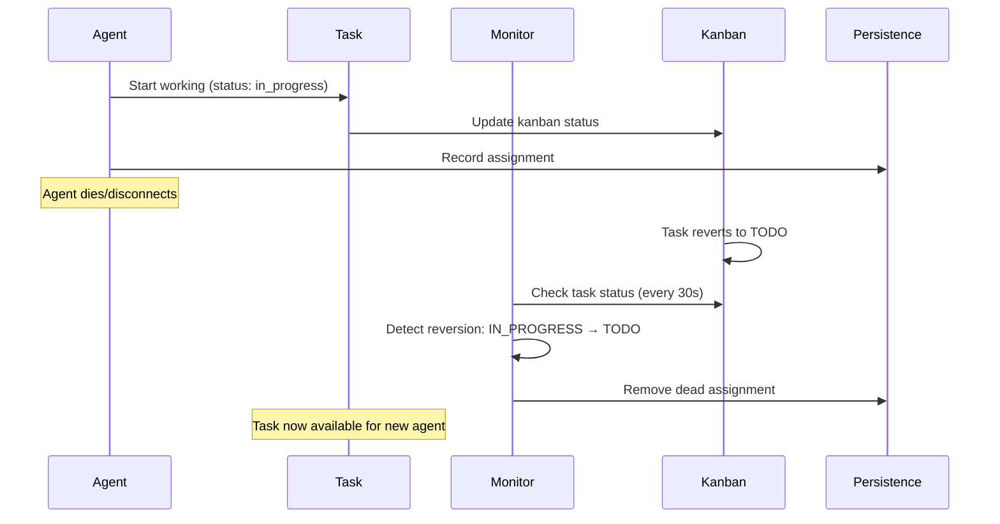
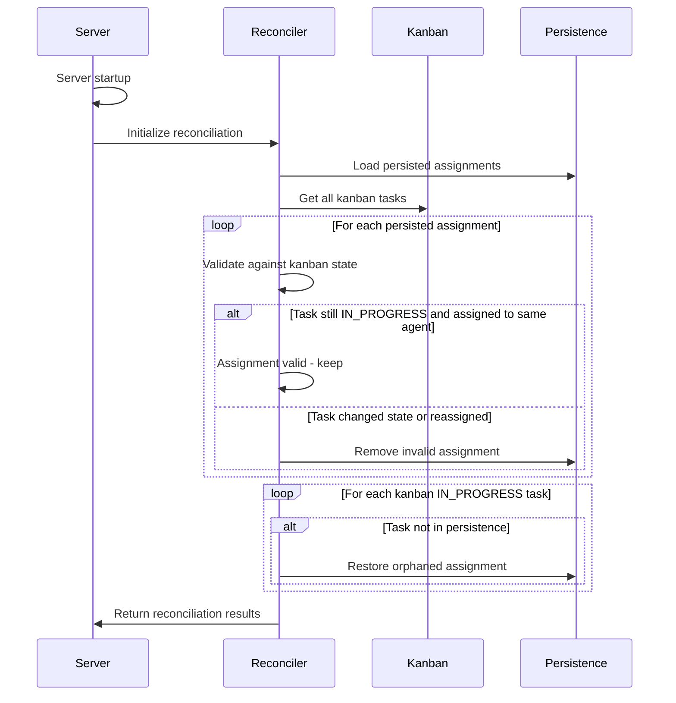
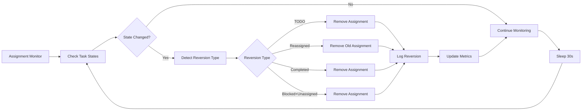

# Orphan Task Recovery System

The Orphan Task Recovery System ensures that tasks don't get permanently stuck when agents die, disconnect, or fail unexpectedly. This system provides multiple layers of protection against orphaned tasks through continuous monitoring, automatic detection, and recovery mechanisms.

## Overview

When agents work on tasks, they can fail or disconnect for various reasons:
- Network connectivity issues
- Process crashes
- System shutdowns
- Agent software bugs
- Resource exhaustion

Without proper handling, these failures would leave tasks "orphaned" - stuck in an IN_PROGRESS state with no active agent working on them, blocking the project indefinitely.

## System Architecture

The orphan task recovery system consists of three main components:

```
┌─────────────────────┐    ┌──────────────────────┐    ┌─────────────────────┐
│  Assignment Monitor │    │ Assignment Reconciler│    │ Health Checker      │
│                     │    │                      │    │                     │
│ • Continuous        │◄──►│ • Startup Recovery   │◄──►│ • System Health     │
│   Monitoring        │    │ • State Validation   │    │ • Issue Detection   │
│ • Reversion         │    │ • Orphan Detection   │    │ • Metrics Reporting │
│   Detection         │    │ • Auto Restoration   │    │                     │
│ • Cleanup Actions   │    │                      │    │                     │
└─────────────────────┘    └──────────────────────┘    └─────────────────────┘
           │                           │                           │
           └───────────────────────────┼───────────────────────────┘
                                       │
                         ┌─────────────▼──────────────┐
                         │    Assignment Persistence   │
                         │                            │
                         │ • Task-Agent Mapping       │
                         │ • State Synchronization    │
                         │ • Recovery Metadata        │
                         └────────────────────────────┘
```

## Core Components

### 1. Assignment Monitor (`AssignmentMonitor`)

**Purpose:** Continuously monitors task assignments for state reversions and inconsistencies.

**Location:** `src/monitoring/assignment_monitor.py`

**Key Responsibilities:**
- Monitors task state changes every 30 seconds (configurable)
- Detects when tasks revert from IN_PROGRESS back to TODO
- Identifies task reassignments to different agents
- Cleans up orphaned assignments from persistence
- Tracks reversion patterns for problematic tasks

**Detection Algorithms:**

```python
async def _detect_reversion(self, task: Task, worker_id: str) -> bool:
    """Detect if a task has been reverted."""

    # Case 1: Task went back to TODO (agent died/disconnected)
    if task.status == TaskStatus.TODO:
        logger.info(f"Task {task.id} reverted to TODO status")
        return True

    # Case 2: Task is IN_PROGRESS but assigned to different worker
    if task.status == TaskStatus.IN_PROGRESS and task.assigned_to != worker_id:
        logger.info(f"Task {task.id} reassigned from {worker_id} to {task.assigned_to}")
        return True

    # Case 3: Task completed by someone else
    if task.status == TaskStatus.DONE and task.assigned_to != worker_id:
        logger.info(f"Task {task.id} completed by {task.assigned_to} instead of {worker_id}")
        return True

    # Case 4: Task blocked but no longer assigned
    if task.status == TaskStatus.BLOCKED and not task.assigned_to:
        logger.info(f"Task {task.id} blocked and unassigned")
        return True

    return False
```

**Monitoring Loop:**
```python
async def _monitor_loop(self):
    """Main monitoring loop."""
    while self._running:
        try:
            await self._check_for_reversions()
            await asyncio.sleep(self.check_interval)  # Default: 30 seconds
        except Exception as e:
            logger.error(f"Error in assignment monitor: {e}")
            await asyncio.sleep(self.check_interval)
```

### 2. Assignment Reconciler (`AssignmentReconciler`)

**Purpose:** Reconciles persisted assignments with kanban board state, especially during startup or after connectivity issues.

**Location:** `src/core/assignment_reconciliation.py`

**Key Responsibilities:**
- Validates all persisted assignments against kanban state
- Detects and recovers orphaned tasks
- Removes invalid or stale assignments
- Restores missing assignments to persistence
- Provides comprehensive reconciliation reports

**Orphan Detection Logic:**

```python
# Find orphaned IN_PROGRESS tasks (assigned in kanban but not persisted)
persisted_task_ids = {a["task_id"] for a in list(persisted.values())}

for task in all_tasks:
    if (task.status == TaskStatus.IN_PROGRESS
        and task.assigned_to
        and task.id not in persisted_task_ids):

        # This task is assigned in kanban but not persisted
        logger.info(f"Found orphaned task {task.id} assigned to {task.assigned_to}")

        # Restore to persistence
        await self.persistence.save_assignment(
            task.assigned_to,
            task.id,
            {
                "name": task.name,
                "priority": task.priority.value if task.priority else "medium",
                "estimated_hours": task.estimated_hours,
                "restored_at": datetime.now().isoformat(),
            }
        )
        results["assignments_restored"] += 1
```

**Recovery Actions:**

| Task State | Kanban Status | Assigned To | Action |
|------------|---------------|-------------|---------|
| Persisted | TODO | None | Remove assignment (task reverted) |
| Persisted | DONE | Different agent | Remove assignment (completed by other) |
| Persisted | IN_PROGRESS | Same agent | Verify (valid assignment) |
| Persisted | IN_PROGRESS | Different agent | Remove assignment (reassigned) |
| Not persisted | IN_PROGRESS | Any agent | Restore assignment (orphaned) |
| Persisted | Missing | N/A | Remove assignment (task deleted) |

### 3. Assignment Health Checker (`AssignmentHealthChecker`)

**Purpose:** Performs comprehensive health checks on the assignment system.

**Location:** `src/monitoring/assignment_monitor.py` (part of AssignmentMonitor)

**Health Metrics:**
- Number of persisted assignments
- Number of kanban-assigned tasks
- Assignment mismatches
- System health status
- Error reporting

**Health Check Process:**

```python
async def check_assignment_health(self) -> Dict:
    """Comprehensive health check of assignment system."""
    health = {
        "healthy": True,
        "issues": [],
        "metrics": {},
        "timestamp": datetime.now().isoformat(),
    }

    # Check persistence health
    persisted = await self.persistence.load_assignments()
    health["metrics"]["persisted_assignments"] = len(persisted)

    # Check kanban assignments
    tasks = await self.kanban_client.get_all_tasks()
    kanban_assigned = [t for t in tasks if t.status == TaskStatus.IN_PROGRESS and t.assigned_to]
    health["metrics"]["kanban_assigned_tasks"] = len(kanban_assigned)

    # Detect mismatches
    mismatches = []
    for task in kanban_assigned:
        if task.assigned_to not in persisted:
            mismatches.append({
                "task_id": task.id,
                "kanban_assignee": task.assigned_to,
                "persisted": False
            })

    if mismatches:
        health["healthy"] = False
        health["issues"].append({
            "type": "assignment_mismatch",
            "count": len(mismatches),
            "description": "Tasks assigned in kanban but not tracked in persistence"
        })

    return health
```

## Recovery Workflows

### 1. Agent Death Detection and Recovery



### 2. Startup Recovery Process



### 3. Continuous Monitoring Flow



## Configuration

### Assignment Monitor Configuration

```python
# Default configuration
monitor = AssignmentMonitor(
    persistence=assignment_persistence,
    kanban_client=kanban_client,
    check_interval=30,  # seconds
)

# Start monitoring
await monitor.start()
```

### Reconciliation Triggers

Reconciliation is triggered:
1. **Server startup** - Automatic reconciliation
2. **Manual trigger** - Via `force_reconciliation()` method
3. **Health check failures** - When mismatches detected
4. **Periodic intervals** - Configurable automated reconciliation

## Monitoring and Alerting

### Key Metrics

The system tracks several important metrics:

- **Reversion Count**: Number of task reversions detected
- **Assignment Mismatches**: Discrepancies between kanban and persistence
- **Recovery Success Rate**: Percentage of successful orphan recoveries
- **Monitor Uptime**: Health of the monitoring system itself
- **Reconciliation Frequency**: How often reconciliation runs

### Alert Conditions

The system generates alerts for:

```python
# High reversion rate (indicates systemic issues)
if reversion_count > 5 in last_hour:
    alert("High task reversion rate detected")

# Repeated task failures
if task_reversion_count >= 3:
    alert(f"Task {task_id} has reverted {count} times - investigate")

# Assignment system health
if health_check.healthy == False:
    alert("Assignment system health issues detected")

# Monitor failure
if monitor_last_check > 5 * check_interval:
    alert("Assignment monitor appears to be down")
```

### Logging and Observability

All recovery actions are extensively logged:

```python
# Reversion detection
logger.warning(
    f"Handled reversion: Task {task_id} for worker {worker_id} "
    f"(status: {current_status}, assigned_to: {assigned_to}, "
    f"reversion_count: {reversion_count})"
)

# Orphan recovery
logger.info(
    f"Restored orphaned assignment: Task {task_id} to agent {agent_id}"
)

# Health issues
logger.error(
    f"Assignment health check failed: {len(issues)} issues detected"
)
```

## Error Handling and Edge Cases

### 1. Kanban Connectivity Issues

When kanban is temporarily unavailable:
- Monitor gracefully handles connection failures
- Falls back to `get_available_tasks()` if `get_all_tasks()` fails
- Continues monitoring with reduced visibility
- Logs warnings about limited health checking

### 2. Persistence Failures

When persistence layer fails:
- Recovery operations are safely aborted
- System continues monitoring (read-only mode)
- Alerts are generated for persistence issues
- Manual intervention may be required

### 3. Rapid State Changes

For tasks that change state rapidly:
- Monitor tracks reversion counts per task
- Tasks with excessive reversions (>3) are flagged
- May indicate task definition issues or agent problems

### 4. Split-Brain Scenarios

When persistence and kanban have conflicting states:
- Reconciler prioritizes kanban as source of truth
- Persistence is updated to match kanban state
- Detailed logging for audit trails

## Performance Considerations

### Scalability

The system is designed to handle large numbers of tasks efficiently:

- **Batch processing**: All tasks processed in single kanban call
- **Efficient data structures**: Hash maps for O(1) lookups
- **Configurable intervals**: Adjust monitoring frequency based on load
- **Async operations**: Non-blocking monitoring loop

### Resource Usage

```python
# Memory usage optimizations
task_map = {task.id: task for task in all_tasks}  # Single pass
assigned_task_ids = set(...)  # Set operations for efficiency

# Network call minimization
all_tasks = await self.kanban_client.get_all_tasks()  # Single call
# vs multiple individual task fetches
```

### Monitoring Overhead

- Default 30-second intervals balance responsiveness with system load
- Monitor can be disabled in test environments
- Health checks are lightweight and can run more frequently

## Best Practices

### 1. Deployment

- Always enable assignment monitor in production
- Set appropriate check intervals (15-60 seconds recommended)
- Ensure persistence layer has adequate performance
- Monitor system health metrics

### 2. Debugging

- Enable debug logging for assignment operations
- Use reconciliation reports to understand recovery actions
- Monitor reversion patterns to identify systemic issues
- Track assignment health metrics over time

### 3. Maintenance

- Regularly review reversion logs for patterns
- Monitor reconciliation success rates
- Clean up old assignment data periodically
- Test recovery procedures in staging environments

## Integration Points

### With Task Assignment

The recovery system integrates with the task assignment flow:

```python
# Task assignment
await state.kanban_client.update_task(
    optimal_task.id,
    {"status": TaskStatus.IN_PROGRESS, "assigned_to": agent_id}
)

# Record assignment for monitoring
await state.assignment_persistence.save_assignment(
    agent_id, optimal_task.id, task_metadata
)
```

### With Progress Reporting

Progress reports trigger monitoring updates:

```python
# Progress update
if status == "completed":
    # Monitor will detect completion and clean up
    update_data["status"] = TaskStatus.DONE
elif status == "in_progress":
    # Ensures proper tracking
    update_data["status"] = TaskStatus.IN_PROGRESS
    update_data["assigned_to"] = agent_id
```

### With Health Monitoring

Assignment health integrates with overall system health:

```python
# System health check
health_status = await assignment_monitor.get_monitoring_stats()
system_health["assignment_system"] = health_status
```

## Future Enhancements

### Planned Improvements

1. **Timeout-based Detection**
   - Detect agents that stop reporting progress
   - Configurable timeout thresholds per task type
   - Proactive reassignment of stalled tasks

2. **Agent Heartbeat System**
   - Regular agent health checks
   - Immediate detection of agent failures
   - Graceful agent shutdown handling

3. **Smart Reassignment**
   - Automatic reassignment of orphaned tasks
   - Agent skill matching for optimal reassignment
   - Load balancing considerations

4. **Historical Analysis**
   - Track agent reliability metrics
   - Identify problematic task patterns
   - Predictive failure detection

### Potential Extensions

- **External monitoring integration** (Prometheus, Grafana)
- **Webhook notifications** for critical failures
- **Recovery strategy customization** per project
- **Distributed monitoring** for multi-server deployments

## Conclusion

The Orphan Task Recovery System provides robust protection against task abandonment due to agent failures. Through continuous monitoring, automatic detection, and intelligent recovery mechanisms, it ensures that project progress is never permanently blocked by agent issues.

The system's multi-layered approach catches failures at various stages, from immediate detection during monitoring to comprehensive recovery during startup. Combined with extensive logging and health monitoring, it provides operators with the visibility and tools needed to maintain a healthy task execution environment.
