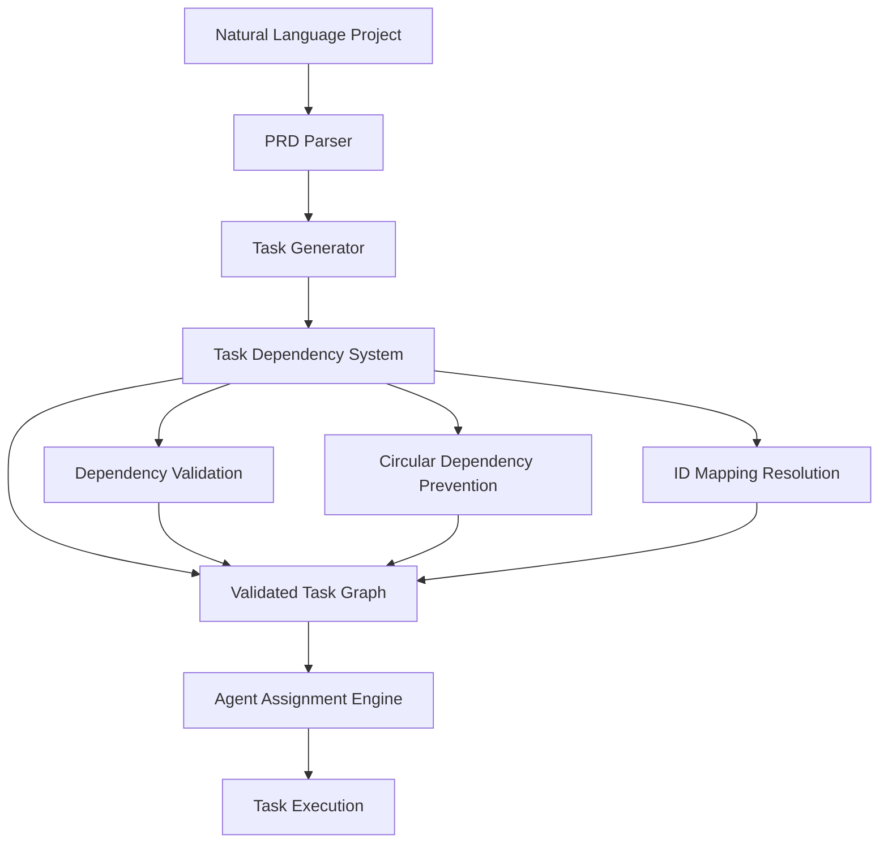

# Task Dependency System

## Overview

The Task Dependency System is Marcus's intelligent engine for understanding, inferring, and managing relationships between tasks to ensure logical project execution. This system prevents catastrophic task ordering errors (like "Deploy before Testing") while enabling sophisticated project coordination across distributed AI agents. It combines rule-based pattern matching with AI-enhanced analysis to create robust, realistic task execution plans.

## What This System Does

The Task Dependency System serves multiple critical functions:

1. **Dependency Inference**: Automatically identifies logical dependencies between tasks using hybrid strategies (pattern-based, AI-enhanced, and adaptive learning)
2. **Circular Dependency Prevention**: Detects and breaks circular dependency loops that would make projects impossible to execute
3. **Task Execution Ordering**: Determines optimal task sequence to maximize parallelization while respecting dependencies
4. **Safety Validation**: Ensures no task can be assigned before its prerequisites are complete
5. **ID Mapping Management**: Handles complex task ID transformations between symbolic and board-specific identifiers
6. **Real-time Dependency Resolution**: Dynamically filters available tasks based on current project state

## Architecture

The system consists of several interconnected components working in harmony:

```
┌─────────────────────────────────────────────────────────────────────────────────┐
│                          Task Dependency System                                │
├─────────────────────────────────────────────────────────────────────────────────┤
│                                                                                 │
│  ┌─────────────────┐  ┌─────────────────┐  ┌─────────────────────────────────┐   │
│  │  Pattern-Based  │  │ AI-Enhanced     │  │ Hybrid Dependency              │   │
│  │  Inference      │  │ Analysis        │  │ Resolver                       │   │
│  │                 │  │                 │  │                                │   │
│  │ • Rule Patterns │  │ • Complex Cases │  │ • Strategy Combination         │   │
│  │ • Fast Matching │  │ • Batch Process │  │ • Confidence Scoring          │   │
│  │ • High Confid.  │  │ • Context Aware │  │ • Conflict Resolution         │   │
│  │ • Mandatory Dep │  │ • Caching       │  │ • Performance Optimization    │   │
│  └─────────────────┘  └─────────────────┘  └─────────────────────────────────┘   │
│           │                      │                           │                  │
│           └──────────────────────┼───────────────────────────┘                  │
│                                  │                                              │
│  ┌───────────────────────────────┼───────────────────────────────────────────┐   │
│  │                    Safety & Validation Layer                           │   │
│  │                               │                                         │   │
│  │  • Circular Dependency Detection    │  • Task Type Classification      │   │
│  │  • Logical Ordering Enforcement     │  • ID Mapping & Resolution       │   │
│  │  • Phase-Based Filtering             │  • Runtime Dependency Checking   │   │
│  └─────────────────────────────────────────────────────────────────────────┘   │
│                                  │                                              │
│  ┌───────────────────────────────┼───────────────────────────────────────────┐   │
│  │                   Integration & Output Layer                           │   │
│  │                               │                                         │   │
│  │  • Marcus Workflow Integration       │  • Kanban Board Synchronization  │   │
│  │  • Agent Assignment Filtering        │  • Real-time State Management    │   │
│  │  • Project Creation Pipeline         │  • Error Recovery & Resilience   │   │
│  └─────────────────────────────────────────────────────────────────────────┘   │
└─────────────────────────────────────────────────────────────────────────────────┘
```

### Core Components

#### 1. Dependency Inferer (`src/intelligence/dependency_inferer.py`)
**Purpose**: Base pattern-based dependency inference with safety guarantees

**Key Classes**:
- **DependencyInferer**: Core inference engine with rule-based patterns
- **DependencyPattern**: Rule definitions with regex patterns and confidence scores
- **InferredDependency**: Dependency relationship with metadata
- **DependencyGraph**: Graph representation with cycle detection and path analysis

**Pattern Categories**:
```python
# Infrastructure before everything else
DependencyPattern(
    name="infrastructure_before_features",
    condition_pattern=r"\b(implement|build|create|develop)\b",
    dependency_pattern=r"\b(setup|init|configure|install|scaffold)\b",
    confidence=0.95,
    mandatory=True
)

# Design before implementation
DependencyPattern(
    name="design_before_implementation",
    condition_pattern=r"\b(implement|build|create|code|develop)\b",
    dependency_pattern=r"\b(design|architect|plan|wireframe|spec)\b",
    confidence=0.95,
    mandatory=True
)

# Implementation before testing
DependencyPattern(
    name="implementation_before_testing",
    condition_pattern=r"\b(test|qa|quality|verify|testing)\b",
    dependency_pattern=r"\b(implement|build|create|develop)\b",
    confidence=0.95,
    mandatory=True
)
```

#### 2. Hybrid Dependency Inferer (`src/intelligence/dependency_inferer_hybrid.py`)
**Purpose**: Combines pattern matching with AI analysis for optimal accuracy

**Key Features**:
- **Dual-Strategy Inference**: Fast patterns for obvious cases, AI for complex scenarios
- **Intelligent Caching**: 24-hour TTL with content-based cache keys
- **Batch Processing**: Groups multiple inferences to optimize API calls
- **Confidence Combination**: Merges pattern and AI confidence scores

**Hybrid Workflow**:
```python
async def infer_dependencies(self, tasks: List[Task]) -> DependencyGraph:
    # Step 1: Fast pattern-based inference
    pattern_dependencies = await self._get_pattern_dependencies(tasks)

    # Step 2: Identify ambiguous cases needing AI analysis
    ambiguous_pairs = await self._identify_ambiguous_pairs(tasks, pattern_dependencies)

    # Step 3: AI analysis for complex cases (batched for efficiency)
    ai_dependencies = await self._get_ai_dependencies(tasks, ambiguous_pairs)

    # Step 4: Combine results with conflict resolution
    final_dependencies = await self._combine_dependencies(pattern_dependencies, ai_dependencies, tasks)

    # Step 5: Build validated dependency graph
    return self._build_dependency_graph(tasks, final_dependencies)
```

#### 3. Task Type Classification (`src/intelligence/dependency_inferer.py`)
**Purpose**: Prevents circular dependencies through logical task ordering

**Classification Logic**:
```python
def _classify_task_type(self, task_name: str) -> str:
    name_lower = task_name.lower()

    # Design/planning tasks (priority 1)
    if any(word in name_lower for word in ['design', 'plan', 'architect', 'wireframe', 'spec', 'research', 'analyze']):
        return 'design'

    # Testing tasks (priority 3)
    if any(word in name_lower for word in ['test', 'qa', 'quality', 'verify', 'validation', 'check']):
        return 'testing'

    # Deployment tasks (priority 4)
    if any(word in name_lower for word in ['deploy', 'release', 'launch', 'production', 'publish']):
        return 'deployment'

    # Implementation tasks (priority 2)
    if any(word in name_lower for word in ['implement', 'build', 'create', 'develop', 'code', 'write']):
        return 'implementation'

    return 'other'
```

#### 4. Circular Dependency Detection & Resolution
**Purpose**: Identifies and breaks impossible circular dependency loops

**Algorithm**:
```python
def _remove_circular_dependencies(self, dependencies: List[InferredDependency]) -> List[InferredDependency]:
    # Build dependency graph
    graph = defaultdict(list)
    dep_map = {}

    for dep in dependencies:
        graph[dep.dependency_task_id].append(dep.dependent_task_id)
        dep_map[(dep.dependency_task_id, dep.dependent_task_id)] = dep

    # Detect cycles using DFS with recursion stack
    cycles_found = []
    visited = set()
    rec_stack = set()

    # For each detected cycle, remove the lowest confidence dependency
    for cycle in cycles_found:
        cycle_deps = [dep_map[(cycle[i], cycle[i+1])] for i in range(len(cycle)-1)]
        weakest_dep = min(cycle_deps, key=lambda d: d.confidence)
        # Remove weakest dependency to break cycle

    return cleaned_dependencies
```

## Integration with Marcus Ecosystem

### Position in Marcus Architecture

The Task Dependency System operates as the "traffic controller" for task assignment, sitting between project creation and task execution:



### Integration Points

1. **Project Creation Pipeline**:
   ```
   create_project → PRD parsing → task generation → [DEPENDENCY INFERENCE] → board creation
   ```

2. **Agent Task Assignment**:
   ```
   request_next_task → available tasks → [DEPENDENCY FILTERING] → eligible tasks → assignment
   ```

3. **Real-time Dependency Checking**:
   ```
   task completion → dependency update → [DEPENDENT TASK UNLOCKING] → new assignments
   ```

4. **Board State Synchronization**:
   ```
   kanban changes → dependency re-evaluation → [ASSIGNMENT ADJUSTMENT] → agent notification
   ```

### Supporting Systems Integration

- **AI Analysis Engine**: Provides complex dependency inference for ambiguous cases
- **Error Framework**: Robust error handling with automatic fallback strategies
- **Kanban Integration**: Bidirectional sync with board dependencies and task metadata
- **Agent Coordination**: Intelligent task filtering based on agent capabilities and availability

## Workflow Integration

### Typical Marcus Scenario Flow

```
create_project → register_agent → request_next_task → report_progress → report_blocker → finish_task
      ↓              ↓                   ↓                   ↓               ↓              ↓
 [Task Creation] → [Agent Ready] → [Dependency Check] → [State Update] → [Recovery] → [Unlock Next]
```

### When the Dependency System is Invoked

#### 1. Project Creation (create_project)
**Phase**: Task Generation & Validation
```python
# Natural language → structured tasks with dependencies
tasks = await generator.generate_tasks_from_prd(prd)
dependency_graph = await dependency_inferer.infer_dependencies(tasks)
validated_tasks = dependency_graph.get_execution_order()
```

**What Happens**:
- Parses project requirements into feature tasks
- Infers logical dependencies using hybrid approach
- Validates no circular dependencies exist
- Creates task execution roadmap
- Stores original task IDs for mapping

#### 2. Agent Registration (register_agent)
**Phase**: Task Eligibility Assessment
```python
# Assess which tasks agent can potentially work on
agent_compatible_tasks = await filter_tasks_by_skills(available_tasks, agent.skills)
dependency_eligible_tasks = await check_dependency_prerequisites(agent_compatible_tasks)
```

#### 3. Task Assignment (request_next_task)
**Phase**: Real-time Dependency Filtering
```python
# Core dependency checking during assignment
def can_assign_task(task: Task, completed_tasks: Set[str]) -> bool:
    # Check all dependencies are completed
    deps = task.dependencies or []
    all_deps_complete = all(dep_id in completed_tasks for dep_id in deps)

    if not all_deps_complete:
        incomplete_deps = [dep for dep in deps if dep not in completed_tasks]
        logger.debug(f"Task '{task.name}' blocked by dependencies: {incomplete_deps}")
        return False

    return True
```

#### 4. Progress Updates (report_progress)
**Phase**: Dependency State Management
```python
# When task completes, unlock dependent tasks
if status == "completed":
    dependent_tasks = dependency_graph.get_dependents(task_id)
    for dep_task_id in dependent_tasks:
        # Check if all dependencies now complete
        if all_dependencies_complete(dep_task_id):
            mark_task_available_for_assignment(dep_task_id)
```

#### 5. Blocker Resolution (report_blocker)
**Phase**: Dependency Analysis & Recovery
```python
# Analyze dependency chain to identify root cause
blocker_chain = dependency_graph.get_blocking_path(blocked_task_id)
suggested_alternatives = find_parallel_tasks_without_dependency(blocked_task_id)
```

## What Makes This System Special

### 1. Hybrid Intelligence Strategy

**Multi-Layered Approach for Optimal Balance**:
- **Fast Pattern Matching**: Handles 90% of common dependencies in <1ms
- **AI Deep Analysis**: Tackles complex, domain-specific relationships
- **Cost Optimization**: Minimizes API calls while maximizing accuracy
- **Graceful Degradation**: Falls back to patterns when AI unavailable

### 2. Circular Dependency Prevention

**Multi-Level Safety System**:
- **Task Type Classification**: Enforces logical ordering (Design → Implementation → Testing)
- **Cycle Detection Algorithm**: Identifies circular loops in dependency graph
- **Automatic Resolution**: Removes lowest confidence dependency to break cycles
- **Runtime Validation**: Prevents assignment of impossible task sequences

### 3. Sophisticated ID Mapping

**Handles Complex Task Identity Transformations**:
```python
# Original task creation with symbolic IDs
task = Task(id="task_auth_implement", name="Implement Authentication")

# Stored in task metadata for mapping
metadata = "🏷️ Original ID: task_auth_implement"

# Board-specific ID after creation
board_task_id = "1560495478238348907"

# Dependency resolution maps between both
dependency_mapping = {
    "task_auth_implement": "1560495478238348907",
    "task_auth_test": "1560495478238348908"
}
```

### 4. Real-time Dependency Resolution

**Dynamic Task Availability Management**:
- **Dependency Status Tracking**: Monitors completion state of all prerequisites
- **Immediate Assignment Updates**: Unlocks tasks as soon as dependencies complete
- **Orphaned Dependency Cleanup**: Removes references to non-existent tasks
- **Board Synchronization**: Maintains consistency between Marcus and external boards

### 5. Advanced Safety Validations

**Prevents Catastrophic Task Ordering**:
- **Mandatory Dependency Patterns**: Some patterns cannot be overridden (e.g., testing before deployment)
- **Phase-Based Enforcement**: Restricts task types based on project maturity
- **Cross-Feature Dependencies**: Manages dependencies spanning different project features
- **Resource Conflict Detection**: Prevents conflicting tasks from running simultaneously

## Technical Implementation Details

### Core Data Models

#### Dependency Pattern Definition
```python
@dataclass
class DependencyPattern:
    name: str                    # Unique pattern identifier
    description: str             # Human-readable explanation
    condition_pattern: str       # Regex to match dependent task
    dependency_pattern: str      # Regex to match dependency task
    confidence: float           # Pattern confidence (0.0-1.0)
    mandatory: bool             # Cannot be overridden

    def matches(self, dependent: Task, dependency: Task) -> bool:
        """Check if pattern applies to task pair"""
        return (
            re.search(self.condition_pattern, dependent.name, re.IGNORECASE) and
            re.search(self.dependency_pattern, dependency.name, re.IGNORECASE)
        )
```

#### Inferred Dependency with Metadata
```python
@dataclass
class InferredDependency:
    dependent_task_id: str       # Task that has the dependency
    dependency_task_id: str      # Task that must complete first
    confidence: float            # Inference confidence
    reasoning: str               # Why this dependency was inferred
    pattern_name: Optional[str]  # Which pattern matched (if any)
    mandatory: bool              # Cannot be removed/overridden

@dataclass
class HybridDependency(InferredDependency):
    inference_method: str        # 'pattern', 'ai', 'both'
    pattern_confidence: float    # Pattern-based confidence
    ai_confidence: float         # AI-based confidence
    ai_reasoning: Optional[str]  # AI's explanation
```

#### Dependency Graph with Analysis
```python
@dataclass
class DependencyGraph:
    nodes: Dict[str, Task]                    # task_id -> Task
    edges: List[InferredDependency]          # All dependencies
    adjacency_list: Dict[str, List[str]]     # Dependency relationships
    reverse_adjacency: Dict[str, List[str]]  # Dependent relationships

    def has_cycle(self) -> bool:
        """Detect circular dependencies using DFS"""

    def get_execution_order(self) -> List[str]:
        """Topological sort for task execution sequence"""

    def get_critical_path(self) -> List[str]:
        """Find longest dependency chain"""

    def get_dependencies(self, task_id: str) -> List[str]:
        """Get all tasks this task depends on"""

    def get_dependents(self, task_id: str) -> List[str]:
        """Get all tasks that depend on this task"""
```

### Pattern-Based Inference Engine

#### Core Safety Patterns
```python
def _initialize_dependency_patterns(self) -> List[DependencyPattern]:
    return [
        # Infrastructure setup must happen first
        DependencyPattern(
            name="infrastructure_before_features",
            description="Setup tasks must complete before feature development",
            condition_pattern=r"\b(implement|build|create|develop|add)\b",
            dependency_pattern=r"\b(setup|init|configure|install|scaffold|environment)\b",
            confidence=0.95,
            mandatory=True
        ),

        # Design before implementation (prevents backwards work)
        DependencyPattern(
            name="design_before_implementation",
            description="Design must complete before implementation",
            condition_pattern=r"\b(implement|build|create|code|develop)\b",
            dependency_pattern=r"\b(design|architect|plan|wireframe|spec)\b",
            confidence=0.95,
            mandatory=True
        ),

        # Testing cannot happen without implementation
        DependencyPattern(
            name="implementation_before_testing",
            description="Implementation must complete before testing",
            condition_pattern=r"\b(test|qa|quality|verify|testing)\b",
            dependency_pattern=r"\b(implement|build|create|develop)\b",
            confidence=0.95,
            mandatory=True
        ),

        # Deployment only after testing
        DependencyPattern(
            name="testing_before_deployment",
            description="Testing must complete before deployment",
            condition_pattern=r"\b(deploy|release|launch|production)\b",
            dependency_pattern=r"\b(test|qa|quality|verify|testing)\b",
            confidence=0.95,
            mandatory=True
        ),

        # Backend APIs before frontend integration
        DependencyPattern(
            name="backend_before_frontend",
            description="Backend/API must exist before frontend integration",
            condition_pattern=r"\b(frontend|ui|client|interface)\b",
            dependency_pattern=r"\b(backend|api|server|endpoint|service)\b",
            confidence=0.85,
            mandatory=False
        )
    ]
```

#### Logical Dependency Validation
```python
def _is_logical_dependency(self, dependent_task: Task, dependency_task: Task, pattern: DependencyPattern) -> bool:
    """Additional validation beyond pattern matching"""

    # Prevent dependencies between completed and new tasks
    if dependency_task.status == TaskStatus.DONE and dependent_task.status == TaskStatus.TODO:
        return False

    # Enforce task type ordering to prevent circular dependencies
    dependent_type = self._classify_task_type(dependent_task.name)
    dependency_type = self._classify_task_type(dependency_task.name)

    task_order = {"design": 1, "implementation": 2, "testing": 3, "deployment": 4}

    dependent_priority = task_order.get(dependent_type, 2.5)
    dependency_priority = task_order.get(dependency_type, 2.5)

    # Dependency should come before dependent in logical order
    if dependency_priority >= dependent_priority:
        return False

    # Must share meaningful words for component-specific patterns
    if pattern.name == "component_implementation_order":
        dependent_words = set(dependent_task.name.lower().split())
        dependency_words = set(dependency_task.name.lower().split())

        # Remove stop words
        stop_words = {"the", "a", "an", "and", "or", "but", "in", "on", "at", "to", "for", "of", "with", "by"}
        dependent_words -= stop_words
        dependency_words -= stop_words

        # Must have shared context
        if len(dependent_words & dependency_words) == 0:
            return False

    return True
```

### AI-Enhanced Analysis

#### Intelligent AI Usage Strategy
```python
async def _identify_ambiguous_pairs(self, tasks: List[Task], pattern_dependencies: Dict) -> List[Tuple[Task, Task]]:
    """Identify task pairs that need AI analysis"""
    ambiguous_pairs = []

    for i, task_a in enumerate(tasks):
        for j, task_b in enumerate(tasks):
            if i >= j:  # Avoid duplicates and self-pairs
                continue

            pair_key = (task_a.id, task_b.id)
            reverse_key = (task_b.id, task_a.id)

            # Skip if already resolved by patterns with high confidence
            if (pair_key in pattern_dependencies and pattern_dependencies[pair_key].confidence > 0.9) or \
               (reverse_key in pattern_dependencies and pattern_dependencies[reverse_key].confidence > 0.9):
                continue

            # Analyze for ambiguity indicators
            if self._is_potentially_related(task_a, task_b):
                ambiguous_pairs.append((task_a, task_b))

    return ambiguous_pairs

def _is_potentially_related(self, task_a: Task, task_b: Task) -> bool:
    """Check if tasks might have dependencies worth AI analysis"""

    # Share keywords beyond stop words
    a_words = set(task_a.name.lower().split()) - self.stop_words
    b_words = set(task_b.name.lower().split()) - self.stop_words
    shared_words = len(a_words & b_words)

    # Same feature/component
    if shared_words >= 2:
        return True

    # Related technology stack
    tech_keywords = {'api', 'database', 'frontend', 'backend', 'auth', 'user', 'admin'}
    a_tech = a_words & tech_keywords
    b_tech = b_words & tech_keywords
    if a_tech & b_tech:
        return True

    return False
```

#### AI Prompt Engineering
```python
async def _get_ai_dependencies(self, tasks: List[Task], ambiguous_pairs: List[Tuple[Task, Task]]) -> Dict:
    """Use AI to analyze complex dependency relationships"""

    if not ambiguous_pairs:
        return {}

    # Batch pairs for efficient API usage
    batches = [ambiguous_pairs[i:i+self.config.max_ai_pairs_per_batch]
              for i in range(0, len(ambiguous_pairs), self.config.max_ai_pairs_per_batch)]

    ai_dependencies = {}

    for batch in batches:
        # Prepare task pairs for analysis
        pairs_for_analysis = []
        for task_a, task_b in batch:
            pairs_for_analysis.append({
                "task_a": {"id": task_a.id, "name": task_a.name, "description": task_a.description},
                "task_b": {"id": task_b.id, "name": task_b.name, "description": task_b.description}
            })

        prompt = f"""Analyze these task pairs and determine if there are dependencies between them.
A dependency exists if one task must be completed before another can reasonably begin.

Focus on logical dependencies based on:
- Technical requirements (can't test non-existent code)
- Data flow (need data model before business logic)
- User workflow (authentication before authorization)
- Architecture layers (database before API before UI)

Task pairs to analyze:
{json.dumps(pairs_for_analysis, indent=2)}

For each pair, return:
- "dependency_direction": "a_depends_on_b", "b_depends_on_a", or "no_dependency"
- "confidence": 0.0 to 1.0
- "reasoning": Brief explanation of why this dependency exists

Return as JSON array matching the input order."""

        try:
            response = await self.ai_engine.call_api(prompt)
            batch_results = json.loads(response)

            # Process AI results
            for i, result in enumerate(batch_results):
                task_a, task_b = batch[i]

                if result.get("dependency_direction") == "a_depends_on_b":
                    key = (task_a.id, task_b.id)
                    ai_dependencies[key] = HybridDependency(
                        dependent_task_id=task_a.id,
                        dependency_task_id=task_b.id,
                        confidence=result.get("confidence", 0.7),
                        reasoning=result.get("reasoning", "AI analysis"),
                        inference_method="ai",
                        ai_confidence=result.get("confidence", 0.7),
                        ai_reasoning=result.get("reasoning")
                    )
                elif result.get("dependency_direction") == "b_depends_on_a":
                    key = (task_b.id, task_a.id)
                    ai_dependencies[key] = HybridDependency(
                        dependent_task_id=task_b.id,
                        dependency_task_id=task_a.id,
                        confidence=result.get("confidence", 0.7),
                        reasoning=result.get("reasoning", "AI analysis"),
                        inference_method="ai",
                        ai_confidence=result.get("confidence", 0.7),
                        ai_reasoning=result.get("reasoning")
                    )

        except Exception as e:
            logger.warning(f"AI dependency analysis failed for batch: {e}")
            # Continue with other batches, graceful degradation

    return ai_dependencies
```

### ID Mapping & Resolution

#### Complex ID Management
```python
def _parse_original_id_from_description(self, description: str) -> Optional[str]:
    """Extract original task ID from task metadata"""
    if not description:
        return None

    # Look for metadata pattern: 🏷️ Original ID: task_id_here
    pattern = r'🏷️ Original ID:\s*([^\n]+)'
    match = re.search(pattern, description)

    if match:
        return match.group(1).strip()

    return None

def _build_id_mapping(self, tasks: List[Task]) -> Dict[str, str]:
    """Build mapping from original IDs to board IDs"""
    id_mapping = {}

    for task in tasks:
        original_id = self._parse_original_id_from_description(task.description)
        if original_id:
            id_mapping[original_id] = task.id

    return id_mapping

def _resolve_dependencies(self, tasks: List[Task], id_mapping: Dict[str, str]) -> None:
    """Resolve symbolic dependencies to actual board IDs"""

    for task in tasks:
        if not task.dependencies:
            continue

        resolved_deps = []
        for dep_id in task.dependencies:
            if dep_id in id_mapping:
                # Symbolic ID -> Board ID
                resolved_id = id_mapping[dep_id]
                resolved_deps.append(resolved_id)
                logger.debug(f"Resolved dependency {dep_id} -> {resolved_id}")
            elif dep_id in [t.id for t in tasks]:
                # Already a valid board ID
                resolved_deps.append(dep_id)
            else:
                # Orphaned dependency - skip it
                logger.warning(f"Skipping orphaned dependency '{dep_id}' for task '{task.name}'")

        task.dependencies = resolved_deps
```

### Performance Optimization

#### Caching Strategy
```python
@dataclass
class HybridInferenceConfig:
    pattern_confidence_threshold: float = 0.8    # Trust patterns above this
    ai_confidence_threshold: float = 0.7         # Accept AI above this
    combined_confidence_boost: float = 0.15      # Boost when both agree
    max_ai_pairs_per_batch: int = 20             # API efficiency
    cache_ttl_hours: int = 24                    # Cache lifetime
    enable_ai_inference: bool = True             # Master switch

class HybridDependencyInferer:
    def __init__(self, config: HybridInferenceConfig):
        self.config = config
        self.inference_cache = {}
        self.cache_timestamps = {}

    def _get_cache_key(self, tasks: List[Task], pairs: List[Tuple[Task, Task]]) -> str:
        """Generate content-based cache key"""
        task_signatures = [f"{t.id}:{t.name}:{hash(t.description or '')}" for t in tasks]
        pair_signatures = [f"{a.id}-{b.id}" for a, b in pairs]

        content = "|".join(sorted(task_signatures + pair_signatures))
        return hashlib.md5(content.encode()).hexdigest()

    async def _get_cached_or_compute(self, cache_key: str, compute_func) -> Any:
        """Check cache or compute fresh results"""

        # Check cache validity
        if cache_key in self.inference_cache:
            cache_time = self.cache_timestamps.get(cache_key, datetime.min)
            if (datetime.now() - cache_time).total_seconds() < self.config.cache_ttl_hours * 3600:
                logger.debug("Using cached inference results")
                return self.inference_cache[cache_key]
            else:
                # Clean expired cache
                del self.inference_cache[cache_key]
                del self.cache_timestamps[cache_key]

        # Compute fresh results
        results = await compute_func()

        # Cache results
        self.inference_cache[cache_key] = results
        self.cache_timestamps[cache_key] = datetime.now()

        return results
```

## Configuration and Tuning

### Preset Configurations

#### Conservative Configuration
```python
conservative_config = HybridInferenceConfig(
    pattern_confidence_threshold=0.9,      # High confidence required
    ai_confidence_threshold=0.8,           # Conservative AI acceptance
    max_ai_pairs_per_batch=10,            # Smaller batches
    enable_ai_inference=True,              # AI enabled but conservative
    cache_ttl_hours=48                     # Longer cache for stability
)
```

#### Balanced Configuration (Default)
```python
balanced_config = HybridInferenceConfig(
    pattern_confidence_threshold=0.8,      # Moderate pattern trust
    ai_confidence_threshold=0.7,           # Balanced AI acceptance
    max_ai_pairs_per_batch=20,            # Efficient batch size
    enable_ai_inference=True,              # Full hybrid approach
    cache_ttl_hours=24                     # Standard cache duration
)
```

#### Aggressive Configuration
```python
aggressive_config = HybridInferenceConfig(
    pattern_confidence_threshold=0.6,      # Lower pattern threshold
    ai_confidence_threshold=0.6,           # More AI dependencies
    max_ai_pairs_per_batch=50,            # Large batches for speed
    enable_ai_inference=True,              # Heavy AI usage
    cache_ttl_hours=12                     # Fresher cache
)
```

#### Cost-Optimized Configuration
```python
cost_optimized_config = HybridInferenceConfig(
    pattern_confidence_threshold=0.7,      # Rely more on patterns
    ai_confidence_threshold=0.8,           # Higher bar for AI
    max_ai_pairs_per_batch=30,            # Larger batches
    enable_ai_inference=True,              # AI used sparingly
    cache_ttl_hours=72                     # Longer cache retention
)
```

#### Pattern-Only Configuration
```python
pattern_only_config = HybridInferenceConfig(
    pattern_confidence_threshold=0.8,      # Pattern-based only
    ai_confidence_threshold=1.0,           # AI never used
    max_ai_pairs_per_batch=0,             # No AI batches
    enable_ai_inference=False,             # AI completely disabled
    cache_ttl_hours=168                    # Week-long cache
)
```

## Board-Specific Considerations

### Kanban Provider Abstraction

The dependency system works uniformly across different Kanban providers through a standardized interface:

#### GitHub Issues Integration
```python
# Dependency representation in GitHub
# Uses issue links and milestone dependencies
github_dependency = {
    "issue_number": 123,
    "depends_on": [118, 119],  # Other issue numbers
    "blocks": [125, 126],      # Issues this blocks
    "milestone": "v1.0",       # Milestone dependency
}
```

#### Planka Integration
```python
# Dependencies stored in card descriptions
planka_metadata = """
🔗 Dependencies: card_id_1, card_id_2, card_id_3
🏷️ Original ID: task_auth_implement
📊 Confidence: 0.95 (pattern-based)
"""
```

#### Trello Integration
```python
# Uses card attachments and custom fields
trello_dependency = {
    "card_id": "60b5d6f7e8a9c1b2d3e4f5",  # pragma: allowlist secret
    "dependencies": {
        "blocked_by": ["60b5d6f7e8a9c1b2d3e4f1", "60b5d6f7e8a9c1b2d3e4f2"],  # pragma: allowlist secret
        "blocks": ["60b5d6f7e8a9c1b2d3e4f6"]  # pragma: allowlist secret
    }
}
```

### Board State Analysis

#### Dependency Health Assessment
```python
def assess_board_dependency_health(board_tasks: List[Task]) -> Dict[str, Any]:
    """Analyze dependency health of existing board"""

    total_tasks = len(board_tasks)
    tasks_with_deps = len([t for t in board_tasks if t.dependencies])
    orphaned_deps = count_orphaned_dependencies(board_tasks)
    circular_deps = detect_circular_dependencies(board_tasks)

    return {
        "dependency_coverage": tasks_with_deps / total_tasks if total_tasks > 0 else 0,
        "orphaned_dependencies": orphaned_deps,
        "circular_dependencies": circular_deps,
        "health_score": calculate_dependency_health_score(board_tasks),
        "recommendations": generate_dependency_recommendations(board_tasks)
    }
```

## Error Handling and Resilience

### Error Framework Integration

The dependency system integrates deeply with Marcus's error framework for robust operation:

```python
from src.core.error_framework import (
    DependencyValidationError,
    CircularDependencyError,
    AIInferenceError,
    error_context,
    with_retry,
    with_circuit_breaker
)

class DependencyInferer:
    @with_retry(RetryConfig(max_attempts=3, base_delay=1.0))
    @with_circuit_breaker("dependency_inference")
    async def infer_dependencies(self, tasks: List[Task]) -> DependencyGraph:
        with error_context("dependency_inference", task_count=len(tasks)):
            try:
                # Pattern-based inference
                pattern_deps = await self._get_pattern_dependencies(tasks)

                # AI-enhanced inference with fallback
                try:
                    ai_deps = await self._get_ai_dependencies(tasks)
                except AIInferenceError as e:
                    logger.warning(f"AI inference failed, using pattern-only: {e}")
                    ai_deps = {}

                # Combine and validate
                combined_deps = self._combine_dependencies(pattern_deps, ai_deps)

                # Build graph with cycle detection
                graph = self._build_dependency_graph(tasks, combined_deps)

                if graph.has_cycle():
                    raise CircularDependencyError(
                        "Circular dependencies detected in task graph",
                        context=error_context.get_current()
                    )

                return graph

            except Exception as e:
                if isinstance(e, CircularDependencyError):
                    # Try to fix circular dependencies automatically
                    logger.warning("Attempting to resolve circular dependencies")
                    fixed_deps = self._remove_circular_dependencies(combined_deps)
                    return self._build_dependency_graph(tasks, fixed_deps)

                raise DependencyValidationError(
                    f"Failed to infer dependencies: {str(e)}",
                    context=error_context.get_current()
                )
```

### Graceful Degradation Patterns

#### AI Service Failures
```python
# Fallback hierarchy: AI → Patterns → Manual → None
async def infer_with_fallbacks(self, tasks: List[Task]) -> DependencyGraph:
    try:
        # Primary: Hybrid AI + patterns
        return await self.hybrid_inference(tasks)
    except AIInferenceError:
        logger.warning("AI inference failed, falling back to patterns")
        try:
            # Secondary: Pattern-only inference
            return await self.pattern_only_inference(tasks)
        except PatternError:
            logger.error("Pattern inference failed, using manual dependencies")
            try:
                # Tertiary: Existing manual dependencies only
                return self.preserve_manual_dependencies(tasks)
            except Exception:
                # Final: No dependencies (parallel execution)
                logger.error("All inference methods failed, no dependencies")
                return self.create_empty_dependency_graph(tasks)
```

#### Cache Failures
```python
# Continue operation without cache
async def get_dependencies_with_cache_fallback(self, tasks: List[Task]) -> DependencyGraph:
    try:
        # Try cached results first
        cache_key = self._generate_cache_key(tasks)
        cached_result = await self.cache.get(cache_key)
        if cached_result:
            return cached_result
    except CacheError:
        logger.warning("Cache unavailable, computing dependencies directly")

    # Compute fresh results
    result = await self.compute_dependencies(tasks)

    # Try to cache result (best effort)
    try:
        await self.cache.set(cache_key, result)
    except CacheError:
        pass  # Continue without caching

    return result
```

### Monitoring and Observability

#### Key Performance Metrics
```python
# Track dependency system performance
dependency_metrics = {
    "inference_latency_p50": Timer("dependency.inference.latency").percentile(50),
    "inference_latency_p95": Timer("dependency.inference.latency").percentile(95),
    "pattern_match_rate": Counter("dependency.patterns.matches") / Counter("dependency.patterns.attempts"),
    "ai_call_frequency": Counter("dependency.ai.calls") / Timer("dependency.ai.sessions").count,
    "cache_hit_rate": Counter("dependency.cache.hits") / Counter("dependency.cache.requests"),
    "circular_dependency_rate": Counter("dependency.circular.detected") / Counter("dependency.graphs.created"),
    "dependency_accuracy": Gauge("dependency.validation.accuracy"),  # From user feedback
}
```

#### Detailed Logging
```python
# Comprehensive dependency logging
logger.info(
    "Dependency inference completed",
    extra={
        "task_count": len(tasks),
        "pattern_dependencies": len(pattern_deps),
        "ai_dependencies": len(ai_deps),
        "final_dependencies": len(final_deps),
        "circular_dependencies_detected": cycle_count,
        "circular_dependencies_resolved": fixed_cycle_count,
        "inference_time_ms": elapsed_time_ms,
        "ai_calls_made": ai_call_count,
        "cache_hits": cache_hit_count,
        "confidence_distribution": {
            "high": len([d for d in final_deps if d.confidence > 0.8]),
            "medium": len([d for d in final_deps if 0.6 <= d.confidence <= 0.8]),
            "low": len([d for d in final_deps if d.confidence < 0.6])
        }
    }
)
```

## Simple vs Complex Task Handling

### Simple Tasks (1-5 tasks, single developer, < 1 week)

**Optimized Fast Path**:
```
Task List → Pattern Matching → Dependency Graph → Assignment Ready
                  ↓
           Fast Path (< 500ms)
```

**Characteristics**:
- **Pattern-only inference** (no AI calls)
- **Simple template dependencies** (Setup → Implement → Test)
- **Minimal validation overhead**
- **Immediate task availability**

**Example**:
```python
# Simple todo app
tasks = [
    Task(name="Setup React project", id="1"),
    Task(name="Create todo components", id="2"),
    Task(name="Add CSS styling", id="3"),
    Task(name="Deploy to Netlify", id="4")
]

# Pattern-based dependencies:
# 1 → 2 (setup before features)
# 2 → 3 (components before styling)
# 3 → 4 (styling before deployment)
```

### Medium Tasks (5-20 tasks, 2-4 developers, 1-4 weeks)

**Balanced Hybrid Path**:
```
Task List → Pattern Pass → AI Analysis (selective) → Validation → Assignment Ready
                              ↓
                     Balanced Path (1-3 seconds)
```

**Characteristics**:
- **Hybrid inference** with selective AI usage
- **Feature-based dependency grouping**
- **Cross-feature relationship analysis**
- **Moderate safety validation**

**Example**:
```python
# E-commerce site with multiple features
features = ["User Auth", "Product Catalog", "Shopping Cart", "Payment"]
tasks_per_feature = 4  # Design, Implement, Test, Deploy

# AI analyzes cross-feature dependencies:
# Auth Implementation → Cart Implementation (user sessions)
# Product API → Cart API (product data)
# Payment Setup → Cart Testing (payment integration)
```

### Complex Tasks (20+ tasks, 5+ developers, 1+ months)

**Comprehensive AI Path**:
```
Task List → Deep Analysis → Full AI Inference → Safety Validation → Optimization → Assignment Ready
                                    ↓
                          Comprehensive Path (3-10 seconds)
```

**Characteristics**:
- **Full hybrid inference** with extensive AI consultation
- **Multi-layer dependency analysis** (technical, data, workflow)
- **Team coordination considerations**
- **Resource conflict detection**
- **Timeline optimization**

**Example**:
```python
# Enterprise SaaS platform
components = [
    "Microservices Architecture",
    "Real-time Analytics Engine",
    "Multi-tenant Data Layer",
    "Enterprise SSO Integration",
    "API Gateway & Load Balancing",
    "Monitoring & Alerting System"
]

# AI analyzes complex interdependencies:
# - Service mesh setup before microservice deployment
# - Analytics data models before dashboard implementation
# - SSO integration before tenant provisioning
# - Load balancer configuration before production deployment
```

## Current Implementation Pros and Cons

### Advantages

#### 1. Robustness and Safety
- **Multiple validation layers** prevent catastrophic task ordering errors
- **Automatic circular dependency detection** ensures executable project plans
- **Graceful degradation** maintains functionality when components fail
- **Comprehensive error handling** with automatic recovery strategies

#### 2. Performance Excellence
- **Sub-millisecond pattern matching** for common dependency cases
- **Intelligent AI usage** minimizes costs while maximizing accuracy
- **Content-based caching** reduces redundant analysis
- **Batch processing** optimizes API calls for efficiency

#### 3. Accuracy and Intelligence
- **Multi-strategy inference** combines speed of patterns with intelligence of AI
- **Confidence scoring** enables informed dependency decisions
- **Domain expertise** encoded in dependency patterns
- **Learning from user feedback** improves accuracy over time

#### 4. Integration Excellence
- **Marcus ecosystem native** design for seamless workflow integration
- **Provider-agnostic** board synchronization
- **Real-time dependency resolution** for dynamic project management
- **Sophisticated ID mapping** handles complex task identity transformations

### Limitations

#### 1. Complexity Management
- **Learning curve** for configuration and advanced features
- **Multiple inference strategies** can be confusing to debug
- **Pattern maintenance** requires updates as development practices evolve
- **Configuration proliferation** across different project types and preferences

#### 2. AI Dependency Risks
- **External API reliance** affects system reliability during AI service outages
- **Cost scaling** with project complexity and AI usage
- **Model changes** may require pattern adjustments for consistency
- **Latency variability** can impact user experience during peak usage

#### 3. Domain and Scale Limitations
- **Software project focus** - primarily optimized for software development workflows
- **Memory usage growth** with project size and history
- **Cache management complexity** in multi-project environments
- **Language dependency** - works best with English task descriptions

#### 4. User Experience Challenges
- **Initial setup complexity** for teams new to dependency-driven project management
- **Debugging difficulty** when dependencies are inferred incorrectly
- **Override complexity** for users who want to modify system suggestions
- **Confidence threshold tuning** requires understanding of system internals

## Why This Approach Was Chosen

### Design Philosophy

**"Intelligent Automation with Safety Guarantees"**

The hybrid dependency approach was chosen to balance competing requirements:

- **Safety vs. Flexibility**: Mandatory patterns prevent dangerous orderings while AI handles edge cases
- **Speed vs. Accuracy**: Fast patterns for obvious cases, AI for complex relationships
- **Automation vs. Control**: Intelligent inference with human override capabilities
- **Cost vs. Quality**: Minimize AI usage while maintaining high dependency accuracy

### Alternative Approaches Considered

#### 1. Pure Rule-Based System
**Pros**: Fast, predictable, no API costs, easily debuggable
**Cons**: Rigid, can't handle novel project types, high false negative rate
**Decision**: Too inflexible for diverse real-world projects

#### 2. Pure AI System
**Pros**: Maximum flexibility, handles any project type, learns from context
**Cons**: High costs, variable latency, unpredictable failures, hard to debug
**Decision**: Too expensive and unreliable for production workflows

#### 3. Manual Dependency Management
**Pros**: Perfect accuracy, full user control, no system complexity
**Cons**: High user burden, time-consuming, error-prone at scale
**Decision**: Defeats automation purpose, doesn't scale with project size

#### 4. Simple Template System
**Pros**: Fast, simple, predictable dependency patterns
**Cons**: No intelligence, prone to errors, can't adapt to project specifics
**Decision**: Insufficient safety guarantees for complex projects

#### 5. Graph Database Approach
**Pros**: Powerful query capabilities, mature dependency modeling
**Cons**: Infrastructure overhead, query complexity, integration challenges
**Decision**: Too heavyweight for Marcus's lightweight, flexible architecture

### Technical Decision Rationale

**Why Hybrid Won**:

1. **Pareto Efficiency**: Patterns handle 90% of cases efficiently, AI tackles the remaining 10% accurately
2. **Safety Guarantees**: Mandatory patterns prevent dangerous sequences that AI might miss
3. **Cost Predictability**: Configurable AI usage allows budget control and scaling
4. **Graceful Degradation**: System remains functional when AI services are unavailable
5. **Future Proofing**: Can evolve with better AI models and learned organizational patterns

## Future Evolution Possibilities

### Short-term Enhancements (3-6 months)

#### 1. Enhanced Pattern Learning
- **Automatic pattern discovery** from successful project completions
- **User feedback incorporation** to adjust pattern confidence scores
- **Domain-specific pattern libraries** for different industries and project types
- **Pattern effectiveness tracking** with continuous improvement algorithms

#### 2. Advanced AI Integration
- **Multi-model ensemble** combining different AI providers for robustness
- **Streaming inference** for real-time dependency analysis as tasks are created
- **Context-aware prompting** using project history and organizational patterns
- **Uncertainty quantification** for better confidence calibration

#### 3. Improved User Experience
- **Visual dependency editor** with drag-and-drop dependency management
- **Dependency explanation interface** showing why each dependency was inferred
- **Interactive learning mode** where users can provide real-time feedback
- **Simplified configuration** with smart defaults and preset profiles

### Medium-term Evolution (6-12 months)

#### 1. Cross-Project Intelligence
- **Organizational pattern learning** from multiple completed projects
- **Team expertise modeling** for dependency inference based on available skills
- **Resource dependency tracking** for shared infrastructure and databases
- **Historical performance analysis** for improved timeline estimation

#### 2. Advanced Dependency Modeling
- **Multi-dimensional dependencies** (technical, resource, skill, timeline)
- **Conditional dependencies** that adapt based on implementation choices
- **Risk-based dependency assessment** with impact analysis
- **Dynamic re-planning** when project scope or team composition changes

#### 3. Integration Expansions
- **Code analysis integration** for technical dependency detection from actual codebase
- **Calendar and resource integration** for realistic scheduling constraints
- **External tool synchronization** with JIRA, GitHub, Linear, etc.
- **Real-time collaboration features** for distributed team coordination

### Long-term Vision (12+ months)

#### 1. Predictive Dependency Management
- **Risk prediction and mitigation** suggestions based on dependency patterns
- **Resource optimization** across multiple concurrent projects
- **Timeline prediction with uncertainty bounds** for realistic project planning
- **Quality outcome correlation** between dependency structure and project success

#### 2. Autonomous Dependency Evolution
- **Self-healing dependency graphs** that adapt to changing project requirements
- **Intelligent dependency suggestion** during project execution
- **Automated decision making** for routine dependency management tasks
- **Outcome optimization** beyond just task completion (quality, speed, cost)

#### 3. Domain and Scale Expansion
- **Non-software project support** (marketing campaigns, research projects, etc.)
- **Multi-industry templates** and dependency patterns
- **Regulatory compliance dependencies** for different domains and regions
- **Custom workflow generation** for unique organizational processes and methodologies

## Integration with Seneca (Learning System)

### Current Status

**Minimal Direct Integration**: The current dependency system has limited integration with Seneca, but the architecture supports future enhancement:

```python
# Future Seneca integration architecture
class SenecaEnhancedDependencyInferer(HybridDependencyInferer):
    def __init__(self, seneca_client: Optional[SenecaClient] = None):
        super().__init__()
        self.seneca = seneca_client

    async def infer_dependencies(self, tasks: List[Task]) -> DependencyGraph:
        # Get base hybrid inference
        base_graph = await super().infer_dependencies(tasks)

        # Enhance with Seneca organizational learning
        if self.seneca:
            learned_patterns = await self.seneca.get_dependency_patterns(
                project_type=self.context.project_type,
                tech_stack=self.context.tech_stack,
                team_size=self.context.team_size
            )
            enhanced_graph = await self._apply_learned_patterns(base_graph, learned_patterns)
            return enhanced_graph

        return base_graph
```

### Planned Seneca Integrations

#### 1. Organizational Pattern Learning
- **Successful project analysis** to identify effective dependency structures
- **Team preference learning** for different dependency inference strategies
- **Technology-specific patterns** based on tech stack and project outcomes
- **Timeline accuracy feedback** to improve estimation algorithms

#### 2. Adaptive Dependency Intelligence
- **Context-aware inference** based on organizational history and preferences
- **Team expertise consideration** for skill-based dependency planning
- **Risk pattern recognition** from historical project failure modes
- **Quality correlation analysis** between dependency structure and project outcomes

#### 3. Continuous Improvement Loop
- **User feedback integration** to refine pattern confidence and AI thresholds
- **Outcome tracking** to correlate dependency decisions with project success
- **Pattern effectiveness measurement** with automatic adjustment algorithms
- **A/B testing framework** for dependency inference strategy optimization

## Conclusion

The Task Dependency System represents a sophisticated approach to project coordination that balances intelligent automation with safety guarantees. By combining fast pattern-based inference with AI-enhanced analysis, it provides robust dependency management that prevents catastrophic task ordering errors while adapting to diverse project requirements.

The system's multi-layered safety approach, from mandatory dependency patterns to circular dependency detection, ensures that Marcus can confidently coordinate distributed AI agents without human oversight. Its hybrid intelligence strategy optimizes for both performance and accuracy, making it practical for production use across projects of varying complexity.

As the system evolves with Seneca integration and organizational learning capabilities, it will become increasingly valuable as a cornerstone of intelligent project management, transforming Marcus from a simple task dispatcher into a sophisticated project coordination platform that understands and adapts to each team's unique workflow patterns.

The dependency system's emphasis on safety, performance, and adaptability makes it well-suited for the dynamic requirements of AI-powered development teams, where project complexity and coordination challenges continue to grow. By providing reliable dependency intelligence with graceful degradation and comprehensive error handling, it enables confident scaling of distributed AI development workflows.
