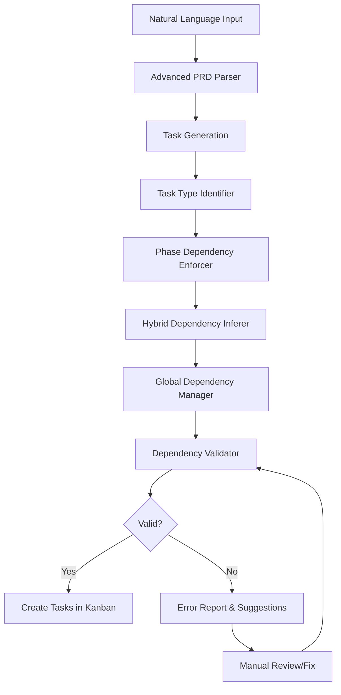

# Task Execution Order Fix Architecture

## Executive Summary

This document presents the architectural design for fixing task execution order issues in Marcus, where tasks are being assigned out of their logical development sequence (e.g., Test tasks before Implementation tasks). The solution introduces a robust four-layer approach: enhanced task type identification, strict phase dependency enforcement, global documentation dependencies, and comprehensive dependency validation.

## Problem Analysis

### Current State Issues

1. **Limited Task Type Detection**
   - Relies on basic keyword matching with limited vocabulary
   - Misses task variations and non-standard naming
   - Priority order doesn't capture all relationships

2. **Incomplete Safety Checks**
   - Only enforces deployment and testing dependencies
   - Missing Design → Implementation enforcement
   - No cross-feature dependency management

3. **Missing Global Dependencies**
   - Documentation tasks can be assigned prematurely
   - No mechanism for "depends on all" relationships
   - Feature-level dependencies not captured

4. **Lack of Validation**
   - Dependencies are inferred but not validated
   - No detection of illogical dependency chains
   - No feedback loop for dependency errors

## Proposed Architecture

### 1. Enhanced Task Type Identification System

```python
class TaskTypeIdentifier:
    """Robust task type identification with expanded patterns"""

    TASK_TYPE_PATTERNS = {
        TaskType.DESIGN: {
            'keywords': [
                'design', 'architect', 'plan', 'specification', 'wireframe',
                'mockup', 'diagram', 'blueprint', 'prototype', 'architecture',
                'planning', 'ui/ux', 'interface', 'layout', 'schema', 'model'
            ],
            'patterns': [
                r'design\s+(?:the\s+)?(\w+)',
                r'create\s+(?:a\s+)?(?:ui|ux|interface)',
                r'plan\s+(?:the\s+)?(?:architecture|structure)',
                r'define\s+(?:the\s+)?(?:api|schema|model)'
            ],
            'priority': 1  # Highest priority in identification
        },
        TaskType.IMPLEMENTATION: {
            'keywords': [
                'implement', 'build', 'create', 'develop', 'code', 'construct',
                'write', 'refactor', 'program', 'engineer', 'add', 'integrate',
                'setup', 'configure', 'initialize'
            ],
            'patterns': [
                r'implement\s+(?:the\s+)?(\w+)',
                r'build\s+(?:the\s+)?(\w+)',
                r'create\s+(?:the\s+)?(?!test|design)(\w+)',
                r'add\s+(?:support\s+for\s+)?(\w+)'
            ],
            'priority': 5  # Lower priority to avoid false matches
        },
        TaskType.TESTING: {
            'keywords': [
                'test', 'qa', 'quality', 'verify', 'validate', 'check',
                'assert', 'unittest', 'integration', 'e2e', 'coverage',
                'spec', 'suite', 'scenario', 'acceptance'
            ],
            'patterns': [
                r'(?:write|create|add)\s+tests?\s+for',
                r'test\s+(?:the\s+)?(\w+)',
                r'verify\s+(?:that\s+)?(\w+)',
                r'validate\s+(?:the\s+)?(\w+)'
            ],
            'priority': 2  # High priority to catch "write tests" tasks
        },
        TaskType.DOCUMENTATION: {
            'keywords': [
                'document', 'docs', 'readme', 'guide', 'tutorial', 'manual',
                'wiki', 'annotate', 'comment', 'explain', 'describe', 'api-docs',
                'changelog', 'notes'
            ],
            'patterns': [
                r'document\s+(?:the\s+)?(\w+)',
                r'write\s+(?:the\s+)?(?:docs|documentation)',
                r'create\s+(?:a\s+)?(?:guide|tutorial|manual)',
                r'update\s+(?:the\s+)?readme'
            ],
            'priority': 3
        }
    }

    def identify_task_type(self, task: Task) -> Tuple[TaskType, float]:
        """
        Identify task type with confidence score

        Returns:
            Tuple of (TaskType, confidence_score)
        """
        # Implementation combines keyword, pattern, and context analysis
```

### 2. Strict Phase Dependency Enforcement

```python
class PhaseDependencyEnforcer:
    """Enforce development lifecycle phase dependencies"""

    # Define phase ordering
    PHASE_ORDER = [
        TaskType.DESIGN,
        TaskType.INFRASTRUCTURE,
        TaskType.IMPLEMENTATION,
        TaskType.TESTING,
        TaskType.DOCUMENTATION,
        TaskType.DEPLOYMENT
    ]

    def enforce_phase_dependencies(self, tasks: List[Task]) -> List[Task]:
        """
        Ensure tasks follow proper phase ordering within features
        """
        # Group tasks by feature/component
        feature_groups = self._group_by_feature(tasks)

        for feature, feature_tasks in feature_groups.items():
            # Classify tasks by phase
            phase_tasks = self._classify_by_phase(feature_tasks)

            # Apply phase ordering rules
            for i, current_phase in enumerate(self.PHASE_ORDER):
                if current_phase not in phase_tasks:
                    continue

                # Tasks in current phase depend on all previous phases
                for prev_phase in self.PHASE_ORDER[:i]:
                    if prev_phase in phase_tasks:
                        self._add_phase_dependencies(
                            dependent_tasks=phase_tasks[current_phase],
                            dependency_tasks=phase_tasks[prev_phase]
                        )

        return tasks
```

### 3. Global Documentation Dependency System

```python
class GlobalDependencyManager:
    """Manage global dependencies like documentation depending on all"""

    def apply_global_dependencies(self, tasks: List[Task]) -> List[Task]:
        """
        Apply global dependency rules
        """
        # Documentation depends on ALL non-doc tasks
        doc_tasks = [t for t in tasks if self._is_documentation(t)]
        non_doc_tasks = [t for t in tasks if not self._is_documentation(t)]

        for doc_task in doc_tasks:
            # Clear existing dependencies to avoid conflicts
            doc_task.dependencies = []

            # Add dependency on all non-doc tasks
            for task in non_doc_tasks:
                if task.id not in doc_task.dependencies:
                    doc_task.dependencies.append(task.id)

        # Final deployment depends on documentation
        deployment_tasks = [t for t in tasks if self._is_deployment(t)]
        for deploy_task in deployment_tasks:
            for doc_task in doc_tasks:
                if doc_task.id not in deploy_task.dependencies:
                    deploy_task.dependencies.append(doc_task.id)

        return tasks
```

### 4. Dependency Validation Framework

```python
class DependencyValidator:
    """Validate dependency graph for logical consistency"""

    def validate_dependencies(self, tasks: List[Task]) -> ValidationResult:
        """
        Comprehensive dependency validation
        """
        errors = []
        warnings = []

        # Check 1: No test without implementation
        errors.extend(self._validate_test_dependencies(tasks))

        # Check 2: No implementation without design
        errors.extend(self._validate_implementation_dependencies(tasks))

        # Check 3: No circular dependencies
        errors.extend(self._detect_circular_dependencies(tasks))

        # Check 4: No orphaned tasks
        warnings.extend(self._detect_orphaned_tasks(tasks))

        # Check 5: Validate cross-feature dependencies
        errors.extend(self._validate_cross_feature_dependencies(tasks))

        return ValidationResult(
            is_valid=len(errors) == 0,
            errors=errors,
            warnings=warnings,
            dependency_graph=self._build_graph(tasks)
        )
```

## Implementation Architecture

### Component Integration Flow



### Data Models

```python
@dataclass
class EnhancedTask(Task):
    """Extended task model with phase information"""
    phase: TaskType
    phase_confidence: float
    feature_group: Optional[str]
    cross_feature_dependencies: List[str]
    validation_status: ValidationStatus

@dataclass
class DependencyValidationResult:
    """Result of dependency validation"""
    task_id: str
    task_name: str
    error_type: str  # 'missing_dependency', 'circular', 'invalid_phase'
    error_message: str
    suggested_fix: Optional[DependencyFix]
    severity: str  # 'error', 'warning', 'info'
```

### API Contracts

#### Task Type Identification API
```python
POST /api/identify-task-type
Request:
{
    "task_name": "string",
    "task_description": "string",
    "labels": ["string"],
    "context": {
        "project_type": "string",
        "existing_tasks": ["string"]
    }
}

Response:
{
    "task_type": "design|implementation|testing|documentation|deployment",
    "confidence": 0.95,
    "reasoning": "Identified as testing due to keywords: test, verify",
    "alternative_types": [
        {"type": "implementation", "confidence": 0.15}
    ]
}
```

#### Dependency Validation API
```python
POST /api/validate-dependencies
Request:
{
    "tasks": [
        {
            "id": "string",
            "name": "string",
            "type": "string",
            "dependencies": ["string"]
        }
    ],
    "validation_mode": "strict|normal|lenient"
}

Response:
{
    "is_valid": false,
    "errors": [
        {
            "task_id": "test-123",
            "error_type": "missing_dependency",
            "message": "Test task 'Test User API' has no implementation dependency",
            "suggested_dependencies": ["impl-456"],
            "severity": "error"
        }
    ],
    "warnings": [...],
    "suggested_order": ["design-1", "impl-1", "test-1", "doc-1"]
}
```

## Migration Strategy

### Phase 1: Enhanced Identification (Week 1)
1. Implement new TaskTypeIdentifier
2. Add confidence scoring
3. Deploy with logging only (no enforcement)
4. Collect metrics on identification accuracy

### Phase 2: Dependency Enforcement (Week 2)
1. Implement PhaseDependencyEnforcer
2. Add validation framework
3. Deploy in "warning mode"
4. Monitor and tune rules

### Phase 3: Full Rollout (Week 3)
1. Enable strict enforcement
2. Add UI for dependency visualization
3. Implement fix suggestions
4. Full production deployment

## Testing Strategy

### Unit Tests
- Test type identification with 100+ task name variations
- Validate phase ordering logic
- Test circular dependency detection
- Verify global dependency rules

### Integration Tests
- End-to-end project creation with proper ordering
- Multi-worker task assignment simulation
- Complex project scenarios with 50+ tasks
- Cross-feature dependency validation

### Performance Tests
- Dependency inference on 1000+ task projects
- Validation performance benchmarks
- Memory usage profiling

## Monitoring & Metrics

### Key Metrics
1. **Task Type Accuracy**: % of correctly identified task types
2. **Dependency Violations**: Count of tasks assigned out of order
3. **Validation Errors**: Number of dependency errors caught
4. **Assignment Success Rate**: % of tasks assigned without blockers

### Alerts
- Task assigned before dependencies complete
- Circular dependency detected
- High rate of validation errors
- Task type identification confidence < 70%

## Risk Mitigation

### Risk 1: Over-Constraining Dependencies
**Mitigation**: Configurable enforcement levels (strict/normal/lenient)

### Risk 2: Performance Impact
**Mitigation**: Caching, async validation, incremental updates

### Risk 3: Breaking Existing Projects
**Mitigation**: Gradual rollout, backwards compatibility mode

## Success Criteria

1. **Zero out-of-order assignments** for standard development workflows
2. **95%+ task type identification accuracy**
3. **< 100ms validation time** for 100-task projects
4. **90%+ reduction in "blocked task" reports**

## Future Enhancements

1. **ML-based task type identification** using historical data
2. **Dynamic dependency learning** from completed projects
3. **Cross-project dependency patterns** for common architectures
4. **Automated dependency resolution** for conflicts

## Conclusion

This architecture provides a comprehensive solution to the task execution order problem through:
- Robust task type identification with confidence scoring
- Strict phase-based dependency enforcement
- Global dependency rules for documentation and deployment
- Comprehensive validation with actionable error messages

The phased implementation approach ensures safe deployment with minimal disruption to existing workflows.
