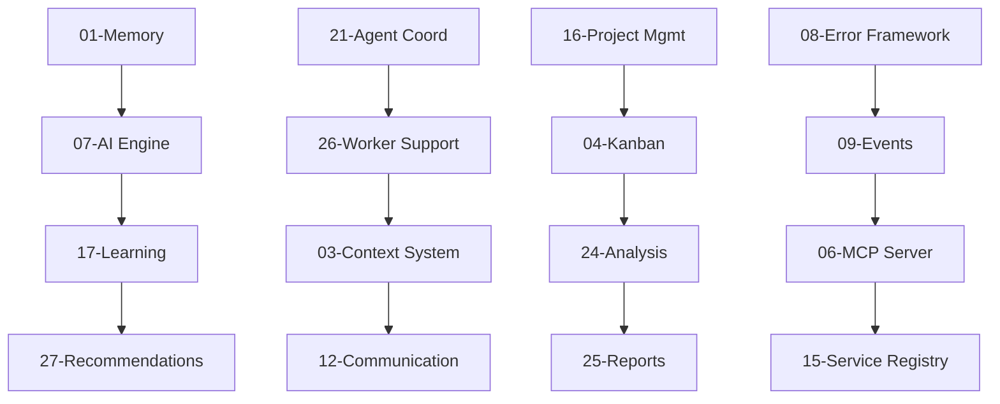

# 🏗️ Marcus System Architecture Documentation

Technical deep-dive documentation for all 32 systems powering Marcus's AI agent coordination platform.

---

## 📋 **System Overview**

Marcus is built on 32 interconnected systems that enable AI agents to collaborate autonomously. Each system is documented with implementation details, APIs, and integration patterns.

### **🎯 Quick Navigation**

| System Category | Files | Description |
|-----------------|-------|-------------|
| **Core Intelligence** | 01, 07, 17, 23, 27 | Memory, AI engine, learning, task intelligence, recommendations |
| **Agent Coordination** | 21, 26, 03, 12 | Agent management, worker support, context sharing, communication |
| **Project Management** | 16, 04, 24, 25 | Project control, Kanban integration, analysis, reporting |
| **Data & Storage** | 10, 32, 13, 19 | Persistence, models, cost tracking, NLP processing |
| **Quality & Testing** | 18, 30, 11, 29 | QA systems, testing framework, monitoring, detection |
| **Infrastructure** | 08, 09, 06, 14, 15 | Error handling, events, MCP server, isolation, service registry |
| **Operations** | 22, 20, 28, 31 | Operational modes, pipelines, configuration, resilience |
| **Visualization** | 05, 02 | UI systems, logging and visualization |

---

## 🧠 **Core Intelligence Systems**

### **[01 - Memory System](01-memory-system.md)**
Multi-tier cognitive memory (Working, Episodic, Semantic, Procedural) that enables learning and context retention across projects.

### **[07 - AI Intelligence Engine](07-ai-intelligence-engine.md)**
Hybrid AI decision-making system combining multiple AI providers with context-aware prompt engineering.

### **[17 - Learning Systems](17-learning-systems.md)**
Continuous learning from project outcomes, pattern recognition, and performance optimization.

### **[23 - Task Management Intelligence](23-task-management-intelligence.md)**
Intelligent task analysis, dependency inference, and automatic task breakdown.

### **[27 - Recommendation Engine](27-recommendation-engine.md)**
AI-powered recommendations for task assignment, technology choices, and workflow optimization.

---

## 🤖 **Agent Coordination Systems**

### **[21 - Agent Coordination](21-agent-coordination.md)**
Core agent lifecycle management, registration, assignment, and communication protocols.

### **[26 - Worker Support](26-worker-support.md)**
Tools and utilities that help AI agents work more effectively with context and error recovery.

### **[03 - Context & Dependency System](03-context-dependency-system.md)**
Intelligent context sharing between agents and automatic dependency resolution.

### **[12 - Communication Hub](12-communication-hub.md)**
Message routing and communication infrastructure between agents and Marcus core.

---

## 📊 **Project Management Systems**

### **[16 - Project Management](16-project-management.md)**
High-level project creation, tracking, and completion management.

### **[04 - Kanban Integration](04-kanban-integration.md)**
Multi-provider Kanban board integration (Planka, Trello, GitHub Projects, Linear).

### **[24 - Analysis Tools](24-analysis-tools.md)**
Project analytics, performance metrics, and insight generation.

### **[25 - Report Generation](25-report-generation.md)**
Automated report creation for project status, agent performance, and system health.

---

## 🗄️ **Data & Storage Systems**

### **[10 - Persistence Layer](10-persistence-layer.md)**
Data storage abstraction supporting multiple backends (JSON, SQLite, PostgreSQL).

### **[32 - Core Models](32-core-models.md)**
Data models for tasks, agents, projects, and system entities.

### **[13 - Cost Tracking](13-cost-tracking.md)**
API usage monitoring and cost optimization across AI providers.

### **[19 - NLP System](19-nlp-system.md)**
Natural language processing for task analysis and context extraction.

---

## ✅ **Quality & Testing Systems**

### **[18 - Quality Assurance](18-quality-assurance.md)**
Automated quality checks, code review, and deployment validation.

### **[30 - Testing Framework](30-testing-framework.md)**
Comprehensive testing infrastructure for all Marcus components.

### **[11 - Monitoring Systems](11-monitoring-systems.md)**
Real-time system monitoring, health checks, and alerting.

### **[29 - Detection Systems](29-detection-systems.md)**
Anomaly detection, error pattern recognition, and preventive measures.

---

## 🏭 **Infrastructure Systems**

### **[08 - Error Framework](08-error-framework.md)**
Comprehensive error handling with automatic recovery and escalation.

### **[09 - Event-Driven Architecture](09-event-driven-architecture.md)**
Publish/subscribe system for loose coupling and scalability.

### **[06 - MCP Server](06-mcp-server.md)**
Model Context Protocol server implementation for AI agent integration.

### **[14 - Workspace Isolation](14-workspace-isolation.md)**
Secure isolation between agents and projects.

### **[15 - Service Registry](15-service-registry.md)**
Dynamic service discovery and health management.

---

## ⚙️ **Operations Systems**

### **[22 - Operational Modes](22-operational-modes.md)**
Different operation modes (development, staging, production) with appropriate configurations.

### **[20 - Pipeline Systems](20-pipeline-systems.md)**
CI/CD pipelines and workflow automation.

### **[28 - Configuration Management](28-configuration-management.md)**
Dynamic configuration system with environment-based overrides.

### **[31 - Resilience](31-resilience.md)**
Fault tolerance, circuit breakers, and graceful degradation.

---

## 🎨 **Visualization Systems**

### **[05 - Visualization System](05-visualization-system.md)**
Real-time dashboards and project visualization tools.

### **[02 - Logging System](02-logging-system.md)**
Comprehensive logging infrastructure with multiple output formats.

---

## 🔍 **How to Use This Documentation**

### **For New Developers**
1. Start with **Core Intelligence** systems to understand how Marcus thinks
2. Review **Agent Coordination** to understand agent workflows
3. Check **Infrastructure** systems for integration patterns

### **For System Integration**
1. Review **MCP Server** (06) for API integration
2. Check **Error Framework** (08) for proper error handling
3. Study **Configuration Management** (28) for setup

### **For Extension Development**
1. Understand **Event-Driven Architecture** (09) for loose coupling
2. Review **Service Registry** (15) for service discovery
3. Check **Testing Framework** (30) for validation

### **For Operations**
1. Study **Monitoring Systems** (11) for observability
2. Review **Resilience** (31) for fault tolerance
3. Check **Pipeline Systems** (20) for deployment

---

## 🔗 **System Interdependencies**

---

## 📈 **System Metrics**

- **32 Total Systems** documented
- **4 Core Intelligence** systems for AI decision-making
- **4 Agent Coordination** systems for workflow management
- **8 Infrastructure** systems for reliability and scalability
- **6 Quality & Testing** systems for reliability
- **Rest**: Project management, data storage, operations, and visualization

---

## 🤝 **Contributing to System Documentation**

When modifying systems:

1. **Update the relevant system documentation**
2. **Update this README** if adding/removing systems
3. **Update interdependency diagrams** if changing relationships
4. **Add integration examples** for new APIs
5. **Document breaking changes** clearly

---

## 💡 **Implementation Notes**

- All systems follow **Event-Driven Architecture** principles
- **Error Framework** provides consistent error handling across systems
- **Configuration Management** allows per-environment customization
- **Testing Framework** ensures all systems maintain quality standards
- **MCP Server** exposes unified API regardless of internal complexity

---

*Each system is designed to be independently testable, scalable, and maintainable while contributing to Marcus's overall AI agent coordination capabilities.*
