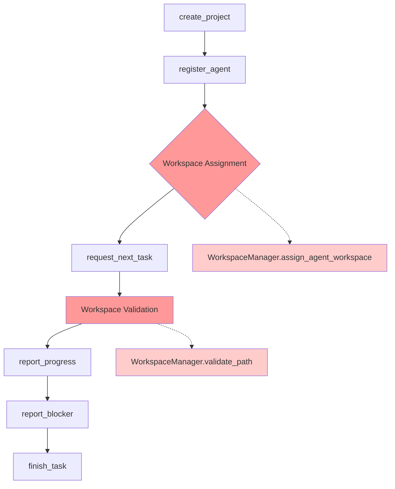
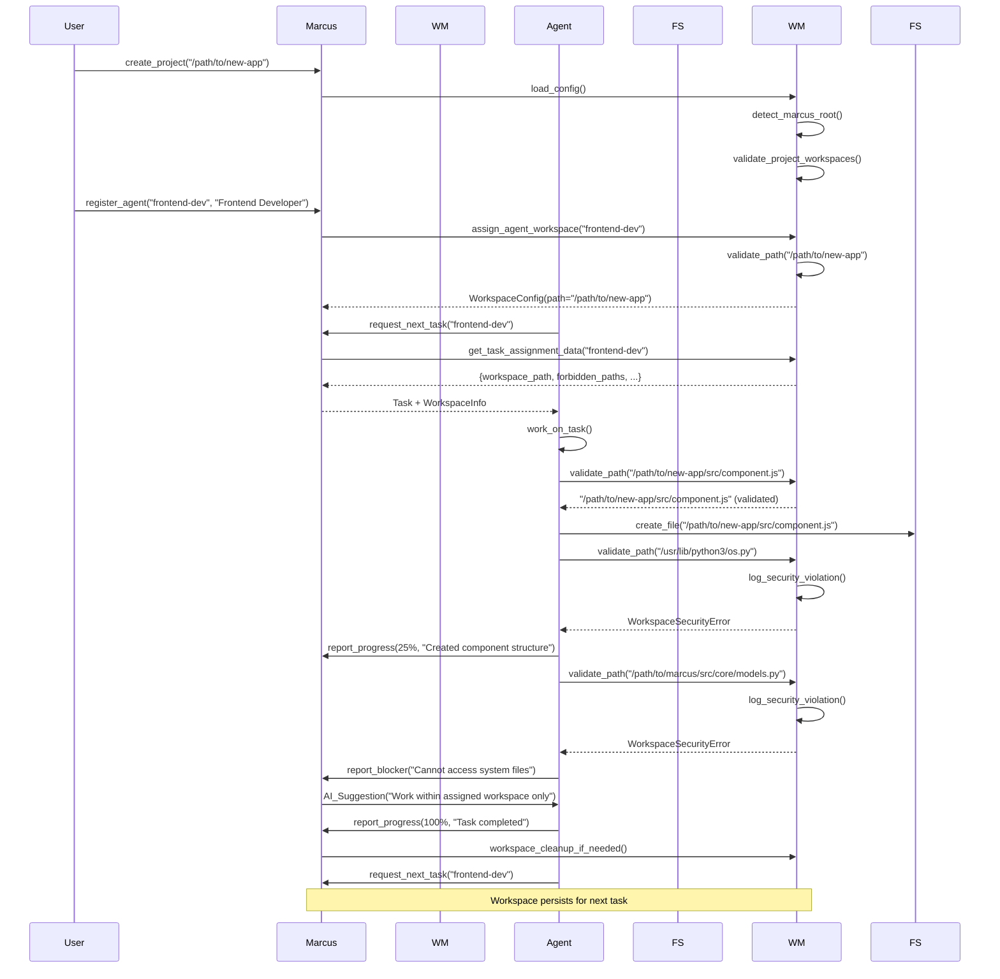

# Workspace Isolation System

## Overview

The Workspace Isolation system is Marcus's security backbone that enforces strict boundaries between autonomous agents and critical system resources. It provides multi-layered security isolation, preventing agents from accessing the Marcus installation directory, system files, and other agents' workspaces while enabling secure, sandboxed execution environments.

## Architecture

### Core Components

```
WorkspaceManager
├── Security Enforcement Layer
│   ├── Marcus Installation Detection
│   ├── System Path Protection
│   ├── Dynamic Forbidden Path Management
│   └── Real-time Path Validation
├── Workspace Management Layer
│   ├── Agent Workspace Assignment
│   ├── Project Workspace Configuration
│   ├── Multi-tenancy Support
│   └── Isolation Boundary Enforcement
└── Integration Layer
    ├── Task Assignment Integration
    ├── Configuration Management
    ├── Audit Logging
    └── MCP Tool Security Wrapper
```

### Data Models

**WorkspaceConfig**: Individual agent workspace configuration
```python
@dataclass
class WorkspaceConfig:
    workspace_id: str      # Unique workspace identifier
    path: str             # Absolute filesystem path
    agent_id: Optional[str] # Assigned agent ID
    is_readonly: bool     # Read-only workspace flag
```

**ProjectWorkspaces**: Project-level workspace organization
```python
@dataclass
class ProjectWorkspaces:
    main_workspace: str                    # Primary project directory
    agent_workspaces: Dict[str, str]      # Agent-specific directories
```

**WorkspaceSecurityError**: Security violation exception
```python
class WorkspaceSecurityError(Exception):
    """Raised when security boundaries are violated"""
```

## Marcus Ecosystem Integration

### Position in Architecture

The Workspace Isolation system operates as a **foundational security layer** that underpins all agent operations:

```
┌─────────────────────────────────────────┐
│             MCP Server Layer            │
├─────────────────────────────────────────┤
│          Task Management Layer          │
├─────────────────────────────────────────┤
│         Agent Assignment Layer          │
├─────────────────────────────────────────┤
│    >>>  WORKSPACE ISOLATION LAYER  <<< │ ← Security Enforcement Point
├─────────────────────────────────────────┤
│           File System Layer             │
└─────────────────────────────────────────┘
```

### Integration Points

1. **Task Assignment System**: Workspace paths are embedded in TaskAssignment objects
2. **Agent Registration**: Workspace assignment occurs during agent initialization
3. **Configuration Management**: Integrates with Marcus configuration system
4. **Error Framework**: Uses Marcus error handling for security violations
5. **Audit System**: Logs security events for monitoring and compliance

## Workflow Integration

### Typical Marcus Workflow Position



**Key Integration Points:**

1. **Agent Registration** → Workspace assignment via `assign_agent_workspace()`
2. **Task Assignment** → Workspace data embedded in task context
3. **File Operations** → Every file access validated via `validate_path()`
4. **Progress Reporting** → Workspace violations logged and reported
5. **Task Completion** → Workspace maintained for next assignment

### Invocation Triggers

The system is invoked at multiple critical points:

**Initialization Phase:**
- During Marcus server startup for configuration loading
- During agent registration for workspace assignment
- During project setup for workspace hierarchy creation

**Runtime Phase:**
- Before every file system operation by agents
- During task assignment for workspace context injection
- During progress reporting for path validation
- During error handling for security violation logging

## What Makes This System Special

### 1. **Automatic Marcus Detection**
Unlike traditional security systems requiring manual configuration, the Workspace Isolation system automatically detects the Marcus installation directory using intelligent path analysis:

```python
def _detect_marcus_root(self) -> str:
    # Navigate up from src/core/workspace.py to find Marcus root
    # Validates against expected markers: ["src", "scripts", "config_marcus.json"]
    current_file = os.path.abspath(__file__)
    marcus_root = os.path.dirname(os.path.dirname(os.path.dirname(current_file)))
    return marcus_root
```

This prevents agents from accidentally or maliciously modifying Marcus itself.

### 2. **Dynamic Security Boundaries**
The system adapts to different deployment environments by automatically detecting system paths:

```python
def _add_system_paths_to_forbidden(self) -> None:
    forbidden_prefixes = [
        "/usr/lib/python",           # System Python libraries
        "/usr/local/lib/python",     # Local Python installations
        "/opt/homebrew/lib/python",  # macOS Homebrew Python
        "/System/Library",           # macOS system libraries
        os.path.dirname(os.__file__), # Python installation root
    ]
```

### 3. **Zero-Configuration Security**
Works out-of-the-box without requiring security configuration, while supporting advanced customization through JSON configuration files.

### 4. **Multi-Tenant Architecture**
Supports multiple agents working simultaneously with complete isolation between their workspaces, preventing data leakage and conflicts.

### 5. **Proactive Path Expansion**
All paths are automatically expanded to absolute paths and user home directories are resolved, preventing relative path attacks:

```python
def __post_init__(self) -> None:
    self.path = os.path.abspath(os.path.expanduser(self.path))
```

## Technical Implementation Details

### Security Enforcement Algorithm

**Path Validation Process:**
1. **Path Normalization**: Convert to absolute path with user expansion
2. **Forbidden Path Checking**: Compare against all forbidden path prefixes
3. **Security Exception**: Raise `WorkspaceSecurityError` for violations
4. **Audit Logging**: Record all violations with context
5. **Valid Path Return**: Return normalized path for allowed access

```python
def validate_path(self, path: str) -> str:
    absolute_path = os.path.abspath(os.path.expanduser(path))

    for forbidden in self.forbidden_paths:
        if absolute_path.startswith(forbidden):
            raise WorkspaceSecurityError(
                f"Access denied: {path} is within forbidden path {forbidden}"
            )

    return absolute_path
```

### Workspace Assignment Strategy

**Three-Tier Assignment Logic:**
1. **Explicit Assignment**: Direct workspace path provided by caller
2. **Pre-configured Assignment**: Agent-specific workspace from configuration
3. **Fallback Assignment**: Main project workspace as default

```python
def assign_agent_workspace(self, agent_id: str, workspace_path: Optional[str] = None) -> WorkspaceConfig:
    if workspace_path:
        # Tier 1: Explicit assignment
        workspace = WorkspaceConfig(workspace_id=f"{agent_id}_workspace", path=workspace_path, agent_id=agent_id)
    elif self.project_config and agent_id in self.project_config.agent_workspaces:
        # Tier 2: Pre-configured
        workspace = WorkspaceConfig(workspace_id=f"{agent_id}_workspace",
                                  path=self.project_config.agent_workspaces[agent_id], agent_id=agent_id)
    elif self.project_config:
        # Tier 3: Fallback
        workspace = WorkspaceConfig(workspace_id=f"{agent_id}_workspace",
                                  path=self.project_config.main_workspace, agent_id=agent_id)
    else:
        raise ValueError(f"No workspace available for agent {agent_id}")
```

### Configuration System

**JSON Configuration Schema:**
```json
{
  "project": {
    "workspaces": {
      "main": "/path/to/project",
      "agents": {
        "frontend-agent": "/path/to/frontend",
        "backend-agent": "/path/to/backend",
        "database-agent": "/path/to/database"
      }
    }
  },
  "security": {
    "additional_forbidden_paths": [
      "/etc/sensitive",
      "/var/secrets"
    ]
  }
}
```

**Configuration Discovery Order:**
1. XDG config directory (`~/.config/marcus/config.json`)
2. Local Marcus root (`marcus_root/config_marcus.json`)
3. Environment variable (`MARCUS_CONFIG`)

### Performance Optimizations

**Path Validation Caching**: Forbidden paths stored as a set for O(1) lookup performance
**Lazy Configuration Loading**: Configuration only loaded when workspace assignment occurs
**Absolute Path Pre-computation**: All paths normalized during configuration to avoid runtime overhead

## Pros and Cons Analysis

### Advantages

**Security Benefits:**
- ✅ **Zero-Trust Architecture**: No implicit trust, every path validated
- ✅ **Automatic Protection**: Marcus installation protected without configuration
- ✅ **Multi-Agent Isolation**: Complete separation between agent workspaces
- ✅ **System Protection**: Python installations and system directories protected
- ✅ **Audit Trail**: Complete logging of security violations

**Operational Benefits:**
- ✅ **Zero Configuration**: Works immediately after installation
- ✅ **Flexible Deployment**: Adapts to different environments automatically
- ✅ **Simple Integration**: Clean API for task assignment systems
- ✅ **Error Handling**: Clear security exceptions with actionable messages
- ✅ **Configuration Override**: Advanced users can customize security policies

**Development Benefits:**
- ✅ **Testable Design**: Clear interfaces enable comprehensive testing
- ✅ **Extensible Architecture**: Easy to add new security policies
- ✅ **Type Safety**: Full type annotations prevent configuration errors
- ✅ **Documentation**: Comprehensive docstrings and examples

### Limitations

**Functional Limitations:**
- ❌ **Static Boundaries**: Security boundaries defined at startup, not dynamic
- ❌ **Path-Based Only**: No content-based security or file permission integration
- ❌ **No Network Security**: Only filesystem isolation, no network restrictions
- ❌ **Limited Audit Storage**: Currently logs to stderr, no persistent audit log

**Operational Limitations:**
- ❌ **Configuration Complexity**: Advanced multi-project setups require manual JSON configuration
- ❌ **Platform Dependencies**: Some system path detection may not work on all platforms
- ❌ **Performance Impact**: Every file operation requires path validation
- ❌ **No Runtime Policy Updates**: Security policies cannot be changed without restart

**Integration Limitations:**
- ❌ **MCP Tool Dependency**: Requires integration with each MCP tool for enforcement
- ❌ **No Cross-Agent Communication**: Agents cannot collaborate through shared workspaces
- ❌ **Limited Task Context**: Workspace information not automatically propagated to all task data

## Design Rationale

### Why This Approach Was Chosen

**1. Defense in Depth Strategy**
The system implements multiple security layers rather than relying on a single mechanism:
- Automatic Marcus root detection prevents self-modification
- System path protection prevents library corruption
- Agent workspace isolation prevents data leakage
- Path validation prevents directory traversal attacks

**2. Fail-Safe Security Model**
When security cannot be determined, the system fails closed (denies access) rather than open:
- Unknown paths are forbidden until explicitly validated
- Configuration errors prevent workspace assignment
- Missing workspaces prevent agent operation

**3. Operational Simplicity**
Security that requires extensive configuration often remains misconfigured:
- Zero-configuration default security posture
- Automatic environment detection
- Clear error messages for troubleshooting
- Simple JSON configuration for advanced needs

**4. Integration-First Design**
Rather than bolting security onto existing systems, it was designed as a foundational layer:
- Clean API for task assignment integration
- Structured data models for workspace information
- Event-driven audit logging
- Exception-based error handling

### Alternative Approaches Considered

**Container-Based Isolation**: Rejected due to complexity and deployment requirements
**chroot/jail Systems**: Rejected due to platform limitations and permission requirements
**Permission-Based Security**: Rejected due to complexity of managing file system permissions
**Agent-Enforced Security**: Rejected due to inability to trust agent implementations

## Future Evolution

### Planned Enhancements

**1. Dynamic Security Policies (v2.0)**
- Runtime policy updates without system restart
- Role-based access control for different agent types
- Time-based access restrictions for temporary tasks
- Content-based security policies (file type restrictions)

**2. Advanced Audit System (v2.1)**
- Persistent audit log storage with rotation
- Real-time security monitoring and alerting
- Security analytics and violation pattern detection
- Integration with external SIEM systems

**3. Enhanced Multi-Tenancy (v2.2)**
- Project-level isolation boundaries
- Shared workspace pools for collaboration
- Resource quotas and usage tracking
- Cross-project security policy inheritance

**4. Network Security Integration (v2.3)**
- Network access restrictions per agent
- API endpoint access control
- External service connection monitoring
- VPN/tunnel integration for secure communication

### Extensibility Points

**Custom Security Providers**: Plugin architecture for organization-specific security policies
**Integration Hooks**: Events and callbacks for external security system integration
**Policy Templates**: Pre-configured security templates for common deployment patterns
**Compliance Frameworks**: Built-in support for SOC2, HIPAA, and other compliance requirements

## Task Complexity Handling

### Simple Tasks
For straightforward tasks with minimal file operations:

- **Single workspace assignment**: Agent gets main project workspace
- **Basic path validation**: Standard forbidden path checking
- **Minimal overhead**: Fast validation with cached forbidden paths
- **Simple audit**: Basic violation logging to stderr

Example: A simple file editing task operates within the main project directory with minimal security overhead.

### Complex Tasks
For multi-component tasks requiring diverse file access:

- **Hierarchical workspace assignment**: Agents may get specialized sub-workspaces
- **Extended validation**: Additional path checking for complex directory structures
- **Enhanced audit logging**: Detailed violation tracking with context
- **Configuration-driven policies**: Custom security rules for complex projects

Example: A full-stack development task might assign separate workspaces for frontend, backend, and database components.

### Task-Specific Workspace Strategy

**Backend Development Tasks**:
```json
{
  "agents": {
    "backend-agent": "/project/server",
    "database-agent": "/project/database",
    "api-agent": "/project/api"
  }
}
```

**Frontend Development Tasks**:
```json
{
  "agents": {
    "ui-agent": "/project/client",
    "styling-agent": "/project/assets",
    "testing-agent": "/project/tests"
  }
}
```

## Board-Specific Considerations

### Kanban Board Integration

The Workspace Isolation system integrates with Kanban board providers through task metadata:

**Task Assignment Enhancement**:
- Workspace paths embedded in Kanban card descriptions
- Security policies reflected in task labels and tags
- Violation alerts posted as card comments
- Workspace assignment tracked in card custom fields

**Board-Specific Workspace Strategies**:

**Development Boards**: Separate workspaces per feature branch
```json
{
  "feature-auth": "/project/features/auth",
  "feature-payment": "/project/features/payment"
}
```

**Testing Boards**: Isolated test environments per test type
```json
{
  "unit-tests": "/project/tests/unit",
  "integration-tests": "/project/tests/integration",
  "e2e-tests": "/project/tests/e2e"
}
```

**Deployment Boards**: Environment-specific workspace isolation
```json
{
  "staging-deploy": "/deploy/staging",
  "production-deploy": "/deploy/production"
}
```

### Board Security Policies

Different board types may require different security postures:

- **Public Boards**: Stricter isolation, read-only workspaces
- **Internal Boards**: Standard isolation with full workspace access
- **Sensitive Boards**: Enhanced audit logging, additional forbidden paths
- **Compliance Boards**: Extended validation, mandatory security configurations

## Seneca Integration

### Context Bridge Integration

The Workspace Isolation system provides security context to Seneca's Context Bridge:

**Secure Context Propagation**:
```python
context_data = {
    "workspace_security": {
        "agent_workspace": workspace.path,
        "forbidden_paths": manager.get_forbidden_paths(),
        "security_level": workspace.security_level,
        "audit_enabled": True
    }
}
```

**Cross-Task Security Continuity**:
When Seneca propagates context between related tasks, workspace security boundaries are maintained:
- Previous task workspace paths included in context
- Security violations from previous tasks influence current assignment
- Workspace recommendations based on task relationships
- Security policy inheritance through task dependency chains

### Memory System Security

Seneca's memory system respects workspace boundaries:

**Pattern Storage**: Learning patterns stored per-workspace to prevent cross-contamination
**Decision Context**: Security decisions included in memory context for future reference
**Violation Patterns**: Security violations analyzed to improve future workspace assignments

### Enhanced Context Integration

**Security-Aware Task Assignment**:
```python
def get_task_assignment_data(self, agent_id: str) -> Dict[str, Any]:
    return {
        "workspace_path": workspace.path,
        "forbidden_paths": self.get_forbidden_paths(),
        "security_context": {
            "previous_violations": self.get_agent_violations(agent_id),
            "trust_level": self.calculate_agent_trust(agent_id),
            "workspace_history": self.get_workspace_history(agent_id)
        }
    }
```

## Typical Scenario Workflow

### Complete Marcus Workflow with Workspace Integration



### Security Decision Points

**1. Project Creation** → Workspace hierarchy validation
**2. Agent Registration** → Workspace assignment and validation
**3. Task Assignment** → Security context injection
**4. File Operations** → Real-time path validation
**5. Progress Reporting** → Security violation handling
**6. Blocker Resolution** → Security-aware recommendations
**7. Task Completion** → Workspace persistence decision

### Error Recovery Scenarios

**Workspace Assignment Failure**:
```
register_agent → assign_workspace → SecurityError → fallback_workspace → retry
```

**Runtime Security Violation**:
```
file_operation → validate_path → SecurityError → log_violation → suggest_alternative
```

**Configuration Error**:
```
load_config → validate_workspaces → ConfigError → use_defaults → notify_admin
```

## Summary

The Workspace Isolation system represents a sophisticated yet practical approach to securing autonomous agent environments. By combining automatic security detection, flexible configuration, and deep integration with the Marcus ecosystem, it provides robust protection while maintaining operational simplicity.

Its position as a foundational security layer ensures that all agent operations benefit from consistent security enforcement, while its extensible design allows for future enhancements in dynamic security policies, advanced audit capabilities, and enhanced multi-tenancy support.

The system's success lies in its balance of security rigor and operational practicality - providing enterprise-grade security boundaries while requiring zero configuration for basic use cases. This makes it suitable for both simple development tasks and complex, multi-agent enterprise deployments.
