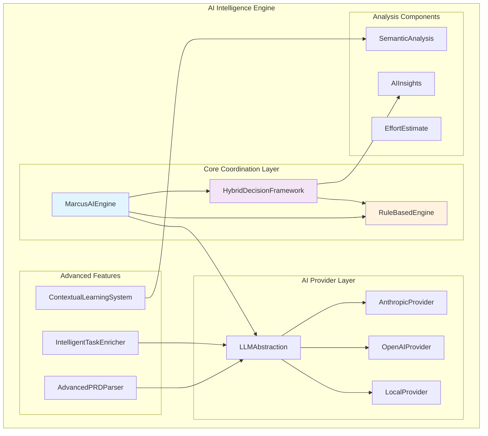
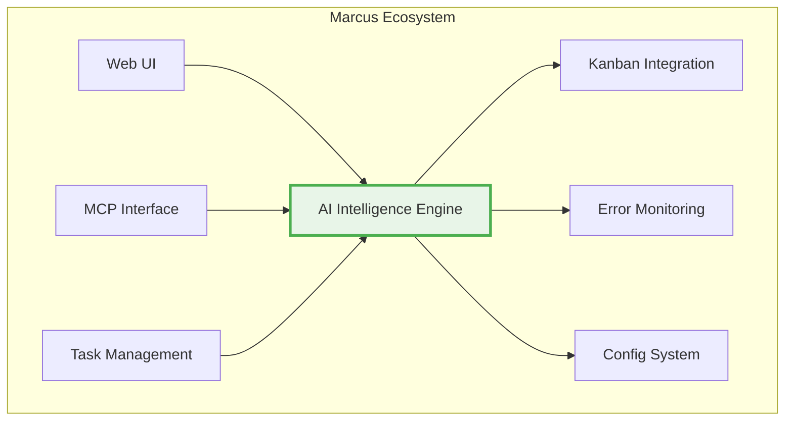

# AI Intelligence Engine System

## Table of Contents
1. [System Overview](#system-overview)
2. [Architecture](#architecture)
3. [Marcus Ecosystem Integration](#marcus-ecosystem-integration)
4. [Workflow Integration](#workflow-integration)
5. [Special Features](#special-features)
6. [Technical Implementation](#technical-implementation)
7. [Pros and Cons](#pros-and-cons)
8. [Design Rationale](#design-rationale)
9. [Future Evolution](#future-evolution)
10. [Task Complexity Handling](#task-complexity-handling)
11. [Board-Specific Considerations](#board-specific-considerations)
12. [Seneca Integration](#seneca-integration)
13. [Typical Scenario Flow](#typical-scenario-flow)

## System Overview

The AI Intelligence Engine is Marcus's hybrid AI system that combines rule-based safety guarantees with advanced AI capabilities to provide intelligent project management, task analysis, and decision-making. Unlike traditional AI systems that operate in isolation, Marcus's AI Engine implements a **hybrid intelligence model** where deterministic rules provide safety constraints while AI provides semantic understanding and optimization.

### Core Principle
**Rules provide safety guarantees; AI provides intelligence enhancement.**

The system operates on a fundamental safety-first principle where AI can never override safety-critical rules but can enhance decision-making when rules permit. This ensures system reliability while leveraging AI's semantic understanding capabilities.

### Key Capabilities
- **Hybrid Decision Making**: Merges rule-based validation with AI-powered optimization
- **Semantic Task Analysis**: Deep understanding of task intent, dependencies, and risks
- **Intelligent Task Enrichment**: AI-enhanced task descriptions, estimates, and acceptance criteria
- **Advanced PRD Parsing**: Natural language requirements → actionable task breakdown
- **Contextual Learning**: Team, technology, and project-specific pattern learning
- **Multi-Provider LLM Support**: Seamless switching between AI providers (Anthropic, OpenAI, local models)

## Architecture

The AI Intelligence Engine follows a layered architecture with clear separation of concerns:



### Component Hierarchy

1. **MarcusAIEngine** (Central Coordinator)
   - Orchestrates all AI operations
   - Manages rule-AI integration
   - Provides main API interface

2. **RuleBasedEngine** (Safety Foundation)
   - Implements Phase 1-2 safety logic
   - Provides deterministic validation
   - Cannot be overridden by AI

3. **HybridDecisionFramework** (Decision Merger)
   - Combines rule and AI results
   - Manages confidence weighting
   - Ensures safety compliance

4. **LLMAbstraction** (Provider Management)
   - Unified interface across LLM providers
   - Automatic fallback handling
   - Performance tracking

5. **Advanced Features** (AI Enhancement)
   - AdvancedPRDParser: Requirements → Tasks
   - IntelligentTaskEnricher: AI task enhancement
   - ContextualLearningSystem: Pattern learning

## Marcus Ecosystem Integration

### Position in Marcus Architecture
The AI Intelligence Engine sits at the **intelligence layer** of Marcus, providing cognitive capabilities to all other systems:



### Integration Points
- **Task Assignment Engine**: Provides intelligent assignment decisions
- **Project Creation**: Converts requirements into structured task lists
- **Task Enrichment**: Enhances task metadata with AI insights
- **Blocker Resolution**: Analyzes blockers and suggests solutions
- **Performance Learning**: Learns from completed projects for future optimization

### Data Flow
1. **Input**: Natural language requirements, task data, project context
2. **Processing**: Semantic analysis, rule validation, AI enhancement
3. **Output**: Structured decisions, enriched tasks, intelligent suggestions

## Workflow Integration

The AI Intelligence Engine is invoked at several key points in the Marcus workflow:

### 1. Project Creation (`create_project`)
```python
# AI Engine converts PRD → Task Breakdown
prd_parser = AdvancedPRDParser()
task_result = await prd_parser.parse_prd_to_tasks(
    prd_content=project_description,
    constraints=project_constraints
)
```

**AI Responsibilities:**
- Parse natural language requirements
- Generate hierarchical task structure
- Estimate effort and timelines
- Identify dependencies and risks
- Create acceptance criteria

### 2. Agent Registration (`register_agent`)
```python
# AI provides agent capability analysis
agent_insights = await ai_engine.analyze_agent_capabilities(
    agent_profile=agent_data,
    project_context=project_info
)
```

**AI Responsibilities:**
- Analyze agent skill matching
- Suggest optimal role assignments
- Identify training needs

### 3. Task Assignment (`request_next_task`)
```python
# Hybrid decision for task assignment
decision = await ai_engine.analyze_with_hybrid_intelligence(
    context=AnalysisContext(
        task=candidate_task,
        project_context=project_state
    )
)
```

**AI Responsibilities:**
- Validate assignment safety (rules)
- Optimize assignment quality (AI)
- Provide enhancement suggestions
- Calculate confidence scores

### 4. Progress Reporting (`report_progress`)
```python
# AI enhances progress understanding
enhanced_progress = await ai_engine.enhance_task_with_ai(
    task=current_task,
    context=project_context
)
```

**AI Responsibilities:**
- Enhance task descriptions
- Update effort estimates
- Suggest optimizations

### 5. Blocker Analysis (`report_blocker`)
```python
# AI analyzes blockers and suggests solutions
suggestions = await ai_engine.analyze_blocker(
    task_id=blocked_task.id,
    blocker_description=blocker_text,
    severity=blocker_severity,
    agent=agent_info,
    task=blocked_task
)
```

**AI Responsibilities:**
- Understand blocker context
- Generate solution strategies
- Prioritize recommendations
- Learn from resolution patterns

### 6. Task Completion (`finish_task`)
```python
# AI learns from completion for future optimization
learning_data = await ai_engine.learn_from_completion(
    task=completed_task,
    outcome=completion_data
)
```

**AI Responsibilities:**
- Extract performance patterns
- Update estimation models
- Improve future assignments

## Special Features

### 1. Hybrid Intelligence Model
**What makes it special**: Unlike pure AI or pure rule-based systems, Marcus implements true hybrid intelligence where rules and AI complement each other with defined precedence.

```python
class MarcusAIEngine:
    async def analyze_with_hybrid_intelligence(self, context: AnalysisContext) -> HybridAnalysis:
        # Step 1: Rule validation (mandatory, never bypassed)
        rule_result = await self.rule_engine.analyze(context)

        # Step 2: AI enhancement (only when rules allow)
        if rule_result.is_valid:
            ai_insights = await self._get_ai_insights(context)

        # Step 3: Hybrid confidence calculation
        final_confidence = self._calculate_hybrid_confidence(
            rule_result.confidence,
            ai_insights.confidence if ai_insights else None
        )
```

### 2. Provider Abstraction with Intelligent Fallback
**What makes it special**: Seamless switching between AI providers with automatic fallback and performance tracking.

```python
class LLMAbstraction:
    async def _execute_with_fallback(self, method_name: str, **kwargs) -> Any:
        providers_to_try = [self.current_provider] + self.fallback_providers

        for provider_name in providers_to_try:
            try:
                result = await self.providers[provider_name].method(**kwargs)
                # Track success and return
                return result
            except Exception as e:
                # Log failure, try next provider
                continue
```

### 3. Contextual Learning System
**What makes it special**: Learns patterns specific to teams, technologies, and project types rather than generic patterns.

```python
class ContextualLearningSystem:
    async def learn_team_patterns(self, team_id: str, completed_projects: List[Dict]) -> TeamLearnings:
        # Analyze team-specific velocity, skills, preferences
        velocity_patterns = self._analyze_team_velocity(completed_projects)
        skill_strengths = self._analyze_team_skills(completed_projects)
        # Return context-specific learnings
```

### 4. Advanced PRD Parsing
**What makes it special**: Converts natural language requirements into complete project breakdowns with intelligent task generation, dependency inference, and risk assessment.

```python
class AdvancedPRDParser:
    async def parse_prd_to_tasks(self, prd_content: str, constraints: ProjectConstraints) -> TaskGenerationResult:
        # Deep PRD analysis
        prd_analysis = await self._analyze_prd_deeply(prd_content)

        # Generate task hierarchy
        tasks = await self._create_detailed_tasks(task_hierarchy, prd_analysis, constraints)

        # AI-powered dependency inference
        dependencies = await self._infer_smart_dependencies(tasks, prd_analysis)

        # Risk assessment and timeline prediction
        risk_assessment = await self._assess_implementation_risks(tasks, prd_analysis, constraints)
```

## Technical Implementation

### Core Data Structures

```python
@dataclass
class AnalysisContext:
    """Context for AI analysis operations"""
    task: Task
    project_context: Dict[str, Any]
    historical_data: List[Dict[str, Any]]
    team_context: Optional[Dict[str, Any]] = None
    constraints: Optional[Dict[str, Any]] = None

@dataclass
class HybridAnalysis:
    """Result of hybrid rule-based + AI analysis"""
    allow_assignment: bool
    confidence: float
    reason: str
    safety_critical: bool = False
    ai_confidence: Optional[float] = None
    ai_insights: Optional[AIInsights] = None
    confidence_breakdown: Optional[Dict[str, float]] = None
```

### Confidence Calculation Algorithm

The system uses weighted confidence scores that prioritize rule-based decisions:

```python
def _calculate_hybrid_confidence(self, rule_confidence: float, ai_confidence: Optional[float]) -> float:
    if ai_confidence is None:
        return rule_confidence

    # Weight rule confidence higher (70%) for safety
    rule_weight = 0.7
    ai_weight = 0.3

    return (rule_confidence * rule_weight) + (ai_confidence * ai_weight)
```

### Error Handling Framework

The system uses Marcus's comprehensive error framework with specific AI error types:

```python
from src.core.error_framework import AIProviderError, ErrorContext

try:
    analysis_result = await self.llm_client.analyze(prompt, context)
except Exception as e:
    raise AIProviderError(
        "LLM",
        "prd_analysis",
        context=ErrorContext(
            operation="analyze_prd_deeply",
            integration_name="advanced_prd_parser",
            custom_context={
                "troubleshooting_steps": [
                    "Check AI provider API credentials",
                    "Verify network connectivity",
                    "Try simplifying project description"
                ]
            }
        )
    )
```

### Multi-Provider Architecture

```python
class LLMAbstraction:
    def __init__(self):
        self.providers: Dict[str, BaseLLMProvider] = {}
        self.current_provider = os.getenv("MARCUS_LLM_PROVIDER", "anthropic")
        self.fallback_providers = []

    def _initialize_providers(self):
        # Initialize Anthropic
        if valid_anthropic_key:
            self.providers["anthropic"] = AnthropicProvider()

        # Initialize OpenAI
        if valid_openai_key:
            self.providers["openai"] = OpenAIProvider()

        # Initialize local model
        if local_model_path:
            self.providers["local"] = LocalLLMProvider(local_model_path)
```

## Pros and Cons

### Pros

#### 1. **Safety Guarantees**
- Rule-based foundation ensures predictable behavior
- AI cannot override safety-critical decisions
- Deterministic validation for critical operations

#### 2. **Intelligence Enhancement**
- Semantic understanding beyond pattern matching
- Contextual learning from project history
- Natural language requirement processing

#### 3. **Reliability**
- Multiple AI provider support with automatic fallback
- Graceful degradation when AI fails
- Comprehensive error handling and recovery

#### 4. **Adaptability**
- Learns team-specific patterns
- Technology stack awareness
- Project type optimization

#### 5. **Transparency**
- Clear confidence breakdowns
- Audit trails for all decisions
- Explainable AI reasoning

### Cons

#### 1. **Complexity**
- Multiple interacting components
- Complex configuration management
- Higher maintenance overhead

#### 2. **AI Provider Dependency**
- Requires external AI services
- Network connectivity dependency
- API cost considerations

#### 3. **Learning Curve**
- Advanced features require understanding
- Configuration complexity
- Debugging hybrid decisions can be challenging

#### 4. **Performance Overhead**
- AI analysis adds latency
- Multiple provider fallbacks can be slow
- Context processing computational cost

#### 5. **Data Quality Dependency**
- Learning quality depends on historical data
- Poor project descriptions reduce AI effectiveness
- Bias from historical patterns

## Design Rationale

### Why Hybrid Intelligence?

1. **Safety First**: Pure AI systems can make unpredictable decisions. Rules provide safety nets.

2. **Best of Both Worlds**: Combines deterministic reliability with intelligent enhancement.

3. **Gradual Adoption**: Teams can start with rules and gradually leverage AI features.

4. **Fallback Guarantee**: System continues working even if AI fails completely.

### Why Multi-Provider Support?

1. **Vendor Independence**: Avoids lock-in to single AI provider
2. **Reliability**: Automatic fallback prevents single points of failure
3. **Cost Optimization**: Can choose optimal provider for different use cases
4. **Performance**: Use best-performing provider for each team/project

### Why Contextual Learning?

1. **Team Specificity**: Each team has unique patterns and preferences
2. **Technology Awareness**: Different tech stacks have different patterns
3. **Project Type Optimization**: E-commerce vs APIs vs Analytics have different needs
4. **Continuous Improvement**: Learn from actual outcomes rather than assumptions

### Why Advanced PRD Parsing?

1. **Natural Interface**: Teams can describe projects in natural language
2. **Comprehensive Breakdown**: AI understands complex requirements
3. **Dependency Intelligence**: Semantic understanding of task relationships
4. **Risk Awareness**: Proactive identification of potential issues

## Future Evolution

### Phase 4 Enhancements (Planned)

#### 1. **Multi-Agent Coordination**
- AI-powered agent communication
- Intelligent work distribution
- Cross-agent learning

#### 2. **Advanced Prediction Models**
- Project outcome prediction
- Resource optimization
- Timeline accuracy improvements

#### 3. **Domain-Specific Intelligence**
- Specialized models for different industries
- Technology-specific optimizations
- Compliance and security awareness

#### 4. **Autonomous Project Management**
- Self-healing project plans
- Proactive issue resolution
- Intelligent resource reallocation

### Long-term Vision

#### 1. **Meta-Learning**
- Learn how to learn better
- Cross-project pattern recognition
- Organizational knowledge graphs

#### 2. **Predictive Intelligence**
- Predict project challenges before they occur
- Suggest optimal team compositions
- Market trend awareness

#### 3. **Collaborative AI**
- Human-AI collaborative planning
- Interactive requirement refinement
- Real-time decision support

## Task Complexity Handling

### Simple Tasks
For straightforward tasks, the AI Engine:
- Uses primarily rule-based validation
- Minimal AI enhancement to avoid overhead
- Fast decision-making with high confidence

```python
# Simple task: "Update documentation"
if task_complexity == "simple":
    # Rules check: basic validation
    rule_result = await self.rule_engine.basic_validate(task)
    # Minimal AI: just confidence boost
    return HybridAnalysis(
        allow_assignment=rule_result.is_valid,
        confidence=rule_result.confidence,
        reason="Simple task - rule validation sufficient"
    )
```

### Complex Tasks
For complex tasks, the AI Engine:
- Full semantic analysis and risk assessment
- Advanced dependency inference
- Detailed enhancement suggestions
- Multi-factor confidence calculation

```python
# Complex task: "Implement distributed caching layer"
if task_complexity == "complex":
    # Full analysis pipeline
    rule_result = await self.rule_engine.analyze(context)
    ai_insights = await self._get_comprehensive_ai_analysis(context)
    risk_assessment = await self._assess_complexity_risks(task, context)

    return HybridAnalysis(
        allow_assignment=rule_result.is_valid,
        confidence=self._calculate_complex_confidence(rule_result, ai_insights, risk_assessment),
        ai_insights=ai_insights,
        risk_factors=risk_assessment.identified_risks
    )
```

### Adaptive Complexity Detection
The system automatically detects task complexity using:
- Keyword analysis (integration, migration, complex)
- Historical patterns
- Technology stack complexity
- Team experience levels

## Board-Specific Considerations

### Local Development Boards
- Simplified infrastructure tasks
- Skip deployment-related epics
- Focus on core functionality
- Reduced non-functional requirements

### Production Boards
- Full infrastructure tasks
- Comprehensive monitoring
- Security considerations
- Performance optimization
- Disaster recovery planning

### Team-Specific Boards
- Adapt to team skill levels
- Consider team velocity patterns
- Respect team preferences
- Learn from team history

```python
def _should_skip_epic(self, epic_id: str, deployment_target: str) -> bool:
    """Determine if an epic should be skipped based on deployment target"""
    if deployment_target == "local":
        skip_keywords = ["deployment", "production", "infrastructure"]
        return any(keyword in epic_id.lower() for keyword in skip_keywords)
    return False
```

## Seneca Integration

While Seneca (Marcus's coaching system) is not yet implemented, the AI Intelligence Engine is designed to integrate with it:

### Planned Integration Points

#### 1. **Performance Coaching**
```python
# AI Engine provides data to Seneca
performance_data = {
    'task_completion_patterns': ai_engine.get_agent_patterns(agent_id),
    'strength_areas': ai_engine.identify_strengths(agent_id),
    'improvement_opportunities': ai_engine.suggest_improvements(agent_id)
}
seneca.update_coaching_plan(agent_id, performance_data)
```

#### 2. **Skill Development**
- AI identifies skill gaps from task performance
- Seneca creates personalized learning paths
- AI tracks skill improvement over time

#### 3. **Collaborative Learning**
- AI analyzes team collaboration patterns
- Seneca suggests team-building activities
- AI measures collaboration improvements

## Typical Scenario Flow

Here's how the AI Intelligence Engine fits into a typical Marcus scenario:

### 1. Project Creation
```
User: "Create a task management API with authentication"
↓
AI Engine (PRD Parser):
- Analyzes requirements
- Generates task breakdown
- Estimates timeline
- Identifies risks
↓
Result: 15 structured tasks with dependencies
```

### 2. Agent Registration
```
Agent: Registers with skills ["Python", "FastAPI", "PostgreSQL"]
↓
AI Engine:
- Analyzes skill matching with project
- Suggests optimal role assignment
- Updates team capability matrix
↓
Result: Agent assigned "Backend Developer" role
```

### 3. Task Request
```
Agent: request_next_task()
↓
AI Engine (Hybrid Decision):
- Rule validation: Check dependencies, workload
- AI analysis: Semantic matching, optimization
- Decision: Assign "Implement User Authentication"
↓
Result: Task assigned with AI-enhanced description
```

### 4. Progress Reporting
```
Agent: report_progress(50%, "JWT implementation complete")
↓
AI Engine:
- Updates project understanding
- Learns from progress patterns
- Adjusts future estimates
↓
Result: Enhanced project intelligence
```

### 5. Blocker Resolution
```
Agent: report_blocker("Database connection failing")
↓
AI Engine:
- Analyzes blocker context
- Searches knowledge base
- Generates solution suggestions
↓
Result: ["Check connection string", "Verify PostgreSQL service", "Review firewall settings"]
```

### 6. Task Completion
```
Agent: finish_task()
↓
AI Engine:
- Learns from completion time
- Updates team velocity patterns
- Improves future estimations
↓
Result: System gets smarter for next project
```

## Configuration and Control

### Environment Variables
```bash
MARCUS_AI_ENABLED=true                 # Enable/disable AI features
MARCUS_LLM_PROVIDER=anthropic         # Primary AI provider
ANTHROPIC_API_KEY=sk-ant-...          # Anthropic API key
OPENAI_API_KEY=sk-...                 # OpenAI API key
MARCUS_LOCAL_LLM_PATH=/path/to/model  # Local model path
```

### Configuration File
```json
{
  "ai": {
    "anthropic_api_key": "sk-ant-...",  # pragma: allowlist secret
    "openai_api_key": "sk-...",  # pragma: allowlist secret
    "hybrid_weights": {
      "rule_weight": 0.7,
      "ai_weight": 0.3
    },
    "fallback_enabled": true,
    "learning_enabled": true
  }
}
```

## Performance Characteristics

### Latency
- Simple rule validation: ~10ms
- AI analysis (with caching): ~200ms
- Complex PRD parsing: ~2-5 seconds
- Fallback activation: ~500ms additional

### Throughput
- Task assignments: ~100/minute
- Concurrent analysis: Up to 10 parallel
- Provider switching: ~1 second

### Resource Usage
- Memory: ~100MB base + model caching
- CPU: Moderate during AI analysis
- Network: API calls to AI providers

The AI Intelligence Engine represents Marcus's commitment to intelligent automation while maintaining safety and reliability. It provides the cognitive foundation for Marcus's advanced project management capabilities while ensuring that teams can trust the system to make sound decisions.
