# Todo Management Application - Architecture Diagrams

## System Architecture Overview

### High-Level System Architecture

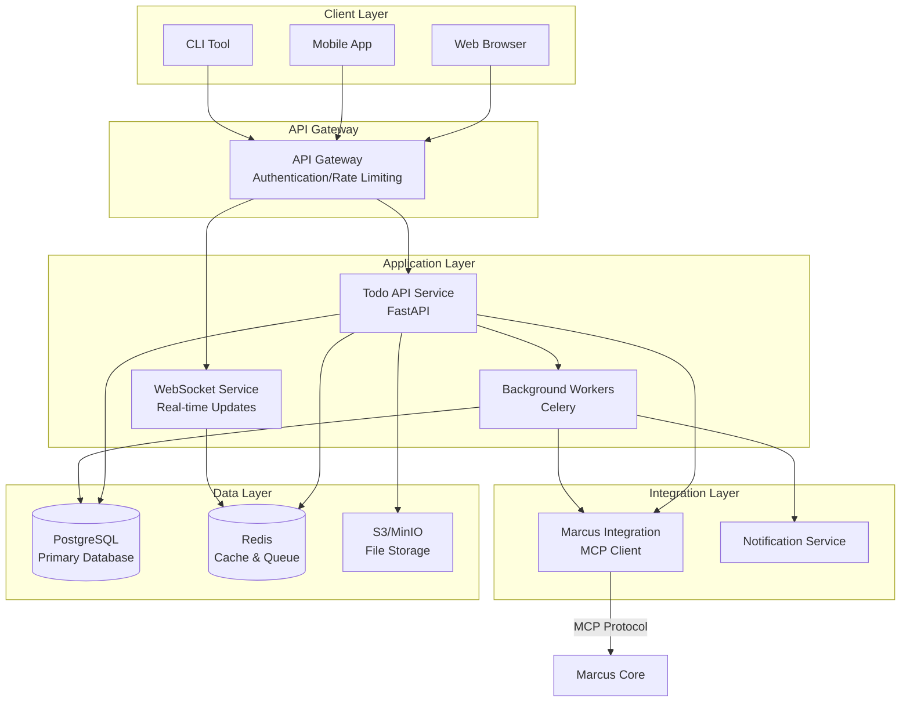

### Component Architecture

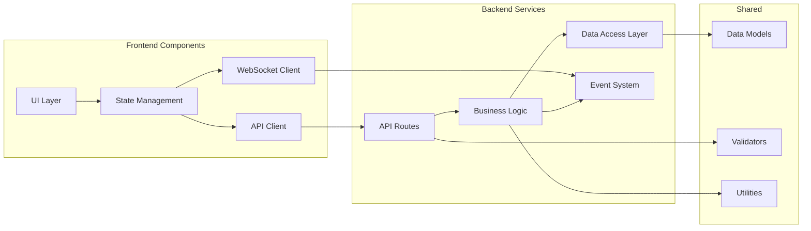

## Data Flow Diagrams

### Todo Creation Flow

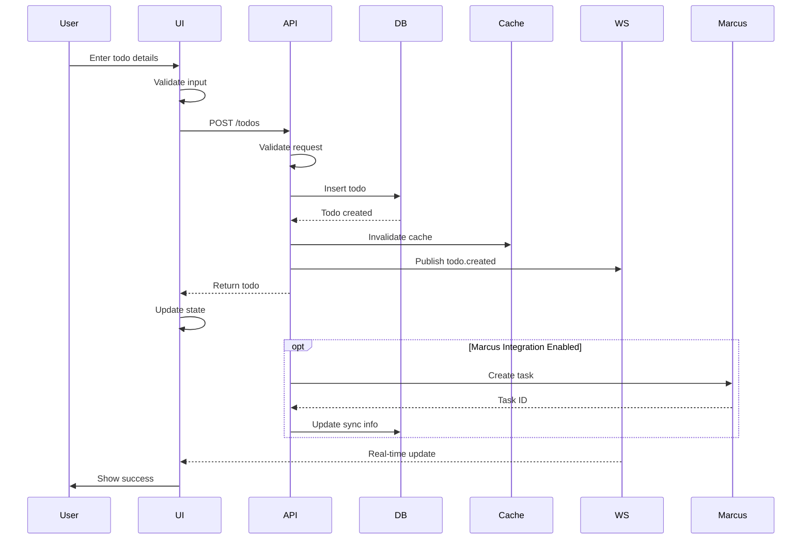

### Todo Update Flow

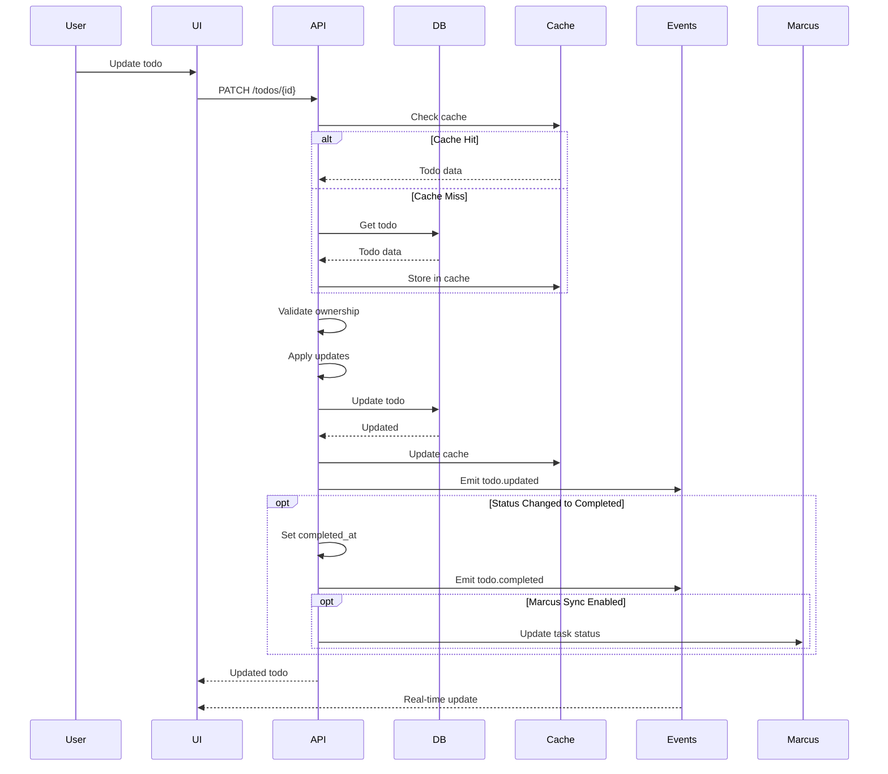

### Bulk Operations Flow

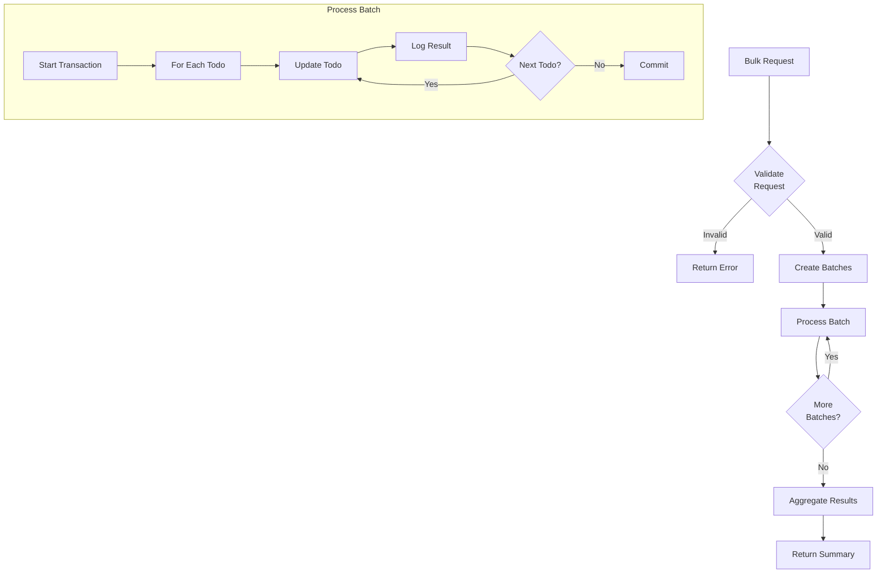

## Database Schema Diagram

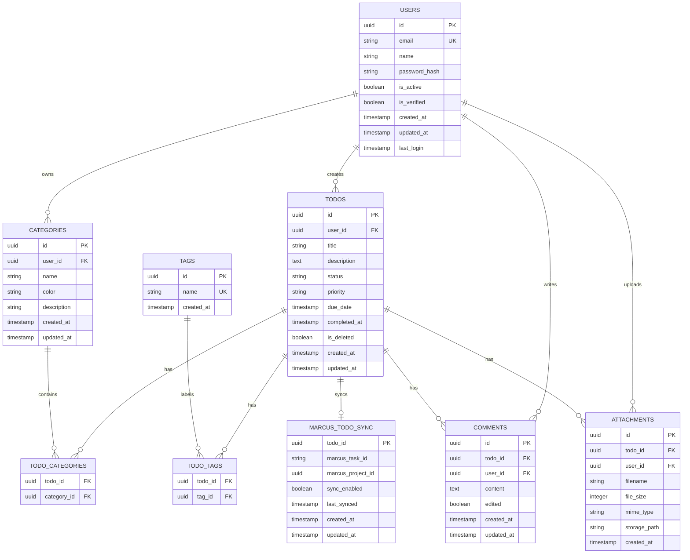

## State Management Diagram

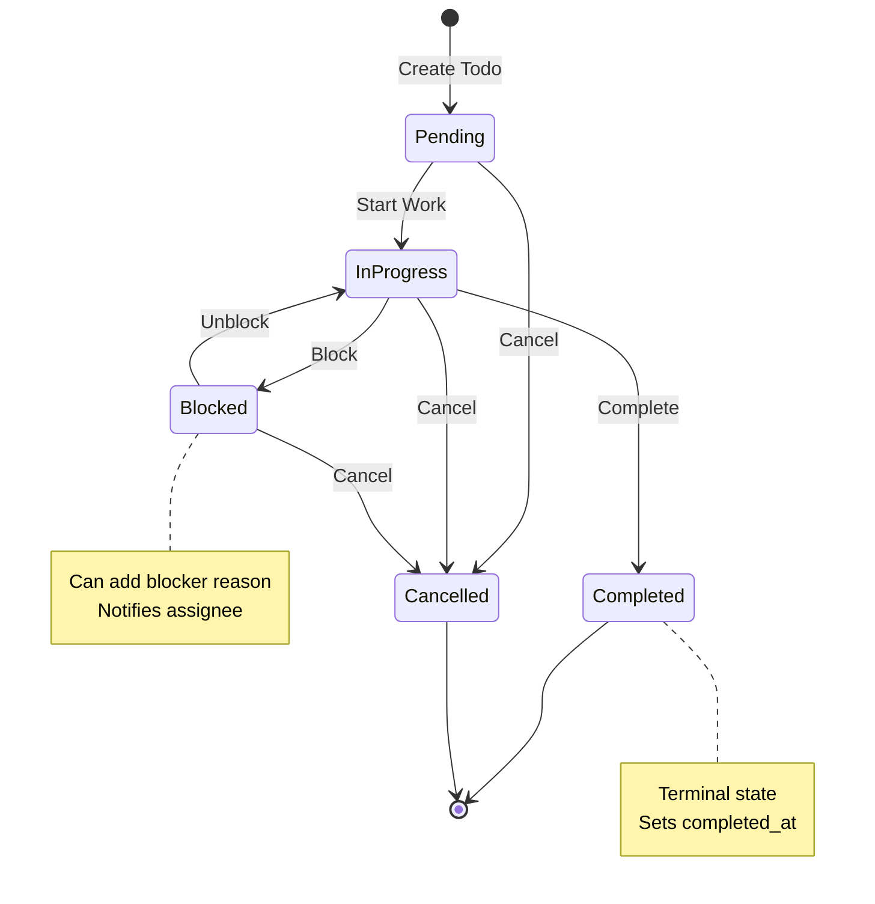

## Authentication Flow

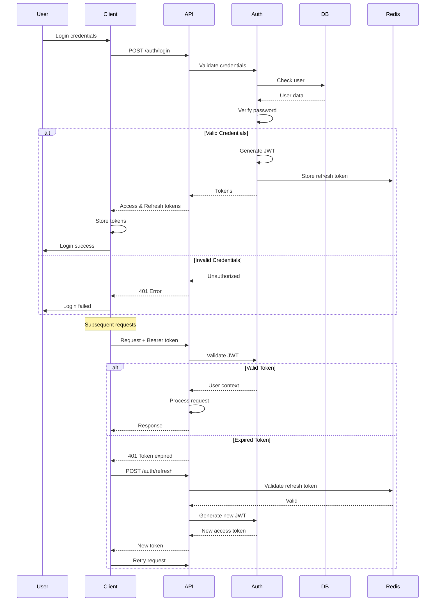

## Marcus Integration Architecture

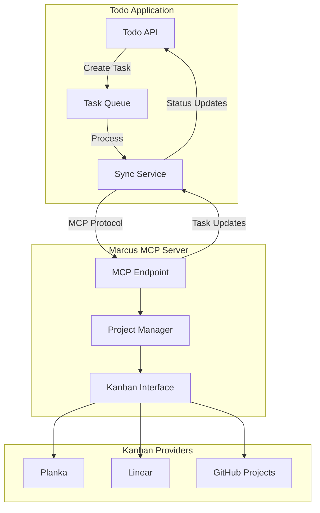

## Deployment Architecture

### Development Environment

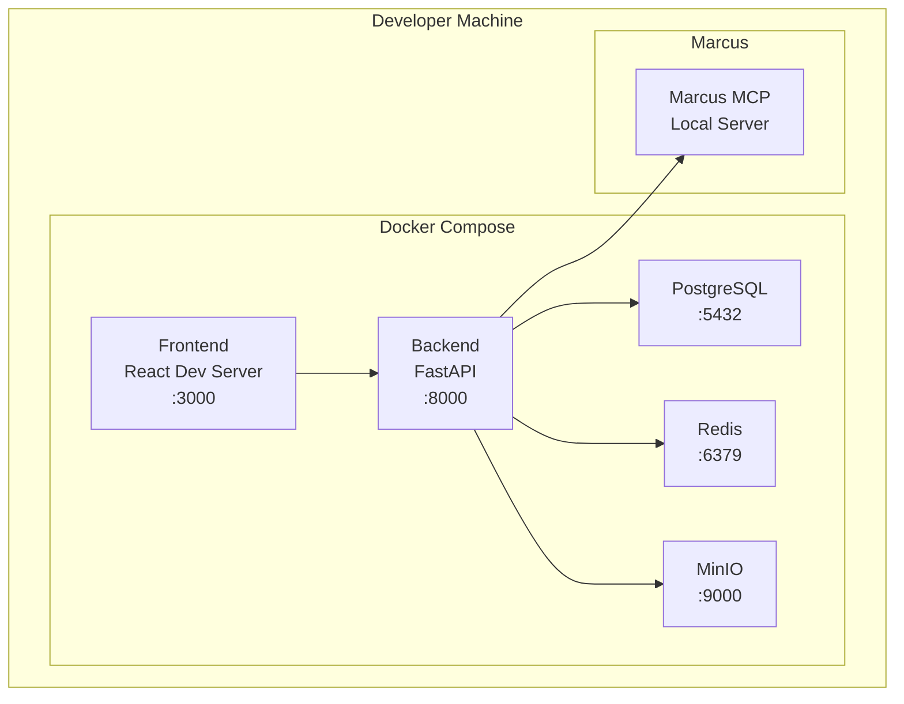

### Production Architecture

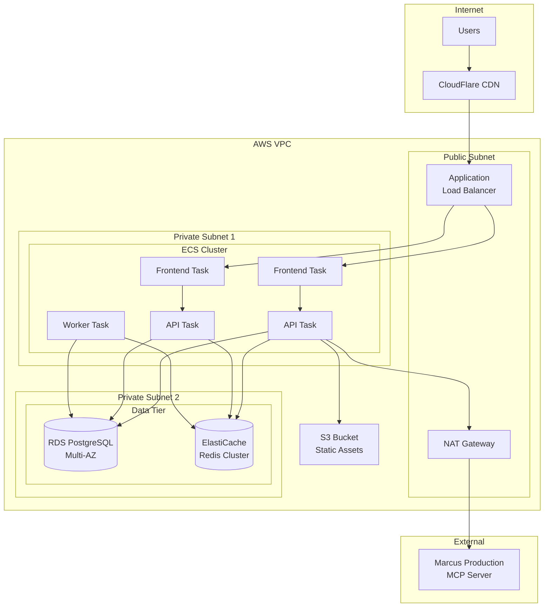

## Performance Optimization Strategy

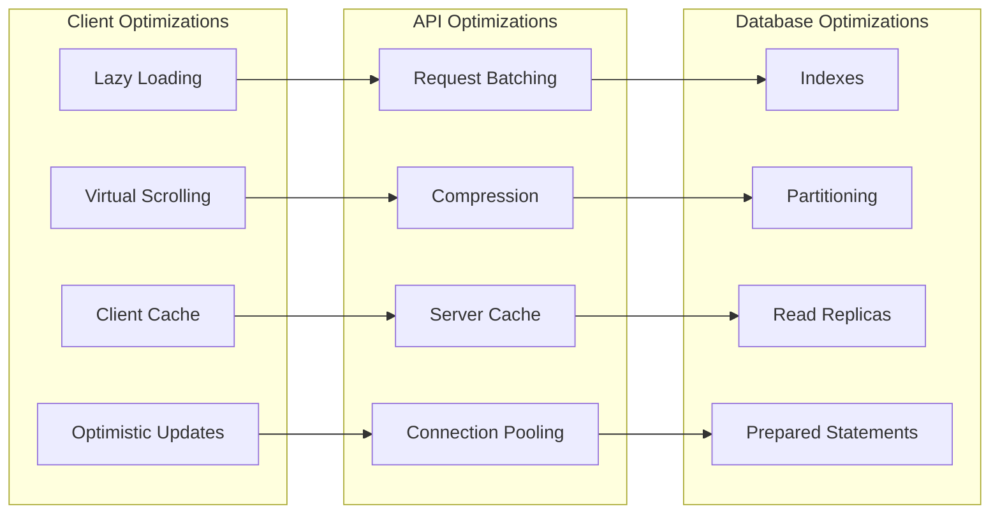

## Monitoring and Observability

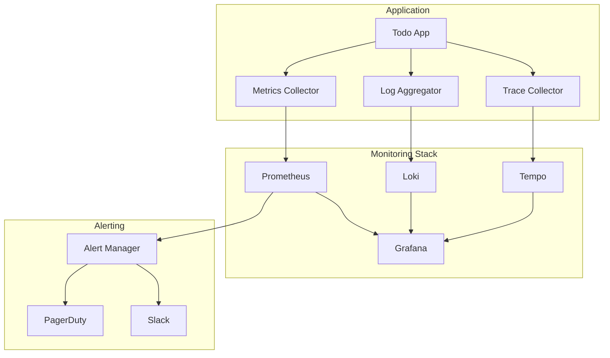

## Security Architecture

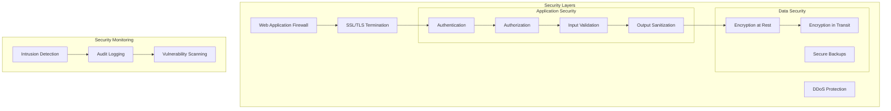

These architectural diagrams provide a comprehensive visual representation of the Todo Management application's design, showing data flows, component interactions, deployment topology, and integration points with the Marcus ecosystem.
