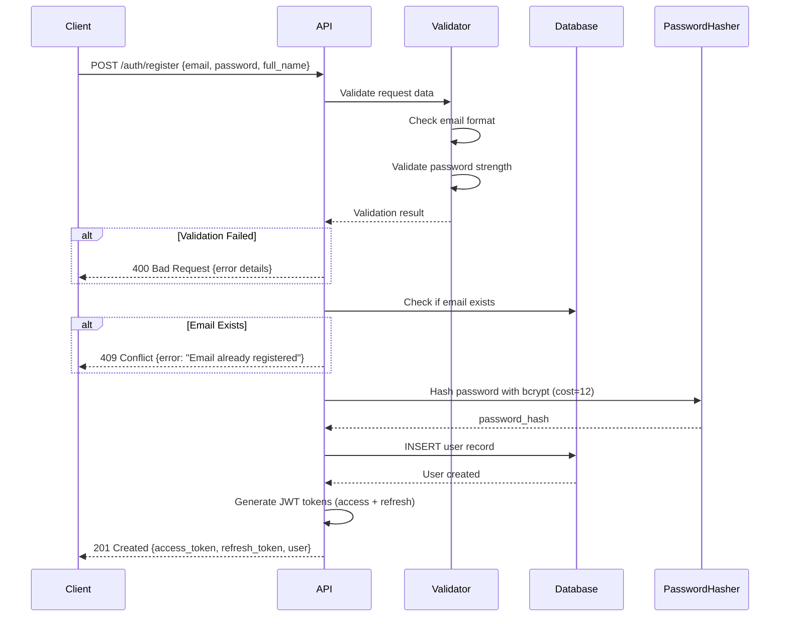
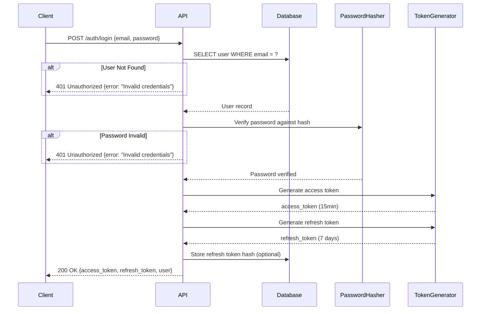
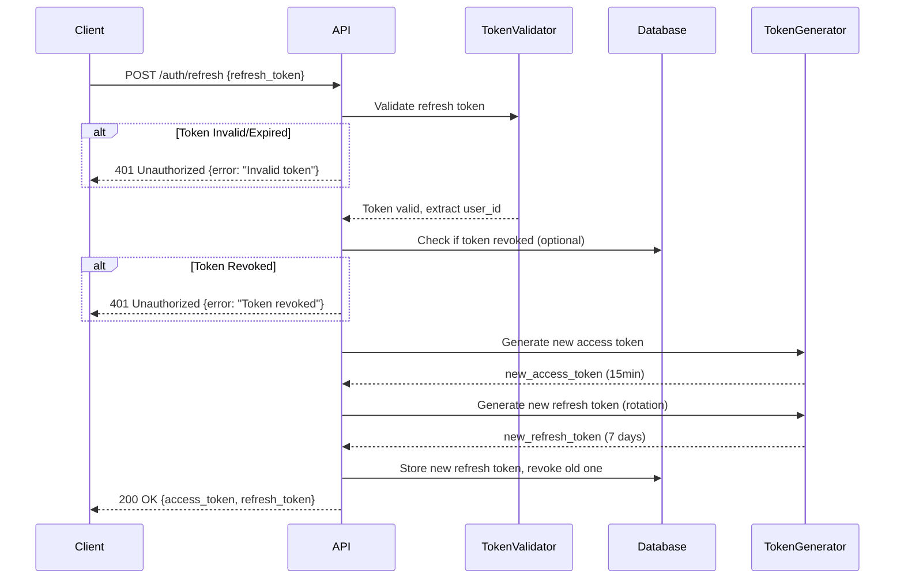
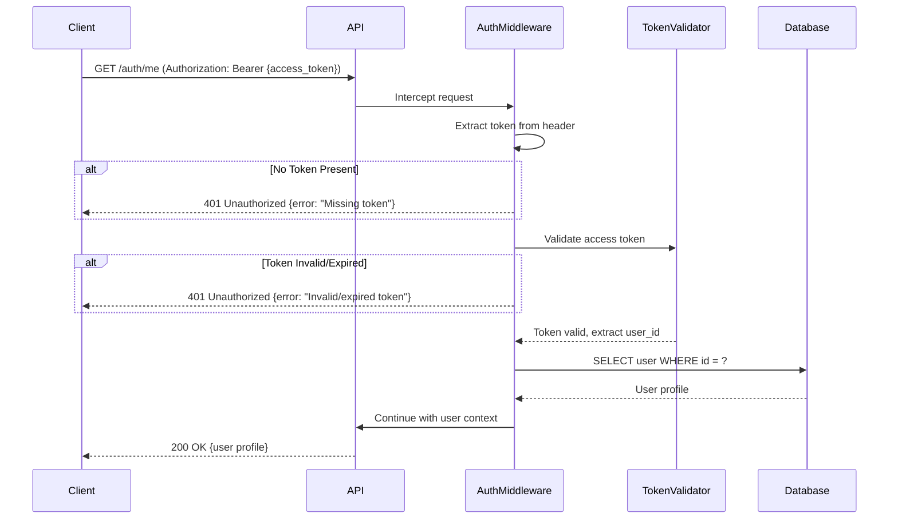
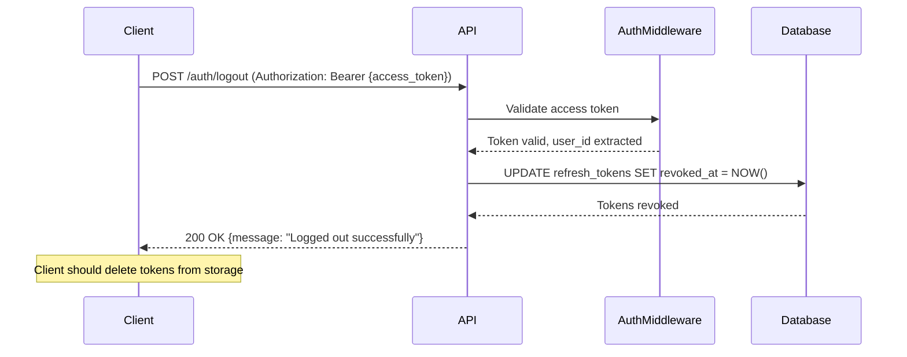

# Authentication Flow Design

## Overview

This document describes the complete authentication flow for the Task Management API, including user registration, login, token refresh, and protected resource access.

## Authentication Flows

### 1. User Registration Flow



**Steps:**
1. Client sends registration request with email, password, and full_name
2. Server validates email format and password strength
3. Server checks if email is already registered
4. Server hashes password using bcrypt with cost factor 12
5. Server creates user record in database
6. Server generates JWT access token (15min) and refresh token (7 days)
7. Server returns tokens and user profile to client

### 2. User Login Flow



**Steps:**
1. Client sends login request with email and password
2. Server retrieves user record by email
3. Server verifies password using bcrypt comparison
4. If credentials valid, server generates JWT tokens
5. Server optionally stores refresh token hash for revocation
6. Server returns tokens and user profile

### 3. Token Refresh Flow



**Steps:**
1. Client sends refresh token
2. Server validates refresh token signature and expiration
3. Server checks if token has been revoked (if using revocation)
4. Server generates new access token
5. Server generates new refresh token (token rotation for security)
6. Server revokes old refresh token and stores new one
7. Server returns new tokens

### 4. Protected Resource Access Flow



**Steps:**
1. Client sends request with Authorization: Bearer {access_token}
2. Authentication middleware extracts token from header
3. Middleware validates token signature and expiration
4. Middleware extracts user_id from token claims
5. Middleware optionally fetches user from database for latest data
6. Request proceeds with authenticated user context
7. Response returned to client

### 5. Logout Flow (Optional - with Token Revocation)



**Steps:**
1. Client sends logout request with access token
2. Server validates access token
3. Server marks all user's refresh tokens as revoked
4. Client deletes tokens from local storage
5. User must login again to get new tokens

## JWT Token Structure

### Access Token Claims

```json
{
  "sub": "123e4567-e89b-12d3-a456-426614174000",  // user_id
  "email": "user@example.com",
  "type": "access",
  "exp": 1704712800,  // expiration (15 minutes from issue)
  "iat": 1704711900,  // issued at
  "jti": "unique-token-id"  // JWT ID for tracking
}
```

### Refresh Token Claims

```json
{
  "sub": "123e4567-e89b-12d3-a456-426614174000",  // user_id
  "email": "user@example.com",
  "type": "refresh",
  "exp": 1705316700,  // expiration (7 days from issue)
  "iat": 1704711900,  // issued at
  "jti": "unique-token-id"  // JWT ID for revocation tracking
}
```

## Security Measures

### 1. Password Security
- **Hashing Algorithm**: bcrypt with cost factor 12
- **Minimum Requirements**:
  - 8 characters minimum
  - At least one uppercase letter
  - At least one lowercase letter
  - At least one digit
  - At least one special character
- **Storage**: Never store plaintext passwords

### 2. Token Security
- **Algorithm**: RS256 (RSA with SHA-256) for asymmetric encryption
- **Access Token Lifetime**: 15 minutes (short-lived)
- **Refresh Token Lifetime**: 7 days
- **Token Rotation**: Generate new refresh token on each refresh
- **Secure Storage**: Private key must be stored securely (env variable, secrets manager)
- **Token Revocation**: Store refresh token hashes for revocation capability

### 3. API Security
- **HTTPS Only**: All authentication endpoints must use HTTPS in production
- **Rate Limiting**:
  - Login: 5 attempts per 15 minutes per IP
  - Registration: 3 attempts per hour per IP
  - Refresh: 10 attempts per hour per user
- **CORS**: Configure allowed origins for browser clients
- **Headers**: Set security headers (HSTS, X-Frame-Options, etc.)

### 4. Input Validation
- **Email**: RFC 5322 compliant, max 255 chars, case-insensitive
- **Password**: Validated against strength requirements before hashing
- **SQL Injection**: Use parameterized queries (ORM protection)
- **XSS Protection**: Sanitize and escape user inputs

### 5. Error Handling
- **Generic Errors**: Don't reveal if email exists during login (always "Invalid credentials")
- **Rate Limit Exceeded**: Return 429 Too Many Requests
- **Logging**: Log authentication attempts (success/failure) for audit trail
- **No Sensitive Data**: Never log passwords or tokens

## Implementation Checklist

### Backend Requirements
- [ ] Implement bcrypt password hashing with cost factor 12
- [ ] Generate RSA key pair for JWT signing (2048-bit minimum)
- [ ] Implement JWT token generation with RS256 algorithm
- [ ] Implement JWT token validation middleware
- [ ] Create user registration endpoint with validation
- [ ] Create login endpoint with credential verification
- [ ] Create token refresh endpoint with rotation
- [ ] Create /auth/me endpoint for profile retrieval
- [ ] Implement rate limiting on auth endpoints
- [ ] Set up refresh token storage and revocation (optional but recommended)
- [ ] Configure CORS for allowed origins
- [ ] Set security headers in responses
- [ ] Implement audit logging for auth events

### Database Requirements
- [ ] Create users table with proper indexes
- [ ] Create refresh_tokens table (if using revocation)
- [ ] Set up database migrations
- [ ] Configure connection pooling
- [ ] Implement soft delete for user accounts (is_active flag)

### Testing Requirements
- [ ] Unit tests for password hashing/verification
- [ ] Unit tests for JWT generation/validation
- [ ] Integration tests for registration flow
- [ ] Integration tests for login flow
- [ ] Integration tests for token refresh
- [ ] Integration tests for protected endpoints
- [ ] Security tests for rate limiting
- [ ] Security tests for invalid inputs
- [ ] Load tests for concurrent authentications

### Frontend Integration
- [ ] Store access token in memory (not localStorage for security)
- [ ] Store refresh token in httpOnly cookie (or secure storage)
- [ ] Implement automatic token refresh before expiration
- [ ] Handle 401 responses with token refresh retry
- [ ] Implement logout with token deletion
- [ ] Add loading states for auth operations
- [ ] Display appropriate error messages

## Error Response Examples

### Invalid Credentials
```json
{
  "error": "Invalid credentials",
  "detail": "Email or password is incorrect",
  "status_code": 401
}
```

### Email Already Exists
```json
{
  "error": "Email already registered",
  "detail": "An account with this email already exists",
  "status_code": 409
}
```

### Weak Password
```json
{
  "error": "Weak password",
  "detail": "Password must contain uppercase, lowercase, digit, and special character",
  "status_code": 400
}
```

### Expired Token
```json
{
  "error": "Token expired",
  "detail": "Access token has expired, please refresh",
  "status_code": 401
}
```

### Rate Limit Exceeded
```json
{
  "error": "Too many requests",
  "detail": "Please try again in 15 minutes",
  "status_code": 429
}
```
